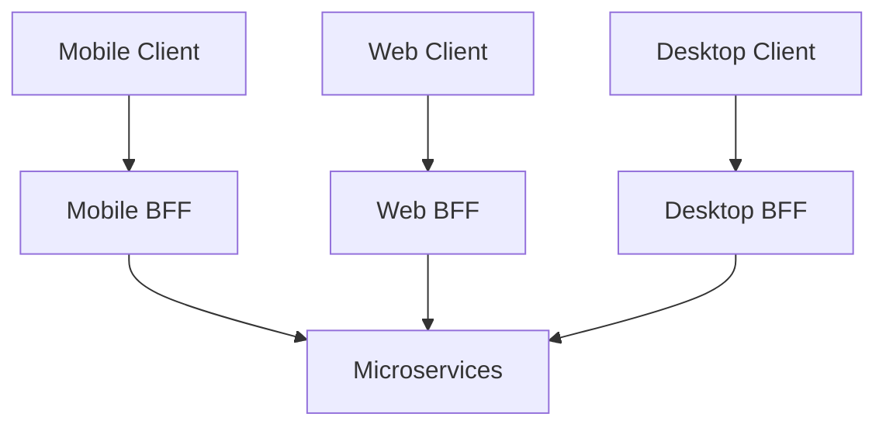
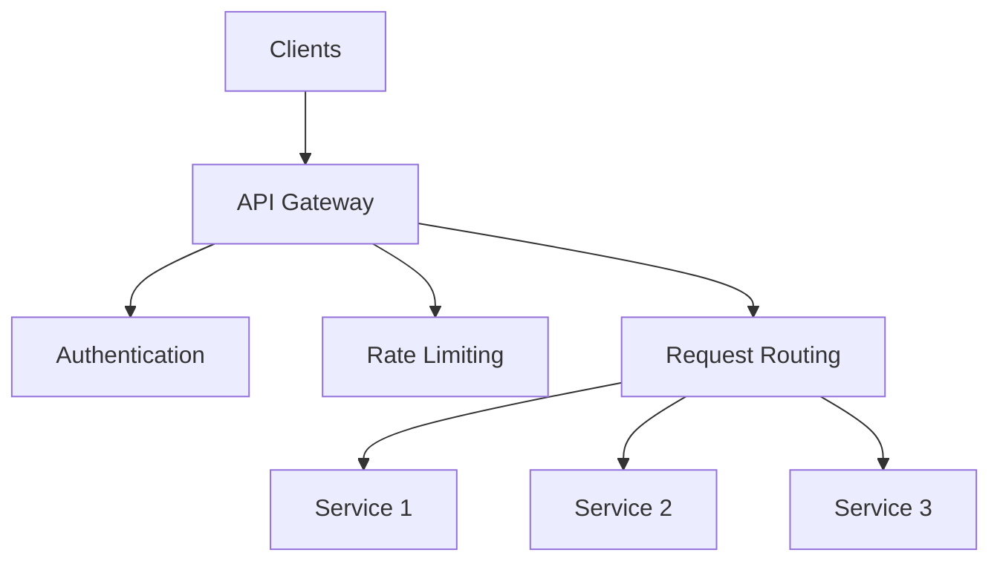

# API Gateway in System Design 📌

## Table of Contents

- [Introduction](#introduction)
- [Prerequisites & Related Topics](#prerequisites--related-topics)
- [Pattern Recognition Guide](#pattern-recognition-guide)
- [Gateway Patterns](#gateway-patterns)
- [Core Features](#core-features)
- [Implementation Strategies](#implementation-strategies)
- [Security Aspects](#security-aspects)
- [Best Practices](#best-practices)
- [Trade-offs](#trade-offs)
- [Edge Cases to Consider](#edge-cases-to-consider)
- [Common Pitfalls](#common-pitfalls)
- [FAQ](#faq)
- [Interview Tips](#interview-tips)
- [Advanced Topics](#advanced-topics)
- [Further Reading](#further-reading)

## Introduction

An API Gateway serves as a single entry point for client applications to access services in a microservices architecture. It handles cross-cutting concerns like authentication, routing, and request aggregation.

### Key Functions
1. **Request Routing**
2. **Authentication**
3. **Rate Limiting**
4. **Request/Response Transformation**
5. **Monitoring**

## Prerequisites & Related Topics

- Builds on: [Load Balancing](../system-basics/load-balancing.md), [API Design](../system-basics/api-design.md)
- Used in: [Microservices](../scalability/microservices.md), [Rate Limiting](rate-limiting.md), [Service Discovery](service-discovery.md)
- Techniques often combined: JWT validation, rate limits, canary routing, request transformation
- See also: Service Mesh — mesh handles east-west, gateway handles north-south

## Pattern Recognition Guide

### 🎯 When to Use API Gateway

**Keywords in requirements**: "single entry point", "cross-cutting concerns", "client-facing API", "auth at the edge", "backend aggregation"
**Reach for this when**:
- Microservices exposing one coherent API to external clients
- Centralizing auth, rate limiting, and telemetry at the edge
- Mobile/BFF aggregation over chatty backend endpoints
- Canary and blue/green traffic shifting per route

### 🔑 Approach Indicators

| Approach | Signals | Best For |
|----------|---------|----------|
| Managed (Kong, Apigee) | policy plugins, fast start | most teams |
| Cloud-native (APIGW, ALB) | pay-per-use, no fleet | serverless, AWS-centric |
| Custom (Envoy-based) | full control, bespoke routing | very large platforms |

### ❌ When NOT to Use

- One or two internal services — a load balancer plus app-level auth suffices
- Ultra-low-latency internal paths — route around the gateway
- Complex business logic in gateway plugins — keep policies declarative

## Gateway Patterns

### 1. Backend for Frontend (BFF)

**How it works — Bffgateway:** Terminate the incoming connection at the edge component, apply cross-cutting policy (auth, limits, routing), and forward to the backend pool — clients see one stable address while pools change freely behind it.

### 2. Aggregation Gateway
**How it works — Aggregation gateway:** Terminate the incoming connection at the edge component, apply cross-cutting policy (auth, limits, routing), and forward to the backend pool — clients see one stable address while pools change freely behind it.

### 3. Protocol Translation Gateway
**How it works — Protocol gateway:** Terminate the incoming connection at the edge component, apply cross-cutting policy (auth, limits, routing), and forward to the backend pool — clients see one stable address while pools change freely behind it.

## Core Features

### 1. Request Routing
**How it works — Request router:** Terminate the incoming connection at the edge component, apply cross-cutting policy (auth, limits, routing), and forward to the backend pool — clients see one stable address while pools change freely behind it.

### 2. Authentication & Authorization
**How it works — Authentication middleware:** extract credentials (bearer token or session cookie), validate signature and expiry, and attach the resolved identity to the request context — reject with 401 before any route logic runs.

### 3. Request Transformation
**How it works — Request transformer:** the gateway rewrites requests in flight — path mapping, header injection, payload reshaping — so backends see a canonical shape while clients keep their own contract.

## Implementation Strategies

### 1. Kong Gateway Implementation
**How it works — Kong:** declarative config defines services (upstreams) and routes; plugins attach cross-cutting behavior per route — auth (JWT/OAuth), rate limiting, caching, logging — without touching backend code. In interviews, frame it as "policy at the edge, configured not coded", with the caveat that very custom routing logic may justify a purpose-built gateway.

### 2. Custom Gateway Implementation
**How it works — Custom gateway:** Terminate the incoming connection at the edge component, apply cross-cutting policy (auth, limits, routing), and forward to the backend pool — clients see one stable address while pools change freely behind it.

### 3. Circuit Breaker Integration
**How it works — Circuit breaker gateway:** Build once, promote the same artifact through environments, and shift traffic gradually — canary or blue/green — so a bad release is rolled back by a routing change, not a rebuild.

## Security Aspects

### 1. API Key Authentication
**How it works — Apikey auth:** static keys identify machines, not humans — hashed at rest, scoped to minimal permissions, rotated on schedule, always over TLS; prefer short-lived tokens wherever the integration allows.

### 2. JWT Authentication
**How it works — JWT authenticator:** the filter validates the token's signature, expiry, and audience before the handler sees the request, and exposes the verified claims as the request identity — one chokepoint, uniformly enforced.

### 3. OAuth Integration
**How it works — OAuth handler:** implements the provider side of the flow — authorize endpoint, code exchange, refresh — validating redirect URIs exactly and issuing narrowly scoped, short-lived tokens; the handler is the trust boundary for every integration.

## Best Practices

### 1. Error Handling
**How it works — Error handler:** fail the operation, not the process — catch at the boundary, log with the trace ID, return a typed error to the caller, and retry only what's idempotent; partial side effects roll back via compensating actions.

### 2. Monitoring & Logging
**How it works — Gateway monitor:** Collect the signal on a schedule, evaluate it against the defined threshold or SLO, and route any breach to the right channel with enough context to act without digging.

## Trade-offs

| Choice | Pros | Cons | Best For |
|--------|------|------|----------|
| Centralized gateway | One place for auth, rate limiting, routing | Potential bottleneck and SPOF, team contention | Consistent cross-cutting policy |
| Per-domain gateways (BFF) | Team autonomy, client-optimized APIs | Duplicated infrastructure and policy | Multiple client types, large orgs |
| Thick gateway (aggregation) | Fewer client round trips | Business logic creeps into gateway | Read-heavy client views |

**Centralization vs flexibility:** A shared gateway enforces consistency but every team's change funnels through it; decentralized gateways trade duplication for autonomy.

**Gateway depth vs latency:** More processing in the gateway (auth, transformation) means more latency and coupling; push work to services when policy allows.

**Availability:** The gateway is on every request path — it must scale horizontally, health-check backends, and degrade gracefully.

> **⚠️ When NOT to add a gateway:** a single service behind one client (a reverse proxy suffices), latency-critical paths that never cross the boundary, and teams that would turn it into a custom-logic dump — gateways hold policy, not business logic.

## Edge Cases to Consider

- Gateway as single point of failure — run HA pairs, health-check it
- Latency budget at scale — every hop through the gateway costs p99
- WebSocket/streaming — ensure pass-through without buffering
- Large uploads — streaming config to avoid buffering blowups

## Common Pitfalls

1. Business logic creeping into the gateway — deployment coupling returns
2. No per-route rate limits — one noisy client starves the rest
3. Skipping observability at the edge — gateways see everything, log it
4. One gateway shape for every client instead of BFFs where needed

## FAQ

**Q1: Gateway vs load balancer?**

A: A balancer spreads traffic; a gateway adds per-route policy — auth, transforms, quotas, aggregation. Most gateways include balancing; few balancers include policy.

**Q2: Gateway or service mesh?**

A: Gateways manage north-south (client in/out); meshes manage east-west (service-to-service). Large platforms run both with identity passed between them.

**Q3: Where does authentication live?**

A: Token verification at the gateway (cheap, centralized), fine-grained authorization in each service — never rely on the edge alone.

## Interview Tips

### 1. Key Considerations
- Gateway responsibilities
- Security requirements
- Performance impact
- Scalability needs
- Monitoring approach

### 2. Common Questions
1. How would you implement an API gateway?
2. How do you handle gateway security?
3. How do you ensure gateway performance?
4. How do you monitor gateway health?

### 3. Architecture Diagram

## Advanced Topics

1. Canary/percentage routing with header-based overrides
2. Request coalescing and response caching per route
3. OIDC-aware edge auth with token exchange
4. Gateway aggregation for GraphQL-style batched queries

## Further Reading
- [Kong Documentation](https://docs.konghq.com/)
- [API Gateway Pattern](https://microservices.io/patterns/apigateway.html)
- [AWS API Gateway](https://aws.amazon.com/api-gateway/)
- [Netflix Zuul](https://github.com/Netflix/zuul/wiki) 