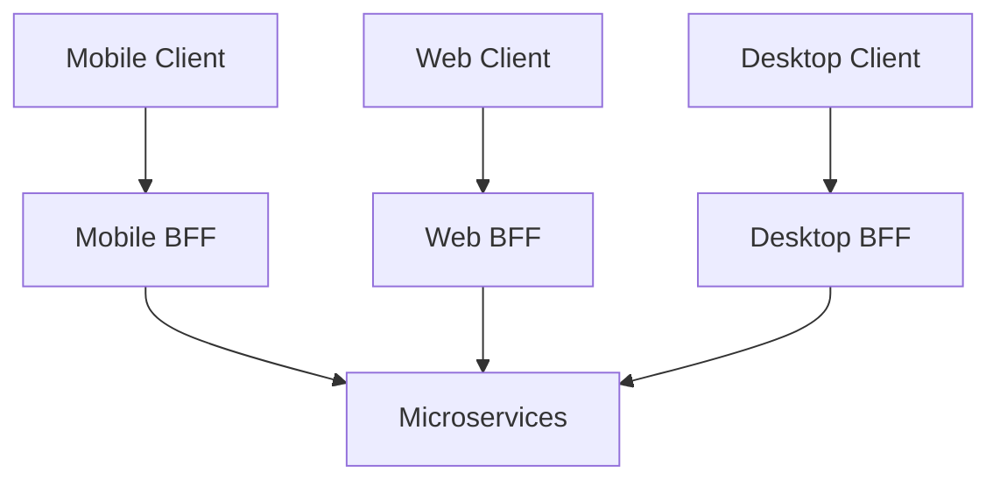
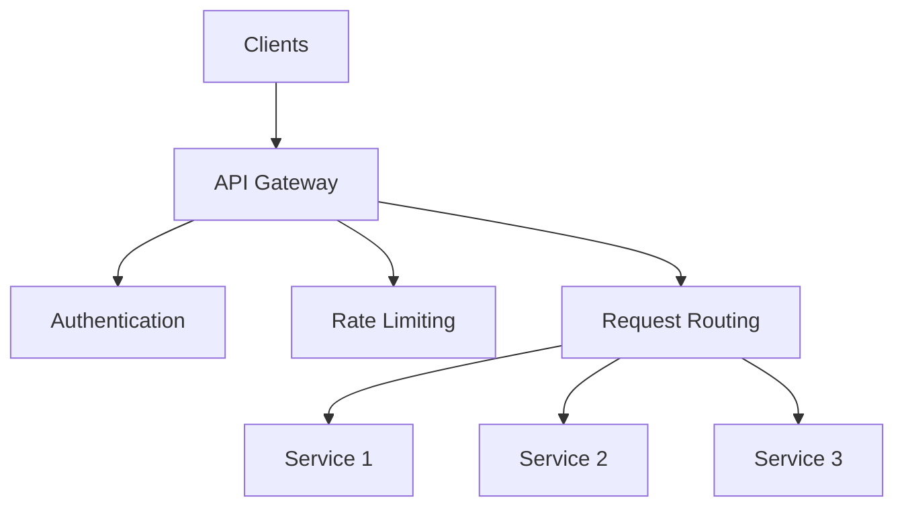

# API Gateway

## Table of Contents
- [Introduction](#introduction)
- [Gateway Patterns](#gateway-patterns)
- [Core Features](#core-features)
- [Implementation Strategies](#implementation-strategies)
- [Security Aspects](#security-aspects)
- [Best Practices](#best-practices)
- [Interview Tips](#interview-tips)

## Introduction

An API Gateway serves as a single entry point for client applications to access services in a microservices architecture. It handles cross-cutting concerns like authentication, routing, and request aggregation.

### Key Functions
1. **Request Routing**
2. **Authentication**
3. **Rate Limiting**
4. **Request/Response Transformation**
5. **Monitoring**

## Gateway Patterns

### 1. Backend for Frontend (BFF)


```python
class BFFGateway:
    def __init__(self, client_type):
        self.client_type = client_type
        self.transformers = self.load_transformers()
    
    async def handle_request(self, request):
        """Handle client-specific request."""
        # Transform request based on client type
        transformed_request = await self.transform_request(request)
        
        # Route to appropriate services
        responses = await self.route_request(transformed_request)
        
        # Transform response for client
        return await self.transform_response(responses)
    
    def load_transformers(self):
        """Load client-specific transformers."""
        return {
            'mobile': MobileTransformer(),
            'web': WebTransformer(),
            'desktop': DesktopTransformer()
        }[self.client_type]
```

### 2. Aggregation Gateway
```python
class AggregationGateway:
    def __init__(self):
        self.service_client = ServiceClient()
    
    async def get_user_dashboard(self, user_id):
        """Aggregate data for user dashboard."""
        # Parallel requests to services
        results = await asyncio.gather(
            self.service_client.get_user_profile(user_id),
            self.service_client.get_user_orders(user_id),
            self.service_client.get_user_preferences(user_id),
            return_exceptions=True
        )
        
        # Handle partial failures
        dashboard_data = {
            'profile': self.handle_result(results[0]),
            'orders': self.handle_result(results[1]),
            'preferences': self.handle_result(results[2])
        }
        
        return dashboard_data
    
    def handle_result(self, result):
        """Handle potentially failed result."""
        if isinstance(result, Exception):
            logger.error(f"Service request failed: {result}")
            return None
        return result
```

### 3. Protocol Translation Gateway
```python
class ProtocolGateway:
    def __init__(self):
        self.protocol_handlers = {
            'http': HTTPHandler(),
            'grpc': GRPCHandler(),
            'graphql': GraphQLHandler()
        }
    
    async def handle_request(self, request, target_protocol):
        """Handle protocol translation."""
        # Determine source protocol
        source_protocol = self.detect_protocol(request)
        
        # Get appropriate handlers
        source_handler = self.protocol_handlers[source_protocol]
        target_handler = self.protocol_handlers[target_protocol]
        
        # Transform and forward request
        internal_request = await source_handler.to_internal(request)
        target_request = await target_handler.from_internal(internal_request)
        
        return await target_handler.send_request(target_request)
```

## Core Features

### 1. Request Routing
```python
class RequestRouter:
    def __init__(self):
        self.route_table = RouteTable()
        self.load_balancer = LoadBalancer()
    
    async def route_request(self, request):
        """Route request to appropriate service."""
        # Get service for route
        service = await self.route_table.get_service(
            request.path,
            request.method
        )
        
        if not service:
            raise RouteNotFoundError()
        
        # Get service instance
        instance = await self.load_balancer.get_instance(service)
        
        # Forward request
        try:
            return await self.forward_request(request, instance)
        except Exception as e:
            return await self.handle_routing_error(e, service)
```

### 2. Authentication & Authorization
```python
class AuthenticationMiddleware:
    def __init__(self):
        self.auth_service = AuthService()
        self.cache = TokenCache()
    
    async def authenticate(self, request):
        """Authenticate incoming request."""
        token = self.extract_token(request)
        if not token:
            raise AuthenticationError("No token provided")
        
        # Check cache first
        cached_auth = await self.cache.get(token)
        if cached_auth:
            return cached_auth
        
        # Verify token
        try:
            auth_info = await self.auth_service.verify_token(token)
            await self.cache.set(token, auth_info)
            return auth_info
        except Exception as e:
            raise AuthenticationError(str(e))
    
    async def authorize(self, request, auth_info):
        """Authorize request."""
        required_permissions = await self.get_required_permissions(
            request.path,
            request.method
        )
        
        if not self.check_permissions(
            auth_info['permissions'],
            required_permissions
        ):
            raise AuthorizationError("Insufficient permissions")
```

### 3. Request Transformation
```python
class RequestTransformer:
    def transform_request(self, request):
        """Transform incoming request."""
        transformed = {
            'headers': self.transform_headers(request.headers),
            'body': self.transform_body(request.body),
            'query': self.transform_query(request.query)
        }
        
        # Add correlation ID
        transformed['headers']['X-Correlation-ID'] = str(uuid.uuid4())
        
        # Add client info
        transformed['headers']['X-Client-Type'] = request.client_type
        transformed['headers']['X-Client-Version'] = request.client_version
        
        return transformed
    
    def transform_response(self, response):
        """Transform service response."""
        return {
            'status': response.status,
            'headers': self.filter_headers(response.headers),
            'body': self.transform_response_body(response.body)
        }
```

## Implementation Strategies

### 1. Kong Gateway Implementation
```yaml
# Kong Gateway Configuration
services:
  - name: user-service
    url: http://user-service:8080
    routes:
      - name: user-api
        paths:
          - /users
        methods:
          - GET
          - POST
    plugins:
      - name: key-auth
      - name: rate-limiting
        config:
          minute: 5
          hour: 100
      - name: cors
```

### 2. Custom Gateway Implementation
```python
class CustomGateway:
    def __init__(self):
        self.middleware = [
            AuthenticationMiddleware(),
            RateLimitMiddleware(),
            LoggingMiddleware(),
            CorsMiddleware()
        ]
        self.router = RequestRouter()
    
    async def handle_request(self, request):
        """Handle incoming request."""
        try:
            # Apply middleware
            for mw in self.middleware:
                request = await mw.process_request(request)
            
            # Route request
            response = await self.router.route_request(request)
            
            # Apply response middleware
            for mw in reversed(self.middleware):
                response = await mw.process_response(response)
            
            return response
            
        except Exception as e:
            return await self.handle_error(e)
```

### 3. Circuit Breaker Integration
```python
class CircuitBreakerGateway:
    def __init__(self):
        self.circuit_breakers = {}
    
    async def call_service(self, service_name, request):
        """Call service with circuit breaker."""
        circuit = self.get_circuit_breaker(service_name)
        
        if circuit.is_open:
            return await self.handle_open_circuit(service_name)
        
        try:
            response = await self.make_request(service_name, request)
            circuit.record_success()
            return response
        except Exception as e:
            circuit.record_failure()
            return await self.handle_service_failure(service_name, e)
    
    def get_circuit_breaker(self, service_name):
        """Get or create circuit breaker."""
        if service_name not in self.circuit_breakers:
            self.circuit_breakers[service_name] = CircuitBreaker(
                failure_threshold=5,
                reset_timeout=60
            )
        return self.circuit_breakers[service_name]
```

## Security Aspects

### 1. API Key Authentication
```python
class APIKeyAuth:
    def __init__(self):
        self.key_store = KeyStore()
    
    async def authenticate(self, request):
        """Authenticate using API key."""
        api_key = self.extract_api_key(request)
        if not api_key:
            raise AuthenticationError("API key required")
        
        # Verify key
        key_info = await self.key_store.verify_key(api_key)
        if not key_info:
            raise AuthenticationError("Invalid API key")
        
        # Check rate limits
        if await self.is_rate_limited(key_info):
            raise RateLimitExceededError()
        
        return key_info
```

### 2. JWT Authentication
```python
class JWTAuthenticator:
    def __init__(self):
        self.public_key = self.load_public_key()
    
    async def authenticate(self, request):
        """Authenticate using JWT."""
        token = self.extract_jwt(request)
        if not token:
            raise AuthenticationError("JWT required")
        
        try:
            # Verify token
            payload = jwt.decode(
                token,
                self.public_key,
                algorithms=['RS256']
            )
            
            # Verify claims
            self.verify_claims(payload)
            
            return payload
            
        except jwt.ExpiredSignatureError:
            raise AuthenticationError("Token expired")
        except jwt.InvalidTokenError as e:
            raise AuthenticationError(f"Invalid token: {e}")
```

### 3. OAuth Integration
```python
class OAuthHandler:
    def __init__(self):
        self.oauth_client = OAuthClient()
        self.token_cache = TokenCache()
    
    async def handle_oauth_request(self, request):
        """Handle OAuth authentication."""
        # Check for token
        access_token = self.extract_token(request)
        if not access_token:
            return self.redirect_to_auth()
        
        try:
            # Verify token
            token_info = await self.verify_token(access_token)
            
            # Check scopes
            required_scopes = self.get_required_scopes(request)
            if not self.check_scopes(token_info['scopes'], required_scopes):
                raise InsufficientScopeError()
            
            return token_info
            
        except TokenExpiredError:
            return await self.refresh_token(request)
```

## Best Practices

### 1. Error Handling
```python
class ErrorHandler:
    def handle_error(self, error):
        """Handle gateway errors."""
        if isinstance(error, AuthenticationError):
            return self.create_error_response(401, str(error))
        elif isinstance(error, AuthorizationError):
            return self.create_error_response(403, str(error))
        elif isinstance(error, RateLimitExceededError):
            return self.create_error_response(429, str(error))
        elif isinstance(error, ServiceUnavailableError):
            return self.create_error_response(503, str(error))
        else:
            logger.error(f"Unexpected error: {error}")
            return self.create_error_response(
                500,
                "Internal server error"
            )
```

### 2. Monitoring & Logging
```python
class GatewayMonitor:
    def __init__(self):
        self.metrics = {
            'requests': Counter('gateway_requests_total', 'Total requests'),
            'errors': Counter('gateway_errors_total', 'Total errors'),
            'latency': Histogram('gateway_latency_seconds', 'Request latency')
        }
    
    async def track_request(self, request, response):
        """Track gateway metrics."""
        # Update request count
        self.metrics['requests'].inc()
        
        # Track latency
        self.metrics['latency'].observe(
            response.duration
        )
        
        # Track errors
        if response.status >= 400:
            self.metrics['errors'].inc()
        
        # Log request
        logger.info('Gateway request', extra={
            'method': request.method,
            'path': request.path,
            'status': response.status,
            'duration': response.duration
        })
```

## Interview Tips

### 1. Key Considerations
- Gateway responsibilities
- Security requirements
- Performance impact
- Scalability needs
- Monitoring approach

### 2. Common Questions
1. How would you implement an API gateway?
2. How do you handle gateway security?
3. How do you ensure gateway performance?
4. How do you monitor gateway health?

### 3. Architecture Diagram


## Further Reading
- [Kong Documentation](https://docs.konghq.com/)
- [API Gateway Pattern](https://microservices.io/patterns/apigateway.html)
- [AWS API Gateway](https://aws.amazon.com/api-gateway/)
- [Netflix Zuul](https://github.com/Netflix/zuul/wiki) 