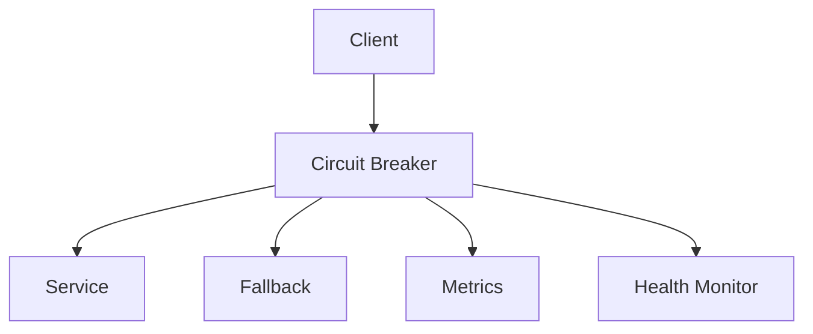

# Circuit Breaker

## Table of Contents
- [Introduction](#introduction)
- [Circuit States](#circuit-states)
- [Implementation Strategies](#implementation-strategies)
- [Monitoring & Recovery](#monitoring--recovery)
- [Best Practices](#best-practices)
- [Trade-offs](#trade-offs)
- [Interview Tips](#interview-tips)

## Introduction

The Circuit Breaker pattern prevents cascading failures by temporarily stopping operations that are likely to fail. It provides stability and resilience in distributed systems.

### Key Benefits
1. **Fail Fast**
2. **Prevent Cascading Failures**
3. **Enable Recovery**
4. **Improve Resilience**

## Circuit States

### 1. Closed State (Normal)
```python
class ClosedState:
    def __init__(self, breaker):
        self.breaker = breaker
        self.failure_count = 0
        self.last_failure_time = None
    
    async def handle_request(self, request):
        """Handle request in closed state."""
        try:
            response = await self.breaker.execute_request(request)
            self.handle_success()
            return response
        except Exception as e:
            return await self.handle_failure(e)
    
    def handle_success(self):
        """Handle successful request."""
        self.failure_count = 0
        self.last_failure_time = None
    
    async def handle_failure(self, error):
        """Handle failed request."""
        self.failure_count += 1
        self.last_failure_time = time.time()
        
        if self.should_trip():
            await self.breaker.trip()
            raise CircuitBreakerOpenError(str(error))
        
        raise error
    
    def should_trip(self):
        """Check if circuit should trip."""
        return (
            self.failure_count >= self.breaker.failure_threshold or
            self.is_failure_rate_exceeded()
        )
```

### 2. Open State (Failed)
```python
class OpenState:
    def __init__(self, breaker):
        self.breaker = breaker
        self.opened_at = time.time()
    
    async def handle_request(self, request):
        """Handle request in open state."""
        if self.should_attempt_reset():
            return await self.attempt_reset(request)
        
        raise CircuitBreakerOpenError(
            "Circuit breaker is open"
        )
    
    def should_attempt_reset(self):
        """Check if should attempt reset."""
        elapsed = time.time() - self.opened_at
        return elapsed >= self.breaker.reset_timeout
    
    async def attempt_reset(self, request):
        """Attempt to reset circuit."""
        await self.breaker.transition_to_half_open()
        return await self.breaker.handle_request(request)
```

### 3. Half-Open State (Testing)
```python
class HalfOpenState:
    def __init__(self, breaker):
        self.breaker = breaker
        self.success_count = 0
    
    async def handle_request(self, request):
        """Handle request in half-open state."""
        try:
            response = await self.breaker.execute_request(request)
            await self.handle_success()
            return response
        except Exception as e:
            await self.handle_failure(e)
            raise
    
    async def handle_success(self):
        """Handle successful request."""
        self.success_count += 1
        
        if self.success_count >= self.breaker.success_threshold:
            await self.breaker.reset()
    
    async def handle_failure(self, error):
        """Handle failed request."""
        await self.breaker.trip()
```

## Implementation Strategies

### 1. Basic Circuit Breaker
```python
class CircuitBreaker:
    def __init__(self, failure_threshold=5, reset_timeout=60):
        self.failure_threshold = failure_threshold
        self.reset_timeout = reset_timeout
        self.state = ClosedState(self)
        self.metrics = CircuitMetrics()
    
    async def execute(self, request):
        """Execute request through circuit breaker."""
        return await self.state.handle_request(request)
    
    async def trip(self):
        """Trip circuit breaker."""
        self.state = OpenState(self)
        self.metrics.record_trip()
        await self.notify_status_change('OPEN')
    
    async def reset(self):
        """Reset circuit breaker."""
        self.state = ClosedState(self)
        self.metrics.record_reset()
        await self.notify_status_change('CLOSED')
    
    async def transition_to_half_open(self):
        """Transition to half-open state."""
        self.state = HalfOpenState(self)
        self.metrics.record_half_open()
        await self.notify_status_change('HALF_OPEN')
```

### 2. Advanced Circuit Breaker
```python
class AdvancedCircuitBreaker:
    def __init__(self, config):
        self.config = config
        self.state = ClosedState(self)
        self.metrics = CircuitMetrics()
        self.fallback_handler = FallbackHandler()
        self.bulkhead = Bulkhead(
            max_concurrent_calls=config.max_concurrent_calls
        )
    
    async def execute(self, request):
        """Execute request with advanced features."""
        # Check bulkhead
        if not await self.bulkhead.acquire():
            return await self.handle_bulkhead_rejection(request)
        
        try:
            # Execute through circuit breaker
            return await self.state.handle_request(request)
        except CircuitBreakerOpenError:
            return await self.fallback_handler.handle(request)
        finally:
            self.bulkhead.release()
    
    async def handle_bulkhead_rejection(self, request):
        """Handle bulkhead rejection."""
        self.metrics.record_rejection()
        return await self.fallback_handler.handle(request)
```

### 3. Distributed Circuit Breaker
```python
class DistributedCircuitBreaker:
    def __init__(self, redis_client):
        self.redis = redis_client
        self.metrics = DistributedMetrics(redis_client)
    
    async def execute(self, request):
        """Execute with distributed state."""
        state = await self.get_distributed_state()
        
        if state == 'OPEN':
            if await self.should_attempt_reset():
                return await self.attempt_reset(request)
            raise CircuitBreakerOpenError()
        
        try:
            response = await self.execute_request(request)
            await self.record_success()
            return response
        except Exception as e:
            await self.record_failure()
            raise
    
    async def get_distributed_state(self):
        """Get circuit state from distributed store."""
        return await self.redis.get('circuit_state')
    
    async def record_failure(self):
        """Record failure in distributed store."""
        async with self.redis.pipeline() as pipe:
            pipe.incr('failure_count')
            pipe.expire('failure_count', self.config.window_size)
            results = await pipe.execute()
            
            if results[0] >= self.config.failure_threshold:
                await self.trip_distributed()
```

## Monitoring & Recovery

### 1. Metrics Collection
```python
class CircuitMetrics:
    def __init__(self):
        self.metrics = {
            'requests': Counter('circuit_requests_total', 'Total requests'),
            'failures': Counter('circuit_failures_total', 'Total failures'),
            'state_changes': Counter('circuit_state_changes', 'State changes'),
            'response_time': Histogram(
                'circuit_response_time',
                'Response time'
            )
        }
    
    def record_request(self, duration, success):
        """Record request metrics."""
        self.metrics['requests'].inc()
        self.metrics['response_time'].observe(duration)
        
        if not success:
            self.metrics['failures'].inc()
    
    def record_state_change(self, from_state, to_state):
        """Record state change."""
        self.metrics['state_changes'].labels(
            from_state=from_state,
            to_state=to_state
        ).inc()
```

### 2. Health Monitoring
```python
class CircuitHealthMonitor:
    def __init__(self):
        self.health_checks = []
    
    async def check_health(self):
        """Check circuit health."""
        results = await asyncio.gather(
            *[check() for check in self.health_checks],
            return_exceptions=True
        )
        
        return {
            'status': self.evaluate_results(results),
            'checks': [
                {
                    'name': check.__name__,
                    'status': 'success' if not isinstance(
                        result, Exception
                    ) else 'failure',
                    'error': str(result) if isinstance(
                        result, Exception
                    ) else None
                }
                for check, result in zip(
                    self.health_checks, results
                )
            ]
        }
    
    def evaluate_results(self, results):
        """Evaluate health check results."""
        failures = sum(
            1 for result in results
            if isinstance(result, Exception)
        )
        return 'healthy' if failures == 0 else 'unhealthy'
```

### 3. Recovery Strategies
```python
class CircuitRecovery:
    def __init__(self):
        self.recovery_strategies = {
            'retry': RetryStrategy(),
            'fallback': FallbackStrategy(),
            'cache': CacheStrategy()
        }
    
    async def attempt_recovery(self, circuit, error):
        """Attempt circuit recovery."""
        for strategy in self.recovery_strategies.values():
            try:
                if await strategy.can_handle(error):
                    return await strategy.handle(circuit, error)
            except Exception as e:
                logger.error(
                    f"Recovery strategy failed: {e}"
                )
        
        # No strategy could handle the error
        raise error
```

## Best Practices

### 1. Configuration Management
```python
class CircuitConfig:
    def __init__(self):
        self.config = {
            'failure_threshold': 5,
            'reset_timeout': 60,
            'success_threshold': 3,
            'window_size': 60,
            'min_calls': 10,
            'failure_rate_threshold': 0.5
        }
    
    def load_config(self, service_name):
        """Load circuit configuration."""
        config = self.config.copy()
        
        # Load service-specific overrides
        overrides = self.load_service_overrides(service_name)
        config.update(overrides)
        
        # Validate configuration
        self.validate_config(config)
        
        return config
```

### 2. Error Classification
```python
class ErrorClassifier:
    def __init__(self):
        self.error_categories = {
            'transient': [
                ConnectionError,
                TimeoutError,
                RequestError
            ],
            'permanent': [
                AuthenticationError,
                AuthorizationError,
                ValidationError
            ]
        }
    
    def classify_error(self, error):
        """Classify error type."""
        for category, errors in self.error_categories.items():
            if any(isinstance(error, e) for e in errors):
                return category
        return 'unknown'
```

## Trade-offs

| Choice | Pros | Cons | Best For |
|--------|------|------|----------|
| Fail fast (open circuit) | Protects caller, saves resources | Callers see errors instead of waiting | Non-critical dependencies |
| Fallback response | User-facing resilience | Stale/degraded data semantics | Recommendations, secondary data |
| Conservative thresholds | Fewer false trips | Slower protection during real incidents | Stable, well-understood dependencies |
| Aggressive thresholds | Fast failure isolation | False positives under load spikes | Volatile dependencies |

**Availability vs correctness:** Tripping the circuit keeps the caller alive but serves fallbacks — acceptable for recommendations, not for payment status.

**Recovery speed vs stability:** Half-open probes recover capacity quickly but can re-overwhelm a struggling dependency; tune probe rate deliberately.

**Where to place breakers:** Per-dependency breakers isolate precisely but multiply configuration; coarse breakers are simpler but blunt.

> **⚠️ When NOT to use a circuit breaker:** dependencies that must succeed for the request to be meaningful (auth checks on a money transfer — fail loudly instead), and low-traffic paths that never accumulate enough samples to trip reliably.

## Interview Tips

### 1. Key Considerations
- Failure detection
- State management
- Recovery strategy
- Monitoring approach
- Configuration needs

### 2. Common Questions
1. How would you implement a circuit breaker?
2. How do you handle distributed state?
3. How do you configure thresholds?
4. How do you monitor circuit health?

### 3. Architecture Diagram


## Further Reading
- [Circuit Breaker Pattern](https://martinfowler.com/bliki/CircuitBreaker.html)
- [Netflix Hystrix](https://github.com/Netflix/Hystrix/wiki)
- [Resilience4j](https://resilience4j.readme.io/docs/circuitbreaker)
- [Microsoft Circuit Breaker](https://docs.microsoft.com/en-us/azure/architecture/patterns/circuit-breaker) 