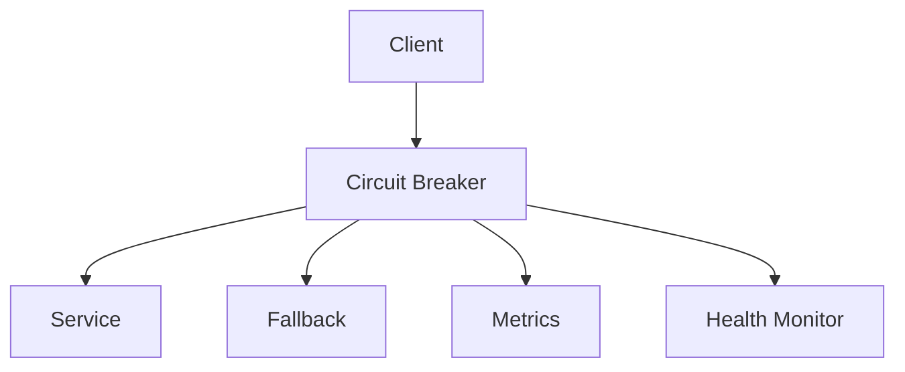

# Circuit Breaker in System Design 📌

## Table of Contents

- [Introduction](#introduction)
- [Prerequisites & Related Topics](#prerequisites--related-topics)
- [Pattern Recognition Guide](#pattern-recognition-guide)
- [Circuit States](#circuit-states)
- [Implementation Strategies](#implementation-strategies)
- [Monitoring & Recovery](#monitoring--recovery)
- [Best Practices](#best-practices)
- [Trade-offs](#trade-offs)
- [Edge Cases to Consider](#edge-cases-to-consider)
- [Common Pitfalls](#common-pitfalls)
- [FAQ](#faq)
- [Interview Tips](#interview-tips)
- [Advanced Topics](#advanced-topics)
- [Further Reading](#further-reading)

## Introduction

The Circuit Breaker pattern prevents cascading failures by temporarily stopping operations that are likely to fail. It provides stability and resilience in distributed systems.

### Key Benefits
1. **Fail Fast**
2. **Prevent Cascading Failures**
3. **Enable Recovery**
4. **Improve Resilience**

## Prerequisites & Related Topics

- Builds on: timeouts and retries, [Load Balancing](../system-basics/load-balancing.md)
- Used in: [Microservices](../scalability/microservices.md), [Design Patterns](../cloud-native/design-patterns.md), [Rate Limiting](rate-limiting.md)
- Techniques often combined: fallbacks, bulkheads, retry budgets, hedged requests
- See also: [Graceful Degradation](../best-practices/design-guidelines.md) — the breaker is the trigger, degradation is the behavior

## Pattern Recognition Guide

### 🎯 When to Use Circuit Breaker

**Keywords in requirements**: "cascading failure", "dependency timeout", "fail fast", "fallback", "resilience", "retry storm"
**Reach for this when**:
- Every synchronous call to another service or external API
- Protecting thread/connection pools from slow dependencies
- Enabling graceful degradation (cache, default, queue) during outages
- Stopping retry storms from amplifying an incident

### 🔑 Approach Indicators

| Approach | Signals | Best For |
|----------|---------|----------|
| Count-based breaker | last N calls threshold | simple, low traffic |
| Time-based sliding window | rate over recent window | high traffic services |
| Per-dependency breaker | isolation per upstream | the standard shape |
| Adaptive (outlier ejection) | mesh-managed | Envoy/Istio environments |

### ❌ When NOT to Use

- Local in-process calls — no network, no breaker needed
- Calls that must always complete (payments capture) — fail over instead of fail back
- As a substitute for fixing the dependency — it protects the caller, nothing else

## Circuit States

### 1. Closed State (Normal)
**How it works — Closed state:** the circuit breaker's healthy state — requests flow normally while the failure counter accrues; crossing the threshold (e.g., 50% errors in a window) trips it open.

### 2. Open State (Failed)
**How it works — Open state:** the breaker rejects every call immediately — clients get the fallback (cached data, default value, queued request) without a network attempt, and no new failures accrue. It stays open for a fixed cool-down, then transitions to half-open for a single probe.

### 3. Half-Open State (Testing)
**How it works — Half open state:** after the cool-down, the breaker lets one probe request through — success closes the circuit (recovery confirmed), failure snaps it back open and restarts the timer.

## Implementation Strategies

### 1. Basic Circuit Breaker
**How it works — Circuit breaker:** every call passes through the breaker, which counts failures against `failure_threshold`; crossing it opens the circuit, and after `reset_timeout` a half-open probe tests recovery — knobs that turn "retry harder" into bounded, automatic behavior.

### 2. Advanced Circuit Breaker
**How it works — Advanced circuit breaker:** Build once, promote the same artifact through environments, and shift traffic gradually — canary or blue/green — so a bad release is rolled back by a routing change, not a rebuild.

### 3. Distributed Circuit Breaker
**How it works — Distributed circuit breaker:** Build once, promote the same artifact through environments, and shift traffic gradually — canary or blue/green — so a bad release is rolled back by a routing change, not a rebuild.

## Monitoring & Recovery

### 1. Metrics Collection
**How it works — Circuit metrics:** Collect the signal on a schedule, evaluate it against the defined threshold or SLO, and route any breach to the right channel with enough context to act without digging.

### 2. Health Monitoring
**How it works — Circuit health monitor:** Collect the signal on a schedule, evaluate it against the defined threshold or SLO, and route any breach to the right channel with enough context to act without digging.

### 3. Recovery Strategies
**How it works — Circuit recovery:** Keep a synchronized copy or snapshot that can take over; failover promotes the copy, and RTO/RPO requirements decide how synchronized "synchronized" must be.

## Best Practices

### 1. Configuration Management
**How it works — Circuit config:** Build once, promote the same artifact through environments, and shift traffic gradually — canary or blue/green — so a bad release is rolled back by a routing change, not a rebuild.

### 2. Error Classification
**How it works — Error classifier:** every failure maps to a class — retryable (timeout, 503), non-retryable (400, validation), or alertable (quota, circuit open) — and the class decides the handling, so retry logic is uniform instead of ad hoc.

## Trade-offs

| Choice | Pros | Cons | Best For |
|--------|------|------|----------|
| Fail fast (open circuit) | Protects caller, saves resources | Callers see errors instead of waiting | Non-critical dependencies |
| Fallback response | User-facing resilience | Stale/degraded data semantics | Recommendations, secondary data |
| Conservative thresholds | Fewer false trips | Slower protection during real incidents | Stable, well-understood dependencies |
| Aggressive thresholds | Fast failure isolation | False positives under load spikes | Volatile dependencies |

**Availability vs correctness:** Tripping the circuit keeps the caller alive but serves fallbacks — acceptable for recommendations, not for payment status.

**Recovery speed vs stability:** Half-open probes recover capacity quickly but can re-overwhelm a struggling dependency; tune probe rate deliberately.

**Where to place breakers:** Per-dependency breakers isolate precisely but multiply configuration; coarse breakers are simpler but blunt.

> **⚠️ When NOT to use a circuit breaker:** dependencies that must succeed for the request to be meaningful (auth checks on a money transfer — fail loudly instead), and low-traffic paths that never accumulate enough samples to trip reliably.

## Edge Cases to Consider

- Slow-not-failing dependency — timeouts must feed the breaker, not just errors
- Probe storms at half-open — admit a bounded probe rate
- Multi-instance inconsistency — share state or accept per-instance breakers
- Retry inside breaker — retries count as failures or budgets will break

## Common Pitfalls

1. Open-and-stuck breakers — no half-open recovery configured
2. Breaker per app instead of per dependency — one bad API degrades everything
3. Fallbacks that silently corrupt data instead of degrading presentation
4. No metrics on breaker state — teams fly blind during incidents

## FAQ

**Q1: Breaker vs retry?**

A: Retries fight transient blips; breakers stop fighting sustained failures. Combine: bounded retries while closed, none while open, probe at half-open.

**Q2: What belongs in a fallback?**

A: Anything cheaper and safe: cached data, default values, queueing for later, feature shading. Not partial writes.

**Q3: Where does the threshold come from?**

A: The dependency's normal error rate plus margin — e.g., trip at 50% failures over a window when baseline is under 1%. Tune with production data.

## Interview Tips

### 1. Key Considerations
- Failure detection
- State management
- Recovery strategy
- Monitoring approach
- Configuration needs

### 2. Common Questions
1. How would you implement a circuit breaker?
2. How do you handle distributed state?
3. How do you configure thresholds?
4. How do you monitor circuit health?

### 3. Architecture Diagram

## Advanced Topics

1. Retry budgets vs naive retries (Google SRE guidance)
2. Hedged requests for tail-latency-sensitive reads
3. Outlier ejection in service meshes
4. Circuit-breaker hierarchies with bulkhead pools

## Further Reading
- [Circuit Breaker Pattern](https://martinfowler.com/bliki/CircuitBreaker.html)
- [Netflix Hystrix](https://github.com/Netflix/Hystrix/wiki)
- [Resilience4j](https://resilience4j.readme.io/docs/circuitbreaker)
- [Microsoft Circuit Breaker](https://docs.microsoft.com/en-us/azure/architecture/patterns/circuit-breaker) 