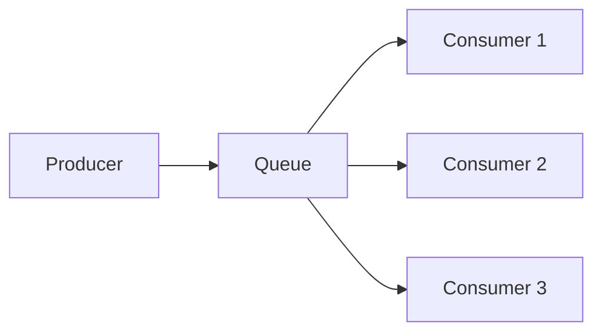
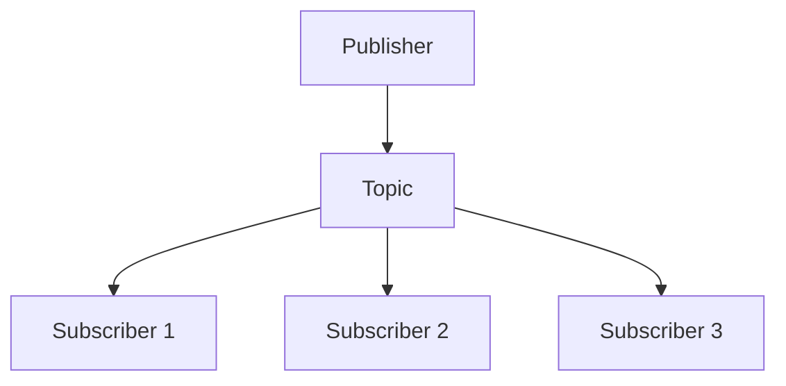
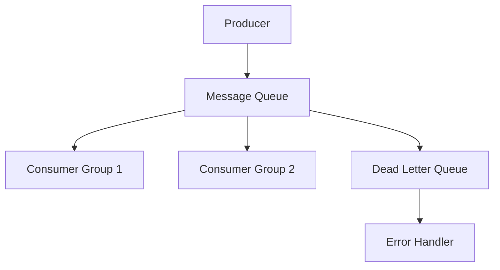

# Message Queues in System Design 📌

## Table of Contents

- [Introduction](#introduction)
- [Prerequisites & Related Topics](#prerequisites--related-topics)
- [Pattern Recognition Guide](#pattern-recognition-guide)
- [Queue Types](#queue-types)
- [Message Patterns](#message-patterns)
- [Implementation Strategies](#implementation-strategies)
- [Reliability & Durability](#reliability--durability)
- [Best Practices](#best-practices)
- [Trade-offs](#trade-offs)
- [Edge Cases to Consider](#edge-cases-to-consider)
- [Common Pitfalls](#common-pitfalls)
- [FAQ](#faq)
- [Interview Tips](#interview-tips)
- [Advanced Topics](#advanced-topics)
- [Further Reading](#further-reading)

## Introduction

Message queues enable asynchronous communication between services, improving scalability and reliability. They decouple producers from consumers and handle message delivery.

### Key Benefits
1. **Decoupling**
2. **Scalability**
3. **Reliability**
4. **Asynchronous Processing**

## Prerequisites & Related Topics

- Builds on: [Event-Driven Architecture](../scalability/event-driven.md) concepts
- Used in: [Microservices](../scalability/microservices.md), [Serverless Patterns](../cloud-native/serverless-patterns.md), [Case Study: Chat](../case-studies/real-time-chat.md)
- Techniques often combined: DLQs, idempotent consumers, prefetch tuning, FIFO partitions
- See also: Data Pipelines — queues as pipeline buffers

## Pattern Recognition Guide

### 🎯 When to Use Message Queues

**Keywords in requirements**: "async processing", "buffer", "spiky traffic", "background job", "worker pool", "decouple services"
**Reach for this when**:
- Accepting work at producer speed, processing at consumer speed
- Retriable background jobs (emails, thumbnails, exports)
- Load-leveling traffic spikes without scaling the database directly
- Reliable handoff between services with delivery guarantees

### 🔑 Approach Indicators

| Approach | Signals | Best For |
|----------|---------|----------|
| Point-to-point queue | one consumer per message | job distribution |
| Pub-sub topic | fan-out to many subscribers | event notifications |
| FIFO queue | ordering + dedupe | state changes, payments |
| Priority queue | urgency ordering | alerts over batch work |
| Delayed queue | time-based delivery | retries, scheduled jobs |

### ❌ When NOT to Use

- The user needs the answer now — synchronous API
- Request-reply over queues for simple reads — overhead without benefit
- Huge unbounded payloads — pass references (S3 keys), not blobs

## Queue Types

### 1. Point-to-Point Queue

**How it works — point-to-point:** each message is consumed by exactly one consumer and acknowledged — work distribution, not broadcasting. Multiple consumers still help (they share the queue), but every message has one final owner.

### 2. Publish-Subscribe Queue

**How it works — pub-sub:** each message is delivered to every subscriber of the topic — one publisher, many independent consumers, each keeping its own position. Fan-out is the broker's job; adding a subscriber changes nothing for existing ones.

### 3. Dead Letter Queue
**How it works — DLQ:** after the configured delivery/retry attempts fail, the message is moved to a dead-letter queue instead of blocking the stream — operators inspect, fix, and replay it. Without a DLQ, one poison message can stall the entire queue.

## Message Patterns

### 1. Request-Reply Pattern
**How it works — request-reply over queues:** the requester publishes a command plus a reply-to address and correlation ID, then waits (async) while the responder processes and publishes the result back to the reply queue — decoupled synchronous-looking semantics across a broker.

### 2. Competing Consumers Pattern
**How it works — Competing consumers:** many workers draw from one queue; each message is processed exactly once by whichever worker grabs it — throughput scales by adding workers, and a slow consumer no longer blocks others.

### 3. Priority Queue Pattern
**How it works — priority queue:** higher-priority messages are dequeued ahead of lower ones regardless of arrival order — critical alerts jump the line. Cost: reordering overhead and the risk of low-priority starvation, so use priorities sparingly (2–3 tiers, not 20).

## Implementation Strategies

### 1. RabbitMQ Implementation
**How it works — Rabbit mqhandler:** each consumer prefetches a bounded batch, processes, then acks; a crash redelivers unacked messages, poison messages dead-letter after retry limits, and prefetch size is the backpressure dial.

### 2. Kafka Implementation
**How it works — Kafka handler:** a consumer group shares the topic's partitions — each partition read by exactly one member, scaling up to the partition count; offsets track progress and `acks=all` on the producer side guards durability.

## Reliability & Durability

### 1. Message Persistence
**How it works — persistence:** messages are written to disk (journal/fsync) before the ack returns, so a broker crash loses nothing acknowledged — the trade is latency vs. durability, and replication across brokers removes the single-disk dependency.

### 2. Error Handling
**How it works — Error handler:** fail the operation, not the process — catch at the boundary, log with the trace ID, return a typed error to the caller, and retry only what's idempotent; partial side effects roll back via compensating actions.

## Best Practices

### 1. Message Design
**How it works — Message schema:** Define the shape from the access patterns first, apply the change incrementally with a rollback path, and verify both old and new readers work during the transition window.

### 2. Performance Optimization
**How it works — Queue optimizer:** the tuning dials — prefetch count, batch size, consumer concurrency, DLQ thresholds — trade throughput against latency and fairness; measure with production-shaped message sizes, not broker defaults.

## Trade-offs

| Pattern | Pros | Cons | Best For |
|---------|------|------|----------|
| Point-to-point queue | Simple load leveling, one consumer per message | No fan-out | Task distribution |
| Publish-subscribe | Fan-out to many consumers | Consumer management complexity | Event broadcast |
| At-least-once delivery | No message loss | Duplicates require idempotent consumers | Default reliable choice |
| At-most-once delivery | No duplicates, lowest overhead | Messages can be lost | Metrics, telemetry |
| FIFO / ordered | Predictable processing | Throughput limits, head-of-line blocking | Per-entity state machines |

**Throughput vs durability:** Persistent, replicated queues survive broker crashes but pay fsync/replication latency; in-memory queues are fast and fragile.

**Pull vs push:** Pull-based consumers self-pace and simplify backpressure; push-based reduces latency but needs flow control.

**Queue depth vs latency:** Buffering smooths spikes but adds delay and hides capacity problems; monitor depth and consumer lag as health signals.

> **⚠️ When NOT to queue:** operations where the user needs the result now (search, checkout pricing), strict end-to-end ordering that fights partitioning, and one-shot CRUD where a queue adds infrastructure without adding decoupling.

## Edge Cases to Consider

- Duplicate delivery after ack timeout — idempotent consumers required
- Poison messages blocking head-of-line — DLQ after N attempts
- Consumer crash mid-batch — unacked messages redeliver; design for it
- Ordering vs parallelism — per-key partitions, not global order

## Common Pitfalls

1. No DLQ — one bad message stalls the queue
2. Unbounded queue growth during incidents — alert on depth and age
3. Processing success signaled before persistence — data loss on crash
4. Ignoring per-message latency — queue depth is only half the story

## FAQ

**Q1: Queue vs pub-sub?**

A: Queues distribute work among competing consumers; pub-sub broadcasts to every subscriber. Many systems (SNS+SQS) combine both.

**Q2: How do I avoid processing a message twice?**

A: You cannot fully prevent redelivery — make consumers idempotent: dedupe by message ID or upsert by natural key.

**Q3: What breaks first under load?**

A: Consumer throughput. Scale consumers up to the partition/concurrency ceiling, then shard the queue; depth alone is not the metric — age is.

## Interview Tips

### 1. Key Considerations
- Message reliability
- Ordering requirements
- Scalability needs
- Error handling
- Performance requirements

### 2. Common Questions
1. How would you handle message ordering?
2. How do you ensure message delivery?
3. How do you handle failed messages?
4. How do you scale message processing?

### 3. Architecture Diagram

## Advanced Topics

1. Exactly-once patterns: idempotency keys + transactional outbox
2. Backpressure via prefetch and consumer credit
3. Kafka-style log compaction vs classic queues
4. Cross-region replication of queues for DR

## Further Reading
- [RabbitMQ Documentation](https://www.rabbitmq.com/documentation.html)
- [Apache Kafka Documentation](https://kafka.apache.org/documentation/)
- [Enterprise Integration Patterns](https://www.enterpriseintegrationpatterns.com/)
- [Message Queue Design Patterns](https://docs.microsoft.com/en-us/azure/architecture/patterns/) 