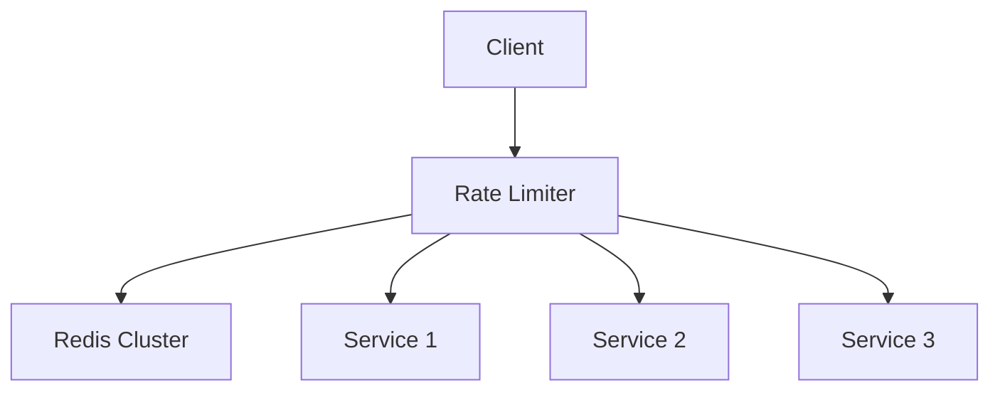

# Rate Limiting

## Table of Contents
- [Introduction](#introduction)
- [Rate Limiting Algorithms](#rate-limiting-algorithms)
- [Implementation Strategies](#implementation-strategies)
- [Distributed Rate Limiting](#distributed-rate-limiting)
- [Best Practices](#best-practices)
- [Trade-offs](#trade-offs)
- [Interview Tips](#interview-tips)

## Introduction

Rate limiting controls the rate of requests a client can make to a service to prevent abuse and ensure fair resource usage. It's crucial for API stability and security.

### Key Benefits
1. **Prevent Abuse**
2. **Ensure Fair Usage**
3. **Protect Resources**
4. **Cost Control**

## Rate Limiting Algorithms

### 1. Token Bucket Algorithm
```python
class TokenBucket:
    def __init__(self, capacity, refill_rate):
        self.capacity = capacity
        self.refill_rate = refill_rate
        self.tokens = capacity
        self.last_refill = time.time()
    
    async def consume(self, tokens=1):
        """Consume tokens from bucket."""
        await self.refill()
        
        if self.tokens >= tokens:
            self.tokens -= tokens
            return True
        return False
    
    async def refill(self):
        """Refill tokens based on elapsed time."""
        now = time.time()
        elapsed = now - self.last_refill
        
        # Calculate tokens to add
        new_tokens = elapsed * self.refill_rate
        self.tokens = min(
            self.capacity,
            self.tokens + new_tokens
        )
        
        self.last_refill = now
```

### 2. Leaky Bucket Algorithm
```python
class LeakyBucket:
    def __init__(self, capacity, leak_rate):
        self.capacity = capacity
        self.leak_rate = leak_rate
        self.bucket = asyncio.Queue(maxsize=capacity)
        self.last_leak = time.time()
    
    async def add(self, item):
        """Add item to bucket."""
        await self.leak()
        
        try:
            self.bucket.put_nowait(item)
            return True
        except asyncio.QueueFull:
            return False
    
    async def leak(self):
        """Leak items from bucket."""
        now = time.time()
        elapsed = now - self.last_leak
        
        # Calculate items to leak
        items_to_leak = int(elapsed * self.leak_rate)
        
        for _ in range(items_to_leak):
            try:
                self.bucket.get_nowait()
            except asyncio.QueueEmpty:
                break
        
        self.last_leak = now
```

### 3. Fixed Window Counter
```python
class FixedWindowCounter:
    def __init__(self, window_size, max_requests):
        self.window_size = window_size
        self.max_requests = max_requests
        self.counters = {}
    
    def get_window(self, timestamp):
        """Get window for timestamp."""
        return timestamp - (timestamp % self.window_size)
    
    async def increment(self, key):
        """Increment counter for key."""
        now = time.time()
        window = self.get_window(now)
        
        # Clear old windows
        self.clear_old_windows(now)
        
        # Get or create counter
        if window not in self.counters:
            self.counters[window] = defaultdict(int)
        
        # Check limit
        if self.counters[window][key] >= self.max_requests:
            return False
        
        # Increment counter
        self.counters[window][key] += 1
        return True
    
    def clear_old_windows(self, now):
        """Clear expired windows."""
        cutoff = self.get_window(now - self.window_size)
        for window in list(self.counters.keys()):
            if window <= cutoff:
                del self.counters[window]
```

### 4. Sliding Window Log
```python
class SlidingWindowLog:
    def __init__(self, window_size, max_requests):
        self.window_size = window_size
        self.max_requests = max_requests
        self.requests = defaultdict(list)
    
    async def allow_request(self, key):
        """Check if request is allowed."""
        now = time.time()
        
        # Remove old requests
        self.cleanup_requests(key, now)
        
        # Check request count
        if len(self.requests[key]) >= self.max_requests:
            return False
        
        # Add new request
        self.requests[key].append(now)
        return True
    
    def cleanup_requests(self, key, now):
        """Remove expired requests."""
        cutoff = now - self.window_size
        
        while (
            self.requests[key] and
            self.requests[key][0] <= cutoff
        ):
            self.requests[key].pop(0)
```

## Implementation Strategies

### 1. Redis Implementation
```python
class RedisRateLimiter:
    def __init__(self, redis_client):
        self.redis = redis_client
        self.script = self.load_lua_script()
    
    def load_lua_script(self):
        """Load rate limiting Lua script."""
        return self.redis.script_load("""
            local key = KEYS[1]
            local limit = tonumber(ARGV[1])
            local window = tonumber(ARGV[2])
            local current = tonumber(redis.call('get', key) or 0)
            
            if current >= limit then
                return 0
            end
            
            redis.call('incr', key)
            redis.call('expire', key, window)
            
            return 1
        """)
    
    async def is_allowed(self, key, limit, window):
        """Check if request is allowed."""
        try:
            result = await self.redis.evalsha(
                self.script,
                1,
                key,
                limit,
                window
            )
            return bool(result)
        except Exception as e:
            logger.error(f"Rate limiting failed: {e}")
            return True  # Fail open
```

### 2. In-Memory Implementation
```python
class InMemoryRateLimiter:
    def __init__(self):
        self.limiters = {}
        self.cleanup_task = asyncio.create_task(
            self.cleanup_loop()
        )
    
    def get_limiter(self, key, limit, window):
        """Get or create limiter for key."""
        if key not in self.limiters:
            self.limiters[key] = {
                'limit': limit,
                'window': window,
                'requests': []
            }
        return self.limiters[key]
    
    async def is_allowed(self, key, limit, window):
        """Check if request is allowed."""
        limiter = self.get_limiter(key, limit, window)
        now = time.time()
        
        # Remove old requests
        cutoff = now - window
        limiter['requests'] = [
            req for req in limiter['requests']
            if req > cutoff
        ]
        
        # Check limit
        if len(limiter['requests']) >= limit:
            return False
        
        # Add request
        limiter['requests'].append(now)
        return True
    
    async def cleanup_loop(self):
        """Cleanup expired limiters."""
        while True:
            now = time.time()
            for key in list(self.limiters.keys()):
                limiter = self.limiters[key]
                cutoff = now - limiter['window']
                
                # Remove old requests
                limiter['requests'] = [
                    req for req in limiter['requests']
                    if req > cutoff
                ]
                
                # Remove empty limiters
                if not limiter['requests']:
                    del self.limiters[key]
            
            await asyncio.sleep(60)  # Cleanup every minute
```

## Distributed Rate Limiting

### 1. Centralized Redis Approach
```python
class DistributedRateLimiter:
    def __init__(self, redis_cluster):
        self.redis = redis_cluster
    
    async def acquire_permit(self, key, permits=1):
        """Acquire rate limiting permits."""
        try:
            # Use Redis transaction
            async with self.redis.pipeline() as pipe:
                # Watch key for changes
                await pipe.watch(key)
                
                # Get current count
                current = await pipe.get(key) or 0
                current = int(current)
                
                if current + permits > self.limit:
                    return False
                
                # Update atomically
                pipe.multi()
                pipe.incr(key, permits)
                pipe.expire(key, self.window)
                
                await pipe.execute()
                return True
                
        except Exception as e:
            logger.error(f"Failed to acquire permit: {e}")
            return False
```

### 2. Consistent Hashing Approach
```python
class ShardedRateLimiter:
    def __init__(self, nodes):
        self.ring = HashRing(nodes)
        self.limiters = {
            node: RateLimiter()
            for node in nodes
        }
    
    async def is_allowed(self, key, limit, window):
        """Check rate limit using consistent hashing."""
        # Get responsible node
        node = self.ring.get_node(key)
        limiter = self.limiters[node]
        
        try:
            return await limiter.is_allowed(key, limit, window)
        except NodeUnavailableError:
            # Handle node failure
            return await self.handle_node_failure(node, key)
    
    async def handle_node_failure(self, failed_node, key):
        """Handle node failure in rate limiting."""
        # Remove failed node
        self.ring.remove_node(failed_node)
        
        # Get new node
        new_node = self.ring.get_node(key)
        
        # Use new node's limiter
        return await self.limiters[new_node].is_allowed(
            key,
            self.limit,
            self.window
        )
```

## Best Practices

### 1. Rate Limit Headers
```python
class RateLimitHeaders:
    def add_headers(self, response, limit_info):
        """Add rate limit headers to response."""
        response.headers.update({
            'X-RateLimit-Limit': str(limit_info['limit']),
            'X-RateLimit-Remaining': str(
                limit_info['remaining']
            ),
            'X-RateLimit-Reset': str(
                limit_info['reset']
            )
        })
        
        if limit_info['remaining'] == 0:
            response.headers['Retry-After'] = str(
                limit_info['retry_after']
            )
```

### 2. Dynamic Rate Limiting
```python
class DynamicRateLimiter:
    def __init__(self):
        self.metrics = SystemMetrics()
    
    async def get_limit(self, user_id):
        """Get dynamic rate limit based on system load."""
        system_load = await self.metrics.get_system_load()
        user_tier = await self.get_user_tier(user_id)
        
        base_limit = self.tier_limits[user_tier]
        
        if system_load > 0.8:
            # Reduce limits under high load
            return int(base_limit * 0.5)
        elif system_load > 0.6:
            return int(base_limit * 0.8)
        else:
            return base_limit
```

## Trade-offs

| Algorithm | Pros | Cons | Best For |
|-----------|------|------|----------|
| Token Bucket | Allows controlled bursts, simple | Tuning rate/burst needs care | APIs with natural bursts |
| Leaky Bucket | Smooth, constant outflow | Queues add latency; bursts lost | Shaping traffic to fixed capacity |
| Fixed Window | Trivially simple, cheap | Boundary spikes (2x at window edges) | Coarse, low-stakes limits |
| Sliding Window Log | Accurate | Memory per key | Strict precision |
| Sliding Window Counter | Accurate enough, memory-efficient | Approximation | Most distributed limits |

**Precision vs cost:** Exact sliding-window logs cost memory per key; windowed counters approximate accuracy cheaply — usually the right trade.

**Reject vs throttle:** Hard rejects are simple and honest; queuing/throttling smooths experience but adds latency and state.

**Local vs distributed limits:** Local limits are fast but drift per node; centralized counters (Redis) are accurate but add a round trip and a dependency.

> **⚠️ When NOT to rate limit at the app layer:** volumetric L3/L4 floods (edge scrubbing handles those before requests arrive), and fully trusted internal meshes where a simple per-dependency concurrency limiter beats full token-bucket machinery.

## Interview Tips

### 1. Key Considerations
- Rate limiting strategy
- Storage mechanism
- Distributed coordination
- Failure handling
- Client communication

### 2. Common Questions
1. How would you implement distributed rate limiting?
2. How do you handle rate limit evasion?
3. How do you choose rate limiting algorithms?
4. How do you handle failures?

### 3. Architecture Diagram


## Further Reading
- [Rate Limiting Algorithms](https://konghq.com/blog/how-to-design-a-scalable-rate-limiting-algorithm)
- [Redis Rate Limiting](https://redis.io/commands/INCR)
- [System Design - Rate Limiter](https://github.com/donnemartin/system-design-primer#design-a-rate-limiter)
- [API Rate Limiting](https://www.nginx.com/blog/rate-limiting-nginx/) 