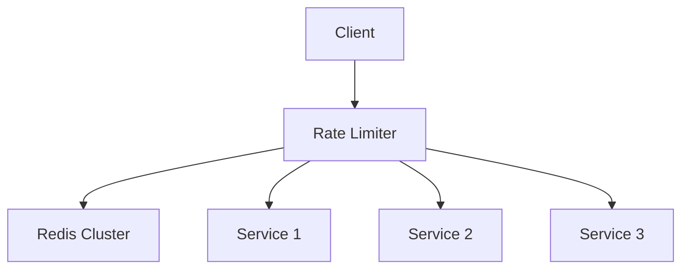

# Rate Limiting in System Design 📌

## Table of Contents

- [Introduction](#introduction)
- [Prerequisites & Related Topics](#prerequisites--related-topics)
- [Pattern Recognition Guide](#pattern-recognition-guide)
- [Rate Limiting Algorithms](#rate-limiting-algorithms)
- [Implementation Strategies](#implementation-strategies)
- [Distributed Rate Limiting](#distributed-rate-limiting)
- [Best Practices](#best-practices)
- [Trade-offs](#trade-offs)
- [Edge Cases to Consider](#edge-cases-to-consider)
- [Common Pitfalls](#common-pitfalls)
- [FAQ](#faq)
- [Interview Tips](#interview-tips)
- [Advanced Topics](#advanced-topics)
- [Further Reading](#further-reading)

## Introduction

Rate limiting controls the rate of requests a client can make to a service to prevent abuse and ensure fair resource usage. It's crucial for API stability and security.

### Key Benefits
1. **Prevent Abuse**
2. **Ensure Fair Usage**
3. **Protect Resources**
4. **Cost Control**

## Prerequisites & Related Topics

- Builds on: [API Gateway](api-gateway.md), [Load Balancing](../system-basics/load-balancing.md)
- Used in: [API Design](../system-basics/api-design.md) (limit headers), [DDoS Prevention](../security/ddos-prevention.md), [Microservices](../scalability/microservices.md)
- Techniques often combined: token buckets, sliding windows, Redis shared counters, retry-after headers
- See also: [Load Shedding](../best-practices/design-guidelines.md) — rate limiting per client, shedding global

## Pattern Recognition Guide

### 🎯 When to Use Rate Limiting

**Keywords in requirements**: "throttle", "429", "quota", "too many requests", "protect the API", "fair usage", "bursts"
**Reach for this when**:
- Public APIs with per-key or per-IP quotas
- Protecting backends from runaway clients or retry loops
- Tiered service levels (free vs paid limits)
- Internal protection of expensive endpoints (search, exports)

### 🔑 Approach Indicators

| Approach | Signals | Best For |
|----------|---------|----------|
| Token bucket | bursts allowed, sustained cap | the general default |
| Leaky bucket | smooth constant outflow | protecting fragile downstreams |
| Fixed window | cheap, coarse | low-risk internal limits |
| Sliding window log | exact counts | billing-grade accuracy |
| Sliding window counter | O(1) approximation | high-traffic edges |

### ❌ When NOT to Use

- Global limits without per-client identity — one abuser consumes everyone's budget
- Limiting only at the edge — internal fan-out multiplies the original request
- Hard limits on critical user flows without a paid-tier escape hatch

## Rate Limiting Algorithms

### 1. Token Bucket Algorithm
**How it works — Token bucket:** the bucket holds up to `capacity` tokens and refills continuously at `refill_rate` tokens/second; each request consumes one token and is rejected (429) when the bucket is empty. Bursts up to the bucket size are absorbed instantly, while sustained traffic settles at the refill rate — knobs: `capacity` (burst ceiling) and `refill_rate` (steady throughput).

### 2. Leaky Bucket Algorithm
**How it works — Leaky bucket:** requests enter a queue (the bucket) and are processed at a fixed `leak_rate`; when the queue is full, new requests are rejected. Unlike the token bucket it smooths bursts into a constant outflow instead of allowing them through — the right choice when the *downstream* needs a steady rate, not just the quota.

### 3. Fixed Window Counter
**How it works — Fixed window counter:** count requests in fixed buckets (per minute, per hour) and reject once `max_requests` is hit. Cheap and O(1), but a burst at the boundary — 2× the limit straddling the window edge — can double the intended rate; that's what the sliding variants fix.

### 4. Sliding Window Log
**How it works — Sliding window log:** keep a timestamped log of each client's recent requests and admit a new one only if fewer than `max_requests` fall inside the last `window_size` — perfectly accurate, at the cost of storing the log (the sliding-window-counter approximation trades a little accuracy for O(1) memory).

## Implementation Strategies

### 1. Redis Implementation
**How it works — Redis rate limiter:** atomic Lua scripts (or INCR+EXPIRE) make check-and-increment one round-trip that all limiter instances share — correct globally, at the cost of Redis becoming the limiter's availability single point.

### 2. In-Memory Implementation
**How it works — In memory rate limiter:** counters live in the instance's own memory — zero latency, but per-instance budgets that multiply by replica count; acceptable for coarse protection, wrong when a precise global quota is the requirement.

## Distributed Rate Limiting

### 1. Centralized Redis Approach
**How it works — Distributed rate limiter:** counters live in shared state (Redis) so all limiter instances enforce one global budget; the cost is a network round-trip per check — amortize with local token caches that sync periodically.

### 2. Consistent Hashing Approach
**How it works — Sharded rate limiter:** Route each record to its partition by the shard key, so most queries touch exactly one partition — and hot spots, cross-partition joins, and rebalancing are the costs you sign up for.

## Best Practices

### 1. Rate Limit Headers
**How it works — Rate limit headers:** every response carries the client's budget — remaining requests and reset time — so well-behaved clients self-throttle instead of discovering the limit by getting 429s.

### 2. Dynamic Rate Limiting
**How it works — Dynamic rate limiter:** limits adjust to conditions — lower during incidents or dependency slowdowns, higher for premium tiers — driven from config rather than redeploy, so the protection matches the system's current capacity.

## Trade-offs

| Algorithm | Pros | Cons | Best For |
|-----------|------|------|----------|
| Token Bucket | Allows controlled bursts, simple | Tuning rate/burst needs care | APIs with natural bursts |
| Leaky Bucket | Smooth, constant outflow | Queues add latency; bursts lost | Shaping traffic to fixed capacity |
| Fixed Window | Trivially simple, cheap | Boundary spikes (2x at window edges) | Coarse, low-stakes limits |
| Sliding Window Log | Accurate | Memory per key | Strict precision |
| Sliding Window Counter | Accurate enough, memory-efficient | Approximation | Most distributed limits |

**Precision vs cost:** Exact sliding-window logs cost memory per key; windowed counters approximate accuracy cheaply — usually the right trade.

**Reject vs throttle:** Hard rejects are simple and honest; queuing/throttling smooths experience but adds latency and state.

**Local vs distributed limits:** Local limits are fast but drift per node; centralized counters (Redis) are accurate but add a round trip and a dependency.

> **⚠️ When NOT to rate limit at the app layer:** volumetric L3/L4 floods (edge scrubbing handles those before requests arrive), and fully trusted internal meshes where a simple per-dependency concurrency limiter beats full token-bucket machinery.

## Edge Cases to Consider

- Clock skew across limiter instances — use monotonic or server-side time
- NAT/proxy IP collapse — prefer authenticated identity over IP
- Distributed counters under partition — fail open or closed deliberately
- Burst at window boundary (fixed window) — double-limit leakage

## Common Pitfalls

1. Per-instance limits that multiply by replica count
2. No rate-limit headers — clients discover limits by failing
3. 429 without Retry-After — clients hammer harder
4. Redis limiter outage takes the API down — decide the fail-open story

## FAQ

**Q1: Token bucket or sliding window?**

A: Token bucket when bursts are legitimate and you want simple tuning; sliding window log/counter when the quota must be exact within any window (billing).

**Q2: Where should limits be enforced?**

A: At the edge for coarse per-client quotas, and per-service for expensive internal endpoints. Enforce where identity is known and capacity is protected.

**Q3: Fail open or closed when the limiter is down?**

A: Public protective limits fail open (availability first); billing or abuse limits fail closed. Document the choice — it is a business decision.

## Interview Tips

### 1. Key Considerations
- Rate limiting strategy
- Storage mechanism
- Distributed coordination
- Failure handling
- Client communication

### 2. Common Questions
1. How would you implement distributed rate limiting?
2. How do you handle rate limit evasion?
3. How do you choose rate limiting algorithms?
4. How do you handle failures?

### 3. Architecture Diagram

## Advanced Topics

1. Hierarchical limits: global, per-tenant, per-key, per-endpoint
2. Cost-based limiting (weight heavy endpoints more)
3. Local token caches synced to a global bucket (GitHub-style)
4. Adaptive limits tied to server load (BBR-style)

## Further Reading
- [Rate Limiting Algorithms](https://konghq.com/blog/how-to-design-a-scalable-rate-limiting-algorithm)
- [Redis Rate Limiting](https://redis.io/commands/INCR)
- [System Design - Rate Limiter](https://github.com/donnemartin/system-design-primer#design-a-rate-limiter)
- [API Rate Limiting](https://www.nginx.com/blog/rate-limiting-nginx/) 