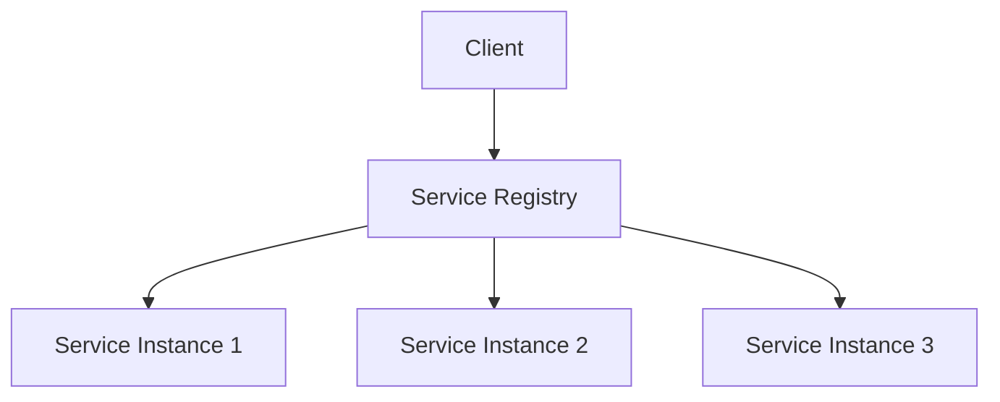
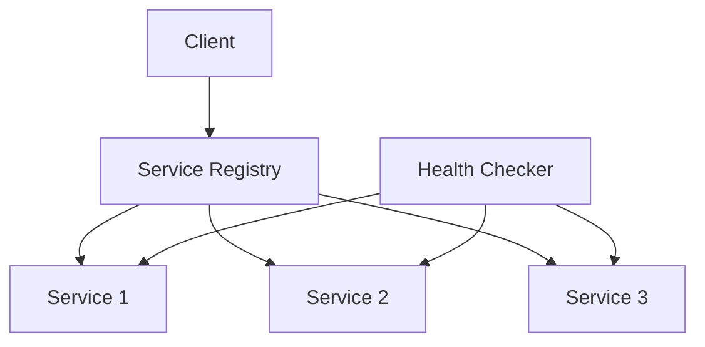

# Service Discovery

## Table of Contents
- [Introduction](#introduction)
- [Discovery Patterns](#discovery-patterns)
- [Registration Methods](#registration-methods)
- [Health Checking](#health-checking)
- [Implementation Strategies](#implementation-strategies)
- [Best Practices](#best-practices)
- [Trade-offs](#trade-offs)
- [Interview Tips](#interview-tips)

## Introduction

Service discovery enables services to find and communicate with each other dynamically in a distributed system. It's crucial for building resilient and scalable microservices architectures.

### Key Components
1. **Service Registry**
2. **Service Registration**
3. **Service Discovery**
4. **Health Checking**

## Discovery Patterns

### 1. Client-Side Discovery


```python
class ClientSideDiscovery:
    def __init__(self):
        self.registry = ServiceRegistry()
        self.load_balancer = LoadBalancer()
    
    async def get_service(self, service_name):
        """Get service instance using client-side discovery."""
        # Get all instances
        instances = await self.registry.get_instances(service_name)
        
        if not instances:
            raise ServiceNotFoundError(service_name)
        
        # Select instance using load balancer
        instance = self.load_balancer.select_instance(instances)
        
        # Verify health
        if not await self.check_health(instance):
            # Remove unhealthy instance
            await self.registry.deregister_instance(instance)
            # Retry with remaining instances
            return await self.get_service(service_name)
        
        return instance
```

### 2. Server-Side Discovery
```python
class ServerSideDiscovery:
    def __init__(self):
        self.registry = ServiceRegistry()
        self.router = Router()
    
    async def route_request(self, request):
        """Route request using server-side discovery."""
        service_name = self.get_service_name(request)
        
        # Get service instances
        instances = await self.registry.get_instances(service_name)
        
        if not instances:
            raise ServiceNotFoundError(service_name)
        
        # Route request
        response = await self.router.route(request, instances)
        
        # Handle routing failure
        if not response.success:
            await self.handle_routing_failure(request, response)
        
        return response
```

### 3. Service Mesh Discovery
```python
class ServiceMesh:
    def __init__(self):
        self.sidecar = Sidecar()
        self.control_plane = ControlPlane()
    
    async def handle_request(self, request):
        """Handle request in service mesh."""
        # Intercept request
        enriched_request = await self.sidecar.intercept_request(request)
        
        # Get routing info
        routing = await self.control_plane.get_routing(enriched_request)
        
        # Apply policies
        if not self.check_policies(enriched_request, routing):
            raise PolicyViolationError()
        
        # Forward request
        response = await self.sidecar.forward_request(
            enriched_request,
            routing
        )
        
        return response
```

## Registration Methods

### 1. Self Registration
```python
class ServiceRegistration:
    def __init__(self):
        self.instance_id = str(uuid.uuid4())
        self.registry_client = RegistryClient()
    
    async def register_service(self):
        """Register service with registry."""
        registration = {
            'id': self.instance_id,
            'name': self.service_name,
            'address': self.get_address(),
            'port': self.port,
            'health_check': {
                'endpoint': '/health',
                'interval': '10s',
                'timeout': '1s'
            },
            'metadata': self.get_metadata()
        }
        
        await self.registry_client.register(registration)
    
    async def deregister_service(self):
        """Deregister service from registry."""
        await self.registry_client.deregister(self.instance_id)
```

### 2. Third-Party Registration
```python
class Registrar:
    def __init__(self):
        self.registry = ServiceRegistry()
        self.discovery = ServiceDiscovery()
    
    async def monitor_services(self):
        """Monitor and register services."""
        while True:
            # Discover services
            services = await self.discovery.find_services()
            
            for service in services:
                # Check if already registered
                if not await self.registry.exists(service.id):
                    # Register service
                    await self.register_service(service)
                
                # Update health status
                health = await self.check_health(service)
                await self.update_health(service.id, health)
            
            await asyncio.sleep(self.check_interval)
```

## Health Checking

### 1. Active Health Checking
```python
class HealthChecker:
    def __init__(self):
        self.check_interval = 10  # seconds
        self.timeout = 1  # seconds
    
    async def check_service_health(self, service):
        """Check service health actively."""
        try:
            async with aiohttp.ClientSession() as session:
                async with session.get(
                    f"{service.address}/health",
                    timeout=self.timeout
                ) as response:
                    if response.status == 200:
                        health_data = await response.json()
                        return self.evaluate_health(health_data)
                    return False
        except Exception as e:
            logger.error(f"Health check failed: {e}")
            return False
    
    def evaluate_health(self, health_data):
        """Evaluate health check response."""
        required_checks = {
            'db_connection': True,
            'cache_connection': True,
            'queue_connection': True
        }
        
        return all(
            health_data.get(check) == status
            for check, status in required_checks.items()
        )
```

### 2. Passive Health Checking
```python
class PassiveHealthChecker:
    def __init__(self):
        self.circuit_breaker = CircuitBreaker()
        self.metrics = HealthMetrics()
    
    async def track_request(self, service_id, response):
        """Track service health passively."""
        # Update metrics
        self.metrics.track_response(service_id, response)
        
        # Check failure threshold
        if self.metrics.get_error_rate(service_id) > 0.5:
            await self.handle_service_degradation(service_id)
    
    async def handle_service_degradation(self, service_id):
        """Handle service health degradation."""
        # Open circuit breaker
        self.circuit_breaker.open_circuit(service_id)
        
        # Notify registry
        await self.registry.update_status(
            service_id,
            'unhealthy'
        )
        
        # Alert operations
        await self.alert_service_degradation(service_id)
```

## Implementation Strategies

### 1. Consul Implementation
```python
class ConsulServiceDiscovery:
    def __init__(self):
        self.consul = ConsulClient()
        self.cache = ServiceCache()
    
    async def register_service(self, service_info):
        """Register service with Consul."""
        registration = {
            'Name': service_info['name'],
            'ID': service_info['id'],
            'Address': service_info['address'],
            'Port': service_info['port'],
            'Tags': service_info['tags'],
            'Check': {
                'HTTP': f"http://{service_info['address']}:{service_info['port']}/health",
                'Interval': '10s'
            }
        }
        
        await self.consul.agent.service.register(**registration)
    
    async def discover_service(self, service_name):
        """Discover service using Consul."""
        # Check cache first
        cached = self.cache.get(service_name)
        if cached:
            return cached
        
        # Query Consul
        services = await self.consul.health.service(
            service_name,
            passing=True
        )
        
        # Update cache
        self.cache.set(service_name, services)
        
        return services
```

### 2. Eureka Implementation
```python
class EurekaServiceDiscovery:
    def __init__(self):
        self.eureka_client = EurekaClient()
    
    async def register_service(self, service_info):
        """Register service with Eureka."""
        instance = {
            'instanceId': service_info['id'],
            'app': service_info['name'],
            'ipAddr': service_info['address'],
            'port': {
                '$': service_info['port'],
                '@enabled': True
            },
            'healthCheckUrl': f"http://{service_info['address']}:{service_info['port']}/health",
            'statusPageUrl': f"http://{service_info['address']}:{service_info['port']}/info",
            'homePageUrl': f"http://{service_info['address']}:{service_info['port']}/",
            'dataCenterInfo': {
                '@class': 'com.netflix.appinfo.InstanceInfo$DefaultDataCenterInfo',
                'name': 'MyOwn'
            }
        }
        
        await self.eureka_client.register_instance(instance)
    
    async def discover_service(self, service_name):
        """Discover service using Eureka."""
        return await self.eureka_client.get_instances(service_name)
```

## Best Practices

### 1. Caching Strategy
```python
class ServiceCache:
    def __init__(self):
        self.cache = {}
        self.ttl = 60  # seconds
    
    def get_service(self, service_name):
        """Get service from cache."""
        cached = self.cache.get(service_name)
        if not cached:
            return None
        
        if self.is_expired(cached['timestamp']):
            del self.cache[service_name]
            return None
        
        return cached['instances']
    
    def update_service(self, service_name, instances):
        """Update service cache."""
        self.cache[service_name] = {
            'instances': instances,
            'timestamp': time.time()
        }
```

### 2. Failure Handling
```python
class FailureHandler:
    def __init__(self):
        self.fallback_registry = FallbackRegistry()
        self.retry_policy = RetryPolicy()
    
    async def handle_discovery_failure(self, service_name):
        """Handle service discovery failure."""
        try:
            # Try fallback registry
            instances = await self.fallback_registry.get_instances(
                service_name
            )
            if instances:
                return instances
            
            # Try cached data
            cached = self.cache.get_expired(service_name)
            if cached:
                return cached
            
            raise ServiceDiscoveryError(service_name)
            
        except Exception as e:
            logger.error(f"Discovery failure: {e}")
            raise
```

## Trade-offs

| Approach | Pros | Cons | Best For |
|----------|------|------|----------|
| Client-side discovery | No extra hop, rich client logic | Client library coupling per language | Polyglot-tolerant stacks |
| Server-side discovery (LB/DNS) | Language-agnostic clients | Extra hop, LB to scale | Heterogeneous clients |
| Self-registration | Simple, no third party | Service code polluted, trust issue | Small systems |
| Third-party registration (registrar) | Clean separation, centralized health | Extra component to run | Production microservices |

**Freshness vs cost:** Aggressive health checks and short TTLs converge fast but multiply registry traffic; relax them and accept brief staleness.

**Consistency of the registry vs its availability:** During partitions, serving possibly-stale instance lists usually beats serving none (AP tendency).

**DNS simplicity vs rich routing:** DNS is universal but slow to converge and coarse; dedicated registries add tooling for real-time health and metadata.

## Interview Tips

### 1. Key Considerations
- Service registration method
- Discovery pattern choice
- Health check strategy
- Caching approach
- Failure handling

### 2. Common Questions
1. How would you implement service discovery?
2. How do you handle service failures?
3. How do you ensure discovery reliability?
4. How do you scale service discovery?

### 3. Architecture Diagram


## Further Reading
- [Consul Documentation](https://www.consul.io/docs)
- [Eureka Wiki](https://github.com/Netflix/eureka/wiki)
- [Service Discovery Pattern](https://microservices.io/patterns/service-registry.html)
- [Health Check Pattern](https://microservices.io/patterns/observability/health-check-api.html) 