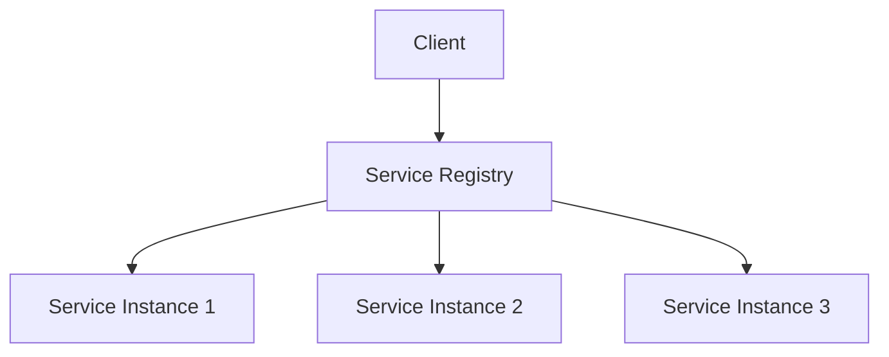
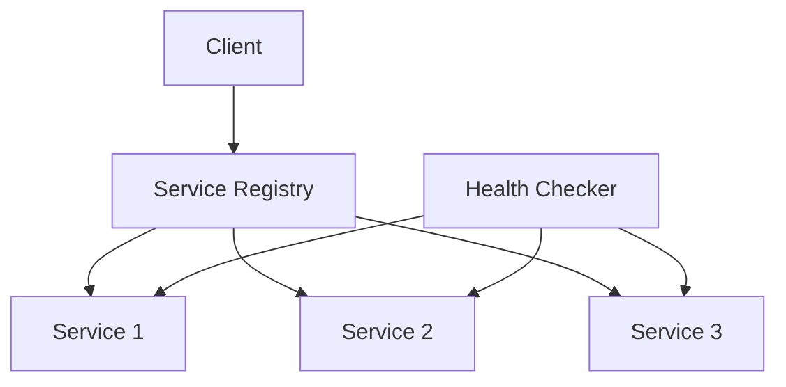

# Service Discovery in System Design 📌

## Table of Contents

- [Introduction](#introduction)
- [Prerequisites & Related Topics](#prerequisites--related-topics)
- [Pattern Recognition Guide](#pattern-recognition-guide)
- [Discovery Patterns](#discovery-patterns)
- [Registration Methods](#registration-methods)
- [Health Checking](#health-checking)
- [Implementation Strategies](#implementation-strategies)
- [Best Practices](#best-practices)
- [Trade-offs](#trade-offs)
- [Edge Cases to Consider](#edge-cases-to-consider)
- [Common Pitfalls](#common-pitfalls)
- [FAQ](#faq)
- [Interview Tips](#interview-tips)
- [Advanced Topics](#advanced-topics)
- [Further Reading](#further-reading)

## Introduction

Service discovery enables services to find and communicate with each other dynamically in a distributed system. It's crucial for building resilient and scalable microservices architectures.

### Key Components
1. **Service Registry**
2. **Service Registration**
3. **Service Discovery**
4. **Health Checking**

## Prerequisites & Related Topics

- Builds on: DNS basics, [Load Balancing](../system-basics/load-balancing.md)
- Used in: [Microservices](../scalability/microservices.md), [Kubernetes](../cloud-native/kubernetes-orchestration.md), [API Gateway](api-gateway.md)
- Techniques often combined: health checks, client-side balancing, DNS-based discovery
- See also: Consistent Hashing — key-to-instance assignment on top of discovery

## Pattern Recognition Guide

### 🎯 When to Use Service Discovery

**Keywords in requirements**: "find services", "dynamic instances", "registry", "health-checked routing", "elastic scaling", "service mesh"
**Reach for this when**:
- Autoscaled fleets where instances change by the minute
- Multi-region or multi-cluster service addressing
- Client-side load balancing with instance metadata
- Zero-downtime deploys driven by health-gated registration

### 🔑 Approach Indicators

| Approach | Signals | Best For |
|----------|---------|----------|
| Client-side (Eureka, Consul) | smart clients, one less hop | fine-grained balancing |
| Server-side (K8s Service, LB) | dumb clients, central control | the common default |
| DNS-based | ubiquitous, coarse TTLs | cross-cluster addressing |
| Mesh (xDS) | uniform policy + discovery | large microservice fleets |

### ❌ When NOT to Use

- Static on-prem deployments with stable addresses — DNS entries suffice
- Instance-level public discovery — expose the gateway, not the fleet
- Replacing it with config files humans update — that is the failure mode it exists to remove

## Discovery Patterns

### 1. Client-Side Discovery

**How it works — Client side discovery:** the consumer fetches the instance list from the registry and picks one itself (often with a client-side balancer) — one less network hop and smarter placement, at the cost of every client needing the discovery library.

### 2. Server-Side Discovery
**How it works — Server side discovery:** clients call one stable address (LB/DNS/virtual IP); the infrastructure resolves it to healthy instances — clients stay dumb, and discovery logic is owned once, centrally.

### 3. Service Mesh Discovery
**How it works — Service mesh:** sidecars intercept every call and enforce mTLS, retries, and traffic rules from one control plane — the app speaks plain HTTP to localhost and the mesh adds the reliability semantics uniformly.

## Registration Methods

### 1. Self Registration
**How it works — Service registration:** on boot the instance registers with the registry and starts heartbeating; missed heartbeats expire it automatically — registration is how the rest of the system learns a deploy happened without being told.

### 2. Third-Party Registration
**How it works — Registrar:** a service instance announces itself (address, port, health, metadata) on boot and renews continuously; deregistration happens on shutdown or lease expiry — consumers always see live instances only.

## Health Checking

### 1. Active Health Checking
**How it works — Health checker:** active probes hit each instance on an interval with healthy/unhealthy thresholds, and passive checks observe real traffic failures; only instances passing both receive load.

### 2. Passive Health Checking
**How it works — Passive health checker:** the balancer watches live requests and ejects servers that error, time out, or refuse connections — no probe traffic, instant reaction on user-visible failures, but silent servers are never tested.

## Implementation Strategies

### 1. Consul Implementation
**How it works — Consul:** services register with health checks attached (HTTP probe or TTL heartbeat); Consul exposes them via DNS or its API, and only instances passing checks are returned — the same agent also distributes KV config, so discovery and configuration share one infrastructure.

### 2. Eureka Implementation
**How it works — Eureka service discovery:** services register on boot and renew leases via heartbeat; clients pull the full registry periodically and route themselves — the registry optimizes for availability (stale-but-listed beats nothing) since clients tolerate brief staleness.

## Best Practices

### 1. Caching Strategy
**How it works — Service cache:** Store the computed result under a stable key with a TTL sized to how stale the data may be; hits skip the expensive path, misses repopulate, and invalidation events cover the changes TTL alone would miss.

### 2. Failure Handling
**How it works — Failure handler:** classify first (transient vs. permanent), retry transient failures with backoff and jitter, dead-letter the permanent ones with full context, and page a human when the failure rate itself breaches its budget.

## Trade-offs

| Approach | Pros | Cons | Best For |
|----------|------|------|----------|
| Client-side discovery | No extra hop, rich client logic | Client library coupling per language | Polyglot-tolerant stacks |
| Server-side discovery (LB/DNS) | Language-agnostic clients | Extra hop, LB to scale | Heterogeneous clients |
| Self-registration | Simple, no third party | Service code polluted, trust issue | Small systems |
| Third-party registration (registrar) | Clean separation, centralized health | Extra component to run | Production microservices |

**Freshness vs cost:** Aggressive health checks and short TTLs converge fast but multiply registry traffic; relax them and accept brief staleness.

**Consistency of the registry vs its availability:** During partitions, serving possibly-stale instance lists usually beats serving none (AP tendency).

**DNS simplicity vs rich routing:** DNS is universal but slow to converge and coarse; dedicated registries add tooling for real-time health and metadata.

> **⚠️ When NOT to run a registry:** a handful of stable services behind DNS or a cloud load balancer, and container platforms (Kubernetes, ECS) that already embed discovery — a separate registry duplicates what the platform provides.

## Edge Cases to Consider

- Stale registrations routing to dead instances — health-gate every lookup
- Registry outage — cache last-known-good on clients
- Thundering re-registration after registry restart
- Split-horizon truth — instance healthy locally, dead to peers (gray failure)

## Common Pitfalls

1. No deregistration on unclean shutdown — TTLs are the backstop
2. Treating the registry as strongly consistent when it is not
3. Discovery lookups on the hot path without caching
4. Forgetting to verify health from the caller's perspective

## FAQ

**Q1: Client-side or server-side discovery?**

A: Client-side gives smarter routing and one less hop but couples clients to the registry; server-side (Kubernetes default) keeps clients dumb and centralizes policy. Default to server-side.

**Q2: How stale can the registry be?**

A: Seconds — heartbeats and health checks bound it. Every lookup should still be health-gated, because staleness is guaranteed eventually.

**Q3: Why not just DNS?**

A: DNS works at coarse TTLs and record limits; registries add per-instance health, metadata, and instant updates. Use DNS across clusters, registries inside them.

## Interview Tips

### 1. Key Considerations
- Service registration method
- Discovery pattern choice
- Health check strategy
- Caching approach
- Failure handling

### 2. Common Questions
1. How would you implement service discovery?
2. How do you handle service failures?
3. How do you ensure discovery reliability?
4. How do you scale service discovery?

### 3. Architecture Diagram

## Advanced Topics

1. xDS APIs (Envoy) for push-based discovery
2. Cell-based discovery to bound blast radius
3. Service identity (SPIFFE) bound to registration
4. Multi-cluster discovery with failover priorities

## Further Reading
- [Consul Documentation](https://www.consul.io/docs)
- [Eureka Wiki](https://github.com/Netflix/eureka/wiki)
- [Service Discovery Pattern](https://microservices.io/patterns/service-registry.html)
- [Health Check Pattern](https://microservices.io/patterns/observability/health-check-api.html) 