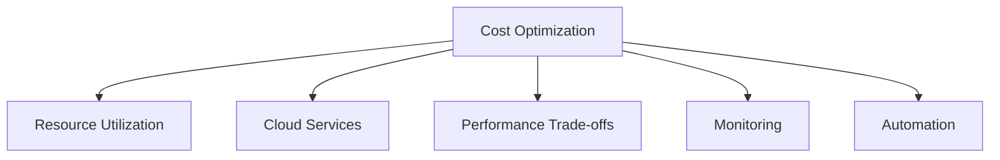

# Cost Optimization

## Table of Contents
- [Introduction](#introduction)
- [Resource Optimization](#resource-optimization)
- [Cloud Cost Management](#cloud-cost-management)
- [Performance vs Cost](#performance-vs-cost)
- [Monitoring and Analysis](#monitoring-and-analysis)
- [Best Practices](#best-practices)
- [Trade-offs](#trade-offs)
- [Interview Tips](#interview-tips)

## Introduction

Cost optimization involves strategies and practices to minimize expenses while maintaining system performance and reliability. It's crucial for sustainable system operation.

### Key Areas
1. **Resource Utilization**
2. **Cloud Services**
3. **Performance Trade-offs**
4. **Operational Efficiency**

## Resource Optimization

### 1. Auto Scaling
```python
class AutoScaler:
    def __init__(self):
        self.min_instances = 2
        self.max_instances = 10
        self.target_cpu = 70
    
    def calculate_desired_count(self, current_metrics):
        """Calculate desired instance count."""
        current_cpu = current_metrics['cpu_utilization']
        current_count = current_metrics['instance_count']
        
        # Scale based on CPU utilization
        desired_count = int(
            current_count * (current_cpu / self.target_cpu)
        )
        
        # Ensure within bounds
        return max(
            self.min_instances,
            min(desired_count, self.max_instances)
        )
    
    def apply_scaling(self, desired_count):
        """Apply scaling decision."""
        current_cost = self.calculate_current_cost()
        projected_cost = self.calculate_projected_cost(desired_count)
        
        if projected_cost <= current_cost * 1.2:  # 20% cost increase threshold
            return self.scale_cluster(desired_count)
        else:
            return self.handle_cost_threshold_exceeded()
```

### 2. Resource Pooling
```python
class ResourcePool:
    def __init__(self):
        self.resources = []
        self.in_use = set()
    
    async def get_resource(self):
        """Get resource from pool."""
        # Try to reuse existing resource
        for resource in self.resources:
            if resource not in self.in_use:
                self.in_use.add(resource)
                return resource
        
        # Create new resource if needed
        if len(self.resources) < self.max_size:
            resource = await self.create_resource()
            self.resources.append(resource)
            self.in_use.add(resource)
            return resource
        
        # Wait for resource to become available
        return await self.wait_for_resource()
    
    async def release_resource(self, resource):
        """Release resource back to pool."""
        self.in_use.remove(resource)
        
        # Clean up if too many idle resources
        if len(self.resources) > self.min_size:
            await self.cleanup_idle_resources()
```

### 3. Caching Strategy
```python
class CostEfficientCache:
    def __init__(self):
        self.memory_cache = MemoryCache()
        self.redis_cache = RedisCache()
        self.s3_cache = S3Cache()
    
    async def get_data(self, key):
        """Get data with cost-efficient caching."""
        # Try memory cache (fastest and cheapest)
        data = self.memory_cache.get(key)
        if data:
            return data
        
        # Try Redis cache (fast but costs more)
        data = await self.redis_cache.get(key)
        if data:
            self.memory_cache.set(key, data)
            return data
        
        # Try S3 cache (slowest and most expensive)
        data = await self.s3_cache.get(key)
        if data:
            # Update faster caches
            self.memory_cache.set(key, data)
            await self.redis_cache.set(key, data)
        
        return data
```

## Cloud Cost Management

### 1. Instance Selection
```python
class InstanceOptimizer:
    def select_instance_type(self, requirements):
        """Select cost-effective instance type."""
        suitable_instances = self.filter_instances(requirements)
        
        # Calculate cost-effectiveness score
        scored_instances = [
            {
                'type': instance['type'],
                'score': self.calculate_score(
                    instance,
                    requirements
                ),
                'cost': instance['cost']
            }
            for instance in suitable_instances
        ]
        
        # Return most cost-effective instance
        return max(
            scored_instances,
            key=lambda x: x['score'] / x['cost']
        )
    
    def calculate_score(self, instance, requirements):
        """Calculate instance suitability score."""
        return sum([
            self.score_cpu(instance, requirements),
            self.score_memory(instance, requirements),
            self.score_network(instance, requirements)
        ])
```

### 2. Storage Optimization
```python
class StorageOptimizer:
    def optimize_storage(self, data_specs):
        """Optimize storage costs."""
        storage_tiers = {
            'hot': {
                'type': 'S3_STANDARD',
                'access_pattern': 'frequent',
                'cost_per_gb': 0.023
            },
            'warm': {
                'type': 'S3_STANDARD_IA',
                'access_pattern': 'infrequent',
                'cost_per_gb': 0.0125
            },
            'cold': {
                'type': 'S3_GLACIER',
                'access_pattern': 'rare',
                'cost_per_gb': 0.004
            }
        }
        
        # Analyze access patterns
        access_frequency = self.analyze_access_patterns(data_specs)
        
        # Select appropriate storage tier
        if access_frequency > 0.7:
            return storage_tiers['hot']
        elif access_frequency > 0.3:
            return storage_tiers['warm']
        else:
            return storage_tiers['cold']
```

### 3. Reserved Capacity
```python
class CapacityPlanner:
    def plan_reserved_capacity(self, usage_history):
        """Plan reserved capacity purchases."""
        # Analyze usage patterns
        base_load = self.calculate_base_load(usage_history)
        peak_load = self.calculate_peak_load(usage_history)
        
        recommendations = {
            'reserved_instances': {
                'amount': base_load,
                'term': '1-year',
                'payment': 'partial_upfront'
            },
            'on_demand_instances': {
                'amount': peak_load - base_load,
                'purpose': 'handle_spikes'
            }
        }
        
        # Calculate cost savings
        savings = self.calculate_savings(recommendations)
        
        return {
            'recommendations': recommendations,
            'projected_savings': savings
        }
```

## Performance vs Cost

### 1. Performance Budgeting
```python
class PerformanceBudget:
    def analyze_performance_cost(self, metrics):
        """Analyze performance vs cost trade-offs."""
        analysis = {
            'current_performance': self.get_performance_metrics(),
            'current_cost': self.get_cost_metrics(),
            'optimization_opportunities': []
        }
        
        # Identify optimization opportunities
        if metrics['response_time'] > self.sla_target:
            if metrics['cpu_utilization'] > 80:
                analysis['optimization_opportunities'].append({
                    'type': 'scale_up',
                    'cost_impact': 'medium',
                    'performance_impact': 'high'
                })
            else:
                analysis['optimization_opportunities'].append({
                    'type': 'optimize_code',
                    'cost_impact': 'low',
                    'performance_impact': 'medium'
                })
        
        return analysis
```

### 2. Cost-Performance Optimization
```python
class CostPerformanceOptimizer:
    def optimize_resources(self, metrics):
        """Optimize resource allocation for cost and performance."""
        current_state = self.analyze_current_state(metrics)
        
        optimizations = []
        
        # Check CPU optimization
        if current_state['cpu_efficiency'] < 0.6:
            optimizations.append(
                self.optimize_cpu_allocation(current_state)
            )
        
        # Check memory optimization
        if current_state['memory_efficiency'] < 0.7:
            optimizations.append(
                self.optimize_memory_allocation(current_state)
            )
        
        # Apply optimizations
        return self.apply_optimizations(optimizations)
```

## Monitoring and Analysis

### 1. Cost Monitoring
```python
class CostMonitor:
    def __init__(self):
        self.metrics = {
            'compute_cost': Gauge('compute_cost', 'Compute costs'),
            'storage_cost': Gauge('storage_cost', 'Storage costs'),
            'network_cost': Gauge('network_cost', 'Network costs')
        }
    
    def track_costs(self):
        """Track and analyze costs."""
        current_costs = self.get_current_costs()
        
        # Update metrics
        for category, cost in current_costs.items():
            self.metrics[f"{category}_cost"].set(cost)
        
        # Check for anomalies
        anomalies = self.detect_cost_anomalies(current_costs)
        if anomalies:
            self.alert_cost_anomalies(anomalies)
```

### 2. Usage Analysis
```python
class UsageAnalyzer:
    def analyze_usage_patterns(self, metrics):
        """Analyze resource usage patterns."""
        analysis = {
            'peak_hours': self.identify_peak_hours(metrics),
            'idle_periods': self.identify_idle_periods(metrics),
            'resource_efficiency': self.calculate_efficiency(metrics)
        }
        
        # Generate optimization recommendations
        recommendations = []
        
        if analysis['resource_efficiency'] < 0.5:
            recommendations.append({
                'type': 'downsize_resources',
                'potential_savings': self.calculate_downsizing_savings()
            })
        
        if len(analysis['idle_periods']) > 0:
            recommendations.append({
                'type': 'schedule_shutdown',
                'potential_savings': self.calculate_shutdown_savings()
            })
        
        return recommendations
```

## Best Practices

### 1. Resource Lifecycle Management
```python
class ResourceLifecycle:
    def manage_resources(self):
        """Manage resource lifecycle."""
        # Check for unused resources
        unused = self.find_unused_resources()
        for resource in unused:
            if resource.idle_time > timedelta(days=30):
                self.terminate_resource(resource)
            elif resource.idle_time > timedelta(days=7):
                self.hibernate_resource(resource)
        
        # Check for underutilized resources
        underutilized = self.find_underutilized_resources()
        for resource in underutilized:
            self.rightsize_resource(resource)
```

### 2. Cost Allocation
```python
class CostAllocator:
    def allocate_costs(self, resources):
        """Allocate costs to teams/projects."""
        allocations = defaultdict(float)
        
        for resource in resources:
            # Get resource tags
            team = resource.tags.get('team')
            project = resource.tags.get('project')
            
            # Calculate resource cost
            cost = self.calculate_resource_cost(resource)
            
            # Allocate cost
            if team:
                allocations[f"team:{team}"] += cost
            if project:
                allocations[f"project:{project}"] += cost
        
        return allocations
```

## Trade-offs

| Choice | Pros | Cons | Best For |
|----------|------|------|----------|
| Reserved/committed capacity | Deep discounts | Lock-in, stranded commitment | Steady baselines |
| Spot/preemptible | Largest discounts | Interruptions | Batch and fault-tolerant work |
| Aggressive right-sizing | Immediate savings | Performance risk | Steady-state services |
| Over-provisioning | Performance headroom | Paying for idle | Hard latency SLOs |

**Cost vs performance:** The cheapest system that meets its SLO is the target — below that, savings become incidents; above it, money becomes waste.

**Optimization effort vs return:** A few high-leverage levers (rightsizing, storage tiering, idle cleanup, commitment coverage) beat exhaustive micro-optimization.

**Visibility before control:** Tagging and cost allocation are prerequisites — you cannot optimize what you cannot attribute.

## Interview Tips

### 1. Key Considerations
- Business requirements
- Performance needs
- Resource utilization
- Scaling patterns
- Operational costs

### 2. Common Questions
1. How would you optimize cloud costs?
2. How do you balance performance and cost?
3. How do you monitor and control costs?
4. What cost optimization strategies would you use?

### 3. Cost Optimization Checklist


## Further Reading
- [AWS Cost Optimization](https://aws.amazon.com/architecture/cost-optimization/)
- [Google Cloud Cost Management](https://cloud.google.com/cost-management)
- [Azure Cost Optimization](https://docs.microsoft.com/en-us/azure/cost-management-billing/)
- [FinOps Foundation](https://www.finops.org/) 