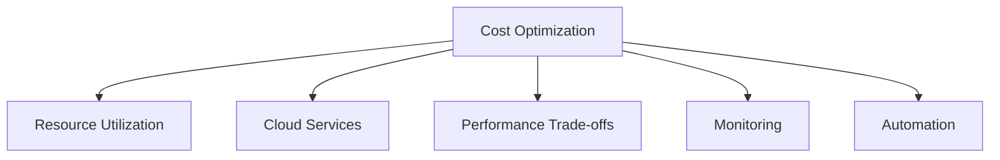

# Cost Management Best Practices 📌

## Table of Contents

- [Introduction](#introduction)
- [Prerequisites & Related Topics](#prerequisites--related-topics)
- [Pattern Recognition Guide](#pattern-recognition-guide)
- [Resource Optimization](#resource-optimization)
- [Cloud Cost Management](#cloud-cost-management)
- [Performance vs Cost](#performance-vs-cost)
- [Monitoring and Analysis](#monitoring-and-analysis)
- [Best Practices](#best-practices)
- [Trade-offs](#trade-offs)
- [Edge Cases to Consider](#edge-cases-to-consider)
- [Common Pitfalls](#common-pitfalls)
- [FAQ](#faq)
- [Interview Tips](#interview-tips)
- [Advanced Topics](#advanced-topics)
- [Further Reading](#further-reading)

## Introduction

Cost optimization involves strategies and practices to minimize expenses while maintaining system performance and reliability. It's crucial for sustainable system operation.

### Key Areas
1. **Resource Utilization**
2. **Cloud Services**
3. **Performance Trade-offs**
4. **Operational Efficiency**

## Prerequisites & Related Topics

- Builds on: [Cost Optimization](../cloud-native/cost-optimization.md) patterns, [Scaling Types](../scalability/scaling-types.md)
- Used in: [Kubernetes](../cloud-native/kubernetes-orchestration.md), [Multi-Cloud](../cloud-native/multi-cloud.md), [Design Reviews](design-guidelines.md)
- Techniques often combined: tagging enforcement, budget alerts, showback dashboards, unit-economics reviews
- See also: [FinOps framework](https://www.finops.org/framework/) — the operating model

## Pattern Recognition Guide

### 🎯 When to Use Cost Management Best Practices 📌

**Keywords in requirements**: "cost review", "budget", "spend", "unit economics", "waste", "forecast", "chargeback"
**Reach for this when**:
- Design reviews including a cost column per approach
- Team-level visibility turning cost into an engineering KPI
- Post-launch cost verification against design estimates
- Quarterly cleanup routines for idle and forgotten resources

### 🔑 Approach Indicators

| Approach | Signals | Best For |
|----------|---------|----------|
| Showback | visibility without billing | the first maturity step |
| Chargeback | teams own their spend | strong incentive alignment |
| Unit economics | cost per transaction/user | business alignment |
| Budget alerts | forecast-based notification | early warning |

### ❌ When NOT to Use

- Monthly bill reviews after the fact — forecast and alert instead
- Optimization without attribution — no tags, no owners, no change
- Cost as finance-only concern — engineers create and control spend

## Resource Optimization

### 1. Auto Scaling
**How it works — Auto scaler:** watch a load signal (CPU, request rate, queue depth), keep headroom above the target, and scale out before saturation — with cool-down periods so flapping doesn't churn instances and minimums that survive a zone loss.

### 2. Resource Pooling
**How it works — shared resource pools:** baseline capacity is provisioned once and shared across environments with quotas per team, rather than every team owning an idle peak-sized stack — utilization rises, and the quota caps any single team's ability to consume the shared budget.

### 3. Caching Strategy
**How it works — Cost efficient cache:** Attribute the spend to its owner via tags, track it daily, and alert on forecast overrun — cost control works when it's a monitored signal, not a monthly surprise.

## Cloud Cost Management

### 1. Instance Selection
**How it works — Instance optimizer:** right-size from observed utilization, not provisioning folklore — mix commitment levels (reserved for baseline, spot for fault-tolerant, on-demand for spiky) and re-evaluate quarterly as usage shifts.

### 2. Storage Optimization
**How it works — Storage optimizer:** tier by access pattern — hot data on fast storage, warm on standard, cold archived automatically by policy — and compress/dedupe at write time; the bill follows the tiering rules, not the total bytes.

### 3. Reserved Capacity
**How it works — Capacity planner:** Build once, promote the same artifact through environments, and shift traffic gradually — canary or blue/green — so a bad release is rolled back by a routing change, not a rebuild.

## Performance vs Cost

### 1. Performance Budgeting
**How it works — Performance budget:** Attribute the spend to its owner via tags, track it daily, and alert on forecast overrun — cost control works when it's a monitored signal, not a monthly surprise.

### 2. Cost-Performance Optimization
**How it works — Cost performance optimizer:** Attribute the spend to its owner via tags, track it daily, and alert on forecast overrun — cost control works when it's a monitored signal, not a monthly surprise.

## Monitoring and Analysis

### 1. Cost Monitoring
**How it works — Cost monitor:** Collect the signal on a schedule, evaluate it against the defined threshold or SLO, and route any breach to the right channel with enough context to act without digging.

### 2. Usage Analysis
**How it works — Usage analyzer:** instrument feature events (who, what, how often), roll them into per-feature cohorts, and read adoption and retention curves — usage data drives what to build next, not the loudest customer.

## Best Practices

### 1. Resource Lifecycle Management
**How it works — Resource lifecycle:** every resource is acquired, used, and released by contract — pooled connections returned after use, temp files deleted by scope, cloud resources tagged and TTL'd — leaks come from lifetimes nobody defined.

### 2. Cost Allocation
**How it works — Cost allocator:** Attribute the spend to its owner via tags, track it daily, and alert on forecast overrun — cost control works when it's a monitored signal, not a monthly surprise.

## Trade-offs

| Choice | Pros | Cons | Best For |
|----------|------|------|----------|
| Reserved/committed capacity | Deep discounts | Lock-in, stranded commitment | Steady baselines |
| Spot/preemptible | Largest discounts | Interruptions | Batch and fault-tolerant work |
| Aggressive right-sizing | Immediate savings | Performance risk | Steady-state services |
| Over-provisioning | Performance headroom | Paying for idle | Hard latency SLOs |

**Cost vs performance:** The cheapest system that meets its SLO is the target — below that, savings become incidents; above it, money becomes waste.

**Optimization effort vs return:** A few high-leverage levers (rightsizing, storage tiering, idle cleanup, commitment coverage) beat exhaustive micro-optimization.

**Visibility before control:** Tagging and cost allocation are prerequisites — you cannot optimize what you cannot attribute.

> **⚠️ When NOT to commit:** volatile workloads, architectures mid-migration, and spend you can't attribute — commitments convert forecasting error into stranded cost; commit only the stable baseline.

## Edge Cases to Consider

- Logs/observability spend quietly exceeding compute
- Egress surprises in multi-region architectures
- Dev environments running 24/7 unused at night
- Autoscaling maxes set from initial guesses, never revisited

## Common Pitfalls

1. Tagging opt-in — enforcement or it decays in a quarter
2. One-time cleanups instead of continuous routines
3. No cost gate in design reviews for new dependencies
4. Celebrating absolute spend cuts while unit cost rises

## FAQ

**Q1: How do we make engineers care about cost?**

A: Attribution plus visibility: tagged spend per team, unit-cost metrics on dashboards next to latency, and cost impact discussed in design reviews like any other trade-off.

**Q2: What should a design review include about cost?**

A: Estimated monthly spend at expected scale, the dominant cost drivers, and the unit cost trend — three lines that catch most surprises before they ship.

**Q3: Where does waste usually hide?**

A: Idle instances, oversized volumes, orphaned snapshots, dev environments on 24/7, over-retained logs, and cross-AZ chatter — audit those first.

## Interview Tips

### 1. Key Considerations
- Business requirements
- Performance needs
- Resource utilization
- Scaling patterns
- Operational costs

### 2. Common Questions
1. How would you optimize cloud costs?
2. How do you balance performance and cost?
3. How do you monitor and control costs?
4. What cost optimization strategies would you use?

### 3. Cost Optimization Checklist

## Advanced Topics

1. Forecast-based budget policies with auto-notifications
2. Kubernetes cost allocation per namespace/workload
3. Spot orchestration with checkpointing for stateful-ish jobs
4. Data lifecycle automation (hot→cold→delete)

## Further Reading
- [AWS Cost Optimization](https://aws.amazon.com/architecture/cost-optimization/)
- [Google Cloud Cost Management](https://cloud.google.com/cost-management)
- [Azure Cost Optimization](https://docs.microsoft.com/en-us/azure/cost-management-billing/)
- [FinOps Foundation](https://www.finops.org/) 