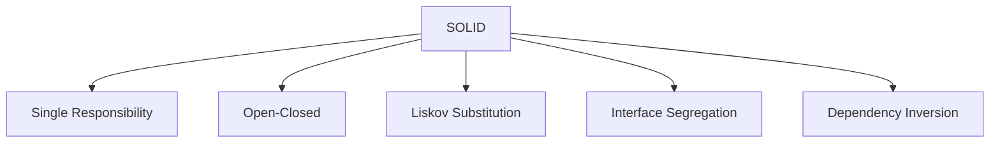
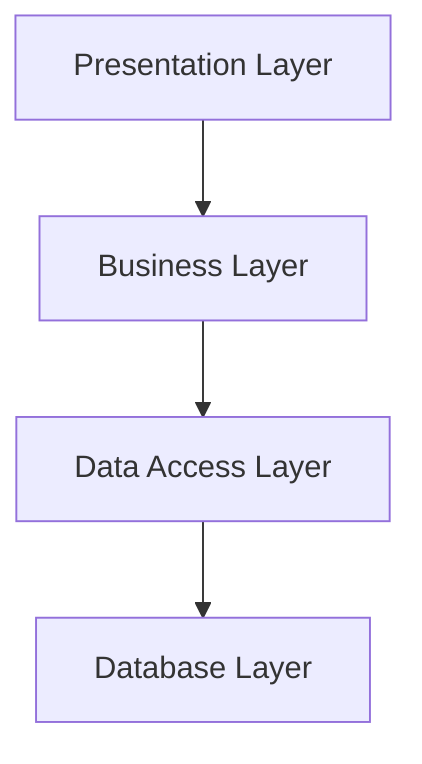
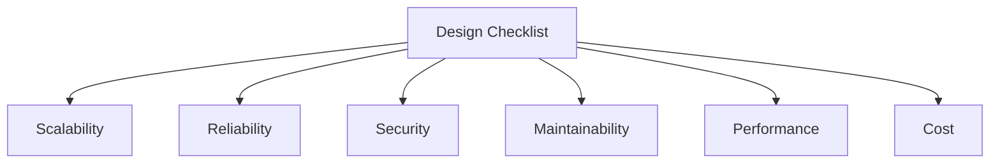

# System Design Guidelines

<div align="center">
  
</div>

## Table of Contents
- [Introduction](#introduction)
- [Design Principles](#design-principles)
- [Architecture Patterns](#architecture-patterns)
- [Design Process](#design-process)
- [Best Practices](#best-practices)
- [Common Pitfalls](#common-pitfalls)
- [Interview Tips](#interview-tips)

## Introduction

System design guidelines help create scalable, maintainable, and reliable systems. Following these guidelines ensures consistency and quality in system architecture.

### Key Objectives
1. **Scalability**
2. **Maintainability**
3. **Reliability**
4. **Performance**
5. **Security**

## Design Principles

### 1. SOLID Principles


### 2. Separation of Concerns
```python
class OrderService:
    def __init__(self):
        self.order_repository = OrderRepository()
        self.payment_service = PaymentService()
        self.notification_service = NotificationService()
    
    def create_order(self, order_data):
        """Create order with proper separation."""
        # Handle order creation
        order = self.order_repository.create(order_data)
        
        # Process payment separately
        payment = self.payment_service.process_payment(order)
        
        # Handle notifications independently
        self.notification_service.notify_customer(order)
        
        return order
```

### 3. DRY (Don't Repeat Yourself)
```python
class ValidationUtils:
    @staticmethod
    def validate_email(email):
        """Reusable email validation."""
        pattern = r'^[\w\.-]+@[\w\.-]+\.\w+$'
        return re.match(pattern, email) is not None
    
    @staticmethod
    def validate_phone(phone):
        """Reusable phone validation."""
        pattern = r'^\+?1?\d{9,15}$'
        return re.match(pattern, phone) is not None

class UserService:
    def create_user(self, user_data):
        """Use shared validation."""
        if not ValidationUtils.validate_email(user_data['email']):
            raise ValidationError("Invalid email")
        
        if not ValidationUtils.validate_phone(user_data['phone']):
            raise ValidationError("Invalid phone")
```

## Architecture Patterns

### 1. Layered Architecture


### 2. Event-Driven Architecture
```python
class EventDrivenSystem:
    def __init__(self):
        self.event_bus = EventBus()
        self.handlers = {}
    
    def register_handler(self, event_type, handler):
        """Register event handler."""
        if event_type not in self.handlers:
            self.handlers[event_type] = []
        self.handlers[event_type].append(handler)
    
    def publish_event(self, event):
        """Publish event to handlers."""
        event_type = event.type
        if event_type in self.handlers:
            for handler in self.handlers[event_type]:
                try:
                    handler.handle(event)
                except Exception as e:
                    logger.error(f"Handler failed: {e}")
```

### 3. Microservices Architecture
```yaml
# Docker Compose example
version: '3'
services:
  user-service:
    build: ./user-service
    ports:
      - "8001:8001"
    environment:
      - DB_HOST=user-db
      
  order-service:
    build: ./order-service
    ports:
      - "8002:8002"
    environment:
      - DB_HOST=order-db
      
  payment-service:
    build: ./payment-service
    ports:
      - "8003:8003"
    environment:
      - DB_HOST=payment-db
```

## Design Process

### 1. Requirements Analysis
```python
class RequirementsAnalyzer:
    def analyze_requirements(self, requirements):
        """Analyze system requirements."""
        analysis = {
            'functional': self.analyze_functional(requirements),
            'non_functional': self.analyze_non_functional(requirements),
            'constraints': self.analyze_constraints(requirements)
        }
        
        # Validate requirements
        self.validate_requirements(analysis)
        
        return analysis
    
    def validate_requirements(self, analysis):
        """Validate requirements completeness."""
        required_aspects = [
            'scalability',
            'performance',
            'security',
            'reliability'
        ]
        
        missing = [
            aspect for aspect in required_aspects
            if aspect not in analysis['non_functional']
        ]
        
        if missing:
            raise IncompleteRequirementsError(f"Missing aspects: {missing}")
```

### 2. System Design
```python
class SystemDesigner:
    def design_system(self, requirements):
        """Design system architecture."""
        # High-level components
        components = self.identify_components(requirements)
        
        # Component interactions
        interactions = self.define_interactions(components)
        
        # Data flow
        data_flow = self.design_data_flow(components)
        
        # Technology stack
        tech_stack = self.select_technologies(requirements)
        
        return ArchitectureDesign(
            components=components,
            interactions=interactions,
            data_flow=data_flow,
            tech_stack=tech_stack
        )
```

## Best Practices

### 1. Code Organization
```python
class ServiceTemplate:
    def __init__(self):
        self.logger = Logger()
        self.metrics = MetricsCollector()
        self.validator = Validator()
    
    def process_request(self, request):
        """Template for request processing."""
        try:
            # Validate request
            self.validator.validate(request)
            
            # Process business logic
            result = self.handle_request(request)
            
            # Record metrics
            self.metrics.record_success(request)
            
            return result
            
        except Exception as e:
            # Log error
            self.logger.error(f"Request failed: {e}")
            # Record failure
            self.metrics.record_failure(request)
            raise
```

### 2. Error Handling
```python
class ErrorHandler:
    def handle_error(self, error, context):
        """Handle different types of errors."""
        if isinstance(error, ValidationError):
            return self.handle_validation_error(error)
        elif isinstance(error, AuthenticationError):
            return self.handle_auth_error(error)
        elif isinstance(error, DatabaseError):
            return self.handle_db_error(error)
        else:
            return self.handle_unknown_error(error)
    
    def handle_validation_error(self, error):
        """Handle validation errors."""
        return {
            'status': 400,
            'error': 'Validation Error',
            'message': str(error)
        }
```

### 3. Testing Strategy
```python
class TestStrategy:
    def __init__(self):
        self.unit_tests = UnitTestSuite()
        self.integration_tests = IntegrationTestSuite()
        self.e2e_tests = E2ETestSuite()
    
    def execute_test_suite(self):
        """Execute complete test suite."""
        # Run unit tests
        unit_results = self.unit_tests.run()
        
        # Run integration tests
        if unit_results.success:
            integration_results = self.integration_tests.run()
        
        # Run E2E tests
        if integration_results.success:
            e2e_results = self.e2e_tests.run()
        
        return TestResults(
            unit=unit_results,
            integration=integration_results,
            e2e=e2e_results
        )
```

## Common Pitfalls

### 1. Over-Engineering
```python
# Bad Example - Over-engineered
class OverEngineeredCalculator:
    def __init__(self):
        self.operation_factory = OperationFactory()
        self.validator = InputValidator()
        self.logger = OperationLogger()
        self.cache = ResultCache()
    
    def add(self, a, b):
        """Simple addition with unnecessary complexity."""
        self.validator.validate_numbers(a, b)
        operation = self.operation_factory.create_operation('add')
        result = self.cache.get_or_compute(
            operation, a, b,
            lambda: operation.execute(a, b)
        )
        self.logger.log_operation('add', a, b, result)
        return result

# Good Example - Simple and effective
class Calculator:
    def add(self, a, b):
        """Simple addition."""
        return a + b
```

### 2. Tight Coupling
```python
# Bad Example - Tight coupling
class OrderProcessor:
    def process_order(self, order):
        # Direct instantiation creates tight coupling
        payment_processor = PaymentProcessor()
        inventory_manager = InventoryManager()
        notification_sender = NotificationSender()
        
        payment_processor.process(order)
        inventory_manager.update(order)
        notification_sender.send(order)

# Good Example - Loose coupling
class OrderProcessor:
    def __init__(self, payment_processor, inventory_manager, notification_sender):
        self.payment_processor = payment_processor
        self.inventory_manager = inventory_manager
        self.notification_sender = notification_sender
    
    def process_order(self, order):
        self.payment_processor.process(order)
        self.inventory_manager.update(order)
        self.notification_sender.send(order)
```

## Interview Tips

### 1. Design Process Steps
1. **Requirements Gathering**
   - Functional requirements
   - Non-functional requirements
   - Scale and performance needs

2. **High-Level Design**
   - System components
   - Component interactions
   - Data flow

3. **Detailed Design**
   - API design
   - Database schema
   - Class diagrams

4. **Trade-off Analysis**
   - Performance vs cost
   - Complexity vs maintainability
   - Scalability vs simplicity

### 2. Common Questions
1. How would you ensure system scalability?
2. How do you handle system failures?
3. How would you monitor system health?
4. How do you manage technical debt?

### 3. Design Checklist


## Further Reading
- [Clean Architecture](https://www.amazon.com/Clean-Architecture-Craftsmans-Software-Structure/dp/0134494164)
- [Design Patterns](https://refactoring.guru/design-patterns)
- [System Design Primer](https://github.com/donnemartin/system-design-primer)
- [Microservices Patterns](https://microservices.io/patterns/) 