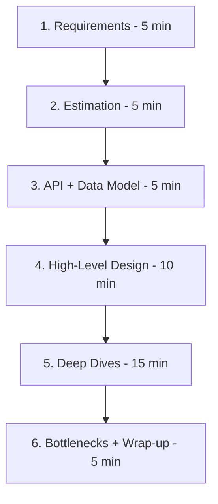
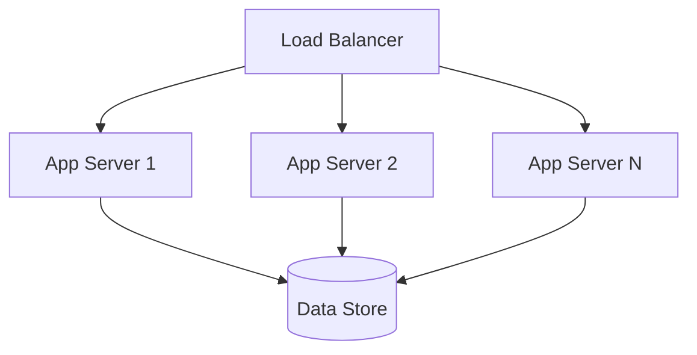

# System Design Guidelines

## Table of Contents
- [Introduction](#introduction)
- [The Interview Design Framework](#the-interview-design-framework)
- [Core Design Principles](#core-design-principles)
- [Component Selection Guidelines](#component-selection-guidelines)
- [Trade-off Analysis](#trade-off-analysis)
- [Design Review Checklist](#design-review-checklist)
- [Common Pitfalls](#common-pitfalls)
- [Interview Tips](#interview-tips)
- [Further Reading](#further-reading)

## Introduction

These guidelines distill the cross-cutting principles that apply to almost every system design interview answer. Use them as a framework for open-ended problems and as a checklist before you declare a design complete.

**Prerequisites:** [Distributed Systems Basics](../system-basics/distributed-systems.md), [Load Balancing](../system-basics/load-balancing.md), [Caching](../system-basics/caching.md), [CAP Theorem](../scalability/cap-theorem.md)

**Related topics:** [Performance Optimization](performance.md), [Security Best Practices](security.md), [Cost Optimization](cost.md), [Case Studies](../case-studies/README.md)

## The Interview Design Framework

A reliable structure for a 45-minute design interview:



### 1. Clarify Requirements
- **Functional:** What are the core use cases? What is explicitly out of scope?
- **Non-functional:** Scale (users, QPS, data volume), latency targets, consistency vs availability needs
- State assumptions out loud — interviewers grade how you handle ambiguity

### 2. Estimate Scale (Back-of-Envelope)
- QPS: `DAU × requests/day ÷ 86,400`, then apply peak multiplier (2–3×)
- Storage: `records/day × record size × retention`
- Bandwidth, cache memory (usually ~20% of daily working set)
- These numbers drive every later decision (sharding, caching, storage choice)

### 3. Define API and Data Model
- Sketch the 3–5 core endpoints before drawing boxes
- Choose the primary data model (relational, document, key-value, graph) from access patterns

### 4. Draw the High-Level Design
- Client → [CDN] → LB → stateless services → datastore (+ cache, queue as needed)
- Keep it simple first; add components only when a requirement demands them

### 5. Deep-Dive on Interesting Components
- Pick the 1–2 hardest parts (feed ranking, id generation, delivery guarantees) — this is where senior signals come from

### 6. Address Bottlenecks and Wrap Up
- Single points of failure, hot keys, read/write scaling, monitoring
- Summarize trade-offs you accepted and what you'd change with more time

## Core Design Principles

### 1. Stateless Services, Stateful Data
Keep application servers stateless so they scale horizontally; push state to dedicated stores.



- Any server can handle any request → easy autoscaling, safe deploys, simple failover
- Session state belongs in Redis or a JWT, not server memory

### 2. Design for Failure
- Every component will fail; the design question is what happens when it does
- Prefer graceful degradation (serve stale cache) over hard failure
- Add timeouts, retries with backoff, and bulkheads at every network boundary

### 3. Loose Coupling
- Async (queues, events) between components that don't need immediate answers
- Synchronous only where the user is waiting and the call is on the critical path

### 4. Scale Reads Before Writes
Reads usually outnumber writes 10:1 to 100:1 — replicas, caches, and CDNs solve most scale problems before sharding becomes necessary.

### 5. Choose Boring Technology
- Proven components with known failure modes beat novel ones in interviews and in production
- Deferring complexity (e.g., staying on Postgres until it hurts) is a strength, not a weakness

## Component Selection Guidelines

| Problem | First Choice | Upgrade Path |
|---------|-------------|--------------|
| Read-heavy workload | Cache + read replicas | Multi-tier caching, CDN |
| Write-heavy workload | LSM-based store (Cassandra, DynamoDB) | Shard + queue buffering |
| Analytics over full scans | Columnar warehouse | Materialized views, streaming |
| Sparse/variable schema | Document store | JSONB in Postgres |
| Relationships/traversals | Relational (first) | Graph DB at scale |
| Large static files | Object storage + CDN | Tiered storage |
| Fan-out/notifications | Message queue / pub-sub | Event streaming (Kafka) |
| Global low latency | CDN + edge, geo-replication | Multi-region active-active |

### When NOT to Add a Component
- **No cache without evidence:** hit-rate math first; caches add invalidation complexity
- **No microservices without a reason:** Conway's law and team size matter; start modular-monolith
- **No multi-region until required:** it multiplies cost and consistency complexity
- **No event-driven everywhere:** debuggability drops; use it where decoupling pays

## Trade-off Analysis

Every design decision is a trade-off — saying so explicitly is what separates strong candidates.

| Trade-off | Tension | Rule of Thumb |
|-----------|---------|---------------|
| Consistency vs Availability | CAP | Strong for payments/inventory; eventual for feeds/likes |
| Latency vs Durability | Sync vs async writes | Ack after replica for money; async for analytics |
| Normalization vs Denormalization | Write cost vs read speed | Normalize OLTP; denormalize for read paths |
| Cache freshness vs Hit rate | TTL length | Short TTL for money; long for public content |
| Provisioned vs Serverless | Cost vs control | Steady high load → provisioned; spiky → serverless |
| Build vs Buy | Differentiation vs speed | Buy commodity (auth, payments); build your edge |

```python
# Frame every decision with this structure in the interview
def justify_choice(option, alternatives):
    """
    "I chose X over Y because <requirement> dominates;
    the trade-off I'm accepting is <cost>;
    if <condition changes>, I'd switch to Y."
    """
    return {
        "chosen": option,
        "because": "<matching requirement>",
        "cost_accepted": "<explicit trade-off>",
        "revisit_when": "<trigger condition>",
    }
```

## Design Review Checklist

Run through this before presenting a finished design:

- [ ] Requirements (functional + non-functional) stated explicitly
- [ ] Back-of-envelope numbers computed and used to justify choices
- [ ] API surface and data model sketched
- [ ] Load balancing and health checks present
- [ ] Caching strategy defined (what, where, TTL, invalidation)
- [ ] Datastore chosen with reasons; read/write scaling addressed
- [ ] Single points of failure eliminated or mitigated
- [ ] Failure modes discussed (timeouts, retries, circuit breakers)
- [ ] Security basics: authN/authZ, encryption in transit and at rest
- [ ] Monitoring, alerting, and key metrics identified
- [ ] Bottlenecks and next 10× scaling step named
- [ ] Cost drivers acknowledged

## Common Pitfalls

1. **Solving scale you don't have** — over-engineering for imaginary users; interviewers probe simplicity
2. **Skipping requirements** — diving into boxes before asking what the system must do
3. **Technology name-dropping** — using Kafka/Redis/K8s without justifying them against the requirements
4. **Ignoring the data model** — access patterns should drive storage choice, not habit
5. **No failure discussion** — designs presented only on the happy path
6. **Forgetting operations** — no mention of monitoring, deploys, or on-call
7. **Silent trade-offs** — making choices without stating what you gave up

## Interview Tips

### 1. Communicate Framework, Not Just Answer
- Narrate your reasoning; check in: *"Does this direction make sense before I go deeper?"*
- When unsure, reason from first principles — interviewers grade the process

### 2. Drive the Conversation
- You own the whiteboard; propose the agenda, manage the clock
- Leave 5+ minutes for bottlenecks and wrap-up

### 3. Handle Pushback Gracefully
- Treat challenges as collaboration, not attack: *"Good point — under that requirement, X breaks because... so I'd..."*
- Admit unknowns, then reason approximately

### 4. Know Your Numbers
Memorize rough constants: memory is ~100× faster than SSD, SSD ~100× faster than network round-trips; a single app server handles ~1k RPS of medium requests. Estimates anchor credibility.

## Further Reading

- [System Design Primer](https://github.com/donnemartin/system-design-primer) - Interview framework and cheat sheets
- [Designing Data-Intensive Applications](https://www.amazon.com/Designing-Data-Intensive-Applications-Reliable-Maintainable/dp/1449373321) - Chapters 1–9 for the fundamentals behind these guidelines
- [The Twelve-Factor App](https://12factor.net/) - Principles for stateless, deployable services
- [AWS Well-Architected Framework](https://aws.amazon.com/architecture/well-architected/) - Operationalized version of these principles
- [Latency Numbers Every Programmer Should Know](https://gist.github.com/jboner/2841832) - The constants behind back-of-envelope math
