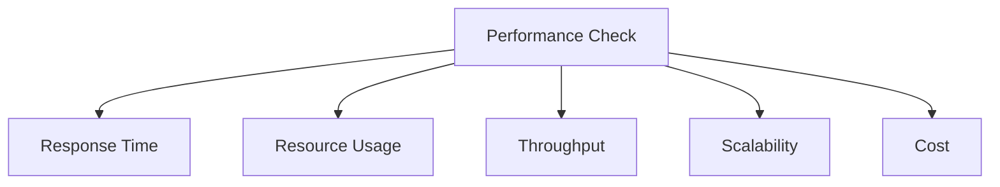

# Performance Best Practices 📌

## Table of Contents

- [Introduction](#introduction)
- [Prerequisites & Related Topics](#prerequisites--related-topics)
- [Pattern Recognition Guide](#pattern-recognition-guide)
- [Performance Metrics](#performance-metrics)
- [Optimization Strategies](#optimization-strategies)
- [Caching Techniques](#caching-techniques)
- [Database Optimization](#database-optimization)
- [Code Optimization](#code-optimization)
- [Trade-offs](#trade-offs)
- [Edge Cases to Consider](#edge-cases-to-consider)
- [Common Pitfalls](#common-pitfalls)
- [FAQ](#faq)
- [Interview Tips](#interview-tips)
- [Advanced Topics](#advanced-topics)
- [Further Reading](#further-reading)

## Introduction

Performance optimization involves improving system efficiency, response time, and resource utilization. It's crucial for providing a good user experience and managing costs effectively.

### Key Areas
1. **Application Performance**
2. **Database Performance**
3. **Network Performance**
4. **Infrastructure Performance**

## Prerequisites & Related Topics

- Builds on: [Caching](../system-basics/caching.md), [Indexing](../system-basics/indexing.md), [Metrics](../observability/metrics.md)
- Used in: [Load Testing](../testing/load-testing.md), [Performance Monitoring](../observability/performance-monitoring.md), [Capacity Planning](../scalability/scaling-types.md)
- Techniques often combined: latency budgets, N+1 elimination, batch/async refactors, tail tracking
- See also: [Debug Strategies](../observability/debug-strategies.md) — finding the fix starts with finding the cost

## Pattern Recognition Guide

### 🎯 When to Use Performance Best Practices 📌

**Keywords in requirements**: "slow", "latency", "optimize", "p95/p99", "bottleneck", "N+1", "profiling"
**Reach for this when**:
- Latency budget definition per endpoint and dependency
- N+1 and chatty-call elimination from trace evidence
- Cache introduction with hit-rate targets set upfront
- Write-path batching and async offload decisions

### 🔑 Approach Indicators

| Approach | Signals | Best For |
|----------|---------|----------|
| Profile-first | attribution before change | always |
| Tail-focused | p95/p99 over averages | user-facing systems |
| Budget-driven | per-hop allocations | microservice latency |
| Verify-after | re-measure the same shape | closing the loop |

### ❌ When NOT to Use

- Premature optimization without measured cost
- Caching as the first fix before reading the query plan
- Optimizing cold paths nobody calls in production

## Performance Metrics

### 1. Response Time
**How it works — Response time monitor:** Collect the signal on a schedule, evaluate it against the defined threshold or SLO, and route any breach to the right channel with enough context to act without digging.

### 2. Throughput
**How it works — Throughput monitor:** Collect the signal on a schedule, evaluate it against the defined threshold or SLO, and route any breach to the right channel with enough context to act without digging.

### 3. Resource Utilization
**How it works — Resource monitor:** Collect the signal on a schedule, evaluate it against the defined threshold or SLO, and route any breach to the right channel with enough context to act without digging.

## Optimization Strategies

### 1. Load Balancing
**How it works — Load balancer:** the balancer spreads requests across a pool by algorithm (round-robin, least-connections), health-checks members, and drains unhealthy ones — one address in front, interchangeable servers behind.

### 2. Caching Strategy
**How it works — Cache manager:** Store the computed result under a stable key with a TTL sized to how stale the data may be; hits skip the expensive path, misses repopulate, and invalidation events cover the changes TTL alone would miss.

### 3. Connection Pooling
**How it works — connection pooling:** a fixed set of connections is created once and reused; a request borrows one, runs its queries, and returns it — eliminating the per-request TCP+auth handshake (tens of ms). Pool too small and requests queue; too large and you exhaust the database's `max_connections` — the ceiling is a shared budget across all app instances.

## Caching Techniques

### 1. Cache Aside
**How it works — Cache aside:** Store the computed result under a stable key with a TTL sized to how stale the data may be; hits skip the expensive path, misses repopulate, and invalidation events cover the changes TTL alone would miss.

### 2. Write Through
**How it works — Write through:** the cache and database are updated in one synchronous write path — reads are always consistent with writes and never miss cold, at the cost of write latency and caching data that may never be read.

## Database Optimization

### 1. Query Optimization
The classic anti-pattern is `SELECT *`: fetching every column defeats covering indexes, drags oversized rows across the network, and breaks the moment a column list changes. Optimization in interviews = name the access pattern first (point lookup? range scan? aggregation?), then make the index and the query agree on it.

### 2. Indexing Strategy
**Index:** `idx_status_created` on `orders(status,created_at)` — in composite indexes the leading column must match equality filters, trailing columns serve range scans.

### 3. Connection Management
**How it works — Database manager:** the operational tasks — capacity planning, index maintenance, backups with tested restores, failover drills — decide whether the database is an asset or a liability; automate all four.

## Code Optimization

### 1. Async Operations
**How it works — Async processor:** the API accepts the job, persists it with a status, enqueues it, and returns 202; workers process at their own pace and the client polls or subscribes for completion — latency for the user, throughput for the system.

### 2. Batch Processing
**How it works — batching:** accumulating work into groups (writes, network calls, queue sends) amortizes per-operation overhead — 100 inserts in one round-trip beat 100 round-trips by an order of magnitude; the knob is batch size, tuned against the latency you're willing to add.

### 3. Memory Management
**How it works — Memory optimizer:** profile before tuning — leaks show as monotonic growth by object type, pressure as GC thrash; right-size caches with real eviction stats and set instance memory from the p99 working set, not the average.

## Trade-offs

| Choice | Pros | Cons | Best For |
|----------|------|------|----------|
| Caching | Largest read-latency win | Invalidation, staleness | Repeated reads |
| Async processing | Frees request path | Eventual consistency | Non-critical work |
| Denormalization | Fewer joins, faster reads | Write complexity | Read-heavy paths |
| More hardware (vertical) | Immediate relief | Cost curve, ceiling | Quick fixes |
| Optimization-first | No architecture change | Diminishing returns, local optima | After measuring |

**Latency vs consistency:** Faster paths (caches, replicas, denormalized reads) serve stale or eventually consistent data — match staleness tolerance per feature.

**Local vs global optimization:** Component-level wins can degrade system performance (over-caching, thread tuning); profile the whole path.

**Premature optimization vs measured optimization:** Measure first, optimize the top of the profile, and re-measure — intuition about bottlenecks is usually wrong.

> **⚠️ When NOT to cache first:** unmeasured paths (profile first — the bottleneck is rarely where you think), write-heavy data with low reuse, and correctness-critical reads — caching is the most popular optimization and the most often premature.

## Edge Cases to Consider

- Fixing CPU while latency is lock contention
- Cache warming after deploys creating slow-start spikes
- Async offload hiding failures until they surface elsewhere
- Multi-region wins negated by cross-region chatter introduced elsewhere

## Common Pitfalls

1. Optimizing without a baseline — no proof of improvement
2. Averages as targets — tails are the user experience
3. Big-bang rewrites over incremental measured fixes
4. Ignoring client-side performance where users actually wait

## FAQ

**Q1: Where do performance wins usually hide?**

A: A missing index, an N+1 query, unbounded fan-out to dependencies, and the one synchronous call that should be async — trace a slow request and it is usually one of these.

**Q2: How do I set a latency budget?**

A: Start from the user-facing SLO (e.g., p95 500 ms) and allocate across hops: gateway 20 ms, service 80 ms, DB 50 ms, external 150 ms — then monitor per-hop and fix violations at the violating hop.

**Q3: When is caching the wrong answer?**

A: When correctness is tight (money, inventory), when hit rates will be low (write-heavy or cold data), or when the query itself is broken — fix the query/index first.

## Interview Tips

### 1. Key Considerations
- Performance requirements
- Resource constraints
- Scalability needs
- Cost implications
- Maintenance overhead

### 2. Common Questions
1. How would you optimize a slow query?
2. How do you handle performance under load?
3. What caching strategies would you use?
4. How do you identify performance bottlenecks?

### 3. Performance Checklist

## Advanced Topics

1. Continuous profiling tied to releases
2. Adaptive concurrency limits and hedged requests
3. Speculative prefetching for predictable reads
4. Hardware-aware tuning (NVMe, NIC, NUMA) for extreme scale

## Further Reading
- [High Performance Browser Networking](https://hpbn.co/)
- [Database Performance Tuning](https://use-the-index-luke.com/)
- [System Performance](http://www.brendangregg.com/systems-performance-2nd-edition-book.html)
- [Performance Antipatterns](https://docs.microsoft.com/en-us/azure/architecture/antipatterns/) 