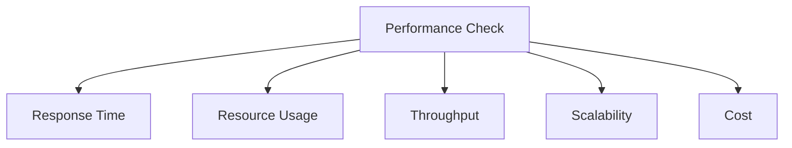

# Performance Optimization

## Table of Contents
- [Introduction](#introduction)
- [Performance Metrics](#performance-metrics)
- [Optimization Strategies](#optimization-strategies)
- [Caching Techniques](#caching-techniques)
- [Database Optimization](#database-optimization)
- [Code Optimization](#code-optimization)
- [Interview Tips](#interview-tips)

## Introduction

Performance optimization involves improving system efficiency, response time, and resource utilization. It's crucial for providing a good user experience and managing costs effectively.

### Key Areas
1. **Application Performance**
2. **Database Performance**
3. **Network Performance**
4. **Infrastructure Performance**

## Performance Metrics

### 1. Response Time
```python
class ResponseTimeMonitor:
    def __init__(self):
        self.metrics = {
            'response_time': Histogram('response_time_seconds', 'Response time'),
            'error_rate': Counter('errors_total', 'Total errors'),
            'requests': Counter('requests_total', 'Total requests')
        }
    
    def record_request(self, start_time):
        """Record request metrics."""
        duration = time.time() - start_time
        self.metrics['response_time'].observe(duration)
        self.metrics['requests'].inc()
        
        # Alert if too slow
        if duration > self.threshold:
            self.alert_slow_response(duration)
```

### 2. Throughput
```python
class ThroughputMonitor:
    def __init__(self):
        self.window_size = 60  # 1 minute
        self.requests = deque()
    
    def record_request(self):
        """Record request for throughput calculation."""
        now = time.time()
        self.requests.append(now)
        
        # Remove old requests
        while self.requests and self.requests[0] < now - self.window_size:
            self.requests.popleft()
    
    def get_current_throughput(self):
        """Calculate current throughput."""
        return len(self.requests) / self.window_size
```

### 3. Resource Utilization
```python
class ResourceMonitor:
    def collect_metrics(self):
        """Collect resource metrics."""
        return {
            'cpu': self.get_cpu_usage(),
            'memory': self.get_memory_usage(),
            'disk': self.get_disk_usage(),
            'network': self.get_network_usage()
        }
    
    def get_cpu_usage(self):
        """Get CPU usage percentage."""
        return psutil.cpu_percent(interval=1)
    
    def get_memory_usage(self):
        """Get memory usage."""
        mem = psutil.virtual_memory()
        return {
            'total': mem.total,
            'available': mem.available,
            'percent': mem.percent
        }
```

## Optimization Strategies

### 1. Load Balancing
```python
class LoadBalancer:
    def __init__(self):
        self.servers = []
        self.current = 0
    
    def add_server(self, server):
        """Add server to pool."""
        self.servers.append({
            'server': server,
            'health': 100,
            'load': 0
        })
    
    def get_next_server(self):
        """Get next server using weighted round-robin."""
        available = [
            s for s in self.servers
            if s['health'] > 50 and s['load'] < 80
        ]
        
        if not available:
            raise NoServerAvailableError()
        
        server = available[self.current % len(available)]
        self.current += 1
        return server['server']
```

### 2. Caching Strategy
```python
class CacheManager:
    def __init__(self):
        self.local_cache = LRUCache(1000)
        self.redis_cache = RedisCache()
    
    async def get_data(self, key):
        """Get data with multi-level caching."""
        # Try local cache
        data = self.local_cache.get(key)
        if data:
            return data
        
        # Try Redis cache
        data = await self.redis_cache.get(key)
        if data:
            self.local_cache.set(key, data)
            return data
        
        # Get from database
        data = await self.database.get(key)
        if data:
            # Update both caches
            self.local_cache.set(key, data)
            await self.redis_cache.set(key, data)
        
        return data
```

### 3. Connection Pooling
```python
class ConnectionPool:
    def __init__(self, max_connections=10):
        self.max_connections = max_connections
        self.connections = Queue(max_connections)
        self.active_connections = 0
    
    async def get_connection(self):
        """Get database connection from pool."""
        if not self.connections.empty():
            return await self.connections.get()
        
        if self.active_connections < self.max_connections:
            connection = await self.create_connection()
            self.active_connections += 1
            return connection
        
        # Wait for available connection
        return await self.connections.get()
    
    async def release_connection(self, connection):
        """Release connection back to pool."""
        await self.connections.put(connection)
```

## Caching Techniques

### 1. Cache Aside
```python
class CacheAside:
    def __init__(self):
        self.cache = Cache()
        self.db = Database()
    
    async def get_item(self, key):
        """Get item using cache-aside pattern."""
        # Try cache first
        item = await self.cache.get(key)
        if item:
            return item
        
        # Cache miss - get from DB
        item = await self.db.get(key)
        if item:
            # Update cache
            await self.cache.set(key, item)
        
        return item
```

### 2. Write Through
```python
class WriteThrough:
    def __init__(self):
        self.cache = Cache()
        self.db = Database()
    
    async def write_item(self, key, value):
        """Write using write-through pattern."""
        try:
            # Write to DB first
            await self.db.write(key, value)
            # Update cache
            await self.cache.set(key, value)
            return True
        except Exception as e:
            logger.error(f"Write failed: {e}")
            return False
```

## Database Optimization

### 1. Query Optimization
```sql
-- Before optimization
SELECT * FROM orders 
JOIN users ON orders.user_id = users.id
WHERE orders.status = 'pending';

-- After optimization
SELECT o.id, o.amount, u.name, u.email 
FROM orders o
JOIN users u ON o.user_id = u.id
WHERE o.status = 'pending'
AND o.created_at > DATE_SUB(NOW(), INTERVAL 1 DAY)
USE INDEX (idx_status_created);
```

### 2. Indexing Strategy
```sql
-- Create composite index
CREATE INDEX idx_status_created 
ON orders(status, created_at);

-- Create covering index
CREATE INDEX idx_user_email 
ON users(email) 
INCLUDE (name, status);

-- Create partial index
CREATE INDEX idx_active_users 
ON users(email, name) 
WHERE status = 'active';
```

### 3. Connection Management
```python
class DatabaseManager:
    def __init__(self):
        self.pool = ConnectionPool(
            min_connections=5,
            max_connections=20,
            idle_timeout=300
        )
    
    async def execute_query(self, query, params=None):
        """Execute query with connection management."""
        conn = await self.pool.get_connection()
        try:
            result = await conn.execute(query, params)
            return result
        finally:
            await self.pool.release_connection(conn)
```

## Code Optimization

### 1. Async Operations
```python
class AsyncProcessor:
    async def process_items(self, items):
        """Process items concurrently."""
        tasks = [
            self.process_item(item)
            for item in items
        ]
        
        results = await asyncio.gather(
            *tasks,
            return_exceptions=True
        )
        
        # Handle results
        successful = []
        failed = []
        for item, result in zip(items, results):
            if isinstance(result, Exception):
                failed.append((item, result))
            else:
                successful.append((item, result))
        
        return successful, failed
```

### 2. Batch Processing
```python
class BatchProcessor:
    def __init__(self, batch_size=100):
        self.batch_size = batch_size
    
    async def process_large_dataset(self, dataset):
        """Process dataset in batches."""
        results = []
        for i in range(0, len(dataset), self.batch_size):
            batch = dataset[i:i + self.batch_size]
            batch_results = await self.process_batch(batch)
            results.extend(batch_results)
        return results
```

### 3. Memory Management
```python
class MemoryOptimizer:
    def process_large_file(self, filename):
        """Process large file with memory optimization."""
        results = []
        
        # Process file in chunks
        with open(filename, 'rb') as f:
            while chunk := f.read(8192):
                result = self.process_chunk(chunk)
                results.append(result)
                
                # Clear intermediate data
                gc.collect()
        
        return self.combine_results(results)
```

## Interview Tips

### 1. Key Considerations
- Performance requirements
- Resource constraints
- Scalability needs
- Cost implications
- Maintenance overhead

### 2. Common Questions
1. How would you optimize a slow query?
2. How do you handle performance under load?
3. What caching strategies would you use?
4. How do you identify performance bottlenecks?

### 3. Performance Checklist


## Further Reading
- [High Performance Browser Networking](https://hpbn.co/)
- [Database Performance Tuning](https://use-the-index-luke.com/)
- [System Performance](http://www.brendangregg.com/systems-performance-2nd-edition-book.html)
- [Performance Antipatterns](https://docs.microsoft.com/en-us/azure/architecture/antipatterns/) 