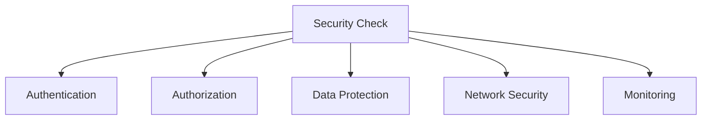

# Security Best Practices

## Table of Contents
- [Introduction](#introduction)
- [Authentication & Authorization](#authentication--authorization)
- [Data Security](#data-security)
- [Network Security](#network-security)
- [Security Monitoring](#security-monitoring)
- [Common Vulnerabilities](#common-vulnerabilities)
- [Trade-offs](#trade-offs)
- [Interview Tips](#interview-tips)

## Introduction

Security best practices are essential for protecting systems, data, and users from threats and vulnerabilities. A comprehensive security strategy involves multiple layers of protection.

### Key Areas
1. **Authentication**
2. **Authorization**
3. **Data Protection**
4. **Network Security**
5. **Monitoring**

## Authentication & Authorization

### 1. Password Security
```python
class PasswordManager:
    def __init__(self):
        self.min_length = 12
        self.pepper = os.getenv('PASSWORD_PEPPER')
    
    def hash_password(self, password):
        """Securely hash password."""
        # Add pepper
        peppered = password + self.pepper
        
        # Generate salt and hash
        salt = bcrypt.gensalt()
        hashed = bcrypt.hashpw(
            peppered.encode(),
            salt
        )
        
        return {
            'hash': hashed,
            'salt': salt
        }
    
    def verify_password(self, password, stored_hash):
        """Verify password against hash."""
        peppered = password + self.pepper
        return bcrypt.checkpw(
            peppered.encode(),
            stored_hash
        )
    
    def validate_password_strength(self, password):
        """Validate password strength."""
        if len(password) < self.min_length:
            return False
        
        # Check complexity
        has_upper = any(c.isupper() for c in password)
        has_lower = any(c.islower() for c in password)
        has_digit = any(c.isdigit() for c in password)
        has_special = any(not c.isalnum() for c in password)
        
        return all([has_upper, has_lower, has_digit, has_special])
```

### 2. JWT Authentication
```python
class JWTManager:
    def __init__(self):
        self.secret_key = os.getenv('JWT_SECRET')
        self.algorithm = 'HS256'
        self.access_token_expire = timedelta(minutes=30)
        self.refresh_token_expire = timedelta(days=7)
    
    def create_access_token(self, data):
        """Create JWT access token."""
        to_encode = data.copy()
        expire = datetime.utcnow() + self.access_token_expire
        to_encode.update({'exp': expire})
        
        return jwt.encode(
            to_encode,
            self.secret_key,
            algorithm=self.algorithm
        )
    
    def verify_token(self, token):
        """Verify JWT token."""
        try:
            payload = jwt.decode(
                token,
                self.secret_key,
                algorithms=[self.algorithm]
            )
            return payload
        except jwt.ExpiredSignatureError:
            raise TokenExpiredError()
        except jwt.JWTError:
            raise InvalidTokenError()
```

### 3. OAuth Implementation
```python
class OAuthManager:
    def __init__(self):
        self.client_id = os.getenv('OAUTH_CLIENT_ID')
        self.client_secret = os.getenv('OAUTH_CLIENT_SECRET')
        self.redirect_uri = os.getenv('OAUTH_REDIRECT_URI')
    
    def get_authorization_url(self, state):
        """Get OAuth authorization URL."""
        params = {
            'client_id': self.client_id,
            'redirect_uri': self.redirect_uri,
            'response_type': 'code',
            'scope': 'read write',
            'state': state
        }
        
        return f"{self.auth_url}?{urlencode(params)}"
    
    async def exchange_code(self, code):
        """Exchange authorization code for tokens."""
        data = {
            'client_id': self.client_id,
            'client_secret': self.client_secret,
            'grant_type': 'authorization_code',
            'code': code,
            'redirect_uri': self.redirect_uri
        }
        
        async with aiohttp.ClientSession() as session:
            async with session.post(self.token_url, data=data) as response:
                return await response.json()
```

## Data Security

### 1. Encryption
```python
class EncryptionManager:
    def __init__(self):
        self.key = Fernet.generate_key()
        self.cipher_suite = Fernet(self.key)
    
    def encrypt_data(self, data):
        """Encrypt sensitive data."""
        if isinstance(data, dict):
            return {
                k: self.encrypt_value(v)
                for k, v in data.items()
            }
        return self.encrypt_value(data)
    
    def encrypt_value(self, value):
        """Encrypt single value."""
        if not isinstance(value, bytes):
            value = str(value).encode()
        return self.cipher_suite.encrypt(value)
    
    def decrypt_data(self, encrypted_data):
        """Decrypt encrypted data."""
        if isinstance(encrypted_data, dict):
            return {
                k: self.decrypt_value(v)
                for k, v in encrypted_data.items()
            }
        return self.decrypt_value(encrypted_data)
```

### 2. Data Masking
```python
class DataMasker:
    def mask_pii(self, data):
        """Mask personally identifiable information."""
        if isinstance(data, dict):
            return {
                k: self.mask_field(k, v)
                for k, v in data.items()
            }
        return self.mask_field('default', data)
    
    def mask_field(self, field_name, value):
        """Mask specific field types."""
        if field_name in ['email']:
            return self.mask_email(value)
        elif field_name in ['phone']:
            return self.mask_phone(value)
        elif field_name in ['credit_card']:
            return self.mask_credit_card(value)
        return value
    
    def mask_email(self, email):
        """Mask email address."""
        if '@' not in email:
            return email
        username, domain = email.split('@')
        masked_username = username[:2] + '*' * (len(username) - 2)
        return f"{masked_username}@{domain}"
```

### 3. Secure Storage
```python
class SecureStorage:
    def __init__(self):
        self.encryption = EncryptionManager()
        self.vault = VaultClient()
    
    async def store_secret(self, key, value):
        """Store secret securely."""
        # Encrypt value
        encrypted = self.encryption.encrypt_value(value)
        
        # Store in vault
        await self.vault.store(key, encrypted)
    
    async def get_secret(self, key):
        """Retrieve secret securely."""
        # Get from vault
        encrypted = await self.vault.get(key)
        
        # Decrypt value
        return self.encryption.decrypt_value(encrypted)
```

## Network Security

### 1. SSL/TLS Configuration
```python
class TLSConfig:
    def configure_ssl(self):
        """Configure SSL/TLS settings."""
        return {
            'ssl_version': ssl.PROTOCOL_TLS,
            'cert_reqs': ssl.CERT_REQUIRED,
            'ca_certs': self.ca_cert_path,
            'certfile': self.cert_path,
            'keyfile': self.key_path,
            'ciphers': 'ECDHE-ECDSA-AES128-GCM-SHA256:ECDHE-RSA-AES128-GCM-SHA256'
        }
```

### 2. Firewall Rules
```python
class FirewallManager:
    def configure_rules(self):
        """Configure firewall rules."""
        rules = [
            # Allow HTTPS
            {'port': 443, 'protocol': 'tcp', 'allow': True},
            # Allow SSH from specific IPs
            {'port': 22, 'protocol': 'tcp', 'source': self.allowed_ips},
            # Block all other incoming traffic
            {'direction': 'in', 'action': 'deny'}
        ]
        
        return self.apply_rules(rules)
```

### 3. Rate Limiting
```python
class RateLimiter:
    def __init__(self, redis_client):
        self.redis = redis_client
        self.default_limit = 100
        self.window = 3600  # 1 hour
    
    async def is_rate_limited(self, key, limit=None):
        """Check if request is rate limited."""
        limit = limit or self.default_limit
        current = await self.redis.incr(key)
        
        if current == 1:
            await self.redis.expire(key, self.window)
        
        return current > limit
```

## Security Monitoring

### 1. Audit Logging
```python
class AuditLogger:
    def log_event(self, event_type, user_id, data):
        """Log security event."""
        event = {
            'timestamp': datetime.utcnow().isoformat(),
            'event_type': event_type,
            'user_id': user_id,
            'ip_address': self.get_client_ip(),
            'data': data
        }
        
        # Store event
        self.store_audit_log(event)
        
        # Alert if suspicious
        if self.is_suspicious(event):
            self.alert_security_team(event)
```

### 2. Intrusion Detection
```python
class IntrusionDetector:
    def analyze_request(self, request):
        """Analyze request for suspicious patterns."""
        scores = {
            'ip_reputation': self.check_ip_reputation(request.ip),
            'request_pattern': self.check_request_pattern(request),
            'payload_analysis': self.analyze_payload(request.data)
        }
        
        total_score = sum(scores.values())
        if total_score > self.threshold:
            self.handle_suspicious_request(request, scores)
```

### 3. Security Metrics
```python
class SecurityMetrics:
    def __init__(self):
        self.metrics = {
            'failed_logins': Counter('failed_logins_total', 'Failed login attempts'),
            'auth_errors': Counter('auth_errors_total', 'Authentication errors'),
            'suspicious_requests': Counter('suspicious_requests_total', 'Suspicious requests')
        }
    
    def track_security_event(self, event_type, metadata=None):
        """Track security-related event."""
        self.metrics[event_type].inc()
        
        if metadata:
            self.store_event_metadata(event_type, metadata)
```

## Common Vulnerabilities

### 1. SQL Injection Prevention
```python
class SQLInjectionPrevention:
    def execute_query(self, query, params):
        """Execute query with SQL injection prevention."""
        # Use parameterized queries
        with self.db.cursor() as cursor:
            cursor.execute(query, params)
            return cursor.fetchall()
    
    # Instead of:
    # f"SELECT * FROM users WHERE username = '{username}'"
    
    # Use:
    query = "SELECT * FROM users WHERE username = %s"
    params = (username,)
```

### 2. XSS Prevention
```python
class XSSPrevention:
    def sanitize_input(self, data):
        """Sanitize input to prevent XSS."""
        if isinstance(data, str):
            return bleach.clean(data)
        elif isinstance(data, dict):
            return {
                k: self.sanitize_input(v)
                for k, v in data.items()
            }
        return data
```

### 3. CSRF Protection
```python
class CSRFProtection:
    def generate_token(self, session_id):
        """Generate CSRF token."""
        token = secrets.token_urlsafe(32)
        self.store_token(session_id, token)
        return token
    
    def verify_token(self, session_id, token):
        """Verify CSRF token."""
        stored_token = self.get_stored_token(session_id)
        if not stored_token:
            return False
        return secrets.compare_digest(stored_token, token)
```

## Trade-offs

| Choice | Pros | Cons | Best For |
|----------|------|------|----------|
| Least privilege | Minimal blast radius | Policy management overhead | All production access |
| Broad access | Operational speed | Large attack surface, audit pain | Never (except sandboxes) |
| Encryption everywhere | Strong data protection | Key management complexity | Sensitive data |
| MFA everywhere | Blocks credential attacks | User friction | At minimum: admin, prod, PII |
| Fail-closed checks | No bypass on error | Availability coupling | AuthZ decisions |

**Security vs usability:** Every control adds friction; place it where risk concentrates (prod access, sensitive data) and automate away the rest.

**Prevention vs detection:** Prevention reduces incidents; detection (monitoring, audit trails) bounds them — mature security needs both.

**Defense in depth:** No single control holds; layered controls assume each one fails eventually.

> **⚠️ When NOT to stop at encryption:** encrypted data behind over-broad access is one credential away from breach — pair encryption with least privilege and audit trails, and skip heavy key management for genuinely public data.

## Interview Tips

### 1. Key Considerations
- Security requirements
- Threat model
- Compliance needs
- Performance impact
- User experience

### 2. Common Questions
1. How would you secure sensitive data?
2. How do you handle authentication?
3. How do you prevent common attacks?
4. How do you monitor security?

### 3. Security Checklist


## Further Reading
- [OWASP Top Ten](https://owasp.org/www-project-top-ten/)
- [Web Security](https://web.dev/security/)
- [Cloud Security](https://aws.amazon.com/security/)
- [Security by Design](https://www.ncsc.gov.uk/collection/security-architecture/security-design-principles) 