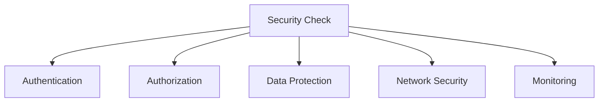

# Security Best Practices in System Design 📌

## Table of Contents

- [Introduction](#introduction)
- [Prerequisites & Related Topics](#prerequisites--related-topics)
- [Pattern Recognition Guide](#pattern-recognition-guide)
- [Authentication & Authorization](#authentication--authorization)
- [Data Security](#data-security)
- [Network Security](#network-security)
- [Security Monitoring](#security-monitoring)
- [Common Vulnerabilities](#common-vulnerabilities)
- [Trade-offs](#trade-offs)
- [Edge Cases to Consider](#edge-cases-to-consider)
- [Common Pitfalls](#common-pitfalls)
- [FAQ](#faq)
- [Interview Tips](#interview-tips)
- [Advanced Topics](#advanced-topics)
- [Further Reading](#further-reading)

## Introduction

Security best practices are essential for protecting systems, data, and users from threats and vulnerabilities. A comprehensive security strategy involves multiple layers of protection.

### Key Areas
1. **Authentication**
2. **Authorization**
3. **Data Protection**
4. **Network Security**
5. **Monitoring**

## Prerequisites & Related Topics

- Builds on: [Authentication & Authorization](../system-basics/auth.md), [API Security](../security/api-security.md)
- Used in: [Cloud Security](../cloud-native/cloud-security.md), [Secrets Management](../security/secrets-management.md), [Zero Trust](../security/zero-trust.md)
- Techniques often combined: defense in depth, threat modeling, least-privilege reviews, audit logging
- See also: [OWASP Top 10](https://owasp.org/www-project-top-ten/) — the classic web risk list

## Pattern Recognition Guide

### 🎯 When to Use Security Best Practices

**Keywords in requirements**: "security", "secure by design", "defense in depth", "least privilege", "threat model", "attack surface", "audit"
**Reach for this when**:
- Every design review — security is a design dimension, not a phase
- Data classification driving encryption, access, and retention choices
- Threat modeling new flows (STRIDE-style) before implementation
- Incident readiness: detection, response, and audit trails

### 🔑 Approach Indicators

| Approach | Signals | Best For |
|----------|---------|----------|
| Least privilege | minimal default grants, time-boxed elevation | every identity, human or service |
| Defense in depth | independent layers, no single control load-bearing | everything |
| Encryption everywhere | TLS in transit, KMS at rest | all data stores |
| Audit trails | who did what, queryably | sensitive operations |

### ❌ When NOT to Use

- Security by obscurity — hidden endpoints and obfuscated IDs are not controls
- Bolting security on pre-launch — retrofitting costs 10x and misses foundations
- Trusting client-side validation or UI hiding as authorization

## Authentication & Authorization

### 1. Password Security
**How it works — Password manager:** passwords are never stored — only their salted adaptive hashes (bcrypt/argon2) with per-user salts and tuned cost; login re-hashes and compares in constant time, and cost can rise over time.

### 2. JWT Authentication
**How it works — JWT manager:** owns issuance and rotation: sign with the current key, publish public keys for verification, accept the previous key during overlap, and keep lifetimes short — rotation is routine because nothing assumes a key lasts forever.

### 3. OAuth Implementation
**How it works — OAuth manager:** tracks registered clients, their redirect URIs, scopes, and token lifetimes — the policy layer that keeps "allow this app to read my email" from becoming "allow this app to be me".

## Data Security

### 1. Encryption
**How it works — Encryption manager:** centralizes key generation, storage (KMS/HSM), rotation, and audit; services request data-key operations instead of touching master keys — envelope encryption keeps key material off the data path.

### 2. Data Masking
**How it works — Data masker:** sensitive fields are replaced at the point of egress — deterministic pseudonymization preserves joins, hashing breaks re-identification, redaction drops the field — and masking runs before data leaves production, never after.

### 3. Secure Storage
**How it works — Secure storage:** sensitive data is encrypted at rest with keys in a KMS — the application holds data keys, the KMS holds master keys, and decryption is auditable — so a stolen disk or backup yields ciphertext only.

## Network Security

### 1. SSL/TLS Configuration
**How it works — Tlsconfig:** Resolve the flag/config for this request from the central store (with a local cache for latency and a safe default if the store is down), then act on the resolved value — changes take effect without deploys.

### 2. Firewall Rules
**How it works — Firewall manager:** rules are declarative and version-controlled (security groups, network policies); default-deny between tiers, explicit allow per dependency, and drift from the declared state is reverted automatically.

### 3. Rate Limiting
**How it works — Rate limiter:** identify the caller (IP, user, API key), check their window/counter against the policy, and return 429 with retry-after headers when exceeded — enforce centrally (or with shared state) so the limit is global, not per-instance.

## Security Monitoring

### 1. Audit Logging
**How it works — Audit logger:** Write the structured record at the moment the action happens — who, what, outcome — and ship it to the central store where retention and query tooling can make it useful later.

### 2. Intrusion Detection
**How it works — Intrusion detector:** signatures catch known attacks, anomaly models flag deviations from baseline traffic; alerts land with context (source, target, rule) and feed the incident process — detection is a tripwire, not a fix.

### 3. Security Metrics
**How it works — Security metrics:** Collect the signal on a schedule, evaluate it against the defined threshold or SLO, and route any breach to the right channel with enough context to act without digging.

## Common Vulnerabilities

### 1. SQL Injection Prevention
**How it works — Sqlinjection prevention:** parameterized queries make injection structurally impossible — user input is data, never SQL text — and input validation plus least-privilege database accounts shrink the blast radius of any other mistake.

### 2. XSS Prevention
**How it works — Xssprevention:** untrusted input is escaped by context (HTML, attribute, JS, URL) before rendering, a strict Content-Security-Policy blocks inline scripts, and framework auto-escaping stays enabled everywhere.

### 3. CSRF Protection
**How it works — Csrfprotection:** state-changing requests must carry a token the attacker's site cannot read — a per-session token checked server-side, or the SameSite cookie attribute — so a forged cross-site form post fails.

## Trade-offs

| Choice | Pros | Cons | Best For |
|----------|------|------|----------|
| Least privilege | Minimal blast radius | Policy management overhead | All production access |
| Broad access | Operational speed | Large attack surface, audit pain | Never (except sandboxes) |
| Encryption everywhere | Strong data protection | Key management complexity | Sensitive data |
| MFA everywhere | Blocks credential attacks | User friction | At minimum: admin, prod, PII |
| Fail-closed checks | No bypass on error | Availability coupling | AuthZ decisions |

**Security vs usability:** Every control adds friction; place it where risk concentrates (prod access, sensitive data) and automate away the rest.

**Prevention vs detection:** Prevention reduces incidents; detection (monitoring, audit trails) bounds them — mature security needs both.

**Defense in depth:** No single control holds; layered controls assume each one fails eventually.

> **⚠️ When NOT to stop at encryption:** encrypted data behind over-broad access is one credential away from breach — pair encryption with least privilege and audit trails, and skip heavy key management for genuinely public data.

## Edge Cases to Consider

- New feature ships with default-allow permissions
- PII surfacing in logs, caches, or error messages
- Third-party breach becoming your breach (supply chain)
- Internal network assumed safe — assume breach inside too

## Common Pitfalls

1. Hardcoded credentials in config or code
2. Authorization only at the edge, not at the resource
3. No audit trail on sensitive actions
4. Security reviews skipped under deadline pressure

## FAQ

**Q1: What are the first three security habits to build?**

A: Least privilege on every identity, secrets with short lifetimes from a vault, and audit logs on sensitive actions — those three prevent and catch most incidents.

**Q2: How does security fit into system design interviews?**

A: Mention authentication at the edge, authorization at the resource, encryption, and rate limiting unprompted — interviewers expect the security dimension raised, not full threat models.

**Q3: Defense in depth vs complexity?**

A: Layer independent controls that each address a distinct attack path; if a control does not block, detect, or slow anything real, it is cost without protection — cut it.

## Interview Tips

### 1. Key Considerations
- Security requirements
- Threat model
- Compliance needs
- Performance impact
- User experience

### 2. Common Questions
1. How would you secure sensitive data?
2. How do you handle authentication?
3. How do you prevent common attacks?
4. How do you monitor security?

### 3. Security Checklist

## Advanced Topics

1. Threat modeling workshops (STRIDE) embedded in design reviews
2. Security chaos drills: credential compromise scenarios
3. Policy-as-code with pre-merge security gates
4. Cryptographic agility planning (algorithm rotation)

## Further Reading
- [OWASP Top Ten](https://owasp.org/www-project-top-ten/)
- [Web Security](https://web.dev/security/)
- [Cloud Security](https://aws.amazon.com/security/)
- [Security by Design](https://www.ncsc.gov.uk/collection/security-architecture/security-design-principles) 