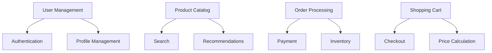

# Case Study: E-Commerce Platform 📌

## Table of Contents

- [Introduction](#introduction)
- [Prerequisites & Related Topics](#prerequisites--related-topics)
- [Pattern Recognition Guide](#pattern-recognition-guide)
- [System Requirements](#system-requirements)
- [Architecture Design](#architecture-design)
- [Implementation Details](#implementation-details)
- [Scaling Strategy](#scaling-strategy)
- [Lessons Learned](#lessons-learned)
- [Trade-offs](#trade-offs)
- [Edge Cases to Consider](#edge-cases-to-consider)
- [Common Pitfalls](#common-pitfalls)
- [FAQ](#faq)
- [Interview Tips](#interview-tips)
- [Advanced Topics](#advanced-topics)
- [Further Reading](#further-reading)

## Introduction

This case study examines the design and implementation of a large-scale e-commerce platform handling millions of daily transactions.

### Key Metrics
1. **Daily Active Users**: 1M+
2. **Peak Orders**: 10K/minute
3. **Product Catalog**: 10M+ items
4. **Storage**: 100TB+ data
5. **Availability**: 99.99%

## Prerequisites & Related Topics

- Builds on: [Caching](../system-basics/caching.md), [Database Sharding](../system-basics/database-sharding.md), [Event-Driven Architecture](../scalability/event-driven.md)
- Used in: [Cap Theorem](../scalability/cap-theorem.md), [API Gateway](../architecture/api-gateway.md), [Search systems](../system-basics/indexing.md)
- Techniques often combined: reservation-based inventory, CQRS for catalog, saga checkout, flash-sale queues
- See also: [Interview Questions: Medium](../interview-questions/medium/README.md) — design-a-store prompts

## Pattern Recognition Guide

### 🎯 When to Use Case Study: E-Commerce Platform 📌

**Keywords in requirements**: "e-commerce", "storefront", "inventory", "checkout", "flash sale", "catalog scale", "payment consistency"
**Reach for this when**:
- Interview: the most common medium design question — practice the full walk
- Reference for read-heavy catalog + write-critical checkout split
- Template for per-domain consistency mapping (CAP applied)
- Flash-sale scaling playbook (queue, reserve, shed)

### 🔑 Approach Indicators

| Approach | Signals | Best For |
|----------|---------|----------|
| Cache-heavy catalog | read ratios exceed 100:1 | browse and search paths |
| Reservation inventory | avoid overselling vs live checks | checkout correctness |
| Saga checkout | payment/inventory/fulfillment consistency | order lifecycle |
| Queue-based admission | flash-sale peaks | flash sales |

### ❌ When NOT to Use

- Copying this architecture day one — a modular monolith plus caches runs early stores
- Strong consistency everywhere — reviews and feeds tolerate eventual; payments do not
- Microservices before traffic and teams justify the seams

## System Requirements

### 1. Functional Requirements

### 2. Non-Functional Requirements
**How it works — System requirements:** convert the vague brief into numbers before designing — DAU, read/write ratio, p99 latency, consistency needs, availability target — every later component choice traces back to one of these.

## Architecture Design

### 1. System Architecture
**How it works — System architecture:** the case study's shape — edge (LB, CDN), stateless services, async workers, primary/replica storage — each choice answers a measured bottleneck; walk the request path when explaining it.

### 2. Data Model
**`users` table:**

| Column | Type |
|--------|------|
| user_id | UUID PRIMARY KEY |
| email | VARCHAR(255) UNIQUE |
| password_hash | VARCHAR(255) |
| created_at | TIMESTAMP |
| product_id | UUID PRIMARY KEY |
| name | VARCHAR(255) |
| description | TEXT |
| price | DECIMAL(10,2) |
| inventory_count | INTEGER |
| category_id | UUID |
| order_id | UUID PRIMARY KEY |
| user_id | UUID REFERENCES users(user_id) |

Primary key: `id`. Keep the schema description in interviews to keys and access patterns, not column lists.

## Implementation Details

### 1. Search Implementation
**How it works — Search service:** Index the corpus into an inverted or vector structure at write time, then serve queries by lookup-plus-scoring instead of scanning — relevance tuning happens on the index, not the data.

### 2. Order Processing
**How it works — Order processor:** validate and persist the order, then execute the side effects as an orchestrated saga — reserve inventory, charge payment, trigger fulfillment — with each step idempotent and compensated on failure.

## Scaling Strategy

### 1. Database Sharding
**How it works — Database sharding:** Route each record to its partition by the shard key, so most queries touch exactly one partition — and hot spots, cross-partition joins, and rebalancing are the costs you sign up for.

### 2. Caching Strategy
**How it works — Cache strategy:** Store the computed result under a stable key with a TTL sized to how stale the data may be; hits skip the expensive path, misses repopulate, and invalidation events cover the changes TTL alone would miss.

## Lessons Learned

### 1. Performance Optimization
**How it works — Performance lessons:** the recurring wins — cache the hot read, add the missing index, make the fan-out async, batch the chatty calls — all came from measured traces, never from guessing; measure, fix the top span, re-measure.

### 2. Architecture Evolution
**How it works — Architecture evolution:** the system grew monolith → service extraction at the first scaling pain → read replicas and caches → per-domain services; each step was pulled by a concrete bottleneck, never pushed by fashion.

## Trade-offs

| Decision | Options | Why One Wins Here |
|----------|---------|-------------------|
| Catalog reads | Cache-heavy vs DB-heavy | Read-heavy traffic makes aggressive caching pay for its invalidation complexity |
| Inventory checks | Synchronous vs reservation-based | Overselling risk forces reservations with expiry over live checks |
| Checkout consistency | Strong vs eventual | Payments demand strong consistency; reviews tolerate eventual |
| Search | Managed engine vs DB queries | Faceting and relevance outgrow SQL quickly |

**Consistency vs availability by domain:** Cart and payment prioritize correctness; recommendations and reviews prioritize availability — a per-domain CAP choice inside one system.

**Build vs buy:** Payments, search, and fraud are commodity (buy); catalog and checkout logic differentiate (build).

**Scale path:** Start relational, add caches, then CQRS for reads — each step defers complexity until traffic justifies it.

> **⚠️ When NOT to copy this architecture day one:** early-stage stores can run a modular monolith with caches — adopt this shape when traffic and team count justify the seams (the scaling path above does exactly that).

## Edge Cases to Consider

- Flash sales 50x traffic — admission queues, cached catalog, over-provisioned checkout
- Inventory race between two buyers — atomic reserve with expiry
- Payment succeeded but order write failed — reconciliation job must exist
- Stale price shown then charged differently — price revalidation at checkout

## Common Pitfalls

1. Caching prices/stock too long — correctness bugs customers see
2. Synchronous chain checkout → payment → shipping (fragile, slow)
3. No idempotency on payment endpoints — double charges on retry
4. Search bolted onto the OLTP database instead of a dedicated engine

## FAQ

**Q1: How do you prevent overselling?**

A: Reservation-based inventory: atomic decrement with expiry at checkout start, releasing abandoned holds. Live checks lose to races at scale.

**Q2: How do you design for a flash sale?**

A: Admit through a queue, serve catalog entirely from cache, pre-scale checkout, and isolate the sale paths so the rest of the store stays healthy.

**Q3: Where does CAP show up here?**

A: Per domain: payments and inventory are CP (correctness), catalog and recommendations are AP (freshness tolerance) — one system, explicit choices.

## Interview Tips

### 1. Key Discussion Points
- Scalability decisions
- Data consistency
- Performance optimization
- System evolution
- Failure handling

### 2. Common Questions
1. How to handle flash sales?
2. How to ensure data consistency?
3. How to optimize search?
4. How to handle system failures?

### 3. Best Practices
- Start with clear requirements
- Plan for scale
- Monitor everything
- Document decisions
- Learn from incidents

## Advanced Topics

1. CQRS read models for catalog and search
2. Cell-based storefronts for blast-radius isolation
3. Experimentation at scale on the funnel
4. Personalization pipelines feeding browse paths

## Further Reading
- [E-commerce Architecture](https://aws.amazon.com/solutions/retail/)
- [Scaling E-commerce](https://www.nginx.com/blog/scaling-ecommerce/)
- [Database Sharding](https://www.digitalocean.com/community/tutorials/understanding-database-sharding)

