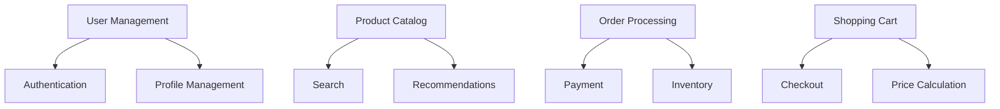

# E-commerce Platform Case Study

## Table of Contents
- [Introduction](#introduction)
- [System Requirements](#system-requirements)
- [Architecture Design](#architecture-design)
- [Implementation Details](#implementation-details)
- [Scaling Strategy](#scaling-strategy)
- [Lessons Learned](#lessons-learned)
- [Trade-offs](#trade-offs)

## Introduction

This case study examines the design and implementation of a large-scale e-commerce platform handling millions of daily transactions.

### Key Metrics
1. **Daily Active Users**: 1M+
2. **Peak Orders**: 10K/minute
3. **Product Catalog**: 10M+ items
4. **Storage**: 100TB+ data
5. **Availability**: 99.99%

## System Requirements

### 1. Functional Requirements


### 2. Non-Functional Requirements
```python
class SystemRequirements:
    def define_requirements(self):
        """Define system requirements"""
        return {
            'performance': {
                'page_load': '< 2s',
                'api_response': '< 200ms',
                'search_latency': '< 500ms'
            },
            'scalability': {
                'users': '10M concurrent',
                'orders': '10K/minute',
                'products': '10M+ items'
            },
            'availability': {
                'uptime': '99.99%',
                'recovery_time': '< 5 minutes'
            },
            'security': {
                'data_encryption': 'at rest & transit',
                'payment_compliance': 'PCI DSS'
            }
        }
```

## Architecture Design

### 1. System Architecture
```python
class SystemArchitecture:
    def define_architecture(self):
        """Define system architecture"""
        return {
            'frontend': {
                'web': 'React.js SPA',
                'mobile': 'React Native',
                'cdn': 'CloudFront'
            },
            'backend': {
                'api_gateway': 'API Gateway',
                'services': {
                    'user_service': 'Node.js',
                    'product_service': 'Python',
                    'order_service': 'Java',
                    'search_service': 'Elasticsearch'
                }
            },
            'data': {
                'main_db': 'PostgreSQL',
                'cache': 'Redis',
                'search': 'Elasticsearch',
                'queue': 'Kafka'
            }
        }
```

### 2. Data Model
```sql
-- User Management
CREATE TABLE users (
    user_id UUID PRIMARY KEY,
    email VARCHAR(255) UNIQUE,
    password_hash VARCHAR(255),
    created_at TIMESTAMP
);

-- Product Catalog
CREATE TABLE products (
    product_id UUID PRIMARY KEY,
    name VARCHAR(255),
    description TEXT,
    price DECIMAL(10,2),
    inventory_count INTEGER,
    category_id UUID
);

-- Order Management
CREATE TABLE orders (
    order_id UUID PRIMARY KEY,
    user_id UUID REFERENCES users(user_id),
    status VARCHAR(50),
    total_amount DECIMAL(10,2),
    created_at TIMESTAMP
);
```

## Implementation Details

### 1. Search Implementation
```python
class SearchService:
    def configure_search(self):
        """Configure search service"""
        return {
            'engine': 'elasticsearch',
            'indices': {
                'products': {
                    'shards': 5,
                    'replicas': 2,
                    'mappings': {
                        'name': {'type': 'text'},
                        'description': {'type': 'text'},
                        'category': {'type': 'keyword'},
                        'price': {'type': 'float'},
                        'inventory': {'type': 'integer'}
                    }
                }
            },
            'queries': {
                'search_products': {
                    'multi_match': {
                        'fields': ['name^3', 'description'],
                        'fuzziness': 'AUTO'
                    }
                }
            }
        }
```

### 2. Order Processing
```python
class OrderProcessor:
    async def process_order(self, order):
        """Process customer order"""
        try:
            # Start transaction
            async with self.transaction() as txn:
                # Check inventory
                if not await self.check_inventory(order):
                    raise InsufficientInventory()
                    
                # Process payment
                payment = await self.process_payment(order)
                
                # Update inventory
                await self.update_inventory(order)
                
                # Create order
                order_id = await self.create_order(order)
                
                # Send notifications
                await self.notify_user(order_id)
                
            return order_id
        except Exception as e:
            await self.rollback_order(order)
            raise OrderProcessingError(str(e))
```

## Scaling Strategy

### 1. Database Sharding
```python
class DatabaseSharding:
    def define_sharding(self):
        """Define database sharding strategy"""
        return {
            'shard_key': 'user_id',
            'shard_function': 'consistent_hashing',
            'num_shards': 100,
            'shard_mapping': {
                'users': 'user_id',
                'orders': 'user_id',
                'products': 'category_id'
            }
        }
```

### 2. Caching Strategy
```python
class CacheStrategy:
    def configure_caching(self):
        """Configure caching strategy"""
        return {
            'layers': {
                'browser': {
                    'type': 'local_storage',
                    'ttl': '1h'
                },
                'cdn': {
                    'type': 'cloudfront',
                    'ttl': '24h'
                },
                'application': {
                    'type': 'redis',
                    'ttl': '15m'
                }
            },
            'invalidation': {
                'strategy': 'write_through',
                'async_update': True
            }
        }
```

## Lessons Learned

### 1. Performance Optimization
```python
class PerformanceLessons:
    def document_lessons(self):
        """Document performance lessons"""
        return {
            'caching': {
                'issue': 'High database load',
                'solution': 'Implemented multi-layer caching',
                'impact': '70% reduction in DB queries'
            },
            'search': {
                'issue': 'Slow search results',
                'solution': 'Optimized Elasticsearch indices',
                'impact': '200ms to 50ms response time'
            },
            'scaling': {
                'issue': 'Database bottlenecks',
                'solution': 'Implemented sharding',
                'impact': '5x throughput improvement'
            }
        }
```

### 2. Architecture Evolution
```python
class ArchitectureEvolution:
    def document_evolution(self):
        """Document architecture evolution"""
        return {
            'phase1': {
                'architecture': 'Monolithic',
                'issues': ['Scaling difficulties', 'Deployment complexity'],
                'changes': 'Split into microservices'
            },
            'phase2': {
                'architecture': 'Microservices',
                'issues': ['Service communication', 'Data consistency'],
                'changes': 'Implemented event sourcing'
            },
            'phase3': {
                'architecture': 'Event-driven',
                'issues': ['Monitoring complexity', 'Debugging challenges'],
                'changes': 'Enhanced observability'
            }
        }
```

## Trade-offs

| Decision | Options | Why One Wins Here |
|----------|---------|-------------------|
| Catalog reads | Cache-heavy vs DB-heavy | Read-heavy traffic makes aggressive caching pay for its invalidation complexity |
| Inventory checks | Synchronous vs reservation-based | Overselling risk forces reservations with expiry over live checks |
| Checkout consistency | Strong vs eventual | Payments demand strong consistency; reviews tolerate eventual |
| Search | Managed engine vs DB queries | Faceting and relevance outgrow SQL quickly |

**Consistency vs availability by domain:** Cart and payment prioritize correctness; recommendations and reviews prioritize availability — a per-domain CAP choice inside one system.

**Build vs buy:** Payments, search, and fraud are commodity (buy); catalog and checkout logic differentiate (build).

**Scale path:** Start relational, add caches, then CQRS for reads — each step defers complexity until traffic justifies it.

## Interview Tips

### 1. Key Discussion Points
- Scalability decisions
- Data consistency
- Performance optimization
- System evolution
- Failure handling

### 2. Common Questions
1. How to handle flash sales?
2. How to ensure data consistency?
3. How to optimize search?
4. How to handle system failures?

### 3. Best Practices
- Start with clear requirements
- Plan for scale
- Monitor everything
- Document decisions
- Learn from incidents

## Further Reading
- [E-commerce Architecture](https://aws.amazon.com/solutions/retail/)
- [Scaling E-commerce](https://www.nginx.com/blog/scaling-ecommerce/)
- [Database Sharding](https://www.digitalocean.com/community/tutorials/understanding-database-sharding)

