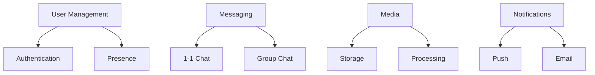

# Real-time Chat System Case Study

## Table of Contents
- [Introduction](#introduction)
- [System Requirements](#system-requirements)
- [Architecture Design](#architecture-design)
- [Implementation Details](#implementation-details)
- [Scaling Strategy](#scaling-strategy)
- [Lessons Learned](#lessons-learned)

## Introduction

This case study examines the design and implementation of a real-time chat system supporting millions of concurrent users.

### Key Metrics
1. **Concurrent Users**: 5M+
2. **Messages/Second**: 100K+
3. **Latency**: < 100ms
4. **Storage**: 50TB+ data
5. **Availability**: 99.99%

## System Requirements

### 1. Functional Requirements


### 2. Non-Functional Requirements
```python
class SystemRequirements:
    def define_requirements(self):
        """Define system requirements"""
        return {
            'performance': {
                'message_delivery': '< 100ms',
                'connection_setup': '< 1s',
                'media_upload': '< 5s'
            },
            'scalability': {
                'users': '5M concurrent',
                'messages': '100K/second',
                'connections': '10M'
            },
            'reliability': {
                'message_delivery': '99.99%',
                'data_durability': '99.999%'
            },
            'security': {
                'e2e_encryption': True,
                'data_privacy': 'GDPR compliant'
            }
        }
```

## Architecture Design

### 1. System Architecture
```python
class SystemArchitecture:
    def define_architecture(self):
        """Define system architecture"""
        return {
            'frontend': {
                'web': 'React with WebSocket',
                'mobile': 'Native WebSocket clients',
                'api': 'REST + WebSocket'
            },
            'backend': {
                'connection_manager': 'Node.js',
                'chat_service': 'Go',
                'presence_service': 'Redis',
                'notification_service': 'Python'
            },
            'storage': {
                'messages': 'Cassandra',
                'media': 'S3',
                'cache': 'Redis',
                'search': 'Elasticsearch'
            },
            'queues': {
                'message_queue': 'Kafka',
                'notification_queue': 'RabbitMQ'
            }
        }
```

### 2. Data Model
```sql
-- User Management
CREATE TABLE users (
    user_id UUID PRIMARY KEY,
    username TEXT,
    status TEXT,
    last_seen TIMESTAMP
);

-- Conversations
CREATE TABLE conversations (
    conv_id UUID PRIMARY KEY,
    type TEXT,  -- 'direct' or 'group'
    created_at TIMESTAMP
);

-- Messages
CREATE TABLE messages (
    message_id UUID,
    conv_id UUID,
    sender_id UUID,
    content TEXT,
    sent_at TIMESTAMP,
    PRIMARY KEY (conv_id, sent_at, message_id)
) WITH CLUSTERING ORDER BY (sent_at DESC);
```

## Implementation Details

### 1. WebSocket Management
```python
class WebSocketManager:
    def handle_connection(self, client):
        """Handle WebSocket connection"""
        try:
            # Authenticate client
            user = await self.authenticate(client)
            
            # Setup connection
            connection = await self.setup_connection(user)
            
            # Subscribe to user channels
            await self.subscribe_channels(connection)
            
            # Handle messages
            async for message in connection:
                await self.process_message(message)
                
        except Exception as e:
            await self.handle_error(e)
        finally:
            await self.cleanup_connection(client)
```

### 2. Message Processing
```python
class MessageProcessor:
    async def process_message(self, message):
        """Process chat message"""
        try:
            # Validate message
            if not self.validate_message(message):
                raise InvalidMessage()
                
            # Store message
            stored_msg = await self.store_message(message)
            
            # Get recipients
            recipients = await self.get_recipients(message)
            
            # Deliver message
            await self.deliver_message(stored_msg, recipients)
            
            # Send notifications
            await self.send_notifications(stored_msg, recipients)
            
        except Exception as e:
            await self.handle_message_error(message, e)
```

## Scaling Strategy

### 1. Connection Management
```python
class ConnectionManager:
    def configure_scaling(self):
        """Configure connection scaling"""
        return {
            'connection_pools': {
                'size': 1000,
                'buffer': 200,
                'scaling_trigger': 0.8
            },
            'sharding': {
                'strategy': 'user_id_hash',
                'shards': 100,
                'replication': 3
            },
            'load_balancing': {
                'algorithm': 'least_connections',
                'health_check': {
                    'interval': '5s',
                    'timeout': '2s'
                }
            }
        }
```

### 2. Message Distribution
```python
class MessageDistributor:
    def configure_distribution(self):
        """Configure message distribution"""
        return {
            'partitioning': {
                'key': 'conversation_id',
                'partitions': 100
            },
            'routing': {
                'strategy': 'consistent_hashing',
                'replicas': 3
            },
            'delivery': {
                'retry_policy': {
                    'attempts': 3,
                    'backoff': 'exponential'
                },
                'timeout': '5s'
            }
        }
```

## Lessons Learned

### 1. Performance Optimization
```python
class PerformanceLessons:
    def document_lessons(self):
        """Document performance lessons"""
        return {
            'connection_handling': {
                'issue': 'Connection overhead',
                'solution': 'Connection pooling',
                'impact': '50% reduction in memory usage'
            },
            'message_delivery': {
                'issue': 'Message latency',
                'solution': 'Optimized routing',
                'impact': 'Latency reduced to < 50ms'
            },
            'storage': {
                'issue': 'Write bottlenecks',
                'solution': 'Write-behind caching',
                'impact': '3x throughput improvement'
            }
        }
```

### 2. Reliability Improvements
```python
class ReliabilityLessons:
    def document_improvements(self):
        """Document reliability improvements"""
        return {
            'message_persistence': {
                'issue': 'Message loss',
                'solution': 'Multi-region replication',
                'impact': '99.999% durability'
            },
            'failure_handling': {
                'issue': 'Node failures',
                'solution': 'Automatic failover',
                'impact': 'Zero message loss'
            },
            'network_issues': {
                'issue': 'Connection drops',
                'solution': 'Smart reconnect',
                'impact': 'Seamless recovery'
            }
        }
```

## Interview Tips

### 1. Key Discussion Points
- Real-time delivery
- Connection management
- Message ordering
- Offline support
- Scaling strategy

### 2. Common Questions
1. How to handle millions of connections?
2. How to ensure message ordering?
3. How to handle offline users?
4. How to scale globally?

### 3. Best Practices
- Use WebSocket for real-time
- Implement proper sharding
- Handle offline scenarios
- Monitor connection health
- Implement retry logic

## Further Reading
- [WebSocket Best Practices](https://www.nginx.com/blog/websocket-nginx/)
- [Scaling WebSocket](https://www.freecodecamp.org/news/million-websockets/)
- [Real-time Systems](https://www.confluent.io/blog/real-time-messaging-at-scale/)

