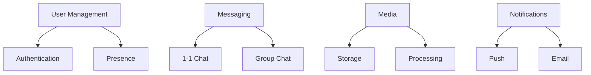

# Case Study: Real-Time Chat 📌

## Table of Contents

- [Introduction](#introduction)
- [Prerequisites & Related Topics](#prerequisites--related-topics)
- [Pattern Recognition Guide](#pattern-recognition-guide)
- [System Requirements](#system-requirements)
- [Architecture Design](#architecture-design)
- [Implementation Details](#implementation-details)
- [Scaling Strategy](#scaling-strategy)
- [Lessons Learned](#lessons-learned)
- [Trade-offs](#trade-offs)
- [Edge Cases to Consider](#edge-cases-to-consider)
- [Common Pitfalls](#common-pitfalls)
- [FAQ](#faq)
- [Interview Tips](#interview-tips)
- [Advanced Topics](#advanced-topics)
- [Further Reading](#further-reading)

## Introduction

This case study examines the design and implementation of a real-time chat system supporting millions of concurrent users.

### Key Metrics
1. **Concurrent Users**: 5M+
2. **Messages/Second**: 100K+
3. **Latency**: < 100ms
4. **Storage**: 50TB+ data
5. **Availability**: 99.99%

## Prerequisites & Related Topics

- Builds on: [Message Queues](../architecture/message-queues.md), [Event-Driven Architecture](../scalability/event-driven.md), [Load Balancing](../system-basics/load-balancing.md)
- Used in: [WebSocket patterns](#), [Presence systems](../modern-architectures/real-time-collaboration.md), [Notification systems](#)
- Techniques often combined: sticky WS routing, sequence numbers, offline queues, push fan-out services
- See also: [Interview Questions: Medium](../interview-questions/medium/README.md) — the chat design prompt

## Pattern Recognition Guide

### 🎯 When to Use Case Study: Real-Time Chat 📌

**Keywords in requirements**: "chat", "messaging", "websocket", "real-time delivery", "presence", "message ordering", "offline messages"
**Reach for this when**:
- Interview: the standard medium real-time design — practice the walkthrough
- Reference for connection-heavy stateful fleets behind load balancers
- Template for delivery guarantees (at-least-once + dedupe by sequence)
- Fan-out pattern for group conversations at scale

### 🔑 Approach Indicators

| Approach | Signals | Best For |
|----------|---------|----------|
| Sticky WS + user map | connection locality, fast delivery | the standard fleet shape |
| Sequence numbers per conversation | ordering + dedupe | every serious chat |
| Offline queue + push | missed message delivery | mobile-heavy users |
| Fan-out on write (small groups) | precomputed recipient lists | group chat |

### ❌ When NOT to Use

- Polling for latency-critical chat — UX dies at 30s freshness
- Global message ordering — per-conversation is the real requirement
- Durable state on connection servers — keep them restartable

## System Requirements

### 1. Functional Requirements

### 2. Non-Functional Requirements
**How it works — System requirements:** convert the vague brief into numbers before designing — DAU, read/write ratio, p99 latency, consistency needs, availability target — every later component choice traces back to one of these.

## Architecture Design

### 1. System Architecture
**How it works — System architecture:** the case study's shape — edge (LB, CDN), stateless services, async workers, primary/replica storage — each choice answers a measured bottleneck; walk the request path when explaining it.

### 2. Data Model
**`users` table:**

| Column | Type |
|--------|------|
| user_id | UUID PRIMARY KEY |
| username | TEXT |
| status | TEXT |
| last_seen | TIMESTAMP |
| conv_id | UUID PRIMARY KEY |
| created_at | TIMESTAMP |
| message_id | UUID |
| conv_id | UUID |
| sender_id | UUID |
| content | TEXT |
| sent_at | TIMESTAMP |

Primary key: `id`. Keep the schema description in interviews to keys and access patterns, not column lists.

## Implementation Details

### 1. WebSocket Management
**How it works — WebSocket manager:** each server owns the sockets for its connected users (a `user_id → connection` map); delivery checks that map first, and falls back to an offline queue when the recipient is elsewhere. Sticky sessions or a shared registry route new connections to the least-loaded server.

### 2. Message Processing
**How it works — message processing:** persist the message, then fan out — direct socket push to online recipients, queue entry for offline ones, and a write to the history store — each step idempotent so redelivery never duplicates a message.

## Scaling Strategy

### 1. Connection Management
**How it works — Connection manager:** connections are pooled, borrowed per operation, and health-checked before reuse; broken connections are evicted and replaced in the background so callers never see a dead one.

### 2. Message Distribution
**How it works — Message distributor:** incoming messages are routed to workers by key or by load — key-based routing preserves per-entity ordering, load-based maximizes utilization; pick one deliberately, because mixing them breaks both.

## Lessons Learned

### 1. Performance Optimization
**How it works — Performance lessons:** the recurring wins — cache the hot read, add the missing index, make the fan-out async, batch the chatty calls — all came from measured traces, never from guessing; measure, fix the top span, re-measure.

### 2. Reliability Improvements
**How it works — Reliability lessons:** every incident taught the same economics — redundant components beat stronger components, tested failover beats assumed failover, and the runbook you actually rehearsed is the one that works at 3 AM.

## Trade-offs

| Decision | Options | Why One Wins Here |
|----------|---------|-------------------|
| Delivery model | WebSocket push vs polling | Push gives real-time UX; polling wastes requests at scale |
| Message queueing | Per-user queues vs shared log | Per-user ordering simplifies delivery; shared logs scale fan-out better |
| Offline delivery | Store-and-forward vs drop | Messaging demands store-and-forward with acks |
| Group fan-out | Write-fan-out vs read-fan-out | Write-fan-out wins for celebrity-scale recipients |

**Consistency vs latency:** Message ordering across devices trades global ordering guarantees for delivery speed; per-conversation ordering is the practical compromise.

**Storage vs retrieval cost:** Keep hot messages in a fast store and archive cold history — retention policy is a performance decision.

**Presence at scale:** Tracking presence for millions of connections requires heartbeat batching and accepting staleness.

> **⚠️ When NOT to use write-fan-out:** celebrity accounts with millions of followers — pushing to all followers at write time stalls the write; read-fan-out or a hybrid wins there.

## Edge Cases to Consider

- Server crash mid-delivery — messages persisted before push; clients fetch gaps by sequence
- Duplicate delivery after reconnect — dedupe by sequence number
- Reconnect storms after network blips — jittered backoff on clients
- Group fan-out for celebrity/room scale — hybrid fan-out with lazy reads

## Common Pitfalls

1. Storing sessions in WS server memory without a recovery path
2. No message dedup — reconnects produce duplicates users notice
3. Push before persist — data loss on crash
4. Presence via DB writes per heartbeat — melt the database; use TTL keys

## FAQ

**Q1: How does message ordering work?**

A: Sequence numbers per conversation assigned at write time; clients detect gaps and request backfill. Global ordering is unnecessary and unscalable.

**Q2: How are offline users handled?**

A: Messages persist first; delivery service queues or pushes to offline users, and on reconnect the client reconciles gaps via sequence numbers before relying on push.

**Q3: What scales the connection fleet?**

A: Stateless-ish connection servers with user→server routing via a registry (or LB stickiness), pub-sub for cross-server delivery, and horizontal growth by connection count — millions of sockets per region is normal.

## Interview Tips

### 1. Key Discussion Points
- Real-time delivery
- Connection management
- Message ordering
- Offline support
- Scaling strategy

### 2. Common Questions
1. How to handle millions of connections?
2. How to ensure message ordering?
3. How to handle offline users?
4. How to scale globally?

### 3. Best Practices
- Use WebSocket for real-time
- Implement proper sharding
- Handle offline scenarios
- Monitor connection health
- Implement retry logic

## Advanced Topics

1. Hybrid fan-out strategies for mixed small/large rooms
2. E2E encryption key distribution patterns
3. Multi-region chat with conversation-home placement
4. Message search pipelines (indexer off the event stream)

## Further Reading
- [WebSocket Best Practices](https://www.nginx.com/blog/websocket-nginx/)
- [Scaling WebSocket](https://www.freecodecamp.org/news/million-websockets/)
- [Real-time Systems](https://www.confluent.io/blog/real-time-messaging-at-scale/)

