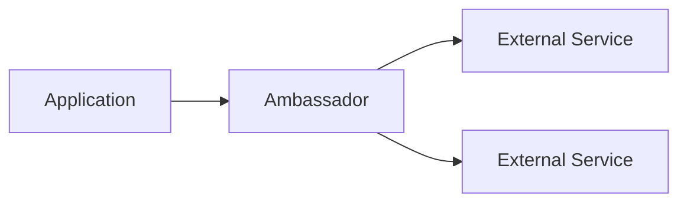

# Cloud Design Patterns

## Table of Contents
- [Introduction](#introduction)
- [Foundational Patterns](#foundational-patterns)
- [Availability Patterns](#availability-patterns)
- [Data Management Patterns](#data-management-patterns)
- [Security Patterns](#security-patterns)
- [Interview Tips](#interview-tips)

## Introduction

Cloud design patterns are reusable solutions to common problems in cloud architecture.

### Key Benefits
1. **Reliability**
2. **Scalability**
3. **Security**
4. **Cost Optimization**
5. **Operational Excellence**

## Foundational Patterns

### 1. Ambassador Pattern


```python
class Ambassador:
    def __init__(self):
        self.circuit_breaker = CircuitBreaker()
        self.retry_policy = RetryPolicy()
    
    async def call_service(self, request):
        """Handle external service call"""
        try:
            if self.circuit_breaker.is_open():
                return "Service unavailable"
                
            return await self.retry_policy.execute(
                lambda: self.make_request(request)
            )
        except Exception as e:
            self.circuit_breaker.record_failure()
            raise e
```

### 2. Sidecar Pattern
```yaml
# Kubernetes Sidecar Example
apiVersion: v1
kind: Pod
metadata:
  name: app-with-sidecar
spec:
  containers:
  - name: app
    image: main-app:1.0
  - name: logging-sidecar
    image: logging-agent:1.0
    volumeMounts:
    - name: logs
      mountPath: /var/log
```

## Availability Patterns

### 1. Circuit Breaker
```python
class CircuitBreaker:
    def __init__(self):
        self.failure_count = 0
        self.state = "CLOSED"
        self.threshold = 5
        self.timeout = 60  # seconds
        
    def execute(self, func):
        if self.state == "OPEN":
            if time.time() - self.last_failure > self.timeout:
                self.state = "HALF_OPEN"
            else:
                raise CircuitBreakerOpen()
                
        try:
            result = func()
            if self.state == "HALF_OPEN":
                self.state = "CLOSED"
            return result
        except Exception as e:
            self.handle_failure()
            raise e
```

### 2. Bulkhead Pattern
```python
class BulkheadPool:
    def __init__(self, size):
        self.semaphore = asyncio.Semaphore(size)
        
    async def execute(self, func):
        async with self.semaphore:
            return await func()
```

## Data Management Patterns

### 1. CQRS Pattern
```python
class OrderSystem:
    def __init__(self):
        self.command_db = CommandDatabase()
        self.query_db = QueryDatabase()
        
    async def create_order(self, order):
        """Command path"""
        order_id = await self.command_db.save_order(order)
        # Publish event for query side
        await self.event_bus.publish("OrderCreated", order)
        return order_id
        
    async def get_order(self, order_id):
        """Query path"""
        return await self.query_db.get_order(order_id)
```

### 2. Event Sourcing
```python
class EventStore:
    async def append_events(self, aggregate_id, events):
        """Store domain events"""
        async with self.session() as session:
            for event in events:
                await session.execute(
                    "INSERT INTO events (aggregate_id, type, data) "
                    "VALUES (:id, :type, :data)",
                    {
                        "id": aggregate_id,
                        "type": event.type,
                        "data": event.data
                    }
                )
                
    async def get_events(self, aggregate_id):
        """Retrieve event stream"""
        async with self.session() as session:
            result = await session.execute(
                "SELECT * FROM events WHERE aggregate_id = :id "
                "ORDER BY sequence",
                {"id": aggregate_id}
            )
            return result.fetchall()
```

## Security Patterns

### 1. Valet Key Pattern
```python
class StorageAccessManager:
    def generate_sas_token(self, resource, permissions, expiry):
        """Generate limited-access token"""
        token = {
            "resource": resource,
            "permissions": permissions,
            "expiry": expiry,
            "signature": self.sign_token(resource, permissions, expiry)
        }
        return base64.encode(json.dumps(token))
```

### 2. Gatekeeper Pattern
```python
class Gatekeeper:
    def __init__(self):
        self.auth_service = AuthService()
        self.validation_service = ValidationService()
        
    async def process_request(self, request):
        # Authenticate
        if not await self.auth_service.verify_token(request.token):
            return "Unauthorized"
            
        # Validate
        if not self.validation_service.validate_input(request.data):
            return "Invalid input"
            
        # Forward to internal service
        return await self.internal_service.process(request.data)
```

## Common Use Cases

### 1. Microservices Architecture
```yaml
# Docker Compose Example
version: '3'
services:
  api-gateway:
    image: api-gateway:1.0
    ports:
      - "80:80"
    
  auth-service:
    image: auth-service:1.0
    environment:
      - DB_HOST=auth-db
    
  order-service:
    image: order-service:1.0
    environment:
      - KAFKA_BROKER=kafka:9092
```

### 2. Serverless Architecture
```python
# AWS Lambda Function
def handler(event, context):
    """Process event from API Gateway"""
    try:
        # Validate input
        order = validate_order(event['body'])
        
        # Process order
        order_id = process_order(order)
        
        # Publish event
        publish_event('OrderCreated', order)
        
        return {
            'statusCode': 200,
            'body': json.dumps({'order_id': order_id})
        }
    except ValidationError as e:
        return {
            'statusCode': 400,
            'body': str(e)
        }
```

## Interview Tips

### 1. Key Considerations
- Scalability requirements
- Fault tolerance
- Data consistency
- Security needs
- Cost implications

### 2. Common Questions
1. How do you handle service discovery?
2. Explain the CQRS pattern and its benefits
3. When would you use event sourcing?
4. How do you implement the circuit breaker pattern?

### 3. Best Practices
- Design for failure
- Implement monitoring
- Use appropriate patterns
- Consider trade-offs
- Document decisions

## Further Reading
- [Cloud Design Patterns](https://docs.microsoft.com/en-us/azure/architecture/patterns/)
- [AWS Well-Architected Framework](https://aws.amazon.com/architecture/well-architected/)
- [Cloud Native Patterns](https://www.manning.com/books/cloud-native-patterns)

