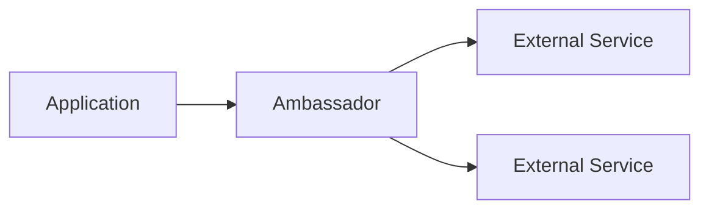

# Cloud Design Patterns in System Design 📌

## Table of Contents

- [Introduction](#introduction)
- [Prerequisites & Related Topics](#prerequisites--related-topics)
- [Pattern Recognition Guide](#pattern-recognition-guide)
- [Foundational Patterns](#foundational-patterns)
- [Availability Patterns](#availability-patterns)
- [Data Management Patterns](#data-management-patterns)
- [Security Patterns](#security-patterns)
- [Common Use Cases](#common-use-cases)
- [Trade-offs](#trade-offs)
- [Edge Cases to Consider](#edge-cases-to-consider)
- [Common Pitfalls](#common-pitfalls)
- [FAQ](#faq)
- [Interview Tips](#interview-tips)
- [Advanced Topics](#advanced-topics)
- [Further Reading](#further-reading)

## Introduction

Cloud design patterns are reusable solutions to common problems in cloud architecture.

### Key Benefits
1. **Reliability**
2. **Scalability**
3. **Security**
4. **Cost Optimization**
5. **Operational Excellence**

## Prerequisites & Related Topics

- Builds on: [Distributed Systems](../system-basics/distributed-systems.md) fundamentals
- Used in: [Circuit Breaker](../architecture/circuit-breaker.md), [API Gateway](../architecture/api-gateway.md), [Kubernetes](kubernetes-orchestration.md)
- Techniques often combined: retries with backoff, health endpoints, outbox, CQRS
- See also: [Azure Architecture Center patterns](https://learn.microsoft.com/en-us/azure/architecture/patterns/) — the canonical catalog

## Pattern Recognition Guide

### 🎯 When to Use Cloud Design Patterns

**Keywords in requirements**: "resilience pattern", "retry", "isolation", "sidecar", "anti-corruption", "ambassador", "strangler"
**Reach for this when**:
- Wrapping every remote call with breaker + retry + timeout
- Isolating dependencies with bulkheaded pools
- Sidecars for logging/mTLS/config without app changes
- Strangler-fig migrations off monoliths incrementally

### 🔑 Approach Indicators

| Approach | Signals | Best For |
|----------|---------|----------|
| Circuit breaker | fail fast on unhealthy dependency | all remote calls |
| Bulkhead | pool isolation per dependency | thread/connection limits |
| Sidecar | cross-cutting concern offload | Kubernetes-native apps |
| Strangler fig | incremental replacement | monolith migration |
| Anti-corruption layer | legacy model isolation | integrations with old systems |

### ❌ When NOT to Use

- Patterns without measured problems — each adds latency and complexity
- Retries on non-idempotent operations without keys
- Sidecars where a library suffices — operational cost is real

## Foundational Patterns

### 1. Ambassador Pattern

**How it works — Ambassador:** a helper process sits beside the application and handles all communication with a remote service — retries, TLS, metrics — so the app talks to localhost and the networking logic is swappable without touching business code.

### 2. Sidecar Pattern
**Kubernetes `Pod` `app-with-sidecar`**: the smallest schedulable unit. In interviews, sketch the object relationships (Deployment → ReplicaSet → Pod → Service) instead of the manifest.

## Availability Patterns

### 1. Circuit Breaker
**How it works — Circuit breaker:** the wrapper keeps three states. **Closed**: requests flow and failures are counted; past a threshold (e.g., 5 failures in 10 s) it trips. **Open**: requests fail fast with no network call, giving the struggling dependency time to recover. **Half-open**: after a cool-down, a probe request is let through — success closes the circuit, failure reopens it. Draw the state machine when explaining it.

### 2. Bulkhead Pattern
**How it works — Bulkhead pattern:** partition resources into isolated pools — one connection pool and thread budget per downstream dependency — so a stalled warehouse service cannot drain the pool that payments depends on. The two knobs are pool size (concurrency granted per dependency) and queue depth (how many requests may wait before being rejected).

## Data Management Patterns

### 1. CQRS Pattern
**How it works — Order system:** the write path is one transactional create; the read path (history, status) is served from projections updated by order events — writes stay simple while reads scale independently.

### 2. Event Sourcing
**How it works — Event store:** events are immutable, append-only records keyed by aggregate; state is rebuilt by replaying, and the log itself is the audit trail — the sequence of events *is* the truth.

## Security Patterns

### 1. Valet Key Pattern
**How it works — Storage access manager:** all reads/writes go through a data-access layer that enforces authz, applies tenant scoping, and emits audit events — the database never sees an unscoped query.

### 2. Gatekeeper Pattern
**How it works — Gatekeeper:** a minimal worker sits between the internet and the trusted internals — it validates and sanitizes requests, then hands them to separate gate-keeper workers that actually touch storage. The gatekeeper holds no credentials and no state, so even a full compromise of that tier gives an attacker nothing but the ability to forward already-validated messages.

## Common Use Cases

### 1. Microservices Architecture
**How it works — pattern stack:** gateway handles edge concerns (routing, auth, rate limits), each service owns its data and emits events, and resilience patterns (breaker, bulkhead, retry) wrap every cross-service call. The patterns compose: an external request hits the gatekeeper/gateway, flows through the breaker-guarded call chain, and lands as events other services consume at their own pace.

### 2. Serverless Architecture
**How it works — serverless composition:** functions react to events (HTTP via API gateway, queue messages, schedules) and chain via queues or step functions rather than direct calls — keeping every hop asynchronous and independently scalable. State lives outside the function (dynamo/queues), because instances are ephemeral and may not exist one request later.

## Trade-offs

| Pattern | Pros | Cons | Best For |
|---------|------|------|----------|
| Retry with backoff | Survives transient failures | Can amplify load (retry storms) | All remote calls (with jitter + budgets) |
| Circuit Breaker | Stops cascading failures | Fallbacks may degrade behavior | Dependency-heavy services |
| Bulkhead | Isolates resource pools | Partitioned capacity, more config | Multi-tenant or multi-dependency systems |
| Saga (choreography) | No central coordinator | Flow logic scattered across services | Distributed transactions |
| Saga (orchestration) | Explicit, observable flow | Orchestrator is central logic + SPOF risk | Multi-step business processes |

**Resilience vs complexity:** Each pattern adds failure-handling power and its own failure modes; adopt per measured need, not wholesale.

**Eventual consistency vs simplicity:** Sagas avoid distributed locks but push compensation and idempotency into every step.

**Isolation vs utilization:** Bulkheads cap blast radius by sacrificing shared-capacity efficiency.

> **⚠️ When NOT to retry:** non-idempotent operations without idempotency keys (double charges), permanent failures (validation errors), and paths already inside a retry budget — blind retries turn a blip into a self-inflicted outage.

## Edge Cases to Consider

- Retry + breaker interplay — retries feed failure counts; budget both
- Pattern interaction surprises — breaker open during deploy causing false alarms
- Distributed tracing mandatory once patterns multiply
- Feature flags as runtime circuit-breakers for product-level rollback

## Common Pitfalls

1. Applying patterns cargo-cult style without failure-mode analysis
2. Bulkheads sized from defaults instead of measured concurrency
3. No observability into pattern state (breaker status, pool saturation)
4. Forgetting idempotency when composing retry + outbox + saga

## FAQ

**Q1: Which patterns should every service start with?**

A: Timeout + retry with backoff + circuit breaker + health checks, with bulkheads where pools are shared. Those four prevent most cascading failures.

**Q2: What is the strangler fig pattern?**

A: Route traffic through a facade and move endpoints to the new system incrementally, retiring old code slice by slice — migration without a big-bang cutover.

**Q3: Sidecar vs library for resilience?**

A: Libraries are simpler and lower-latency; sidecars give uniform policy across languages and centralized upgrades. Meshes pay off at fleet scale.

## Interview Tips

### 1. Key Considerations
- Scalability requirements
- Fault tolerance
- Data consistency
- Security needs
- Cost implications

### 2. Common Questions
1. How do you handle service discovery?
2. Explain the CQRS pattern and its benefits
3. When would you use event sourcing?
4. How do you implement the circuit breaker pattern?

### 3. Best Practices
- Design for failure
- Implement monitoring
- Use appropriate patterns
- Consider trade-offs
- Document decisions

## Advanced Topics

1. Saga orchestration vs choreography trade-offs
2. CQRS with event-sourced aggregates
3. Cell-based isolation for blast-radius control
4. Priority queues + load shedding for graceful degradation

## Further Reading
- [Cloud Design Patterns](https://docs.microsoft.com/en-us/azure/architecture/patterns/)
- [AWS Well-Architected Framework](https://aws.amazon.com/architecture/well-architected/)
- [Cloud Native Patterns](https://www.manning.com/books/cloud-native-patterns)

