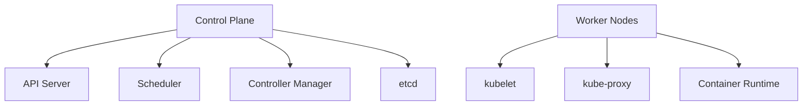

# Kubernetes Orchestration in System Design 📌

## Table of Contents

- [Introduction](#introduction)
- [Prerequisites & Related Topics](#prerequisites--related-topics)
- [Pattern Recognition Guide](#pattern-recognition-guide)
- [Core Concepts](#core-concepts)
- [Architecture Components](#architecture-components)
- [Implementation Patterns](#implementation-patterns)
- [Common Use Cases](#common-use-cases)
- [Trade-offs](#trade-offs)
- [Edge Cases to Consider](#edge-cases-to-consider)
- [Common Pitfalls](#common-pitfalls)
- [FAQ](#faq)
- [Interview Tips](#interview-tips)
- [Advanced Topics](#advanced-topics)
- [Further Reading](#further-reading)

## Introduction

Kubernetes is a container orchestration platform that automates the deployment, scaling, and management of containerized applications.

### Key Benefits
1. **Automated Operations**
2. **Scalability**
3. **High Availability**
4. **Resource Efficiency**
5. **Declarative Configuration**

## Prerequisites & Related Topics

- Builds on: containers, [Load Balancing](../system-basics/load-balancing.md)
- Used in: Service Mesh, [Cost Optimization](cost-optimization.md), [Serverless Patterns](serverless-patterns.md)
- Techniques often combined: HPA autoscaling, readiness/liveness probes, resource requests/limits, NetworkPolicies
- See also: [The Twelve-Factor App](https://12factor.net/) — the app discipline K8s assumes

## Pattern Recognition Guide

### 🎯 When to Use Kubernetes Orchestration

**Keywords in requirements**: "container orchestration", "declarative", "self-healing", "rolling update", "autoscaling", "pod", "cluster"
**Reach for this when**:
- Fleets of services needing uniform deploy, scaling, and healing
- Mixed workloads with bin-packing efficiency on shared nodes
- Platform engineering golden paths (templates, operators)
- Hybrid/multi-cloud portability at the orchestration layer

### 🔑 Approach Indicators

| Approach | Signals | Best For |
|----------|---------|----------|
| Deployment + Service | stateless rollout, stable VIP | the default shape |
| StatefulSet | stable identity + storage | databases, brokers |
| HPA/KEDA | metric- or queue-driven scaling | variable load |
| Operator pattern | automated domain ops | running stateful tech |

### ❌ When NOT to Use

- A few stateless services — managed platforms (Fargate, Cloud Run) are cheaper to run and staff
- Strong statefulness without an operator — databases often belong on managed services
- One giant shared cluster with no tenancy boundaries

## Core Concepts

### 1. Basic Architecture

### 2. Kubernetes Objects
**Kubernetes `Pod` `nginx-pod`**: the smallest schedulable unit. In interviews, sketch the object relationships (Deployment → ReplicaSet → Pod → Service) instead of the manifest.

### 3. Deployment Patterns
**Kubernetes `Deployment` `web-app`** — 3 replicas: rolls out stateless replicas behind a Service. In interviews, sketch the object relationships (Deployment → ReplicaSet → Pod → Service) instead of the manifest.

## Architecture Components

### 1. Control Plane Components
**How it works — Control plane:** the component that stores desired state and drives the data plane toward it — schedulers, service-mesh pilots, and orchestrators are all control planes; they decide, the data plane executes.

### 2. Networking
**How it works — Kubernetes network:** every pod gets a cluster-routable IP and pods talk directly without NAT; Services provide stable virtual IPs with load balancing across pods, and NetworkPolicies apply default-deny between namespaces.

## Implementation Patterns

### 1. Service Discovery
**Kubernetes `Service` `web-service`**: gives pods a stable virtual IP and DNS name. In interviews, sketch the object relationships (Deployment → ReplicaSet → Pod → Service) instead of the manifest.

### 2. Configuration Management
**Kubernetes `ConfigMap` `app-config`**: injects non-secret configuration as env vars or files. In interviews, sketch the object relationships (Deployment → ReplicaSet → Pod → Service) instead of the manifest.

### 3. State Management
**Kubernetes `StatefulSet` `web`** — 3 replicas: gives replicas stable identities and ordered rollout. In interviews, sketch the object relationships (Deployment → ReplicaSet → Pod → Service) instead of the manifest.

## Common Use Cases

### 1. Microservices Deployment
**Kubernetes `Deployment` `auth-service`** — 3 replicas: rolls out stateless replicas behind a Service. In interviews, sketch the object relationships (Deployment → ReplicaSet → Pod → Service) instead of the manifest.

### 2. Batch Processing
**Kubernetes `Job` `batch-job`**: runs a workload to completion once. In interviews, sketch the object relationships (Deployment → ReplicaSet → Pod → Service) instead of the manifest.

## Trade-offs

| Choice | Pros | Cons | Best For |
|--------|------|------|----------|
| Kubernetes | Portable, rich ecosystem, autoscaling | Steep learning curve, operational weight | Multi-service platforms |
| Managed K8s (EKS/GKE/AKS) | Control plane offloaded | Cost, provider coupling | Most production teams |
| Autoscaling (HPA/cluster) | Pay for load, self-healing | Needs solid metrics, scaling flapping | Variable traffic |
| Static provisioning | Predictable, simple | Waste at low traffic, manual scaling | Stable, well-known load |

**Control vs operational burden:** Self-managing Kubernetes gives full control and consumes engineering time; managed control planes trade some flexibility for operability.

**Density vs blast radius:** Packing many workloads per cluster saves money but couples failures and upgrades; more clusters isolate but multiply overhead.

**Fast autoscaling vs stability:** Aggressive scale-up handles spikes quickly but thrashes; stabilize windows smooth it at the cost of brief over/under-provisioning.

> **⚠️ When NOT to use Kubernetes:** a few stateless services that fit managed platforms (Cloud Run, ECS), small teams without ops capacity, and single-region apps where the control plane's flexibility buys nothing — managed PaaS is cheaper to run and to staff.

## Edge Cases to Consider

- Graceful shutdown — SIGTERM handling and preStop drains
- Pod disruption during node ops — PodDisruptionBudgets protect availability
- Probe misconfig killing healthy pods (liveness on slow endpoints)
- ETCD/control-plane saturation from churn (HPA flapping)

## Common Pitfalls

1. No resource requests — scheduling and capacity planning break
2. Liveness probes that check dependencies — restart storms
3. latest tags and immutable-image violations
4. Secrets as plain ConfigMaps — use secret stores and encryption

## FAQ

**Q1: Kubernetes or serverless?**

A: Serverless for spiky/event-driven and small teams; Kubernetes for dense fleets, custom runtimes, and cost at sustained scale. Start serverless, migrate deliberately.

**Q2: Why requests and limits?**

A: Requests drive placement guarantees; limits prevent noisy neighbors. Without requests, the scheduler packs blind and QoS collapses under pressure.

**Q3: What makes deploys zero-downtime?**

A: Rolling updates gated by readiness probes plus PDBs — new pods receive traffic only when able, old pods drain gracefully.

## Interview Tips

### 1. Key Considerations
- High availability design
- Scaling strategies
- Resource management
- Security practices
- Monitoring and logging

### 2. Common Questions
1. How does Kubernetes handle node failures?
2. Explain pod networking and service discovery
3. How would you design a stateful application in Kubernetes?
4. What are the best practices for security?

### 3. Best Practices
- Use namespaces for isolation
- Implement resource limits
- Use health checks
- Plan for disaster recovery
- Monitor cluster health

## Advanced Topics

1. Horizontal + vertical autoscaling with cost-aware bin-packing
2. Multi-cluster traffic and failover (service mesh assisted)
3. GitOps (Argo/Flux) with progressive delivery (Argo Rollouts)
4. Operators/CRDs encoding operational runbooks

## Further Reading
- [Kubernetes Documentation](https://kubernetes.io/docs/)
- [Cloud Native Computing Foundation](https://www.cncf.io/)
- [Kubernetes Patterns](https://www.redhat.com/en/resources/oreilly-kubernetes-patterns-cloud-native-apps)

