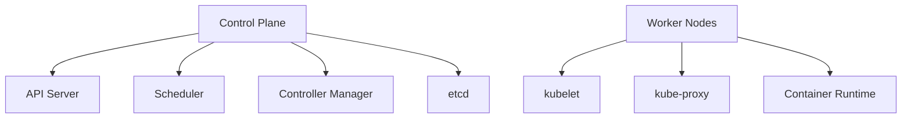

# Container Orchestration with Kubernetes

## Table of Contents
- [Introduction](#introduction)
- [Core Concepts](#core-concepts)
- [Architecture Components](#architecture-components)
- [Implementation Patterns](#implementation-patterns)
- [Common Use Cases](#common-use-cases)
- [Trade-offs](#trade-offs)
- [Interview Tips](#interview-tips)

## Introduction

Kubernetes is a container orchestration platform that automates the deployment, scaling, and management of containerized applications.

### Key Benefits
1. **Automated Operations**
2. **Scalability**
3. **High Availability**
4. **Resource Efficiency**
5. **Declarative Configuration**

## Core Concepts

### 1. Basic Architecture


### 2. Kubernetes Objects
```yaml
# Pod Example
apiVersion: v1
kind: Pod
metadata:
  name: nginx-pod
  labels:
    app: nginx
spec:
  containers:
  - name: nginx
    image: nginx:1.14.2
    ports:
    - containerPort: 80
```

### 3. Deployment Patterns
```yaml
# Deployment with Rolling Update
apiVersion: apps/v1
kind: Deployment
metadata:
  name: web-app
spec:
  replicas: 3
  strategy:
    type: RollingUpdate
    rollingUpdate:
      maxSurge: 1
      maxUnavailable: 1
  selector:
    matchLabels:
      app: web
  template:
    metadata:
      labels:
        app: web
    spec:
      containers:
      - name: web-app
        image: web-app:1.0
        resources:
          requests:
            memory: "64Mi"
            cpu: "250m"
          limits:
            memory: "128Mi"
            cpu: "500m"
```

## Architecture Components

### 1. Control Plane Components
```python
class ControlPlane:
    def __init__(self):
        self.api_server = APIServer()
        self.scheduler = Scheduler()
        self.controller_manager = ControllerManager()
        self.etcd = ETCD()
    
    def handle_request(self, request):
        """Process API request"""
        # Authenticate and authorize
        if not self.api_server.authenticate(request):
            return "Unauthorized"
            
        # Schedule if needed
        if request.type == "CREATE_POD":
            node = self.scheduler.select_node(request.pod)
            return self.api_server.create_pod(request.pod, node)
```

### 2. Networking
```python
class KubernetesNetwork:
    def setup_network(self):
        """Configure cluster networking"""
        # Pod networking
        self.configure_pod_network()
        
        # Service networking
        self.configure_service_network()
        
        # Network policies
        self.apply_network_policies()
    
    def configure_pod_network(self):
        """Setup pod network with CNI"""
        cni_config = {
            "cniVersion": "0.3.1",
            "name": "cluster-network",
            "type": "calico",
            "ipam": {
                "type": "host-local",
                "subnet": "10.244.0.0/16"
            }
        }
        return self.apply_cni_config(cni_config)
```

## Implementation Patterns

### 1. Service Discovery
```yaml
# Service Definition
apiVersion: v1
kind: Service
metadata:
  name: web-service
spec:
  selector:
    app: web
  ports:
  - port: 80
    targetPort: 8080
  type: LoadBalancer
```

### 2. Configuration Management
```yaml
# ConfigMap
apiVersion: v1
kind: ConfigMap
metadata:
  name: app-config
data:
  database_url: "postgresql://db:5432"
  api_key: "development-key"

---
# Secret
apiVersion: v1
kind: Secret
metadata:
  name: app-secrets
type: Opaque
data:
  db_password: BASE64_ENCODED_PASSWORD
```

### 3. State Management
```yaml
# StatefulSet Example
apiVersion: apps/v1
kind: StatefulSet
metadata:
  name: web
spec:
  serviceName: "nginx"
  replicas: 3
  selector:
    matchLabels:
      app: nginx
  template:
    metadata:
      labels:
        app: nginx
    spec:
      containers:
      - name: nginx
        image: nginx:1.14.2
        ports:
        - containerPort: 80
        volumeMounts:
        - name: www
          mountPath: /usr/share/nginx/html
  volumeClaimTemplates:
  - metadata:
      name: www
    spec:
      accessModes: [ "ReadWriteOnce" ]
      resources:
        requests:
          storage: 1Gi
```

## Common Use Cases

### 1. Microservices Deployment
```yaml
# Microservice Architecture
apiVersion: apps/v1
kind: Deployment
metadata:
  name: auth-service
spec:
  replicas: 3
  selector:
    matchLabels:
      app: auth
  template:
    metadata:
      labels:
        app: auth
    spec:
      containers:
      - name: auth
        image: auth-service:1.0
        env:
        - name: DB_HOST
          valueFrom:
            configMapKeyRef:
              name: app-config
              key: database_url
```

### 2. Batch Processing
```yaml
# Job Example
apiVersion: batch/v1
kind: Job
metadata:
  name: batch-job
spec:
  template:
    spec:
      containers:
      - name: batch-processor
        image: batch-processor:1.0
        command: ["python", "process.py"]
      restartPolicy: Never
  backoffLimit: 4
```

## Trade-offs

| Choice | Pros | Cons | Best For |
|--------|------|------|----------|
| Kubernetes | Portable, rich ecosystem, autoscaling | Steep learning curve, operational weight | Multi-service platforms |
| Managed K8s (EKS/GKE/AKS) | Control plane offloaded | Cost, provider coupling | Most production teams |
| Autoscaling (HPA/cluster) | Pay for load, self-healing | Needs solid metrics, scaling flapping | Variable traffic |
| Static provisioning | Predictable, simple | Waste at low traffic, manual scaling | Stable, well-known load |

**Control vs operational burden:** Self-managing Kubernetes gives full control and consumes engineering time; managed control planes trade some flexibility for operability.

**Density vs blast radius:** Packing many workloads per cluster saves money but couples failures and upgrades; more clusters isolate but multiply overhead.

**Fast autoscaling vs stability:** Aggressive scale-up handles spikes quickly but thrashes; stabilize windows smooth it at the cost of brief over/under-provisioning.

> **⚠️ When NOT to use Kubernetes:** a few stateless services that fit managed platforms (Cloud Run, ECS), small teams without ops capacity, and single-region apps where the control plane's flexibility buys nothing — managed PaaS is cheaper to run and to staff.

## Interview Tips

### 1. Key Considerations
- High availability design
- Scaling strategies
- Resource management
- Security practices
- Monitoring and logging

### 2. Common Questions
1. How does Kubernetes handle node failures?
2. Explain pod networking and service discovery
3. How would you design a stateful application in Kubernetes?
4. What are the best practices for security?

### 3. Best Practices
- Use namespaces for isolation
- Implement resource limits
- Use health checks
- Plan for disaster recovery
- Monitor cluster health

## Further Reading
- [Kubernetes Documentation](https://kubernetes.io/docs/)
- [Cloud Native Computing Foundation](https://www.cncf.io/)
- [Kubernetes Patterns](https://www.redhat.com/en/resources/oreilly-kubernetes-patterns-cloud-native-apps)

