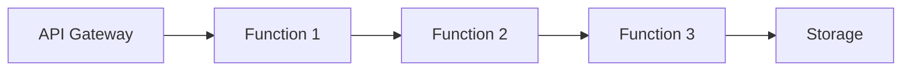

# Serverless Design Patterns

## Table of Contents
- [Introduction](#introduction)
- [Core Patterns](#core-patterns)
- [Integration Patterns](#integration-patterns)
- [Implementation Strategies](#implementation-strategies)
- [Common Use Cases](#common-use-cases)
- [Interview Tips](#interview-tips)

## Introduction

Serverless design patterns focus on building applications using managed services without directly managing servers.

### Key Benefits
1. **Auto-scaling**
2. **Pay-per-use**
3. **Reduced Operations**
4. **Fast Deployment**
5. **Built-in Availability**

## Core Patterns

### 1. Function Chain Pattern


```python
# AWS Lambda Function Chain
def handler1(event, context):
    """First function in chain"""
    result = process_data(event)
    return invoke_lambda('function2', result)

def handler2(event, context):
    """Second function in chain"""
    result = transform_data(event)
    return invoke_lambda('function3', result)
```

### 2. Fan-out Pattern
```python
class EventProcessor:
    def process_event(self, event):
        """Fan out processing"""
        # Publish to SNS topic
        sns.publish(
            TopicArn='arn:aws:sns:region:topic',
            Message=json.dumps(event)
        )
        
class EventConsumer:
    def handle_event(self, event):
        """Process individual event"""
        try:
            data = json.loads(event['Records'][0]['Sns']['Message'])
            process_data(data)
        except Exception as e:
            handle_error(e)
```

## Integration Patterns

### 1. API Gateway Pattern
```yaml
# API Gateway Configuration
openapi: 3.0.0
paths:
  /orders:
    post:
      x-amazon-apigateway-integration:
        uri: arn:aws:lambda:region:function:create-order
        type: AWS_PROXY
      responses:
        200:
          description: Order created
```

### 2. Event-Driven Pattern
```python
class OrderProcessor:
    def handle_event(self, event):
        """Process order events"""
        event_type = event['detail-type']
        
        if event_type == 'OrderCreated':
            return self.process_new_order(event['detail'])
        elif event_type == 'PaymentProcessed':
            return self.update_order_status(event['detail'])
```

## Implementation Strategies

### 1. State Management
```python
class StateMachine:
    def process_order(self, order):
        """Order processing state machine"""
        return {
            'StateMachine': {
                'StartAt': 'ValidateOrder',
                'States': {
                    'ValidateOrder': {
                        'Type': 'Task',
                        'Resource': 'arn:aws:lambda:validate',
                        'Next': 'ProcessPayment'
                    },
                    'ProcessPayment': {
                        'Type': 'Task',
                        'Resource': 'arn:aws:lambda:payment',
                        'Next': 'FulfillOrder'
                    },
                    'FulfillOrder': {
                        'Type': 'Task',
                        'Resource': 'arn:aws:lambda:fulfill',
                        'End': True
                    }
                }
            }
        }
```

### 2. Data Processing
```python
def process_stream(event, context):
    """Process Kinesis stream"""
    for record in event['Records']:
        # Decode and process data
        data = base64.b64decode(record['kinesis']['data'])
        
        # Process each record
        try:
            process_record(data)
        except Exception as e:
            # Handle error and continue
            log_error(e)
            continue
```

## Common Use Cases

### 1. REST API
```python
class OrderAPI:
    def create_order(self, event, context):
        """Handle POST /orders"""
        try:
            # Parse request body
            body = json.loads(event['body'])
            
            # Validate input
            validate_order(body)
            
            # Create order
            order_id = create_order(body)
            
            return {
                'statusCode': 201,
                'body': json.dumps({'order_id': order_id})
            }
        except ValidationError as e:
            return {
                'statusCode': 400,
                'body': str(e)
            }
```

### 2. Event Processing
```python
class EventProcessor:
    def process_s3_event(self, event, context):
        """Process S3 events"""
        for record in event['Records']:
            bucket = record['s3']['bucket']['name']
            key = record['s3']['object']['key']
            
            # Process file
            try:
                process_file(bucket, key)
            except Exception as e:
                handle_error(e, bucket, key)
```

## Interview Tips

### 1. Key Considerations
- Cold start latency
- Function timeout limits
- State management
- Error handling
- Cost optimization

### 2. Common Questions
1. How do you handle state in serverless?
2. What are the limitations of serverless?
3. How do you monitor serverless applications?
4. When should you not use serverless?

### 3. Best Practices
- Keep functions focused
- Optimize cold starts
- Use appropriate triggers
- Implement proper error handling
- Monitor and log effectively

## Further Reading
- [AWS Lambda Patterns](https://docs.aws.amazon.com/lambda/latest/dg/best-practices.html)
- [Serverless Architecture](https://martinfowler.com/articles/serverless.html)
- [Event-Driven Serverless](https://www.manning.com/books/event-driven-serverless)

