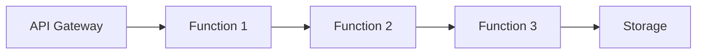

# Serverless Patterns in System Design 📌

## Table of Contents

- [Introduction](#introduction)
- [Prerequisites & Related Topics](#prerequisites--related-topics)
- [Pattern Recognition Guide](#pattern-recognition-guide)
- [Core Patterns](#core-patterns)
- [Integration Patterns](#integration-patterns)
- [Implementation Strategies](#implementation-strategies)
- [Common Use Cases](#common-use-cases)
- [Trade-offs](#trade-offs)
- [Edge Cases to Consider](#edge-cases-to-consider)
- [Common Pitfalls](#common-pitfalls)
- [FAQ](#faq)
- [Interview Tips](#interview-tips)
- [Advanced Topics](#advanced-topics)
- [Further Reading](#further-reading)

## Introduction

Serverless design patterns focus on building applications using managed services without directly managing servers.

### Key Benefits
1. **Auto-scaling**
2. **Pay-per-use**
3. **Reduced Operations**
4. **Fast Deployment**
5. **Built-in Availability**

## Prerequisites & Related Topics

- Builds on: [Message Queues](../architecture/message-queues.md), [API Gateway](../architecture/api-gateway.md)
- Used in: [Event-Driven Architecture](../scalability/event-driven.md), [Real-Time Analytics](../data-engineering/real-time-analytics.md), [Cost Optimization](cost-optimization.md)
- Techniques often combined: idempotent handlers, DLQs, Step Functions, thin clients
- See also: [Kubernetes](kubernetes-orchestration.md) — the alternative when control matters more than ops-zero

## Pattern Recognition Guide

### 🎯 When to Use Serverless Patterns

**Keywords in requirements**: "serverless", "lambda", "event-driven", "scale to zero", "pay per use", "no servers to manage"
**Reach for this when**:
- Spiky or unpredictable traffic (webhooks, scheduled jobs)
- Event pipelines: transform, enrich, route per event
- Glue integrations between managed services
- Tiny teams shipping product without infrastructure toil

### 🔑 Approach Indicators

| Approach | Signals | Best For |
|----------|---------|----------|
| Function + gateway | HTTP-triggered compute | APIs with variable load |
| Queue-triggered functions | async work with retries | background processing |
| Orchestrator (Step Functions) | multi-step workflows | sagas, approvals |
| Event fan-out (SNS) | one event, many handlers | integration buses |

### ❌ When NOT to Use

- Sustained high utilization — containers/reserved capacity often cheaper
- Sub-millisecond latency requirements — cold starts and hops cost
- Very long-running stateful processing — step functions or containers

## Core Patterns

### 1. Function Chain Pattern

**How it works — Handler 1:** each request passes through a chain of handlers — auth, validation, rate limit, then the business handler — each one either enriches the context, short-circuits with an error, or passes it on.

### 2. Fan-out Pattern
**How it works — event fan-out:** one event triggers multiple independent functions (via SNS/topic fan-out) — each scales with the event rate independently and one failing consumer never affects the others; retries and DLQs are per-consumer.

## Integration Patterns

### 1. API Gateway Pattern
**OpenAPI spec:** the machine-readable REST contract — paths, parameters, and response codes — consumed by docs and client generators.

### 2. Event-Driven Pattern
**How it works — Order processor:** validate and persist the order, then execute the side effects as an orchestrated saga — reserve inventory, charge payment, trigger fulfillment — with each step idempotent and compensated on failure.

## Implementation Strategies

### 1. State Management
**How it works — State machine:** valid states and transitions are enumerated (created → paid → shipped → closed); every mutation checks current state and applies one legal transition — illegal transitions are rejected by construction, not by hope.

### 2. Data Processing
**How it works — stream-triggered functions:** each stream record (or batch of records) invokes the function, which processes it idempotently and writes results downstream — the platform handles batching, retries, and scaling with stream depth, so processing capacity always matches the event rate.

## Common Use Cases

### 1. REST API
**How it works — Order API:** Keep the contract explicit — resource, method, versioning, pagination, error shape — and evolve it without breaking existing clients; additive changes only, deprecations announced with a sunset date.

### 2. Event Processing
**How it works — serverless event processing:** the platform invokes the function per event batch with built-in retries; the function must be idempotent (at-least-once delivery) and keep no state between invocations — state lives in the queue, the database, or Step Functions.

## Trade-offs

| Aspect | Benefit | Cost |
|--------|---------|------|
| Pay-per-use | Zero cost at zero traffic | Cost surprises at sustained high load |
| Auto-scaling to zero | No idle spend | Cold-start latency spikes |
| Managed operations | No server patching | Runtime/timeout/memory limits |
| Event-driven glue | Fast composition | Vendor-specific triggers, lock-in |

**Latency vs cost:** Provisioned concurrency removes cold starts but reintroduces idle cost — pay for the tail latencies you cannot tolerate.

**Granularity vs overhead:** Many small functions maximize reuse and independent scaling but multiply deployment, tracing, and cold-start surfaces.

**Statelessness:** Functions force externalized state (better architecture) at the price of extra round trips to databases and caches.

> **⚠️ When NOT to go serverless:** sustained high-volume compute (provisioned is cheaper), long-running or stateful processes (timeouts, externalized state), hard latency floors (cold starts), and exotic runtimes or kernel access.

## Edge Cases to Consider

- Cold starts on hot paths — provisioned concurrency or keep-warm patterns
- Poison events — DLQ with context after bounded retries
- State between invocations — externalize (DB, Redis, Step Functions)
- Downstream connection exhaustion — connection pools do not survive; use HTTP/keep-alive carefully

## Common Pitfalls

1. Non-idempotent handlers under at-least-once delivery
2. Chatty function-to-function chains — orchestrate or queue instead
3. VPC-attached functions adding cold-start networking pain
4. No observability on concurrency limits and throttles

## FAQ

**Q1: When does serverless beat containers?**

A: Load is spiky or idle-heavy, events drive compute, and team size argues against running infrastructure. Cost crossover arrives with sustained high utilization.

**Q2: How do I handle failures?**

A: Bounded platform retries plus a DLQ for context, idempotent handlers because redelivery happens, and orchestration for multi-step flows needing compensation.

**Q3: What replaces server-side state?**

A: Externalize everything: DynamoDB/Redis for hot state, Step Functions for workflow state, and idempotency keys replacing in-flight deduplication.

## Interview Tips

### 1. Key Considerations
- Cold start latency
- Function timeout limits
- State management
- Error handling
- Cost optimization

### 2. Common Questions
1. How do you handle state in serverless?
2. What are the limitations of serverless?
3. How do you monitor serverless applications?
4. When should you not use serverless?

### 3. Best Practices
- Keep functions focused
- Optimize cold starts
- Use appropriate triggers
- Implement proper error handling
- Monitor and log effectively

## Advanced Topics

1. Step Functions for durable, visualizable workflows
2. Provisioned concurrency and SnapStart-style cold-start mitigation
3. EventBridge buses with content-based routing
4. Serverless data patterns: DynamoDB streams + single-table design

## Further Reading
- [AWS Lambda Patterns](https://docs.aws.amazon.com/lambda/latest/dg/best-practices.html)
- [Serverless Architecture](https://martinfowler.com/articles/serverless.html)
- [Event-Driven Serverless](https://www.manning.com/books/event-driven-serverless)

