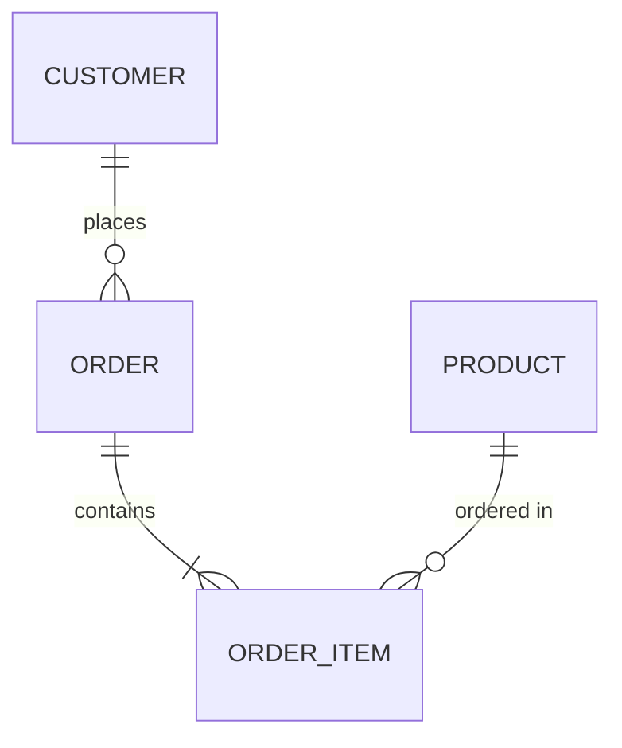
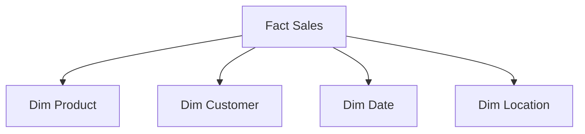

# Data Modeling in System Design 📌

## Table of Contents

- [Introduction](#introduction)
- [Prerequisites & Related Topics](#prerequisites--related-topics)
- [Pattern Recognition Guide](#pattern-recognition-guide)
- [Modeling Techniques](#modeling-techniques)
- [Schema Patterns](#schema-patterns)
- [Implementation Strategies](#implementation-strategies)
- [Common Use Cases](#common-use-cases)
- [Trade-offs](#trade-offs)
- [Edge Cases to Consider](#edge-cases-to-consider)
- [Common Pitfalls](#common-pitfalls)
- [FAQ](#faq)
- [Interview Tips](#interview-tips)
- [Advanced Topics](#advanced-topics)
- [Further Reading](#further-reading)

## Introduction

Data modeling is the process of creating a conceptual representation of data objects, their relationships, and the rules governing them.

### Key Concepts
1. **Data Structure Design**
2. **Relationship Mapping**
3. **Normalization Rules**
4. **Performance Optimization**
5. **Scalability Planning**

## Prerequisites & Related Topics

- Builds on: relational theory, query patterns
- Used in: [Data Warehousing](data-warehousing.md), [Database Sharding](../system-basics/database-sharding.md), [OLAP vs OLTP](olap-vs-oltp.md)
- Techniques often combined: normalization (3NF), star schemas, event modeling, access-pattern-first design
- See also: [Indexing](../system-basics/indexing.md) — indexes operationalize the model

## Pattern Recognition Guide

### 🎯 When to Use Data Modeling

**Keywords in requirements**: "schema", "entities", "relationships", "access patterns", "normalization", "one-to-many", "aggregation"
**Reach for this when**:
- New services defining tables/collections before writing queries
- Choosing relational vs document vs wide-column per workload
- Read-model design for dashboards and APIs
- Multi-tenant schema strategies (shared, per-tenant, hybrid)

### 🔑 Approach Indicators

| Approach | Signals | Best For |
|----------|---------|----------|
| 3NF relational | integrity, flexible queries | OLTP systems |
| Star schema | fast aggregates, BI reads | warehouses |
| Document/nested | whole-object reads | content, profiles |
| Wide-column | write-heavy, key-range scans | telemetry, time-series |
| Graph | deep relationships | social, recommendations |

### ❌ When NOT to Use

- Modeling for imaginary queries — list the top access patterns first
- Denormalizing before measuring read pain — duplication is a paid subscription
- One schema for OLTP and OLAP — split them ([OLAP vs OLTP](olap-vs-oltp.md))

## Modeling Techniques

### 1. Conceptual Modeling

### 2. Logical Modeling
**`customers` table:**

| Column | Type |
|--------|------|
| customer_id | SERIAL PRIMARY KEY |
| name | VARCHAR(100) |
| email | VARCHAR(255) UNIQUE |
| created_at | TIMESTAMP DEFAULT CURRENT_TIMESTAMP |
| order_id | SERIAL PRIMARY KEY |
| customer_id | INTEGER REFERENCES customers(customer_id) |
| order_date | TIMESTAMP |
| status | VARCHAR(50) |

Primary key: `id`. Keep the schema description in interviews to keys and access patterns, not column lists.

### 3. Physical Modeling
**`orders` table:**

| Column | Type |
|--------|------|
| order_id | BIGINT |
| order_date | DATE |
| customer_id | INTEGER |
| amount | DECIMAL(10,2) |
| FOR | VALUES FROM ('2023-01-01') TO ('2024-01-01'); |

Primary key: `id`. Keep the schema description in interviews to keys and access patterns, not column lists.

## Schema Patterns

### 1. Star Schema

### 2. Snowflake Schema
**How it works — Dimension hierarchy:** dimensions carry rollup paths (city → region → country, SKU → brand → category) so aggregations at any level are consistent by construction — define the hierarchy once, and every report rolls up the same way.

### 3. Data Vault
**How it works — Create data vault:** raw data is landed immutably in source-shaped tables — no business logic applied on the way in — so the vault is a replayable history; all cleaning happens downstream in curated layers.

## Implementation Strategies

### 1. Normalization Example
**How it works — Data normalizer:** Define the shape from the access patterns first, apply the change incrementally with a rollback path, and verify both old and new readers work during the transition window.

### 2. Denormalization Strategy
Denormalization pays when reads dominate and joins are expensive: pre-join the hot path into a wide reporting table (order + customer + product in one row) that a dashboard can scan without touching three dimension tables. The bill comes at write time — every update to a joined entity must now fan out to the denormalized copies — so reserve it for read-mostly, analytically consumed data.

## Common Use Cases

### 1. E-commerce Schema
**`products` table:**

| Column | Type |
|--------|------|
| product_id | SERIAL PRIMARY KEY |
| sku | VARCHAR(50) UNIQUE |
| name | VARCHAR(255) |
| description | TEXT |
| price | DECIMAL(10,2) |
| category_id | INTEGER REFERENCES categories(category_id) |
| created_at | TIMESTAMP DEFAULT CURRENT_TIMESTAMP |
| order_id | SERIAL PRIMARY KEY |
| customer_id | INTEGER REFERENCES customers(customer_id) |
| status | VARCHAR(50) |
| total_amount | DECIMAL(10,2) |
| created_at | TIMESTAMP DEFAULT CURRENT_TIMESTAMP |

Primary key: `id`. Keep the schema description in interviews to keys and access patterns, not column lists.

### 2. Event Tracking
**`events` table:**

| Column | Type |
|--------|------|
| event_id | SERIAL PRIMARY KEY |
| user_id | INTEGER |
| event_type | VARCHAR(50) |
| event_data | JSONB |
| created_at | TIMESTAMP DEFAULT CURRENT_TIMESTAMP |
| FROM | events |

Primary key: `id`. Keep the schema description in interviews to keys and access patterns, not column lists.

## Trade-offs

| Choice | Pros | Cons | Best For |
|--------|------|------|----------|
| Normalization | No anomalies, cheap writes | Joins cost reads | OLTP, changing entities |
| Denormalization | Fast reads, simple queries | Update anomalies, storage bloat | Read-heavy analytics, caches |
| Wide tables | One-stop queries | Sparse columns, schema sprawl | Event/attribute-heavy domains |
| Star schema | Fast aggregations, BI-friendly | Predefined grains | Warehouses and reporting |

**Read optimization vs write optimization:** Every denormalization trades write complexity and consistency risk for read speed — decide per access pattern.

**Flexibility vs enforceability:** Flexible schema-on-read ingests fast but pushes quality checks downstream; strict schemas cost upfront design but catch errors early.

**Query-first vs source-first modeling:** Modeling for known queries is fast but brittle to new questions; source-faithful models age better.

> **⚠️ When NOT to denormalize:** write-heavy entities with many update paths (anomalies multiply), fields that change together, and ad hoc analytics — denormalize hot read paths only, derived from a normalized source of truth.

## Edge Cases to Consider

- Schema evolution with old readers — backward-compatible changes only
- Many-to-many explosion — junction tables or graph stores
- Hot rows (counters) — split or aggregate asynchronously
- Time zones and money precision — store UTC and integer minor units

## Common Pitfalls

1. E/R-first design detached from real queries
2. Blind denormalization without an invalidation story
3. String-typed enums and dates — integrity dies quietly
4. No unique constraints on natural keys — duplicates accumulate

## FAQ

**Q1: Normalize or denormalize?**

A: Normalize the system of record — integrity first. Denormalize targeted read paths (caches, projections, marts) when a measured query demands it.

**Q2: How do I choose between SQL and NoSQL?**

A: Write the top three queries first. Relational covers most; document fits whole-object reads; wide-column fits write-heavy scans. The model follows the access pattern.

**Q3: What is the most common modeling mistake?**

A: Designing tables that mirror the UI. Screens change; access patterns and invariants are the stable ground to model on.

## Interview Tips

### 1. Key Considerations
- Data access patterns
- Query performance
- Scalability requirements
- Data consistency needs
- Maintenance overhead

### 2. Common Questions
1. How do you choose between normalization levels?
2. When should you denormalize data?
3. How do you handle schema evolution?
4. What are the trade-offs of different modeling patterns?

### 3. Best Practices
- Start with business requirements
- Consider query patterns
- Plan for growth
- Document decisions
- Test with realistic data volumes

## Advanced Topics

1. Event modeling and CQRS read models
2. Slowly changing dimensions (Type 1/2) in warehouses
3. Data vault modeling for audit-heavy lakes
4. Multi-tenant patterns: shared row, schema-per-tenant, database-per-tenant

## Further Reading
- [Data Modeling Guide](https://www.kimballgroup.com/data-warehouse-business-intelligence-resources/books/data-warehouse-dw-toolkit/)
- [Schema Design Patterns](https://docs.aws.amazon.com/redshift/latest/dg/c_designing-tables-best-practices.html)
- [Data Vault Modeling](https://www.data-vault.co.uk/what-is-data-vault/)

