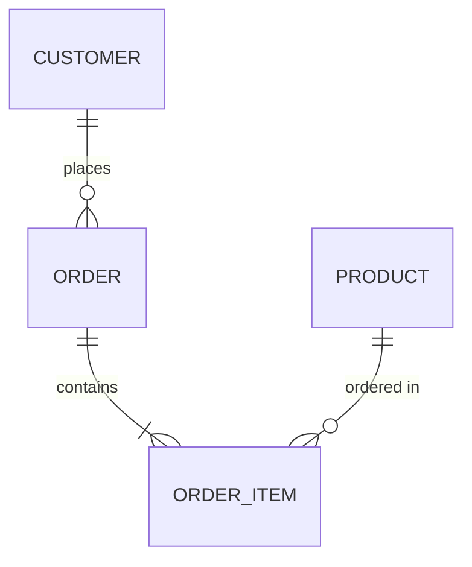
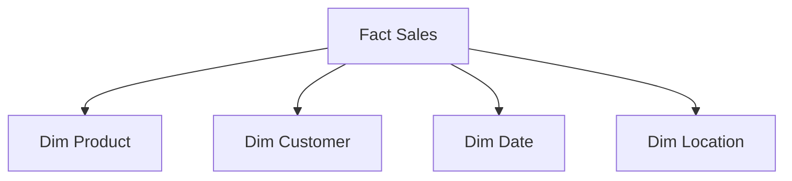

# Data Modeling Patterns

## Table of Contents
- [Introduction](#introduction)
- [Modeling Techniques](#modeling-techniques)
- [Schema Patterns](#schema-patterns)
- [Implementation Strategies](#implementation-strategies)
- [Common Use Cases](#common-use-cases)
- [Interview Tips](#interview-tips)

## Introduction

Data modeling is the process of creating a conceptual representation of data objects, their relationships, and the rules governing them.

### Key Concepts
1. **Data Structure Design**
2. **Relationship Mapping**
3. **Normalization Rules**
4. **Performance Optimization**
5. **Scalability Planning**

## Modeling Techniques

### 1. Conceptual Modeling


### 2. Logical Modeling
```sql
CREATE TABLE customers (
    customer_id SERIAL PRIMARY KEY,
    name VARCHAR(100),
    email VARCHAR(255) UNIQUE,
    created_at TIMESTAMP DEFAULT CURRENT_TIMESTAMP
);

CREATE TABLE orders (
    order_id SERIAL PRIMARY KEY,
    customer_id INTEGER REFERENCES customers(customer_id),
    order_date TIMESTAMP,
    status VARCHAR(50)
);
```

### 3. Physical Modeling
```sql
-- Partitioning Example
CREATE TABLE orders (
    order_id BIGINT,
    order_date DATE,
    customer_id INTEGER,
    amount DECIMAL(10,2)
) PARTITION BY RANGE (order_date);

CREATE TABLE orders_2023 PARTITION OF orders
    FOR VALUES FROM ('2023-01-01') TO ('2024-01-01');
```

## Schema Patterns

### 1. Star Schema


### 2. Snowflake Schema
```python
class DimensionHierarchy:
    def create_hierarchy(self):
        """Create snowflake schema hierarchy"""
        execute_sql("""
            CREATE TABLE dim_location (
                location_id SERIAL PRIMARY KEY,
                city_id INTEGER REFERENCES dim_city(city_id)
            );
            
            CREATE TABLE dim_city (
                city_id SERIAL PRIMARY KEY,
                state_id INTEGER REFERENCES dim_state(state_id)
            );
            
            CREATE TABLE dim_state (
                state_id SERIAL PRIMARY KEY,
                country_id INTEGER REFERENCES dim_country(country_id)
            );
        """)
```

### 3. Data Vault
```python
def create_data_vault():
    """Create data vault structure"""
    # Create Hub
    create_hub_table('HUB_CUSTOMER', 'CUSTOMER_ID')
    
    # Create Satellite
    create_satellite_table('SAT_CUSTOMER', 'CUSTOMER_ID', [
        'name', 'email', 'address'
    ])
    
    # Create Link
    create_link_table('LINK_CUSTOMER_ORDER', [
        'CUSTOMER_ID', 'ORDER_ID'
    ])
```

## Implementation Strategies

### 1. Normalization Example
```python
class DataNormalizer:
    def normalize_to_3nf(self, data):
        """Normalize data to Third Normal Form"""
        # First Normal Form
        data = self.remove_repeating_groups(data)
        
        # Second Normal Form
        data = self.remove_partial_dependencies(data)
        
        # Third Normal Form
        data = self.remove_transitive_dependencies(data)
        
        return data
```

### 2. Denormalization Strategy
```sql
-- Denormalized Table for Reporting
CREATE TABLE report_sales AS
SELECT 
    s.sale_id,
    s.sale_date,
    c.customer_name,
    c.customer_region,
    p.product_name,
    p.category,
    s.quantity,
    s.amount
FROM sales s
JOIN customers c ON s.customer_id = c.customer_id
JOIN products p ON s.product_id = p.product_id;
```

## Common Use Cases

### 1. E-commerce Schema
```sql
-- Product Catalog
CREATE TABLE products (
    product_id SERIAL PRIMARY KEY,
    sku VARCHAR(50) UNIQUE,
    name VARCHAR(255),
    description TEXT,
    price DECIMAL(10,2),
    category_id INTEGER REFERENCES categories(category_id),
    created_at TIMESTAMP DEFAULT CURRENT_TIMESTAMP
);

-- Order Management
CREATE TABLE orders (
    order_id SERIAL PRIMARY KEY,
    customer_id INTEGER REFERENCES customers(customer_id),
    status VARCHAR(50),
    total_amount DECIMAL(10,2),
    created_at TIMESTAMP DEFAULT CURRENT_TIMESTAMP
);
```

### 2. Event Tracking
```sql
-- Event Tracking Schema
CREATE TABLE events (
    event_id SERIAL PRIMARY KEY,
    user_id INTEGER,
    event_type VARCHAR(50),
    event_data JSONB,
    created_at TIMESTAMP DEFAULT CURRENT_TIMESTAMP
) PARTITION BY RANGE (created_at);

-- Event Aggregation
CREATE MATERIALIZED VIEW daily_events AS
SELECT 
    date_trunc('day', created_at) as event_date,
    event_type,
    COUNT(*) as event_count
FROM events
GROUP BY 1, 2;
```

## Interview Tips

### 1. Key Considerations
- Data access patterns
- Query performance
- Scalability requirements
- Data consistency needs
- Maintenance overhead

### 2. Common Questions
1. How do you choose between normalization levels?
2. When should you denormalize data?
3. How do you handle schema evolution?
4. What are the trade-offs of different modeling patterns?

### 3. Best Practices
- Start with business requirements
- Consider query patterns
- Plan for growth
- Document decisions
- Test with realistic data volumes

## Further Reading
- [Data Modeling Guide](https://www.kimballgroup.com/data-warehouse-business-intelligence-resources/books/data-warehouse-dw-toolkit/)
- [Schema Design Patterns](https://docs.aws.amazon.com/redshift/latest/dg/c_designing-tables-best-practices.html)
- [Data Vault Modeling](https://www.data-vault.co.uk/what-is-data-vault/)

