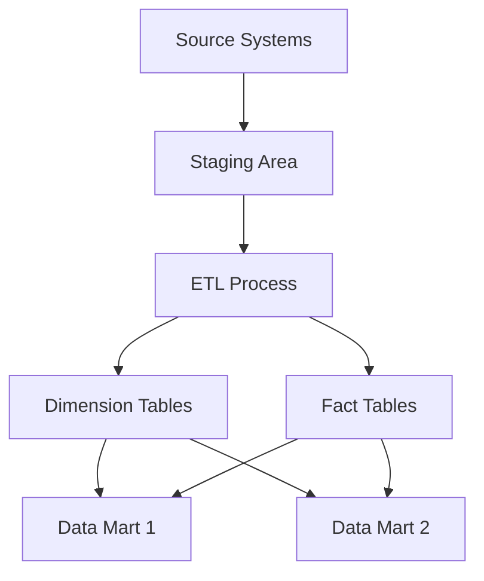
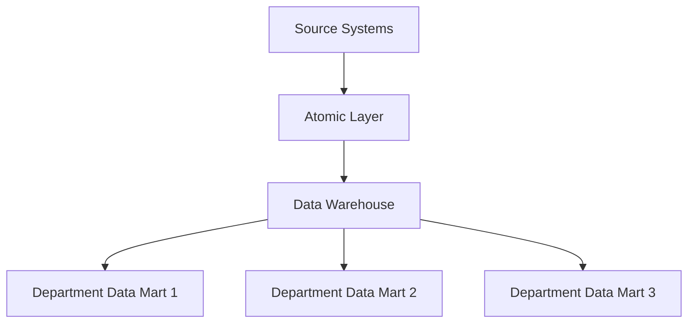
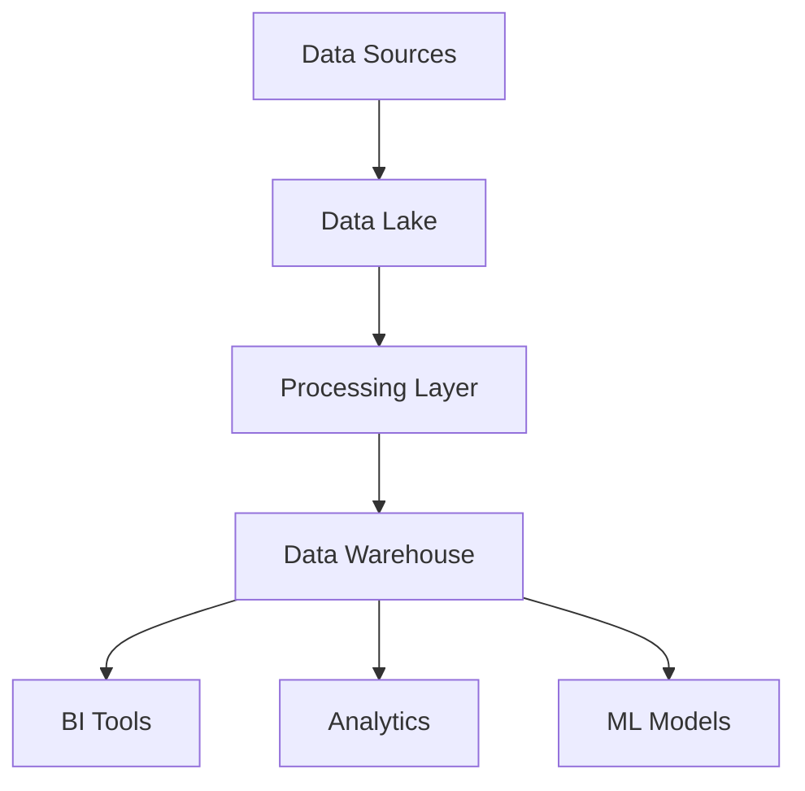

# Data Warehousing in System Design 📌

## Table of Contents

- [Introduction to Data Warehousing](#introduction-to-data-warehousing)
- [Prerequisites & Related Topics](#prerequisites--related-topics)
- [Pattern Recognition Guide](#pattern-recognition-guide)
- [Architecture Patterns](#architecture-patterns)
- [Design Considerations](#design-considerations)
- [Implementation Strategies](#implementation-strategies)
- [Common Use Cases](#common-use-cases)
- [Trade-offs](#trade-offs)
- [Edge Cases to Consider](#edge-cases-to-consider)
- [Common Pitfalls](#common-pitfalls)
- [FAQ](#faq)
- [Interview Tips](#interview-tips)
- [Advanced Topics](#advanced-topics)
- [Further Reading](#further-reading)

## Introduction to Data Warehousing

A data warehouse is a centralized repository that stores structured data from multiple sources for reporting and analysis.

### Benefits
1. **Centralized Analytics**
2. **Historical Data Analysis**
3. **Data Quality Control**
4. **Business Intelligence**
5. **Performance Optimization**

## Prerequisites & Related Topics

- Builds on: [Data Modeling](data-modeling.md), ETL concepts
- Used in: [OLAP vs OLTP](olap-vs-oltp.md), [ETL vs ELT](etl-vs-elt.md), [Real-Time Analytics](real-time-analytics.md)
- Techniques often combined: dimensional modeling, partitioning, materialized views, SCD Type 2
- See also: Data Lakes — raw storage feeding the warehouse

## Pattern Recognition Guide

### 🎯 When to Use Data Warehousing

**Keywords in requirements**: "analytics", "BI", "reporting", "star schema", "aggregations", "historical analysis", "single source of truth"
**Reach for this when**:
- Cross-domain reporting that operational databases cannot serve
- Historical trend analysis over years of data
- Feeding BI dashboards without touching production OLTP
- Data products and metrics layers for the company

### 🔑 Approach Indicators

| Approach | Signals | Best For |
|----------|---------|----------|
| Star schema | fast dimensional joins | most BI workloads |
| Snowflake schema | normalized dimensions | very large dimensions |
| Wide denormalized tables | simplest consumption | self-serve analytics |
| ELT transformations | compute where data lives | modern warehouses |

### ❌ When NOT to Use

- Operational reads with point-lookup latency — that is OLTP
- Raw capture without curation — that is the lake's job
- Real-time sub-second serving — streaming/OLAP engines fit better

## Architecture Patterns

### 1. Kimball's Dimensional Modeling

### 2. Inmon's Corporate Information Factory

### 3. Modern Data Warehouse

## Design Considerations

### 1. Schema Design
- **Star Schema**
  - Simple and fast queries
  - Denormalized dimensions
  - Central fact table

- **Snowflake Schema**
  - Normalized dimensions
  - Better data integrity
  - More complex queries

### 2. Performance Optimization
- Partitioning strategies
- Indexing techniques
- Query optimization
- Materialized views

### 3. Data Loading
- Batch processing
- Real-time streaming
- Incremental updates
- Change data capture

## Implementation Strategies

### 1. ETL Pipeline Example
**How it works — warehouse ETL:** extract incrementally from each source (timestamp watermark or CDC log, never full dumps), land raw copies in a staging schema, apply business rules (dedupe, conform dimensions, type-cast), then load into star-schema fact and dimension tables inside one transaction so no report ever sees a half-loaded day.

### 2. Dimension Table Management
Dimensions change slowly, so warehouses use SCD (slowly changing dimension) handling: **Type 1** overwrites the old value (current state only), **Type 2** inserts a new row with valid-from/valid-to dates so history stays queryable ("what region was this customer in last quarter?"). Interviews care most about Type 2 — it's the default answer when historical accuracy matters.

## Common Use Cases

### 1. Sales Analytics
The star schema is built for exactly this: a fact table of transactions joins to date, product, store, and customer dimensions with single-key joins, so "revenue by region by month" is one scan of the fact table plus small dimension lookups. Columnar storage makes it fast — queries touch only the few columns referenced, not whole rows.

### 2. Customer Analysis
Segmentation queries (RFM-style: recency, frequency, monetary) aggregate each customer's full transaction history, then bucket the results — a pattern that reads like a two-stage pipeline: build per-customer aggregates in a temp/CTE stage, then classify. On large warehouses this is where partitioning by date and clustering by customer pays off, since each customer's history lands in few blocks.

## Trade-offs

| Choice | Pros | Cons | Best For |
|--------|------|------|----------|
| Star schema | Fast joins, BI-friendly | Requires stable grain design | Reporting and dashboards |
| Snowflake schema | Less redundancy, easier maintenance | More joins, slower queries | Large, complex dimensions |
| Data vault | Auditability, agile loading | Complexity, more joins | Regulated, evolving sources |
| Denormalized wide tables | Simplest queries | Redundancy, update anomalies | Serving layers, caches |

**Normalized vs dimensional:** Normalized warehouses save storage and ease loading; dimensional models sacrifice redundancy for query speed — warehouses almost always choose query speed.

**Freshness vs cost:** Near-real-time loads raise infrastructure and pipeline complexity; nightly batches are cheap and predictable.

**Precompute vs compute-on-read:** Materialized aggregates accelerate dashboards but must be maintained; on-the-fly aggregation stays flexible.

> **⚠️ When NOT to build a dimensional warehouse:** pre-product startups (a well-organized lakehouse may suffice), and operational lookups that belong in OLTP stores — warehouses answer analytical questions, not row-level reads.

## Edge Cases to Consider

- Late-arriving facts after dimension updates — enforce date-effective joins
- Backfills reprocessing history — idempotent, partition-scoped loads
- Skewed dimension members (one huge customer) — band or salt
- Costly full-table scans — partition + cluster + materialize

## Common Pitfalls

1. Loading straight from OLTP primaries — extract from replicas/CDC
2. No grain definition on fact tables — double counting follows
3. Dashboards querying raw layers instead of curated marts
4. Ignoring warehouse cost metrics until the bill lands

## FAQ

**Q1: Warehouse vs data lake?**

A: Lakes keep raw, cheap, schema-on-read copies; warehouses hold modeled, query-optimized truth. Modern lakehouses blur the line — the modeling still matters.

**Q2: Why a star schema?**

A: Analysts slice and dice by dimensions; stars make those joins predictable and fast, and the grain rules keep every metric counted exactly once.

**Q3: How fresh can a warehouse be?**

A: Classically daily/hourly; CDC plus incremental models push to minutes. Sub-second is a streaming/OLAP problem, not a warehouse one.

## Interview Tips

### 1. Key Considerations
- Data volume and scalability
- Query performance
- Data freshness requirements
- Cost optimization
- Compliance and security

### 2. Common Questions
1. How would you design a data warehouse for a retail company?
2. What are the trade-offs between different schema designs?
3. How do you handle slowly changing dimensions?
4. How would you optimize query performance?

### 3. Best Practices
- Start with business requirements
- Plan for scalability
- Implement data quality checks
- Document assumptions and decisions
- Consider maintenance and operations

## Advanced Topics

1. Incremental models (dbt-style) with merge/upsert semantics
2. Lakehouse table formats (Iceberg/Delta) unifying lake and warehouse
3. Data mesh domain marts with central contracts
4. Workload isolation via virtual warehouses/queues

## Further Reading
- [Kimball's Data Warehouse Toolkit](https://www.kimballgroup.com/data-warehouse-business-intelligence-resources/books/data-warehouse-dw-toolkit/)
- [Modern Data Warehouse Architecture](https://docs.microsoft.com/en-us/azure/architecture/solution-ideas/articles/modern-data-warehouse)
- [Data Warehouse Design Best Practices](https://cloud.google.com/architecture/dw-design-best-practices)

