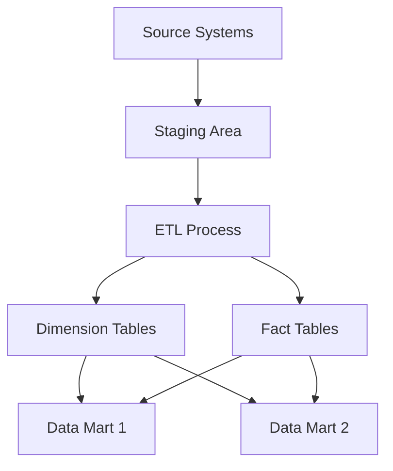
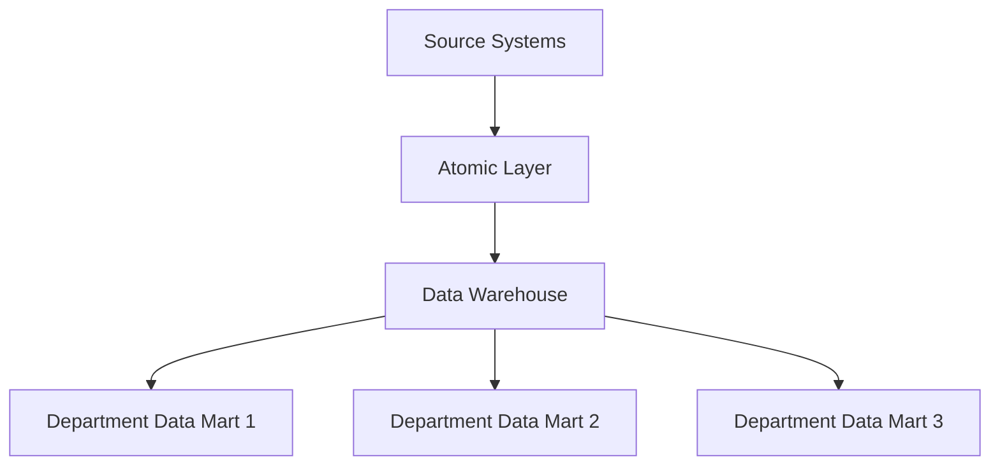
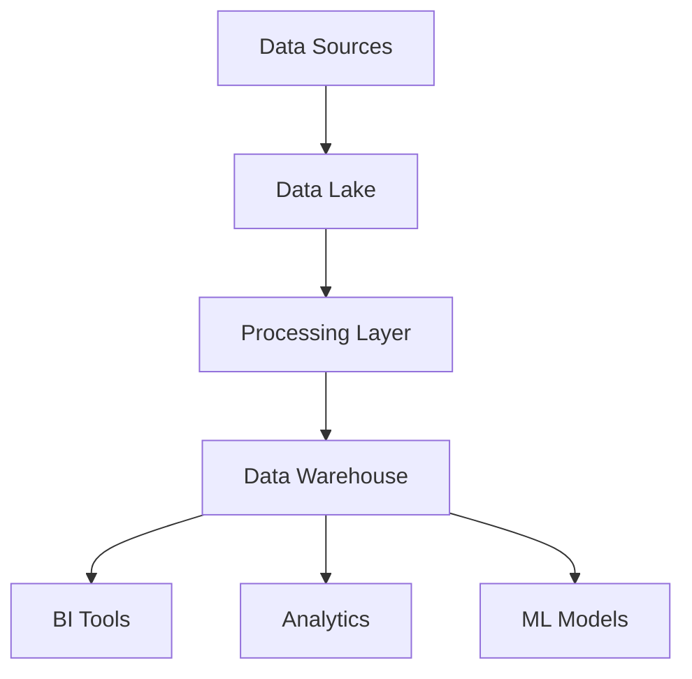

# Data Warehousing

## Table of Contents
- [Introduction to Data Warehousing](#introduction-to-data-warehousing)
- [Architecture Patterns](#architecture-patterns)
- [Design Considerations](#design-considerations)
- [Implementation Strategies](#implementation-strategies)
- [Common Use Cases](#common-use-cases)
- [Interview Tips](#interview-tips)

## Introduction to Data Warehousing

A data warehouse is a centralized repository that stores structured data from multiple sources for reporting and analysis.

### Benefits
1. **Centralized Analytics**
2. **Historical Data Analysis**
3. **Data Quality Control**
4. **Business Intelligence**
5. **Performance Optimization**

## Architecture Patterns

### 1. Kimball's Dimensional Modeling


### 2. Inmon's Corporate Information Factory


### 3. Modern Data Warehouse


## Design Considerations

### 1. Schema Design
- **Star Schema**
  - Simple and fast queries
  - Denormalized dimensions
  - Central fact table

- **Snowflake Schema**
  - Normalized dimensions
  - Better data integrity
  - More complex queries

### 2. Performance Optimization
- Partitioning strategies
- Indexing techniques
- Query optimization
- Materialized views

### 3. Data Loading
- Batch processing
- Real-time streaming
- Incremental updates
- Change data capture

## Implementation Strategies

### 1. ETL Pipeline Example
```python
def extract_data(source):
    """Extract data from source system"""
    return pd.read_sql("SELECT * FROM source_table", source_conn)

def transform_data(df):
    """Apply transformations"""
    # Clean data
    df = df.dropna()
    # Apply business rules
    df['total'] = df['quantity'] * df['price']
    return df

def load_data(df, target):
    """Load data into warehouse"""
    df.to_sql("fact_sales", target_conn, if_exists='append')
```

### 2. Dimension Table Management
```sql
-- Slowly Changing Dimension Type 2
INSERT INTO dim_customer (
    customer_id,
    name,
    address,
    valid_from,
    valid_to,
    is_current
)
SELECT 
    customer_id,
    name,
    new_address,
    CURRENT_TIMESTAMP,
    NULL,
    TRUE
FROM staging_customers
WHERE customer_id NOT IN (
    SELECT customer_id 
    FROM dim_customer 
    WHERE is_current = TRUE
);
```

## Common Use Cases

### 1. Sales Analytics
```sql
SELECT 
    d.product_category,
    d.region,
    SUM(f.sales_amount) as total_sales,
    COUNT(DISTINCT f.customer_id) as unique_customers
FROM fact_sales f
JOIN dim_product d ON f.product_id = d.product_id
GROUP BY d.product_category, d.region
HAVING total_sales > 1000000;
```

### 2. Customer Analysis
```sql
WITH customer_segments AS (
    SELECT 
        customer_id,
        SUM(purchase_amount) as total_spent,
        COUNT(*) as frequency,
        MAX(purchase_date) as last_purchase
    FROM fact_purchases
    GROUP BY customer_id
)
SELECT 
    CASE 
        WHEN total_spent > 10000 THEN 'High Value'
        WHEN total_spent > 5000 THEN 'Medium Value'
        ELSE 'Low Value'
    END as customer_segment,
    COUNT(*) as segment_size,
    AVG(total_spent) as avg_spent
FROM customer_segments
GROUP BY customer_segment;
```

## Interview Tips

### 1. Key Considerations
- Data volume and scalability
- Query performance
- Data freshness requirements
- Cost optimization
- Compliance and security

### 2. Common Questions
1. How would you design a data warehouse for a retail company?
2. What are the trade-offs between different schema designs?
3. How do you handle slowly changing dimensions?
4. How would you optimize query performance?

### 3. Best Practices
- Start with business requirements
- Plan for scalability
- Implement data quality checks
- Document assumptions and decisions
- Consider maintenance and operations

## Further Reading
- [Kimball's Data Warehouse Toolkit](https://www.kimballgroup.com/data-warehouse-business-intelligence-resources/books/data-warehouse-dw-toolkit/)
- [Modern Data Warehouse Architecture](https://docs.microsoft.com/en-us/azure/architecture/solution-ideas/articles/modern-data-warehouse)
- [Data Warehouse Design Best Practices](https://cloud.google.com/architecture/dw-design-best-practices)

