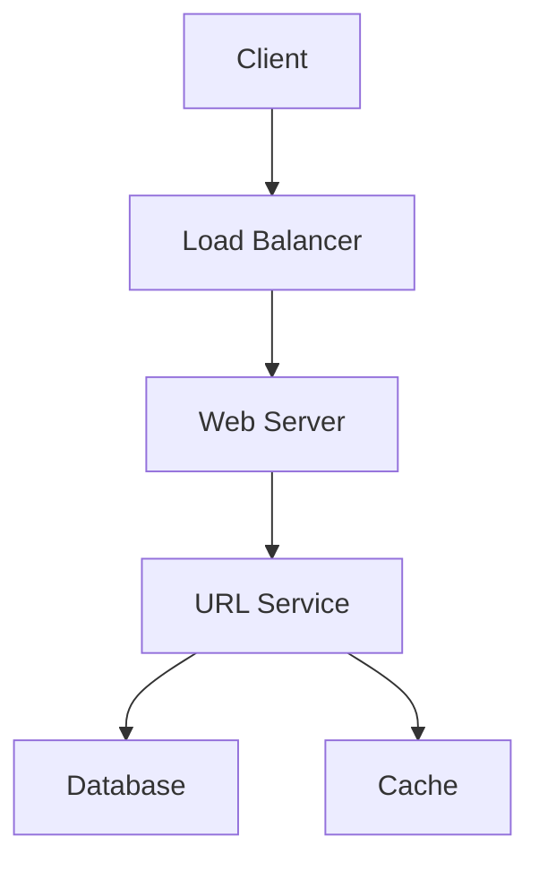
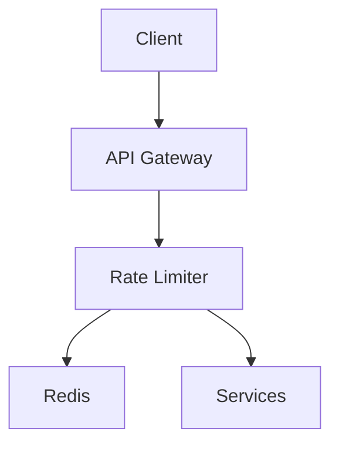
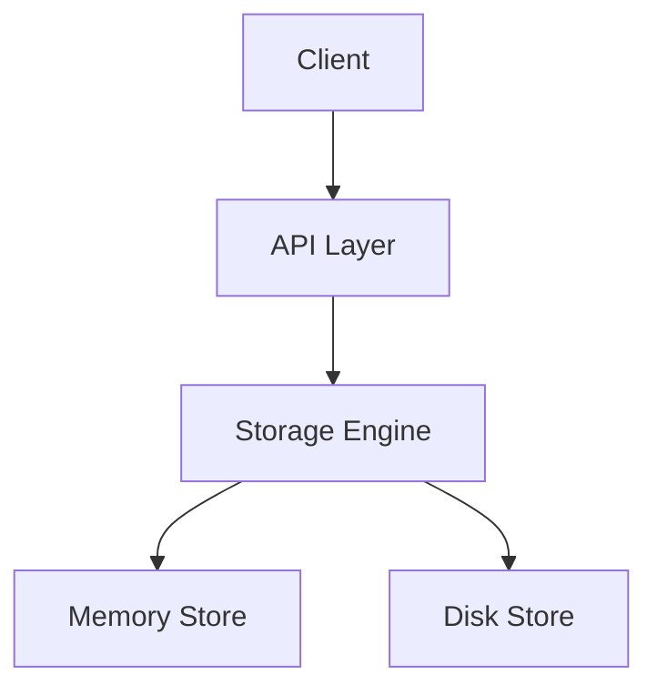
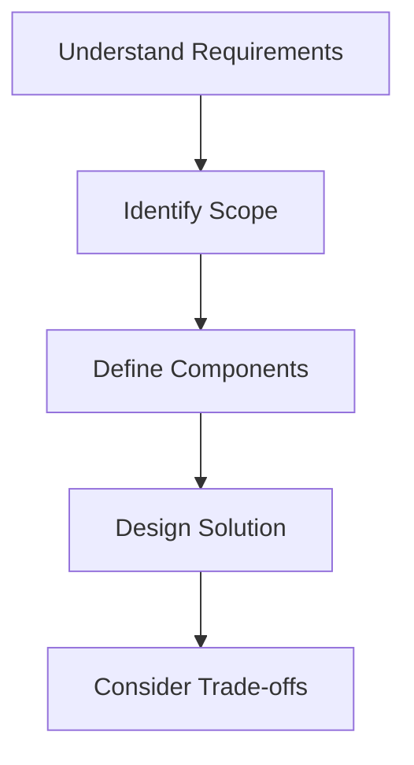

# Easy System Design Questions

## Table of Contents
- [Introduction](#introduction)
- [Question Types](#question-types)
- [Common Questions](#common-questions)
- [Solution Strategies](#solution-strategies)
- [Best Practices](#best-practices)
- [Interview Tips](#interview-tips)

## Introduction

Easy system design questions typically focus on basic components and simple architectures. They help assess fundamental understanding of distributed systems concepts.

### Key Focus Areas
1. **Basic Architecture**
2. **Core Components**
3. **Simple Scalability**
4. **Basic Data Flow**

## Question Types

### 1. URL Shortener
Design a URL shortening service like bit.ly

#### Requirements
- Shorten long URLs to short aliases
- Redirect users to original URL
- Optional custom aliases
- Analytics (optional)

#### Solution Approach


#### Key Components
1. **URL Generation Service**
```python
class URLShortener:
    def __init__(self):
        self.base62 = "0123456789abcdefghijklmnopqrstuvwxyzABCDEFGHIJKLMNOPQRSTUVWXYZ"
    
    def encode(self, num):
        """Encode number to base62."""
        if num == 0:
            return self.base62[0]
        
        arr = []
        base = len(self.base62)
        while num:
            num, rem = divmod(num, base)
            arr.append(self.base62[rem])
        arr.reverse()
        return ''.join(arr)
    
    def create_short_url(self, url):
        """Create short URL."""
        # Store URL in database
        url_id = self.store_url(url)
        
        # Generate short code
        short_code = self.encode(url_id)
        
        return f"http://short.url/{short_code}"
```

2. **Database Schema**
```sql
CREATE TABLE urls (
    id BIGSERIAL PRIMARY KEY,
    original_url TEXT NOT NULL,
    short_code VARCHAR(10) UNIQUE NOT NULL,
    created_at TIMESTAMP DEFAULT CURRENT_TIMESTAMP,
    expires_at TIMESTAMP,
    user_id INTEGER REFERENCES users(id)
);

CREATE INDEX idx_short_code ON urls(short_code);
```

### 2. Rate Limiter
Design a rate limiter for an API

#### Requirements
- Limit requests per user/IP
- Different rate limits for different endpoints
- Handle distributed system

#### Solution Approach


#### Key Components
1. **Token Bucket Implementation**
```python
class TokenBucket:
    def __init__(self, capacity, refill_rate):
        self.capacity = capacity
        self.tokens = capacity
        self.refill_rate = refill_rate
        self.last_refill = time.time()
    
    def consume(self, tokens=1):
        """Consume tokens from bucket."""
        self.refill()
        
        if self.tokens >= tokens:
            self.tokens -= tokens
            return True
        return False
    
    def refill(self):
        """Refill tokens based on elapsed time."""
        now = time.time()
        elapsed = now - self.last_refill
        new_tokens = elapsed * self.refill_rate
        
        self.tokens = min(
            self.capacity,
            self.tokens + new_tokens
        )
        self.last_refill = now
```

### 3. Key-Value Store
Design a simple key-value store

#### Requirements
- Get/Set operations
- TTL support
- Basic persistence
- Memory efficiency

#### Solution Approach


#### Key Components
1. **Storage Engine**
```python
class KeyValueStore:
    def __init__(self):
        self.store = {}
        self.cleanup_thread = Thread(
            target=self.cleanup_expired
        )
    
    def set(self, key, value, ttl=None):
        """Set key with optional TTL."""
        expires_at = None
        if ttl:
            expires_at = time.time() + ttl
        
        self.store[key] = {
            'value': value,
            'expires_at': expires_at
        }
    
    def get(self, key):
        """Get value for key."""
        if key not in self.store:
            return None
        
        entry = self.store[key]
        if self.is_expired(entry):
            del self.store[key]
            return None
        
        return entry['value']
    
    def is_expired(self, entry):
        """Check if entry is expired."""
        if not entry['expires_at']:
            return False
        return time.time() > entry['expires_at']
```

## Solution Strategies

### 1. Requirements Analysis
```python
class RequirementsAnalyzer:
    def analyze_requirements(self):
        """Analyze system requirements."""
        functional_reqs = [
            "Core functionality",
            "Basic operations",
            "Data persistence"
        ]
        
        non_functional_reqs = [
            "Performance",
            "Reliability",
            "Scalability"
        ]
        
        constraints = [
            "Time constraints",
            "Resource limitations",
            "Technology stack"
        ]
        
        return {
            'functional': functional_reqs,
            'non_functional': non_functional_reqs,
            'constraints': constraints
        }
```

### 2. Component Design
```python
class ComponentDesigner:
    def design_components(self, requirements):
        """Design system components."""
        components = []
        
        # Add required components
        if 'data_storage' in requirements:
            components.append(self.design_storage())
        
        if 'api' in requirements:
            components.append(self.design_api())
        
        if 'caching' in requirements:
            components.append(self.design_cache())
        
        return components
```

### 3. API Design
```python
class APIDesigner:
    def design_api(self):
        """Design API endpoints."""
        return {
            'endpoints': [
                {
                    'path': '/api/v1/resource',
                    'method': 'GET',
                    'params': ['id', 'filter'],
                    'response': {
                        'type': 'object',
                        'properties': {
                            'id': 'string',
                            'data': 'object'
                        }
                    }
                }
            ],
            'authentication': {
                'type': 'bearer',
                'headers': ['Authorization']
            },
            'rate_limiting': {
                'rate': '100/minute'
            }
        }
```

## Best Practices

### 1. Start Simple
- Begin with basic requirements
- Add complexity gradually
- Focus on core functionality
- Consider future scalability

### 2. Clear Communication
- Explain design decisions
- Ask clarifying questions
- Draw clear diagrams
- Use proper terminology

### 3. Time Management
- Spend 5 minutes on requirements
- 15 minutes on high-level design
- 10 minutes on detailed design
- 5 minutes for follow-up questions

## Interview Tips

### 1. Question Analysis


### 2. Common Mistakes to Avoid
1. **Over-engineering**
   - Adding unnecessary complexity
   - Using unfamiliar technologies
   - Implementing optional features first

2. **Poor Communication**
   - Not asking clarifying questions
   - Not explaining design decisions
   - Unclear diagrams

3. **Time Management**
   - Spending too long on one aspect
   - Not leaving time for questions
   - Rushing through important details

### 3. Success Strategies
1. **Preparation**
   - Review basic concepts
   - Practice drawing diagrams
   - Study common patterns

2. **During Interview**
   - Listen carefully
   - Take brief notes
   - Explain your thinking

3. **Follow-up**
   - Ask for feedback
   - Discuss alternatives
   - Show enthusiasm

## Further Reading
- [System Design Primer](https://github.com/donnemartin/system-design-primer)
- [Grokking System Design](https://www.educative.io/courses/grokking-the-system-design-interview)
- [Design Patterns](https://refactoring.guru/design-patterns)
- [Clean Architecture](https://blog.cleancoder.com/uncle-bob/2012/08/13/the-clean-architecture.html) 