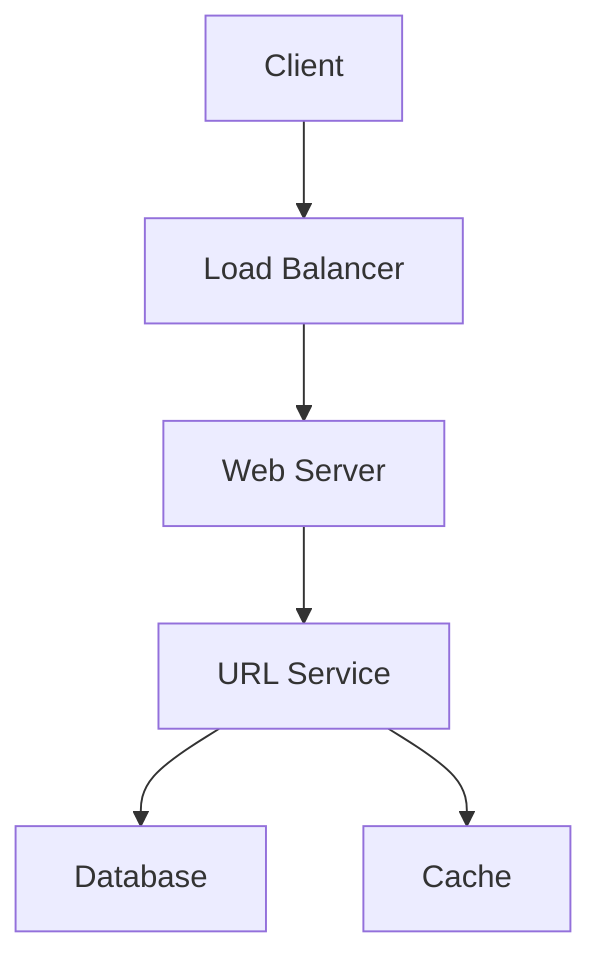
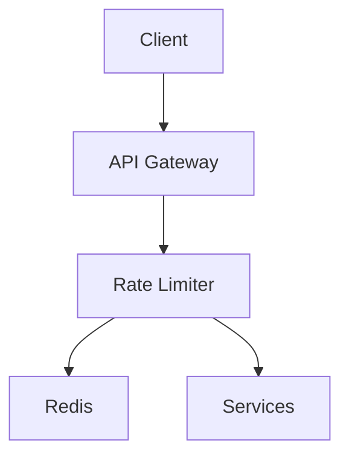
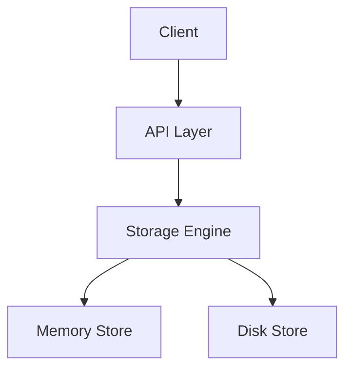
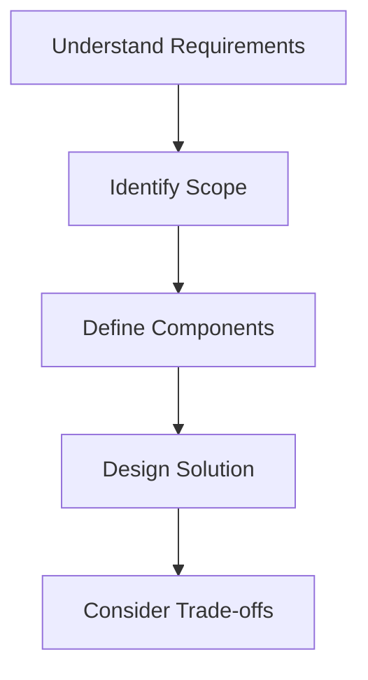

# Easy System Design Questions

## Table of Contents
- [Introduction](#introduction)
- [Question Types](#question-types)
- [Common Questions](#common-questions)
- [Solution Strategies](#solution-strategies)
- [Best Practices](#best-practices)
- [Interview Tips](#interview-tips)

## Introduction

Easy system design questions typically focus on basic components and simple architectures. They help assess fundamental understanding of distributed systems concepts.

### Key Focus Areas
1. **Basic Architecture**
2. **Core Components**
3. **Simple Scalability**
4. **Basic Data Flow**

## Question Types

### 1. URL Shortener
Design a URL shortening service like bit.ly

#### Requirements
- Shorten long URLs to short aliases
- Redirect users to original URL
- Optional custom aliases
- Analytics (optional)

#### Solution Approach

#### Key Components
1. **URL Generation Service**

**How it works — Short code generation:** each new URL gets a monotonically increasing ID from the database; encode that ID in base62 (digits + lower + upper case) to produce the short code. ID 1 → `1`, ID 62 → `10`, ID 3844 → `100`. Seven base62 characters give 62⁷ ≈ 3.5 trillion codes — far more than any realistic workload.

**Worked example:** store the long URL → row gets ID 1,000,000 → encode as `4C92` → serve `https://short.url/4C92`. Redirects are a single lookup of the short code, ideally served from cache.

2. **Database Schema**

**`urls` table:**

| Column | Type | Purpose |
|--------|------|---------|
| `id` | BIGINT, primary key | monotonic ID, also the base62 source |
| `original_url` | TEXT | the destination |
| `short_code` | VARCHAR(10), unique | the lookup key for redirects |
| `created_at` | TIMESTAMP | audit trail |
| `expires_at` | TIMESTAMP, nullable | optional TTL for cleanup |

The redirect path only ever queries by `short_code` — that single unique index is what matters. Say so in the interview.

### 2. Rate Limiter
Design a rate limiter for an API

#### Requirements
- Limit requests per user/IP
- Different rate limits for different endpoints
- Handle distributed system

#### Solution Approach

#### Key Components
1. **Token Bucket Algorithm**

**How it works — Token bucket:** the bucket holds up to `capacity` tokens and refills at `refill_rate` tokens per second. Each request consumes one token: allowed if the bucket is non-empty, rejected (HTTP 429) otherwise. Bursts are absorbed up to the bucket size, then traffic settles to the refill rate. Key knobs: `capacity` (maximum burst) and `refill_rate` (sustained throughput).

**Worked example:** capacity 100, refill 10/sec — a client can fire 100 requests instantly, then averages 10/sec; after going idle for 10 seconds the bucket is full again.

### 3. Key-Value Store
Design a simple key-value store

#### Requirements
- Get/Set operations
- TTL support
- Basic persistence
- Memory efficiency

#### Solution Approach

#### Key Components
1. **Storage Engine**

**How it works — Key value store:** a hash map gives O(1) `get`/`set`. Entries carry an optional `expires_at`; reads that find an expired entry delete it and return nothing, while a background sweeper reclaims memory from keys nobody reads again. Durability comes from an append-only log replayed on restart — describe that sequence, not the data structure internals.

**Interview framing:** this is Redis in miniature — in-memory hash map + TTL + persistence. Name the real-world analogue and the interviewer will steer you to what they care about (eviction, replication, sharding).

## Solution Strategies

### 1. Requirements Analysis

Work through three buckets out loud:

- **Functional** — the core operations the system must support (shorten + redirect, get/set, publish/subscribe)
- **Non-functional** — latency targets, availability, consistency, scale
- **Constraints** — time budget, team size, existing tech stack

State each assumption explicitly; interviewers grade the assumptions as much as the design.

### 2. Component Design

Choose components driven by the requirements, not by habit:

- Data must persist? → database (pick the access pattern first)
- Read-heavy with hot keys? → cache in front of the database
- Public interface? → API layer with authentication and rate limiting
- Spiky or slow work? → queue that decouples producers from consumers

Sketch each component as a box with its inputs and outputs; arrows are the data flow you will be quizzed on.

### 3. API Design

Define the surface before the internals:

- **Endpoints** — resource-oriented paths with their methods (`GET /resource/{id}`, params, filters)
- **Response shape** — the fields clients depend on, plus typed error responses
- **Authentication** — bearer tokens in the `Authorization` header
- **Rate limiting** — per-client limits with `429` and `Retry-After` on breach

A small, consistent API table beats a large ad-hoc one in interviews.

## Best Practices

### 1. Start Simple
- Begin with basic requirements
- Add complexity gradually
- Focus on core functionality
- Consider future scalability

### 2. Clear Communication
- Explain design decisions
- Ask clarifying questions
- Draw clear diagrams
- Use proper terminology

### 3. Time Management
- Spend 5 minutes on requirements
- 15 minutes on high-level design
- 10 minutes on detailed design
- 5 minutes for follow-up questions

## Interview Tips

### 1. Question Analysis

### 2. Common Mistakes to Avoid
1. **Over-engineering**
   - Adding unnecessary complexity
   - Using unfamiliar technologies
   - Implementing optional features first

2. **Poor Communication**
   - Not asking clarifying questions
   - Not explaining design decisions
   - Unclear diagrams

3. **Time Management**
   - Spending too long on one aspect
   - Not leaving time for questions
   - Rushing through important details

### 3. Success Strategies
1. **Preparation**
   - Review basic concepts
   - Practice drawing diagrams
   - Study common patterns

2. **During Interview**
   - Listen carefully
   - Take brief notes
   - Explain your thinking

3. **Follow-up**
   - Ask for feedback
   - Discuss alternatives
   - Show enthusiasm

## Further Reading
- [System Design Primer](https://github.com/donnemartin/system-design-primer)
- [Grokking System Design](https://www.educative.io/courses/grokking-the-system-design-interview)
- [Design Patterns](https://refactoring.guru/design-patterns)
- [Clean Architecture](https://blog.cleancoder.com/uncle-bob/2012/08/13/the-clean-architecture.html) 