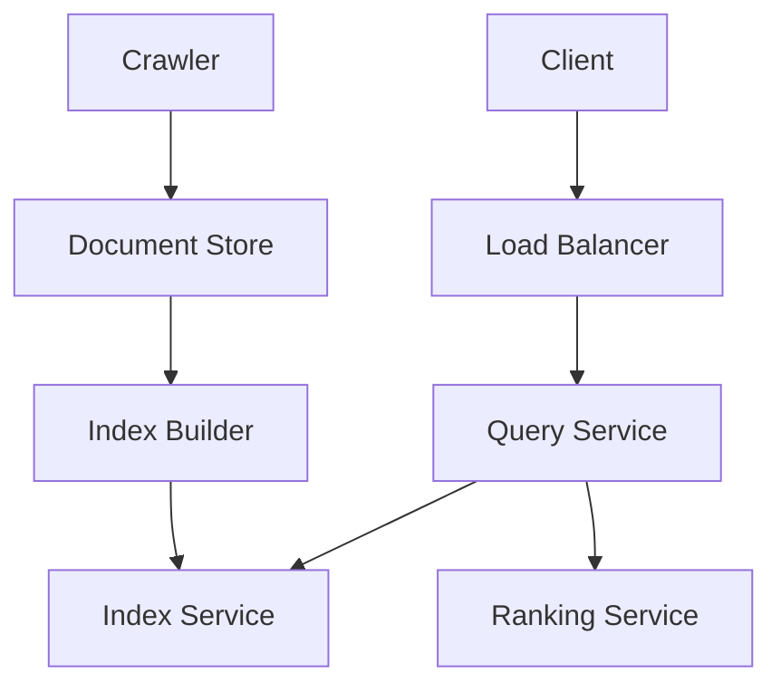
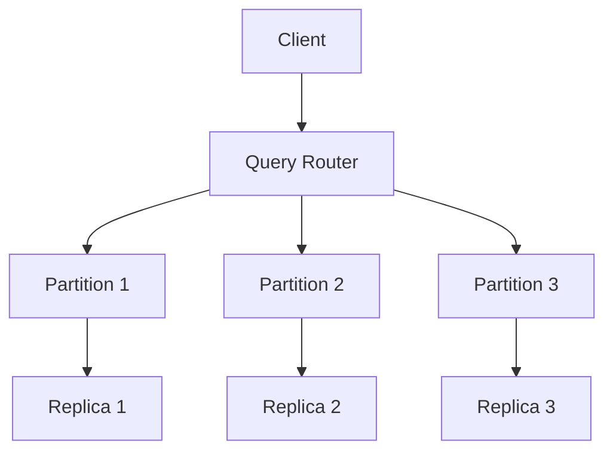
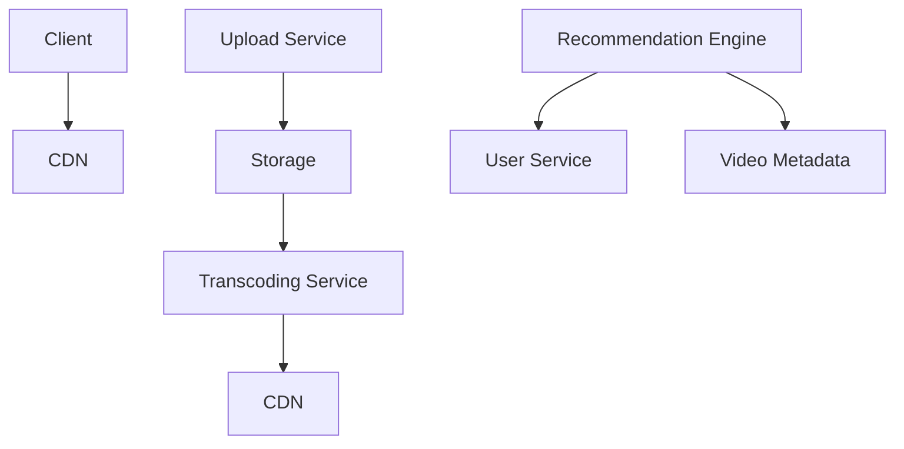
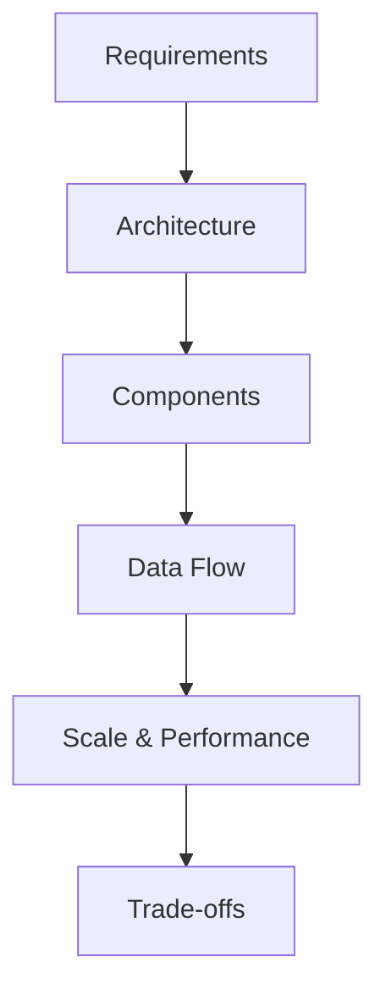

# Hard System Design Questions

<div align="center">
  
</div>

## Table of Contents
- [Introduction](#introduction)
- [Question Types](#question-types)
- [Common Questions](#common-questions)
- [Solution Strategies](#solution-strategies)
- [Best Practices](#best-practices)
- [Interview Tips](#interview-tips)

## Introduction

Hard system design questions test your ability to design large-scale distributed systems with complex requirements. They focus on scalability, reliability, and performance at scale.

### Key Focus Areas
1. **Large Scale Systems**
2. **Complex Requirements**
3. **Performance at Scale**
4. **Global Distribution**

## Question Types

### 1. Search Engine
Design a search engine like Google

#### Requirements
- Web crawling
- Index building
- Search ranking
- Query processing
- Real-time updates

#### Solution Approach


#### Key Components
1. **Web Crawler**
```python
class WebCrawler:
    def __init__(self):
        self.url_queue = asyncio.Queue()
        self.seen_urls = BloomFilter()
        self.robots_cache = {}
    
    async def crawl(self, start_urls):
        """Start crawling process."""
        # Add initial URLs
        for url in start_urls:
            await self.url_queue.put(url)
        
        # Start crawler workers
        workers = [
            asyncio.create_task(self.crawler_worker())
            for _ in range(self.num_workers)
        ]
        
        await asyncio.gather(*workers)
    
    async def crawler_worker(self):
        """Crawler worker process."""
        while True:
            url = await self.url_queue.get()
            
            try:
                # Check robots.txt
                if not await self.check_robots(url):
                    continue
                
                # Fetch and parse page
                content = await self.fetch_page(url)
                parsed = await self.parse_page(content)
                
                # Store document
                await self.store_document(url, parsed)
                
                # Extract and queue new URLs
                new_urls = self.extract_urls(parsed)
                await self.queue_urls(new_urls)
                
            except Exception as e:
                logger.error(f"Crawl error: {e}")
            
            finally:
                self.url_queue.task_done()
```

2. **Search Index**
```python
class SearchIndex:
    def __init__(self):
        self.index = defaultdict(list)
        self.document_store = DocumentStore()
    
    async def build_index(self, documents):
        """Build search index."""
        for doc in documents:
            # Extract terms
            terms = self.extract_terms(doc.content)
            
            # Calculate term frequencies
            term_freq = self.calculate_term_freq(terms)
            
            # Update index
            for term, freq in term_freq.items():
                self.index[term].append({
                    'doc_id': doc.id,
                    'frequency': freq,
                    'position': self.get_positions(term, doc)
                })
    
    async def search(self, query):
        """Search index for query."""
        # Parse query
        terms = self.parse_query(query)
        
        # Get matching documents
        doc_scores = defaultdict(float)
        
        for term in terms:
            postings = self.index.get(term, [])
            idf = self.calculate_idf(term)
            
            for posting in postings:
                score = self.calculate_score(
                    posting,
                    idf,
                    query
                )
                doc_scores[posting['doc_id']] += score
        
        # Sort by score
        return sorted(
            doc_scores.items(),
            key=lambda x: x[1],
            reverse=True
        )
```

### 2. Distributed Database
Design a distributed database system

#### Requirements
- Data partitioning
- Replication
- Consistency
- Transaction support
- Fault tolerance

#### Solution Approach


#### Key Components
1. **Distributed Transaction Manager**
```python
class TransactionManager:
    def __init__(self):
        self.transactions = {}
        self.locks = LockManager()
    
    async def begin_transaction(self):
        """Start new transaction."""
        txn_id = str(uuid.uuid4())
        self.transactions[txn_id] = {
            'status': 'active',
            'operations': [],
            'locks': set()
        }
        return txn_id
    
    async def commit(self, txn_id):
        """Commit transaction."""
        txn = self.transactions[txn_id]
        
        try:
            # Prepare phase
            prepared = await self.prepare_transaction(txn)
            if not prepared:
                await self.rollback(txn_id)
                return False
            
            # Commit phase
            await self.commit_transaction(txn)
            
            # Cleanup
            await self.cleanup_transaction(txn)
            
            return True
            
        except Exception as e:
            await self.rollback(txn_id)
            raise TransactionError(str(e))
```

2. **Consensus Manager**
```python
class ConsensusManager:
    def __init__(self):
        self.nodes = []
        self.leader = None
        self.term = 0
    
    async def propose_value(self, value):
        """Propose value to cluster."""
        if not self.is_leader():
            raise NotLeaderError()
        
        # Create proposal
        proposal = {
            'term': self.term,
            'value': value,
            'leader': self.leader
        }
        
        # Get quorum
        responses = await self.request_votes(proposal)
        if not self.has_quorum(responses):
            raise QuorumError()
        
        # Commit value
        await self.commit_value(proposal)
        
        return True
    
    async def request_votes(self, proposal):
        """Request votes from nodes."""
        futures = [
            node.vote(proposal)
            for node in self.nodes
            if node != self.leader
        ]
        
        return await asyncio.gather(
            *futures,
            return_exceptions=True
        )
```

### 3. Video Streaming Platform
Design a video streaming platform like YouTube

#### Requirements
- Video upload/processing
- Content delivery
- Recommendation system
- Analytics
- Monetization

#### Solution Approach


#### Key Components
1. **Video Processing Pipeline**
```python
class VideoProcessor:
    def __init__(self):
        self.storage = StorageService()
        self.transcoder = TranscodingService()
        self.cdn = CDNService()
    
    async def process_video(self, video_id, file_path):
        """Process uploaded video."""
        try:
            # Store original
            original_url = await self.storage.store(
                video_id,
                file_path
            )
            
            # Create transcoding jobs
            jobs = await self.create_transcode_jobs(
                video_id,
                original_url
            )
            
            # Wait for transcoding
            results = await self.wait_for_transcoding(jobs)
            
            # Upload to CDN
            cdn_urls = await self.upload_to_cdn(
                video_id,
                results
            )
            
            return cdn_urls
            
        except Exception as e:
            await self.handle_processing_error(
                video_id,
                e
            )
```

2. **Recommendation Engine**
```python
class RecommendationEngine:
    def __init__(self):
        self.user_model = UserModel()
        self.content_model = ContentModel()
        self.ranking = RankingModel()
    
    async def get_recommendations(self, user_id):
        """Get video recommendations."""
        # Get user features
        user_features = await self.user_model.get_features(
            user_id
        )
        
        # Get candidate videos
        candidates = await self.get_candidates(user_id)
        
        # Score candidates
        scored_videos = []
        for video in candidates:
            score = await self.score_video(
                video,
                user_features
            )
            scored_videos.append((video, score))
        
        # Rank and diversify
        recommendations = self.ranking.rank_videos(
            scored_videos
        )
        
        return recommendations
    
    async def score_video(self, video, user_features):
        """Score video for user."""
        # Get video features
        video_features = await self.content_model.get_features(
            video.id
        )
        
        # Calculate relevance score
        relevance = self.calculate_relevance(
            user_features,
            video_features
        )
        
        # Get engagement signals
        engagement = await self.get_engagement_signals(
            video.id
        )
        
        # Calculate final score
        return self.combine_scores(
            relevance,
            engagement
        )
```

## Solution Strategies

### 1. System Architecture
```python
class SystemArchitect:
    def design_system(self, requirements):
        """Design large-scale system."""
        architecture = {
            'frontend': self.design_frontend(),
            'backend': self.design_backend(),
            'storage': self.design_storage(),
            'processing': self.design_processing(),
            'delivery': self.design_delivery()
        }
        
        # Add specialized components
        if 'ml' in requirements:
            architecture['ml'] = self.design_ml_system()
        
        if 'analytics' in requirements:
            architecture['analytics'] = self.design_analytics()
        
        return architecture
```

### 2. Scalability Design
```python
class ScalabilityDesigner:
    def design_scalability(self, components):
        """Design system scalability."""
        strategies = {
            'data_partitioning': {
                'strategy': 'consistent_hashing',
                'replication_factor': 3
            },
            'load_balancing': {
                'strategy': 'consistent_hashing',
                'health_checking': True
            },
            'caching': {
                'strategy': 'multilevel_cache',
                'layers': ['client', 'cdn', 'application']
            }
        }
        
        return strategies
```

### 3. Performance Optimization
```python
class PerformanceOptimizer:
    def optimize_system(self, components):
        """Design performance optimizations."""
        optimizations = {
            'caching': self.design_caching(),
            'indexing': self.design_indexing(),
            'queuing': self.design_queuing(),
            'batching': self.design_batching()
        }
        
        # Add monitoring
        optimizations['monitoring'] = {
            'metrics': self.define_metrics(),
            'alerts': self.define_alerts(),
            'dashboards': self.define_dashboards()
        }
        
        return optimizations
```

## Best Practices

### 1. System Design
- Start with requirements
- Design for scale
- Plan for failure
- Consider trade-offs

### 2. Data Management
- Choose right storage
- Plan partitioning
- Handle consistency
- Design for recovery

### 3. Performance
- Design for latency
- Optimize critical paths
- Monitor bottlenecks
- Plan capacity

## Interview Tips

### 1. Design Process


### 2. Common Mistakes to Avoid
1. **Design Issues**
   - Overlooking scalability
   - Ignoring edge cases
   - Poor data modeling

2. **Communication Issues**
   - Not explaining trade-offs
   - Skipping important details
   - Poor time management

### 3. Success Strategies
1. **Preparation**
   - Study distributed systems
   - Practice system design
   - Review real-world systems

2. **During Interview**
   - Start with requirements
   - Draw clear diagrams
   - Discuss trade-offs

3. **Follow-up**
   - Address edge cases
   - Discuss alternatives
   - Consider improvements

## Further Reading
- [Designing Data-Intensive Applications](https://dataintensive.net/)
- [System Design Interview](https://www.amazon.com/System-Design-Interview-insiders-Second/dp/B08CMF2CQF)
- [Distributed Systems](https://www.distributed-systems.net/index.php/books/ds3/)
- [High Scalability Blog](http://highscalability.com/) 