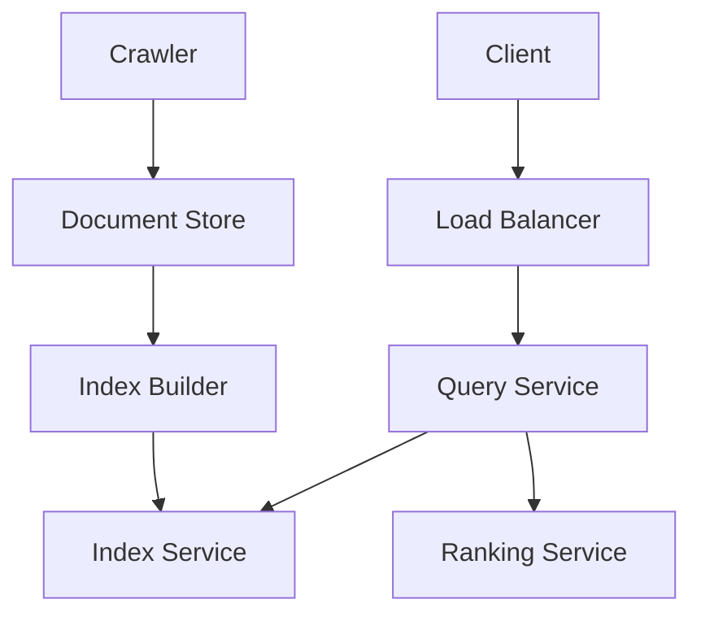
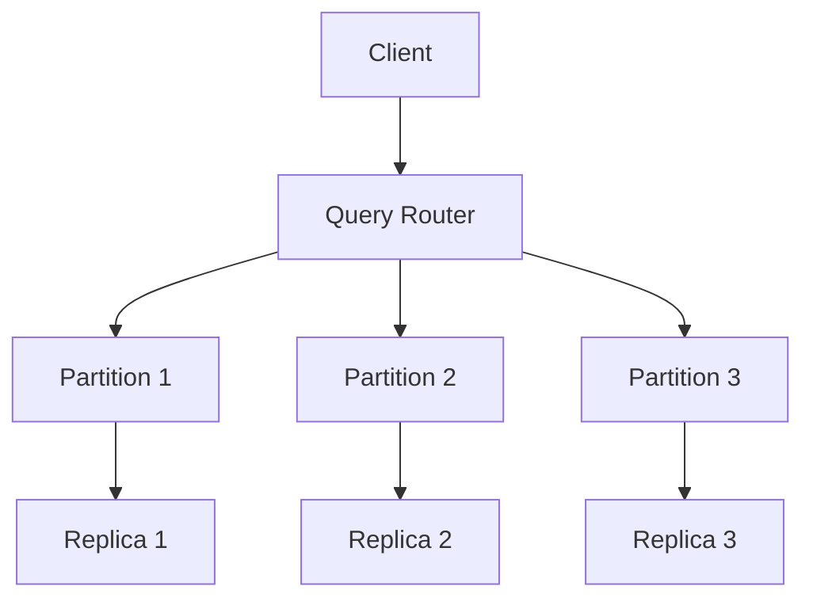
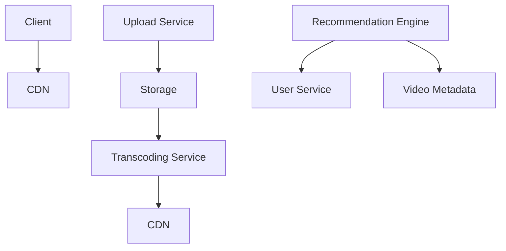
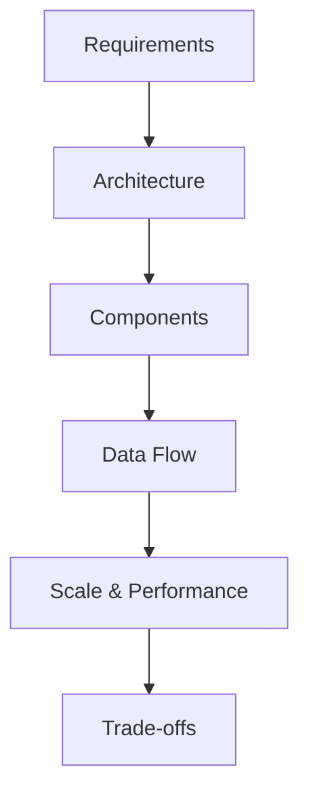

# Hard System Design Questions

## Table of Contents
- [Introduction](#introduction)
- [Question Types](#question-types)
- [Common Questions](#common-questions)
- [Solution Strategies](#solution-strategies)
- [Best Practices](#best-practices)
- [Interview Tips](#interview-tips)

## Introduction

Hard system design questions test your ability to design large-scale distributed systems with complex requirements. They focus on scalability, reliability, and performance at scale.

### Key Focus Areas
1. **Large Scale Systems**
2. **Complex Requirements**
3. **Performance at Scale**
4. **Global Distribution**

## Question Types

### 1. Search Engine
Design a search engine like Google

#### Requirements
- Web crawling
- Index building
- Search ranking
- Query processing
- Real-time updates

#### Solution Approach

#### Key Components
1. **Web Crawler**

**How it works — Crawl loop:** a distributed URL frontier (queue) feeds worker pools. Each worker: check politeness rules (robots.txt, per-domain rate limits) → fetch → parse and extract links → filter through a deduplication set (a Bloom filter: ~10 bits/URL at 1% false-positive rate, so 100B seen URLs ≈ 125 GB) → push new URLs back to the frontier. Failures re-enqueue with backoff.

**Back-of-envelope:** 10B pages at ~100 KB average ≈ 1 PB of raw content; a 4-week refresh cycle means ~400 pages/sec sustained fetch rate — that drives the worker fleet size and storage layering (hot index in memory/SSD, cold content in object storage).

2. **Search Index**

**How it works — Inverted index:** documents are tokenized into terms; the index maps each term → sorted posting list of (doc ID, term frequency, positions). A query parses into terms, intersects/merges the posting lists, and ranks surviving documents by TF-IDF-style scoring (rare terms are worth more; term frequency boosts; position data enables phrase queries).

**Worked example:** query "distributed systems" → intersect the `distributed` and `systems` posting lists → score matches by combined term weight and proximity → return the top-k by score. Index is sharded across machines (by doc ID), queries fan out to all shards, and a coordinator merges top-k results.

### 2. Distributed Database
Design a distributed database system

#### Requirements
- Data partitioning
- Replication
- Consistency
- Transaction support
- Fault tolerance

#### Solution Approach

#### Key Components
1. **Distributed Transaction Manager**

**How it works — Two phase commit:** the coordinator collects participating partitions, then runs **prepare** (each participant locks the affected rows and votes yes/no — durable, but not yet visible) followed by **commit** (all yes votes → write the commit record and release locks; any no or timeout → rollback everywhere). The commit point is the instant every participant has agreed to commit.

**Trade-off to state:** 2PC blocks if the coordinator dies mid-prepare — participants hold locks until recovery. Discuss the alternatives: asynchronous compensation (sagas) when you can invert operations, or single-shard transactions when the schema allows routing a transaction to one partition.

2. **Consensus Manager**

**How it works — Raft style consensus:** all writes route to the leader for the current term. The leader appends the proposal to its log and requests votes (AppendEntries) from followers; once a majority acknowledges, the entry is committed and applied. Leaders heart-beat periodically; missed heartbeats trigger an election with randomized timeouts to avoid split votes.

**Why majority matters:** with N nodes you tolerate ⌊(N−1)/2⌋ failures — a 5-node cluster survives 2. State the read-options trade-off: linearizable reads go through the leader/quorum, stale-but-fast reads go to any follower.

### 3. Video Streaming Platform
Design a video streaming platform like YouTube

#### Requirements
- Video upload/processing
- Content delivery
- Recommendation system
- Analytics
- Monetization

#### Solution Approach

#### Key Components
1. **Video Processing Pipeline**

**How it works — Upload to playback:** upload lands in object storage → the storage event enqueues transcoding jobs → a worker fleet encodes the original into a bitrate ladder (e.g., 1080p/720p/480p/240p), splitting each rendition into small segments → renditions publish to the CDN → metadata (title, duration, thumbnail, availability) writes to the metadata store only after all renditions succeed.

**Back-of-envelope:** 500 hours uploaded/minute ≈ 8 videos/sec; a 10-minute video transcodes into ~6 renditions, so the fleet must sustain ~50 concurrent encode jobs per upload rate — sized from video duration distribution, not guesswork. Failures retry with the job queue; unprocessable videos dead-letter after N attempts.

2. **Recommendation Engine**

**How it works — Two stage retrieval:** stage 1 (candidate generation) cheaply narrows millions of videos to a few hundred using user features (watch history, subscriptions) and candidate sources (trending, similar-to-watched); stage 2 (ranking) scores those candidates with an expensive model blending predicted watch probability, engagement, and freshness, then diversifies the final list.

**Interview framing:** the system-design content is the architecture around the models — feature stores, offline batch training vs online serving, A/B testing hooks, and keeping recommendation latency under ~200 ms by precomputing candidate pools. You are not asked to derive the model itself.

## Solution Strategies

### 1. System Architecture

Anchor every hard-question architecture in five planes, then justify additions:

| Plane | Components |
|-------|-----------|
| Ingress | CDN, API gateway, load balancers |
| Stateless services | the business logic, horizontally scalable |
| State / storage | primary store, cache tier, object storage, search index |
| Async processing | queues, workers, batch pipelines |
| Cross-cutting | config, service discovery, observability |

Add specialized subsystems (ML serving, analytics, real-time stream processing) only when a requirement names them — and say why.

### 2. Scalability Design

The hard questions expect a scaling story per layer:

- **Data partitioning** — consistent hashing with a replication factor of 3; call out hot-partition handling
- **Load balancing** — L4 for connection scale, L7 for content-aware routing, health-checked
- **Caching** — multilevel: client → CDN → application cache → database buffers; state the invalidation strategy for each layer
- **Backpressure** — queues absorb spikes; drop or degrade gracefully past a saturation point instead of collapsing

### 3. Performance Optimization

Pull optimizations from a standard checklist, each with the symptom it fixes:

- **Latency** — cache hot paths, parallelize fan-out calls, move work async
- **Throughput** — batch writes, connection pooling, index the real access patterns
- **Tail latency (p99)** — hedged requests, timeouts + retries with jitter, isolate noisy neighbors (bulkheads)
- **Feedback loop** — metrics for the paths above, alerts on SLO burn rate, dashboards that show user-facing latency rather than machine stats

Name the metric you optimize and the target — "p99 under 200 ms" beats "make it fast".

## Best Practices

### 1. System Design
- Start with requirements
- Design for scale
- Plan for failure
- Consider trade-offs

### 2. Data Management
- Choose right storage
- Plan partitioning
- Handle consistency
- Design for recovery

### 3. Performance
- Design for latency
- Optimize critical paths
- Monitor bottlenecks
- Plan capacity

## Interview Tips

### 1. Design Process

### 2. Common Mistakes to Avoid
1. **Design Issues**
   - Overlooking scalability
   - Ignoring edge cases
   - Poor data modeling

2. **Communication Issues**
   - Not explaining trade-offs
   - Skipping important details
   - Poor time management

### 3. Success Strategies
1. **Preparation**
   - Study distributed systems
   - Practice system design
   - Review real-world systems

2. **During Interview**
   - Start with requirements
   - Draw clear diagrams
   - Discuss trade-offs

3. **Follow-up**
   - Address edge cases
   - Discuss alternatives
   - Consider improvements

## Further Reading
- [Designing Data-Intensive Applications](https://dataintensive.net/)
- [System Design Interview](https://www.amazon.com/System-Design-Interview-insiders-Second/dp/B08CMF2CQF)
- [Distributed Systems](https://www.distributed-systems.net/index.php/books/ds3/)
- [High Scalability Blog](http://highscalability.com/) 