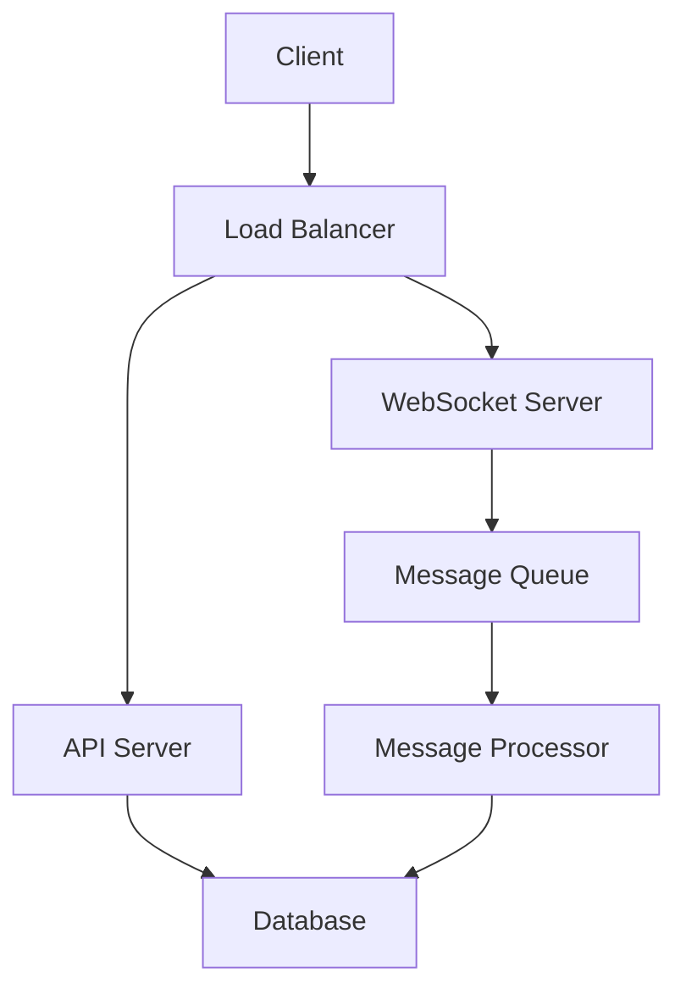
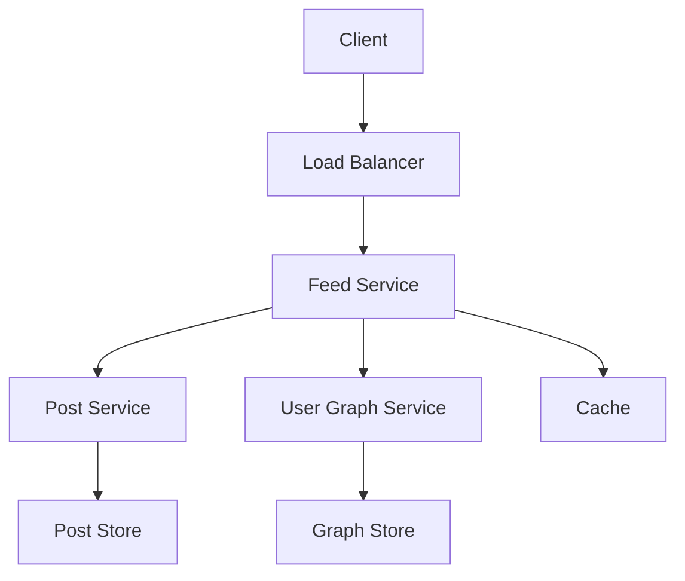
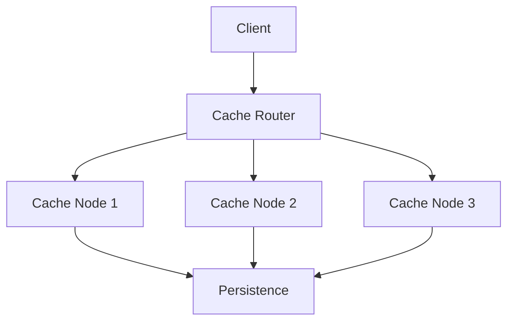
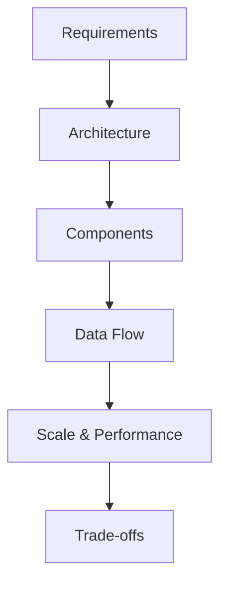

# Medium System Design Questions

## Table of Contents
- [Introduction](#introduction)
- [Question Types](#question-types)
- [Common Questions](#common-questions)
- [Solution Strategies](#solution-strategies)
- [Best Practices](#best-practices)
- [Interview Tips](#interview-tips)

## Introduction

Medium difficulty system design questions focus on scalable architectures and distributed systems concepts. They test understanding of complex interactions between components and trade-offs in design decisions.

### Key Focus Areas
1. **Scalable Architecture**
2. **Distributed Systems**
3. **Data Consistency**
4. **Performance Optimization**

## Question Types

### 1. Chat System
Design a real-time chat system like WhatsApp

#### Requirements
- One-on-one messaging
- Group chats
- Online/offline status
- Message persistence
- Real-time delivery

#### Solution Approach


#### Key Components
1. **WebSocket Handler**
```python
class WebSocketHandler:
    def __init__(self):
        self.connections = {}
        self.message_queue = MessageQueue()
    
    async def handle_connection(self, user_id, websocket):
        """Handle new WebSocket connection."""
        self.connections[user_id] = websocket
        
        try:
            while True:
                message = await websocket.receive_json()
                await self.handle_message(user_id, message)
        except Exception as e:
            await self.handle_disconnect(user_id)
    
    async def handle_message(self, sender_id, message):
        """Handle incoming message."""
        # Store message
        stored_message = await self.store_message(message)
        
        # Get recipient connection
        recipient_socket = self.connections.get(
            message['recipient_id']
        )
        
        if recipient_socket:
            # Send directly if online
            await recipient_socket.send_json(stored_message)
        else:
            # Queue for offline delivery
            await self.message_queue.enqueue(stored_message)
```

2. **Message Store**
```python
class MessageStore:
    def __init__(self):
        self.db = Database()
    
    async def store_message(self, message):
        """Store message in database."""
        message_data = {
            'id': str(uuid.uuid4()),
            'sender_id': message['sender_id'],
            'recipient_id': message['recipient_id'],
            'content': message['content'],
            'timestamp': datetime.utcnow(),
            'status': 'sent'
        }
        
        # Store in database
        await self.db.messages.insert_one(message_data)
        
        # Update conversation
        await self.update_conversation(message_data)
        
        return message_data
    
    async def get_conversation(self, user1_id, user2_id):
        """Get conversation history."""
        return await self.db.messages.find({
            '$or': [
                {
                    'sender_id': user1_id,
                    'recipient_id': user2_id
                },
                {
                    'sender_id': user2_id,
                    'recipient_id': user1_id
                }
            ]
        }).sort('timestamp', -1).limit(50)
```

### 2. News Feed System
Design a news feed system like Facebook

#### Requirements
- Post creation and retrieval
- Feed generation
- Content ranking
- Real-time updates

#### Solution Approach


#### Key Components
1. **Feed Generator**
```python
class FeedGenerator:
    def __init__(self):
        self.post_service = PostService()
        self.user_graph = UserGraphService()
        self.ranking = ContentRanking()
    
    async def generate_feed(self, user_id):
        """Generate user's news feed."""
        # Get user's connections
        connections = await self.user_graph.get_connections(
            user_id
        )
        
        # Get recent posts
        posts = await self.get_recent_posts(connections)
        
        # Rank posts
        ranked_posts = self.ranking.rank_posts(
            posts,
            user_id
        )
        
        return ranked_posts
    
    async def get_recent_posts(self, user_ids):
        """Get recent posts from connections."""
        tasks = [
            self.post_service.get_user_posts(user_id)
            for user_id in user_ids
        ]
        
        posts = await asyncio.gather(*tasks)
        return self.merge_posts(posts)
```

2. **Content Ranking**
```python
class ContentRanking:
    def rank_posts(self, posts, user_id):
        """Rank posts for user's feed."""
        scored_posts = []
        
        for post in posts:
            score = self.calculate_score(post, user_id)
            scored_posts.append((post, score))
        
        # Sort by score
        scored_posts.sort(key=lambda x: x[1], reverse=True)
        
        return [post for post, _ in scored_posts]
    
    def calculate_score(self, post, user_id):
        """Calculate post score."""
        # Factors to consider
        time_decay = self.get_time_decay(post['timestamp'])
        relevance = self.get_relevance(post, user_id)
        engagement = self.get_engagement_score(post)
        
        return (
            0.4 * time_decay +
            0.4 * relevance +
            0.2 * engagement
        )
```

### 3. Distributed Cache
Design a distributed caching system

#### Requirements
- Get/Set operations
- Cache invalidation
- Consistency
- Scalability
- Fault tolerance

#### Solution Approach


#### Key Components
1. **Cache Router**
```python
class CacheRouter:
    def __init__(self):
        self.nodes = []
        self.hash_ring = ConsistentHashRing()
    
    async def set(self, key, value, ttl=None):
        """Set value in cache."""
        # Get responsible node
        node = self.hash_ring.get_node(key)
        
        try:
            # Set value in node
            await node.set(key, value, ttl)
            
            # Replicate to backup nodes
            await self.replicate(key, value, ttl)
            
        except NodeError:
            # Handle node failure
            await self.handle_node_failure(node)
            
            # Retry with new node
            node = self.hash_ring.get_node(key)
            await node.set(key, value, ttl)
    
    async def get(self, key):
        """Get value from cache."""
        # Try primary node
        node = self.hash_ring.get_node(key)
        try:
            return await node.get(key)
        except NodeError:
            # Try backup nodes
            return await self.get_from_backup(key)
```

2. **Cache Node**
```python
class CacheNode:
    def __init__(self):
        self.store = {}
        self.locks = {}
    
    async def set(self, key, value, ttl=None):
        """Set value with optional TTL."""
        async with self.get_lock(key):
            self.store[key] = {
                'value': value,
                'expires_at': time.time() + ttl if ttl else None
            }
    
    async def get(self, key):
        """Get value for key."""
        entry = self.store.get(key)
        if not entry:
            return None
        
        # Check expiration
        if self.is_expired(entry):
            await self.delete(key)
            return None
        
        return entry['value']
    
    def is_expired(self, entry):
        """Check if entry is expired."""
        if not entry['expires_at']:
            return False
        return time.time() > entry['expires_at']
```

## Solution Strategies

### 1. System Components
```python
class SystemDesigner:
    def design_system(self, requirements):
        """Design system components."""
        components = {
            'frontend': self.design_frontend(),
            'backend': self.design_backend(),
            'database': self.design_database(),
            'cache': self.design_cache(),
            'queue': self.design_queue()
        }
        
        # Add optional components
        if 'realtime' in requirements:
            components['websocket'] = self.design_websocket()
        
        if 'analytics' in requirements:
            components['analytics'] = self.design_analytics()
        
        return components
```

### 2. Data Flow Design
```python
class DataFlowDesigner:
    def design_data_flow(self, components):
        """Design system data flow."""
        flows = []
        
        # Add data flows
        flows.extend(self.design_read_flow(components))
        flows.extend(self.design_write_flow(components))
        
        if 'realtime' in components:
            flows.extend(
                self.design_realtime_flow(components)
            )
        
        return flows
```

### 3. Scalability Planning
```python
class ScalabilityPlanner:
    def plan_scalability(self, components):
        """Plan system scalability."""
        plans = {
            'horizontal_scaling': {
                'strategy': 'add_nodes',
                'triggers': ['cpu_usage > 70%', 'memory_usage > 80%']
            },
            'data_partitioning': {
                'strategy': 'hash_based',
                'key': 'user_id'
            },
            'caching': {
                'strategy': 'distributed_cache',
                'policy': 'lru'
            }
        }
        
        return plans
```

## Best Practices

### 1. Component Design
- Use microservices architecture
- Implement proper separation
- Design for failure
- Consider monitoring

### 2. Data Management
- Choose appropriate storage
- Plan for data growth
- Implement caching
- Handle consistency

### 3. Performance
- Optimize critical paths
- Use appropriate indexes
- Implement caching
- Monitor bottlenecks

## Interview Tips

### 1. Design Process


### 2. Common Mistakes to Avoid
1. **Design Issues**
   - Overlooking scalability
   - Ignoring failure scenarios
   - Poor data modeling

2. **Communication Issues**
   - Not explaining trade-offs
   - Skipping important details
   - Poor time management

### 3. Success Strategies
1. **Preparation**
   - Study distributed systems
   - Practice common patterns
   - Review real-world systems

2. **During Interview**
   - Start with requirements
   - Draw clear diagrams
   - Discuss trade-offs

3. **Follow-up**
   - Address edge cases
   - Discuss alternatives
   - Consider improvements

## Further Reading
- [Designing Data-Intensive Applications](https://dataintensive.net/)
- [System Design Interview](https://www.amazon.com/System-Design-Interview-insiders-Second/dp/B08CMF2CQF)
- [Distributed Systems](https://www.distributed-systems.net/index.php/books/ds3/)
- [Architecture Patterns](https://www.martinfowler.com/architecture/) 