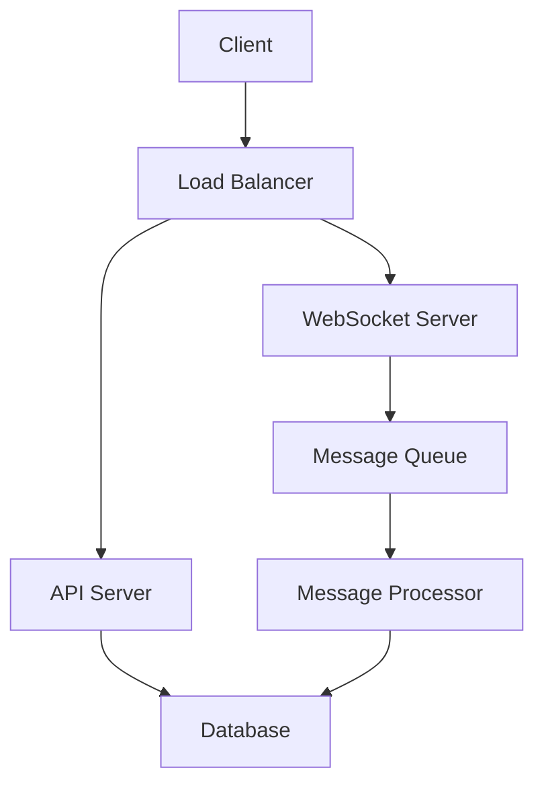
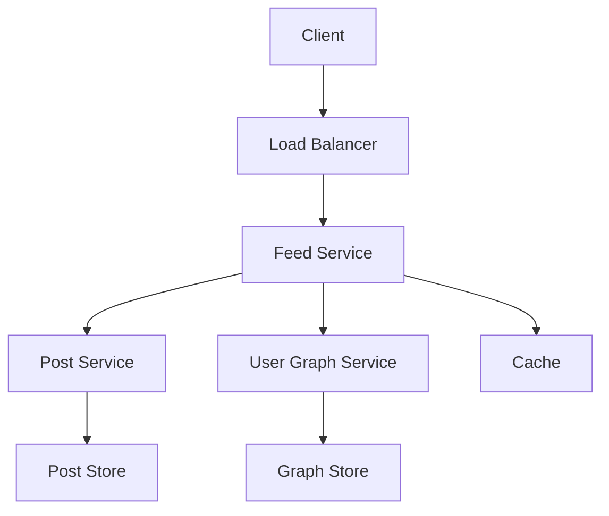
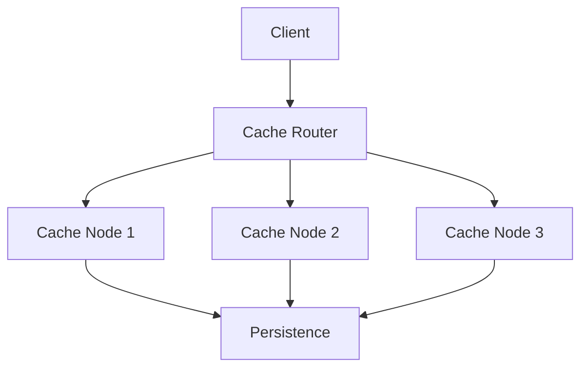
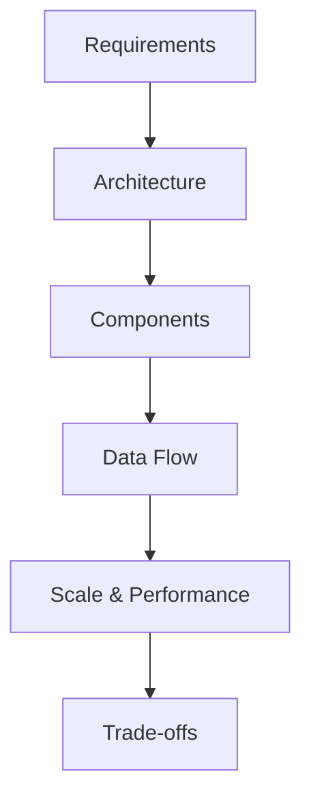

# Medium System Design Questions

## Table of Contents
- [Introduction](#introduction)
- [Question Types](#question-types)
- [Common Questions](#common-questions)
- [Solution Strategies](#solution-strategies)
- [Best Practices](#best-practices)
- [Interview Tips](#interview-tips)

## Introduction

Medium difficulty system design questions focus on scalable architectures and distributed systems concepts. They test understanding of complex interactions between components and trade-offs in design decisions.

### Key Focus Areas
1. **Scalable Architecture**
2. **Distributed Systems**
3. **Data Consistency**
4. **Performance Optimization**

## Question Types

### 1. Chat System
Design a real-time chat system like WhatsApp

#### Requirements
- One-on-one messaging
- Group chats
- Online/offline status
- Message persistence
- Real-time delivery

#### Solution Approach

#### Key Components
1. **WebSocket Handler**

**How it works — Real time delivery:** each server holds a map of `user_id → open socket`. When a message arrives: persist it first, then look up the recipient's socket — deliver directly if the recipient is connected to *this* server, otherwise publish to the message queue so whichever server holds their socket can deliver. On disconnect, remove the mapping. Connections are sticky per server; a routing layer (Redis pub/sub or a dedicated connection registry) bridges users on different servers.

**Back-of-envelope:** 100M daily users × 20 messages/day ≈ 23K messages/sec write throughput; with 1M concurrent sockets per server you need connection-heavy (not CPU-heavy) instances and ~100 servers at peak.

2. **Message Store**

**`messages` table:**

| Field | Purpose |
|-------|---------|
| `id` | unique message ID (UUID or snowflake) |
| `sender_id` / `recipient_id` | conversation participants |
| `content` | message body |
| `timestamp` | ordering key |
| `status` | sent → delivered → read |

Conversation history is always queried by participant pair, sorted by `timestamp`, newest first — so partition by conversation (or by one user ID) and index the time column. Say the access pattern before the schema.

### 2. News Feed System
Design a news feed system like Facebook

#### Requirements
- Post creation and retrieval
- Feed generation
- Content ranking
- Real-time updates

#### Solution Approach

#### Key Components
1. **Feed Generator**

**How it works — Pull based feed:** on request, fetch the user's connections from the graph service, gather recent posts from all of them in parallel, merge, and rank. Simple and always fresh, but reads are expensive for users following many accounts.

**Push-based alternative (fan-out on write):** when a user posts, insert the post into every follower's pre-computed feed list — reads become a single sorted fetch. Choose by follower counts: celebrities (millions of followers) use pull, normal users use push; hybrid is what real systems ship.

**Back-of-envelope:** 300M active users × 10 feed refreshes/day × ~50 posts per feed = heavy read amplification — this is why pre-computed feeds live in cache-backed stores rather than being queried per request.

2. **Content Ranking**

**How it works — Feed ranking:** score each candidate post as a weighted blend of signals — recency (time decay), relevance to the user (affinity, past interactions), and engagement (likes/comments/reshares). Sort by score, truncate to the first page.

**Worked example:** with weights 0.4 recency + 0.4 relevance + 0.2 engagement, a 1-hour-old post from a close friend (relevance 0.9) scores 0.4×0.8 + 0.4×0.9 + 0.2×0.4 = 0.76 and outranks a viral post (engagement 1.0) from an unfollowed page scoring lower on relevance. State the weights are illustrative — the interview point is *which signals and why*.

### 3. Distributed Cache
Design a distributed caching system

#### Requirements
- Get/Set operations
- Cache invalidation
- Consistency
- Scalability
- Fault tolerance

#### Solution Approach

#### Key Components
1. **Cache Router**

**How it works — Routing layer:** map each key to a node with consistent hashing — each key falls between positions on the hash ring, and only K/N keys move when a node joins or leaves. Writes go to the primary node and replicate to the next node on the ring; on node failure the ring is updated and keys re-home to their successor, losing only that node's keys.

**Worked example:** with 3 nodes, losing one makes only ~1/3 of keys miss — a brief cache-penetration spike at the database, which is exactly why you warm the cache and throttle the refill after recovery.

2. **Cache Node**

**How it works — A single cache node:** an in-memory hash map where every entry carries an optional `expires_at`. Reads check expiry first — expired entries are deleted lazily and return a miss; a background sweeper reclaims memory for keys nobody reads. LRU eviction keeps the working set within the memory budget. Keep nodes dumb; intelligence lives in the routing layer.

**Interview framing:** a node is Redis in miniature — hash map + TTL + LRU eviction. Name that, then move on to the interesting parts: routing, replication, and failure handling.

## Solution Strategies### 1. System Components

Start with the core five and add components only when a requirement forces them:

| Component | Include when... |
|----------|-----------------|
| Load balancer | more than one server behind an API |
| Database | data must survive restarts |
| Cache | reads outnumber writes and some keys are hot |
| Queue | work can be done asynchronously or traffic is spiky |
| CDN | global audience fetching static assets |
| WebSocket servers | real-time push is a hard requirement |
| Analytics pipeline | product decisions depend on event data |

### 2. Data Flow Design

Trace two flows explicitly on your diagram before adding anything else:

- **Write path** — client → validation → primary store → (fan-out: cache invalidation, queue events, search indexing)
- **Read path** — client → cache (hit returns immediately) → database on miss → populate cache
- **Real-time path** (if required) — event → queue → fan-out workers → persistent connections

Interviewers follow your arrows; label them with the data that moves, not just "calls".

### 3. Scalability Planning

Have a growth story ready for each layer:

- **Compute** — horizontal scaling behind a load balancer; add nodes when CPU passes ~70% or memory ~80%
- **Data** — partition by a high-cardinality key (`user_id` is the usual answer); range-based only if queries need it
- **Cache** — consistent-hash ring so scaling doesn't flush the cache
- **Hot spots** — celebrity/fan-out problems get dedicated handling (hybrid feed fan-out, per-key throttling)

State the trigger for each action — interviewers want to hear *when* you scale, not just *that* you can.

## Best Practices

### 1. Component Design
- Use microservices architecture
- Implement proper separation
- Design for failure
- Consider monitoring

### 2. Data Management
- Choose appropriate storage
- Plan for data growth
- Implement caching
- Handle consistency

### 3. Performance
- Optimize critical paths
- Use appropriate indexes
- Implement caching
- Monitor bottlenecks

## Interview Tips

### 1. Design Process

### 2. Common Mistakes to Avoid
1. **Design Issues**
   - Overlooking scalability
   - Ignoring failure scenarios
   - Poor data modeling

2. **Communication Issues**
   - Not explaining trade-offs
   - Skipping important details
   - Poor time management

### 3. Success Strategies
1. **Preparation**
   - Study distributed systems
   - Practice common patterns
   - Review real-world systems

2. **During Interview**
   - Start with requirements
   - Draw clear diagrams
   - Discuss trade-offs

3. **Follow-up**
   - Address edge cases
   - Discuss alternatives
   - Consider improvements

## Further Reading
- [Designing Data-Intensive Applications](https://dataintensive.net/)
- [System Design Interview](https://www.amazon.com/System-Design-Interview-insiders-Second/dp/B08CMF2CQF)
- [Distributed Systems](https://www.distributed-systems.net/index.php/books/ds3/)
- [Architecture Patterns](https://www.martinfowler.com/architecture/) 