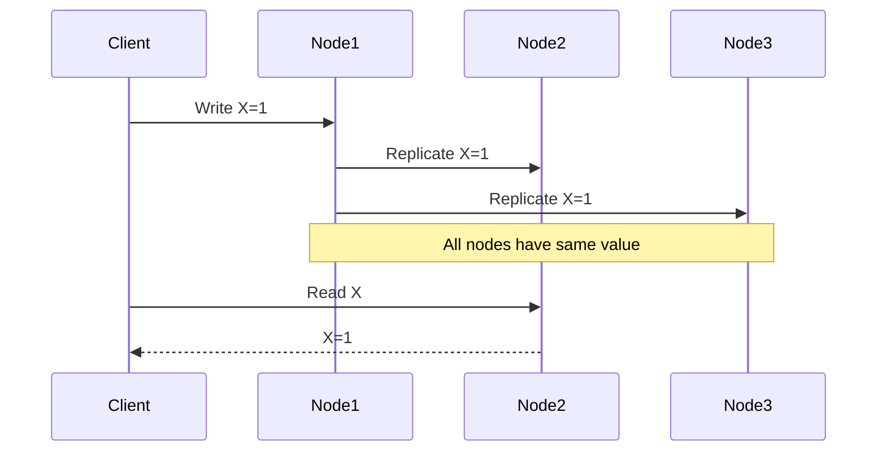
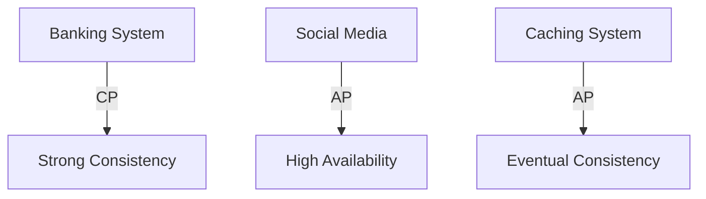

# CAP Theorem

<div align="center">
  
</div>

## Table of Contents
- [Introduction](#introduction)
- [Core Concepts](#core-concepts)
- [System Types](#system-types)
- [Trade-offs](#trade-offs)
- [Implementation Strategies](#implementation-strategies)
- [Real-World Examples](#real-world-examples)
- [Interview Tips](#interview-tips)

## Introduction

The CAP theorem states that a distributed system can only provide two of the following three guarantees simultaneously:
- **Consistency**: All nodes see the same data at the same time
- **Availability**: Every request receives a response
- **Partition Tolerance**: System continues to operate despite network partitions

## Core Concepts

### 1. Consistency


### 2. Availability
```python
class HighAvailabilitySystem:
    def handle_request(self, request):
        """Handle request with high availability."""
        try:
            # Try primary node
            return self.primary_node.process(request)
        except NodeUnavailableError:
            # Failover to secondary
            return self.secondary_node.process(request)
        except AllNodesDownError:
            # Degrade gracefully
            return self.handle_degraded_mode(request)
```

### 3. Partition Tolerance
```python
class PartitionTolerantSystem:
    def handle_network_partition(self):
        """Handle network partition."""
        if self.is_primary_partition():
            # Continue processing in primary partition
            self.operate_primary_mode()
        else:
            # Operate in degraded mode
            self.operate_secondary_mode()
    
    def detect_partition(self):
        """Detect network partition."""
        return not all(
            node.is_reachable()
            for node in self.cluster_nodes
        )
```

## System Types

### 1. CP Systems (Consistency + Partition Tolerance)
```python
class CPSystem:
    def write_data(self, key, value):
        """Write with consistency guarantee."""
        # Get quorum of nodes
        available_nodes = self.get_available_nodes()
        if len(available_nodes) < self.quorum_size:
            raise QuorumNotAvailableError("Cannot guarantee consistency")
        
        # Write to all available nodes
        success = all(
            node.write(key, value)
            for node in available_nodes
        )
        
        if not success:
            raise WriteFailedError("Write failed to reach quorum")
        
        return success
```

### 2. AP Systems (Availability + Partition Tolerance)
```python
class APSystem:
    def read_data(self, key):
        """Read with availability guarantee."""
        # Try any available node
        for node in self.get_available_nodes():
            try:
                value = node.read(key)
                return value
            except NodeError:
                continue
        
        # Return stale data if available
        return self.get_cached_value(key)
```

### 3. CA Systems (Consistency + Availability)
```python
class CASystem:
    def process_transaction(self, transaction):
        """Process with consistency and availability."""
        # Note: Only works in single-node or perfect network
        with self.distributed_lock:
            # Verify all nodes are available
            if not self.all_nodes_available():
                raise SystemNotAvailableError()
            
            # Process transaction
            result = self.process_atomic_transaction(transaction)
            
            # Replicate to all nodes
            self.replicate_to_all_nodes(transaction)
            
            return result
```

## Trade-offs

### 1. Consistency vs Availability
```python
class ConsistencyLevel:
    def choose_consistency_level(self, operation_type):
        """Choose consistency level based on operation."""
        if operation_type == 'financial_transaction':
            return ConsistencyLevel.STRONG
        elif operation_type == 'user_profile':
            return ConsistencyLevel.EVENTUAL
        elif operation_type == 'cache_data':
            return ConsistencyLevel.WEAK
```

### 2. Latency vs Consistency
```python
class LatencyOptimizer:
    def optimize_request(self, request):
        """Optimize request handling."""
        if request.requires_strong_consistency():
            # Use synchronous replication
            return self.handle_sync_request(request)
        else:
            # Use async replication for better latency
            return self.handle_async_request(request)
```

### 3. Partition Handling
```python
class PartitionHandler:
    def handle_partition(self, partition_type):
        """Handle different partition scenarios."""
        if partition_type == 'network_split':
            # Choose primary partition
            self.elect_primary_partition()
        elif partition_type == 'node_failure':
            # Redistribute load
            self.rebalance_nodes()
        elif partition_type == 'partial_partition':
            # Operate in degraded mode
            self.handle_degraded_operation()
```

## Implementation Strategies

### 1. Eventual Consistency
```python
class EventualConsistency:
    def write_with_async_replication(self, key, value):
        """Write with eventual consistency."""
        # Write to local node
        self.local_write(key, value)
        
        # Async replicate to other nodes
        asyncio.create_task(self.async_replicate(key, value))
        
        # Return immediately
        return True
    
    async def async_replicate(self, key, value):
        """Asynchronously replicate data."""
        for node in self.replica_nodes:
            try:
                await node.replicate(key, value)
            except Exception as e:
                # Queue for retry
                self.replication_queue.put((node, key, value))
```

### 2. Strong Consistency
```python
class StrongConsistency:
    def write_with_consensus(self, key, value):
        """Write with strong consistency."""
        # Prepare phase
        prepare_responses = self.prepare_phase(key, value)
        if not self.has_quorum(prepare_responses):
            raise ConsensusError("Failed to achieve prepare quorum")
        
        # Commit phase
        commit_responses = self.commit_phase(key, value)
        if not self.has_quorum(commit_responses):
            raise ConsensusError("Failed to achieve commit quorum")
        
        return True
```

### 3. Quorum-Based Consistency
```python
class QuorumConsistency:
    def __init__(self, n, w, r):
        self.N = n  # Total nodes
        self.W = w  # Write quorum
        self.R = r  # Read quorum
        assert w + r > n, "W + R must be > N for strong consistency"
    
    def read_with_quorum(self, key):
        """Read with quorum consistency."""
        responses = []
        for node in self.nodes:
            try:
                value = node.read(key)
                responses.append(value)
                if len(responses) >= self.R:
                    return self.resolve_conflicts(responses)
            except Exception:
                continue
        
        raise QuorumNotMetError("Failed to achieve read quorum")
```

## Real-World Examples

### 1. Distributed Cache
```python
class DistributedCache:
    def get_value(self, key):
        """Get value with CAP trade-offs."""
        try:
            # Try local cache first
            value = self.local_cache.get(key)
            if value:
                return value
            
            # Try distributed cache
            value = self.distributed_get(key)
            if value:
                # Update local cache
                self.local_cache.set(key, value)
                return value
            
            return None
            
        except PartitionError:
            # During partition, serve stale data
            return self.local_cache.get(key)
```

### 2. Banking System
```python
class BankingSystem:
    def transfer_money(self, from_account, to_account, amount):
        """Handle money transfer with strong consistency."""
        try:
            # Must have all nodes available
            if not self.all_nodes_available():
                raise SystemNotAvailableError()
            
            # Two-phase commit
            transaction_id = self.prepare_transfer(
                from_account, to_account, amount
            )
            
            success = self.commit_transfer(transaction_id)
            if not success:
                self.rollback_transfer(transaction_id)
                raise TransactionFailedError()
            
            return success
            
        except PartitionError:
            # Cannot process during partition
            raise ServiceUnavailableError()
```

## Interview Tips

### 1. Key Considerations
- Business requirements
- Data consistency needs
- Availability requirements
- Network reliability
- Latency requirements

### 2. Common Questions
1. When would you choose CP over AP?
2. How do you handle network partitions?
3. How do you implement eventual consistency?
4. What are the trade-offs in your design?

### 3. System Examples


### 4. Decision Framework
1. **Analyze Requirements**
   - Business needs
   - Technical constraints
   - User expectations

2. **Evaluate Trade-offs**
   - Consistency impact
   - Availability needs
   - Partition handling

3. **Choose Architecture**
   - CP for financial systems
   - AP for content delivery
   - CA for single-node systems

## Further Reading
- [CAP Theorem Paper](https://www.cs.berkeley.edu/~brewer/cs262b-2004/PODC-keynote.pdf)
- [Consistency Models](https://jepsen.io/consistency)
- [Distributed Systems](https://www.distributed-systems.net/index.php/books/ds3/)
- [NoSQL Patterns](https://docs.mongodb.com/manual/core/distributed-queries/) 