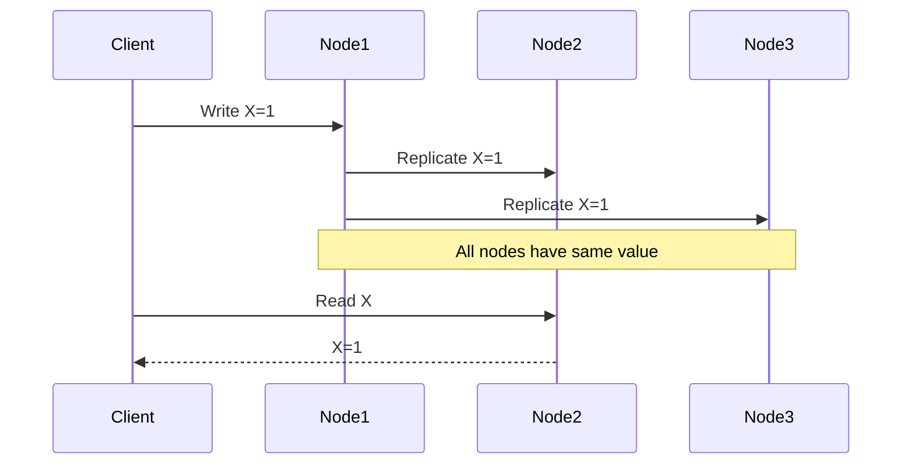
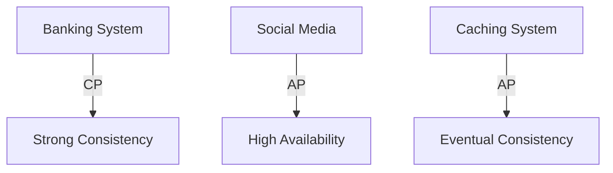

# CAP Theorem in System Design 📌

## Table of Contents

- [Introduction](#introduction)
- [Prerequisites & Related Topics](#prerequisites--related-topics)
- [Pattern Recognition Guide](#pattern-recognition-guide)
- [Core Concepts](#core-concepts)
- [System Types](#system-types)
- [Trade-offs](#trade-offs)
- [Edge Cases to Consider](#edge-cases-to-consider)
- [Implementation Strategies](#implementation-strategies)
- [Real-World Examples](#real-world-examples)
- [Common Pitfalls](#common-pitfalls)
- [FAQ](#faq)
- [Interview Tips](#interview-tips)
- [Advanced Topics](#advanced-topics)
- [Further Reading](#further-reading)

## Introduction

The CAP theorem states that a distributed system can only provide two of the following three guarantees simultaneously:
- **Consistency**: All nodes see the same data at the same time
- **Availability**: Every request receives a response
- **Partition Tolerance**: System continues to operate despite network partitions

## Prerequisites & Related Topics

- **Builds on**: replication basics, distributed systems vocabulary
- **Used in**: [Database Sharding](../system-basics/database-sharding.md), [Event-Driven Architecture](event-driven.md), Consistency patterns
- **Techniques often combined**: quorum reads/writes, leader elections, conflict resolution (CRDTs, LWW)
- **See also**: [Case Study: E-commerce](../case-studies/e-commerce-platform.md) — per-domain CP/AP in one system

## Pattern Recognition Guide

### 🎯 When to Use CAP Theorem

**Keywords in requirements**: "consistency vs availability", "network partition", "CP vs AP", "quorum", "stale reads"
**Reach for this when**:
- Choosing a database posture (CP vs AP vs tunable) per workload
- Reasoning about failure behavior before it happens
- Explaining per-domain trade-offs (payments CP, feeds AP) in interviews
- Setting expectations for conflict resolution and staleness

### 🔑 Approach Indicators

| Approach | Signals | Best For |
|----------|---------|----------|
| CP | correctness over liveness | payments, ledgers, inventory |
| AP | availability over freshness | social feeds, carts, sessions |
| Tunable quorum | per-operation choice | Dynamo-family stores |

### ❌ When NOT to Use

- Single-node systems — CAP is a distributed-systems statement
- Using CAP as an excuse for "no consistency anywhere" — most data is eventually-consistent-safe
- Ignoring latency when there is no partition — PACELC completes the picture

## Core Concepts

### 1. Consistency

### 2. Availability
**How it works — High availability system:** eliminate single points of failure — replicas across zones, automatic failover with a tested runbook, load balancers with health routing — and measure the result as availability nines, budgeting the residual downtime.

### 3. Partition Tolerance
**How it works — Partition tolerant system:** Route each record to its partition by the shard key, so most queries touch exactly one partition — and hot spots, cross-partition joins, and rebalancing are the costs you sign up for.

## System Types

### 1. CP Systems (Consistency + Partition Tolerance)
**How it works — Cpsystem:** data is addressed by its hash — identical content dedupes naturally, writes are immutable, and integrity checks are free (re-hash on read).

### 2. AP Systems (Availability + Partition Tolerance)
**How it works — Apsystem:** the app tier stays stateless — session state in Redis, files in object storage — so instances scale horizontally and any instance can serve any request.

### 3. CA Systems (Consistency + Availability)
**How it works — Casystem:** check-and-set gives optimistic concurrency: read the value with its version, attempt a conditional write that succeeds only if the version is unchanged — retries on conflict instead of holding locks.

## Trade-offs

| System Choice | Guarantees Kept | Sacrificed During Partitions | Best For |
|---------------|-----------------|------------------------------|----------|
| CP | Consistency + Partition Tolerance | Availability (rejects writes/reads rather than serve stale) | Banking, inventory, coordination services |
| AP | Availability + Partition Tolerance | Consistency (serves possibly-stale data) | Social feeds, caching, content delivery |
| CA (no partitions) | Consistency + Availability | Partition tolerance — only valid on a single node or perfect network | Legacy single-node systems |

**Consistency vs Availability**: Under a partition you must pick one — CP systems refuse requests to avoid serving stale data; AP systems keep answering and reconcile later.

**Latency vs Consistency**: Synchronous replication keeps every read consistent but adds latency; asynchronous replication responds fast and accepts temporary divergence.

**Partition Handling**: Networks split; the design question is whether the system stops (CP), continues degraded (AP), or tunes the response per operation with quorums.

### 1. Consistency vs Availability
**How it works — Consistency level:** pick per operation — strong/quorum reads-writes when a stale answer is wrong (billing), eventual/single-replica when speed matters (feed counts) — declaring the choice per call is what makes tunable stores useful.

### 2. Latency vs Consistency
**How it works — Latency optimizer:** Move the compute or content to the location nearest the user; the origin is hit only for misses and writes, and each region's data stays within its regulatory boundary.

### 3. Partition Handling
**How it works — Partition handler:** Route each record to its partition by the shard key, so most queries touch exactly one partition — and hot spots, cross-partition joins, and rebalancing are the costs you sign up for.

> **⚠️ When NOT to default to CP:** domains that tolerate brief staleness (feeds, recommendations, caches) — paying availability for consistency you don't need hurts users. Choose per data domain, not per company.

## Edge Cases to Consider

- Asymmetric partitions — nodes see each other one-way; Jepsen territory
- Gray failures — slow-not-dead nodes poison quorums; use timeouts + ejection
- Clock skew in LWW conflict resolution — logical clocks where it matters
- Reads during repair — quorums can still see pre-repair values

## Implementation Strategies

### 1. Eventual Consistency
**How it works — Eventual consistency:** updates replicate asynchronously, so reads may briefly return older data — acceptable when the staleness window is small and conflicts rare; the design work is bounding that window and resolving conflicts deterministically.

### 2. Strong Consistency
**How it works — Strong consistency:** every read reflects the latest committed write — achieved with leader-based replication (read from leader) or quorums (R + W > N) — and paid for in latency and availability during partitions; use it where money and correctness demand it.

### 3. Quorum-Based Consistency
**How it works — Quorum consistency:** reads and writes each contact a quorum (R + W > N), so they always overlap in at least one up-to-date replica — tune R/W per operation to trade latency against staleness without stopping the system.

## Real-World Examples

### 1. Distributed Cache
**How it works — Distributed cache:** Store the computed result under a stable key with a TTL sized to how stale the data may be; hits skip the expensive path, misses repopulate, and invalidation events cover the changes TTL alone would miss.

### 2. Banking System
**How it works — Banking system:** money movement is transactional — double-entry ledger rows are immutable, balances are derived, and every transfer runs in an ACID transaction or a compensating saga; reconciliation jobs prove the books balance daily.

## Common Pitfalls

1. Claiming C+A+P all at once
2. Quorum math done once at design time instead of per operation
3. Equating eventual consistency with "no conflicts to resolve"
4. Never testing partition behavior — run failure drills

## FAQ

**Q1: Is my database CP or AP?**

A: Ask what happens to a read/write when replicas can't reach each other: rejects (CP) or serves-and-reconciles (AP). Dynamo-family is tunable per operation — know your settings.

**Q2: Can I have consistency and availability?**

A: Only without partitions — which is most of the time, and why PACELC matters. Under partition, pick one; in normal ops, tune latency vs consistency.

**Q3: Where does CAP show up in an interview?**

A: Per-domain choices: payments CP, feeds AP, carts AP-with-idempotency — saying "it depends" and then depending correctly is the winning answer.

## Interview Tips

### 1. Key Considerations
- Business requirements
- Data consistency needs
- Availability requirements
- Network reliability
- Latency requirements

### 2. Common Questions
1. When would you choose CP over AP?
2. How do you handle network partitions?
3. How do you implement eventual consistency?
4. What are the trade-offs in your design?

### 3. System Examples

### 4. Decision Framework
1. **Analyze Requirements**
   - Business needs
   - Technical constraints
   - User expectations

2. **Evaluate Trade-offs**
   - Consistency impact
   - Availability needs
   - Partition handling

3. **Choose Architecture**
   - CP for financial systems
   - AP for content delivery
   - CA for single-node systems

## Advanced Topics

1. **PACELC** — the else: latency vs consistency when connected
2. **CRDTs** — AP systems that still converge deterministically
3. **Leader leases & fencing tokens** — guarding CP primaries
4. **Jepsen-style verification** — finding the real behavior under partitions

## Further Reading
- [CAP Theorem Paper](https://www.cs.berkeley.edu/~brewer/cs262b-2004/PODC-keynote.pdf)
- [Consistency Models](https://jepsen.io/consistency)
- [Distributed Systems](https://www.distributed-systems.net/index.php/books/ds3/)
- [NoSQL Patterns](https://docs.mongodb.com/manual/core/distributed-queries/) 
