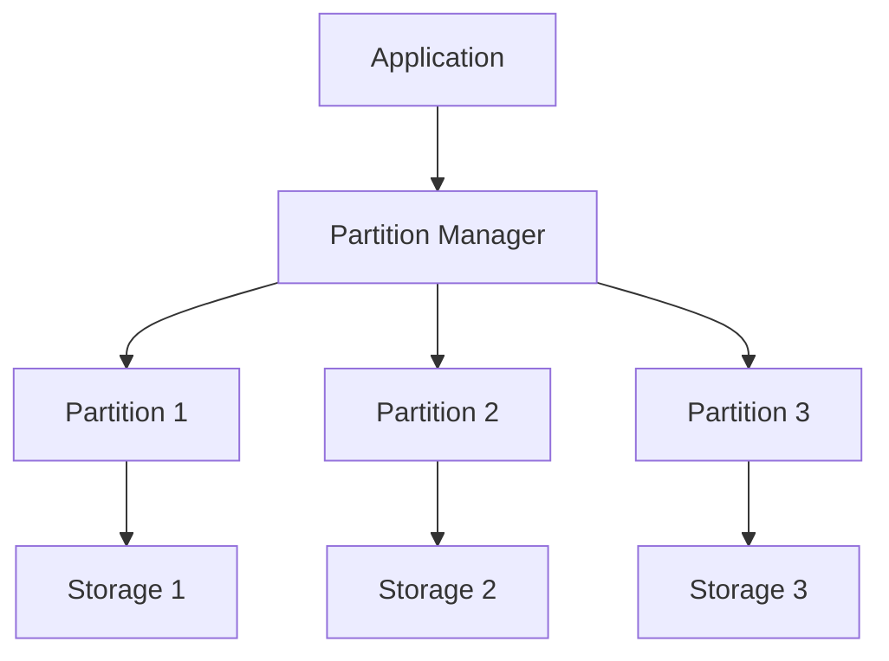

# Data Partitioning in System Design 📌

## Table of Contents

- [Introduction](#introduction)
- [Prerequisites & Related Topics](#prerequisites--related-topics)
- [Pattern Recognition Guide](#pattern-recognition-guide)
- [Partitioning Methods](#partitioning-methods)
- [Partitioning Criteria](#partitioning-criteria)
- [Implementation Strategies](#implementation-strategies)
- [Challenges and Solutions](#challenges-and-solutions)
- [Best Practices](#best-practices)
- [Trade-offs](#trade-offs)
- [Edge Cases to Consider](#edge-cases-to-consider)
- [Common Pitfalls](#common-pitfalls)
- [FAQ](#faq)
- [Interview Tips](#interview-tips)
- [Advanced Topics](#advanced-topics)
- [Further Reading](#further-reading)

## Introduction

Data partitioning is the process of dividing large datasets into smaller, more manageable pieces. It improves performance, manageability, and availability of data processing applications.

### Benefits
1. **Improved Performance**
2. **Better Scalability**
3. **Enhanced Availability**
4. **Easier Maintenance**

## Prerequisites & Related Topics

- Builds on: [Database Sharding](../system-basics/database-sharding.md), consistent hashing concepts
- Used in: [Replication](replication.md), [Event-Driven Architecture](event-driven.md) (Kafka partitions), [Data Warehousing](../data-engineering/data-warehousing.md)
- Techniques often combined: co-located joins, rebalancing, partition pruning
- See also: [Scaling Types](scaling-types.md) — partitioning is the write-scaling tier

## Pattern Recognition Guide

### 🎯 When to Use Data Partitioning

**Keywords in requirements**: "partition", "shard", "distribute data", "hot partition", "rebalancing", "key ranges"
**Reach for this when**:
- Write volume or dataset size beyond one node
- Ordered range scans with locality (time ranges)
- Even write distribution on skewed keys (hash)
- Regional data residency boundaries

### 🔑 Approach Indicators

| Approach | Signals | Best For |
|----------|---------|----------|
| Range partitioning | ordered scans, locality | time-series |
| Hash partitioning | even spread, point lookups | user-scoped data |
| List partitioning | category-based placement | multi-region, tenants |
| Composite | range + hash layered | large multi-tenant |

### ❌ When NOT to Use

- Read bottleneck — replicas and caches first
- Small datasets — partitioning overhead without payoff
- Frequent cross-partition joins on un-chosen keys — redesign access patterns

## Partitioning Methods

### 1. Horizontal Partitioning (Sharding)
**`orders_2023` table:**

| Column | Type |
|--------|------|
| RETURNS | TRIGGER AS $$ |
| INSERT | INTO orders_2023 VALUES (NEW.*); |
| INSERT | INTO orders_2024 VALUES (NEW.*); |
| RAISE | EXCEPTION 'Date out of range'; |
| END | IF; |
| RETURN | NULL; |

Primary key: `id`. Keep the schema description in interviews to keys and access patterns, not column lists.

### 2. Vertical Partitioning
**`users` table:**

| Column | Type |
|--------|------|
| user_id | INT PRIMARY KEY |
| username | VARCHAR(50) |
| email | VARCHAR(100) |
| address | TEXT |
| preferences | JSON |
| profile_data | JSONB |
| user_id | INT PRIMARY KEY |
| username | VARCHAR(50) |
| email | VARCHAR(100) |
| user_id | INT PRIMARY KEY |
| address | TEXT |
| preferences | JSON |

Primary key: `id`. Keep the schema description in interviews to keys and access patterns, not column lists.

### 3. Directory-Based Partitioning
**How it works — Partition directory:** Route each record to its partition by the shard key, so most queries touch exactly one partition — and hot spots, cross-partition joins, and rebalancing are the costs you sign up for.

## Partitioning Criteria

### 1. Range-Based Partitioning
**How it works — Range partitioner:** Route each record to its partition by the shard key, so most queries touch exactly one partition — and hot spots, cross-partition joins, and rebalancing are the costs you sign up for.

### 2. Hash-Based Partitioning
**How it works — Hash partitioner:** Route each record to its partition by the shard key, so most queries touch exactly one partition — and hot spots, cross-partition joins, and rebalancing are the costs you sign up for.

### 3. List-Based Partitioning
**How it works — List partitioner:** Route each record to its partition by the shard key, so most queries touch exactly one partition — and hot spots, cross-partition joins, and rebalancing are the costs you sign up for.

## Implementation Strategies

### 1. Consistent Hashing
**How it works — Consistent hash ring:** hash servers and keys onto the same ring; each key belongs to the next server clockwise — adding or removing a server remaps only its neighboring arc (~1/N of keys), not the whole keyspace.

### 2. Dynamic Partitioning
**How it works — Dynamic partitioner:** Route each record to its partition by the shard key, so most queries touch exactly one partition — and hot spots, cross-partition joins, and rebalancing are the costs you sign up for.

## Challenges and Solutions

### 1. Join Operations
**How it works — Distributed join:** prefer co-locating joined data on the same shard key; otherwise broadcast one small side to all partitions, or shuffle both sides by the join key — each option trades network volume for parallelism.

### 2. Rebalancing
**How it works — Partition rebalancer:** Route each record to its partition by the shard key, so most queries touch exactly one partition — and hot spots, cross-partition joins, and rebalancing are the costs you sign up for.

## Best Practices

### 1. Partition Key Selection
- Choose keys with good distribution
- Avoid hotspots
- Consider query patterns
- Plan for growth

### 2. Monitoring
**How it works — Partition monitor:** Collect the signal on a schedule, evaluate it against the defined threshold or SLO, and route any breach to the right channel with enough context to act without digging.

## Trade-offs

| Method | Pros | Cons | Best For |
|--------|------|------|----------|
| Range partitioning | Efficient range scans, easy to reason about | Hot spots on sequential keys | Time-series, ordered data |
| Hash partitioning | Even distribution | Range queries scatter; resharding pain without consistent hashing | Uniform key access |
| Directory partitioning | Flexible placement, easy migration | Lookup service adds latency and is a SPOF | Multi-tenancy, heterogeneous tenants |

**Rebalancing cost vs idle capacity:** Keeping partitions/headroom ready for growth wastes resources now but avoids painful resharding later.

**Query flexibility vs partition discipline:** Cross-partition queries are slow; choosing partition keys from real access patterns beats generic keys.

**Physical vs logical partitioning:** Logical buckets (many per node) make future moves cheap at the cost of routing indirection.

> **⚠️ When NOT to use hash partitioning:** workloads dominated by range scans or time-ordered queries — hashing scatters them across every partition; range or time-bucketed composite schemes fit better.

## Edge Cases to Consider

- Monotonic keys landing on the last range partition
- Celebrity entity hot-spotting a hash partition — sub-partition or salt
- Resizing partitions under live traffic
- Secondary indexes becoming scatter-gather
- Transactions spanning partitions — design away or accept 2PC

## Common Pitfalls

1. Partition key chosen without the query workload in hand
2. Fixed partition count with no growth plan
3. Ignoring rebalancing cost until the first resize
4. Assuming indexes solve cross-partition queries — they do not

## FAQ

**Q1: Range or hash partitioning?**

A: Range when queries need ordered scans and locality (time-series); hash when even distribution matters more (user data). Composite hybrids cover multi-tenant systems.

**Q2: How does this differ from sharding?**

A: Sharding is partitioning across machines; partitioning also covers within-node schemes. In interviews they are used interchangeably — the strategy discussion is the same.

**Q3: What breaks first with bad partitioning?**

A: Everything funnels to one hot partition — the system behaves like one small database plus the coordination overhead. Watch per-partition load, not averages.

## Interview Tips

### 1. Key Considerations
- Data distribution
- Query patterns
- Growth projections
- Maintenance overhead
- Rebalancing strategy

### 2. Common Questions
1. How do you choose partition keys?
2. How do you handle cross-partition queries?
3. What are the trade-offs of different partitioning strategies?
4. How do you manage partition growth?

### 3. Architecture Diagram

## Advanced Topics

1. Consistent-hash partition placement with virtual nodes
2. Online resharding protocols (dual-write, flip, verify)
3. Vitess-style keyspaces and VReplication
4. Time-based partition lifecycle with tiered storage

## Further Reading
- [Database Partitioning](https://docs.microsoft.com/en-us/azure/architecture/best-practices/data-partitioning)
- [Sharding Pattern](https://docs.microsoft.com/en-us/azure/architecture/patterns/sharding)
- [Partition Management](https://docs.aws.amazon.com/redshift/latest/dg/c_designing-tables-best-practices.html)
- [Scaling Databases](https://www.mongodb.com/basics/scaling) 