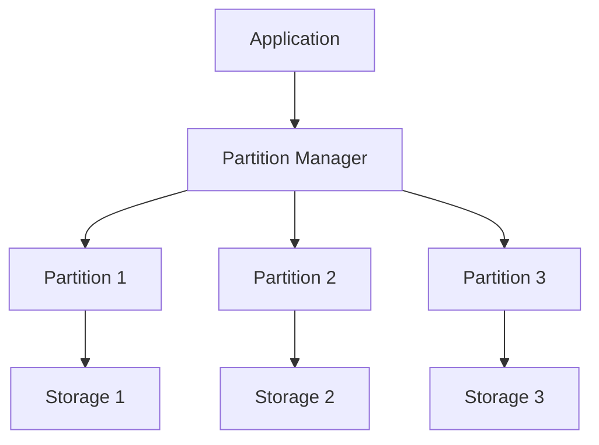

# Data Partitioning

## Table of Contents
- [Introduction](#introduction)
- [Partitioning Methods](#partitioning-methods)
- [Partitioning Criteria](#partitioning-criteria)
- [Implementation Strategies](#implementation-strategies)
- [Challenges and Solutions](#challenges-and-solutions)
- [Best Practices](#best-practices)
- [Trade-offs](#trade-offs)
- [Interview Tips](#interview-tips)

## Introduction

Data partitioning is the process of dividing large datasets into smaller, more manageable pieces. It improves performance, manageability, and availability of data processing applications.

### Benefits
1. **Improved Performance**
2. **Better Scalability**
3. **Enhanced Availability**
4. **Easier Maintenance**

## Partitioning Methods

### 1. Horizontal Partitioning (Sharding)
```sql
-- Create partitions by date range
CREATE TABLE orders_2023 (
    CHECK (order_date >= '2023-01-01' AND order_date < '2024-01-01')
) INHERITS (orders);

CREATE TABLE orders_2024 (
    CHECK (order_date >= '2024-01-01' AND order_date < '2025-01-01')
) INHERITS (orders);

-- Partition function
CREATE OR REPLACE FUNCTION orders_partition_function()
RETURNS TRIGGER AS $$
BEGIN
    IF (NEW.order_date >= '2023-01-01' AND NEW.order_date < '2024-01-01') THEN
        INSERT INTO orders_2023 VALUES (NEW.*);
    ELSIF (NEW.order_date >= '2024-01-01' AND NEW.order_date < '2025-01-01') THEN
        INSERT INTO orders_2024 VALUES (NEW.*);
    ELSE
        RAISE EXCEPTION 'Date out of range';
    END IF;
    RETURN NULL;
END;
$$ LANGUAGE plpgsql;
```

### 2. Vertical Partitioning
```sql
-- Original table
CREATE TABLE users (
    user_id INT PRIMARY KEY,
    username VARCHAR(50),
    email VARCHAR(100),
    address TEXT,
    preferences JSON,
    profile_data JSONB
);

-- Vertically partitioned tables
CREATE TABLE user_core (
    user_id INT PRIMARY KEY,
    username VARCHAR(50),
    email VARCHAR(100)
);

CREATE TABLE user_details (
    user_id INT PRIMARY KEY,
    address TEXT,
    preferences JSON,
    FOREIGN KEY (user_id) REFERENCES user_core(user_id)
);

CREATE TABLE user_profile (
    user_id INT PRIMARY KEY,
    profile_data JSONB,
    FOREIGN KEY (user_id) REFERENCES user_core(user_id)
);
```

### 3. Directory-Based Partitioning
```python
class PartitionDirectory:
    def __init__(self):
        self.partition_map = {}
    
    def register_partition(self, key_range, partition):
        """Register partition for key range."""
        self.partition_map[key_range] = partition
    
    def get_partition(self, key):
        """Get partition for key."""
        for key_range, partition in self.partition_map.items():
            if key_range.contains(key):
                return partition
        raise KeyError(f"No partition found for key: {key}")
```

## Partitioning Criteria

### 1. Range-Based Partitioning
```python
class RangePartitioner:
    def __init__(self, ranges):
        self.ranges = ranges  # List of (start, end) tuples
    
    def get_partition(self, value):
        """Get partition number for value."""
        for i, (start, end) in enumerate(self.ranges):
            if start <= value < end:
                return i
        raise ValueError(f"Value {value} out of range")
```

### 2. Hash-Based Partitioning
```python
class HashPartitioner:
    def __init__(self, num_partitions):
        self.num_partitions = num_partitions
    
    def get_partition(self, key):
        """Get partition using hash function."""
        return hash(key) % self.num_partitions
    
    def distribute_data(self, data):
        """Distribute data across partitions."""
        partitions = [[] for _ in range(self.num_partitions)]
        for item in data:
            partition = self.get_partition(item['key'])
            partitions[partition].append(item)
        return partitions
```

### 3. List-Based Partitioning
```python
class ListPartitioner:
    def __init__(self):
        self.partition_lists = {}
    
    def add_partition(self, partition_id, values):
        """Add list of values for partition."""
        self.partition_lists[partition_id] = set(values)
    
    def get_partition(self, value):
        """Get partition for value."""
        for partition_id, values in self.partition_lists.items():
            if value in values:
                return partition_id
        raise ValueError(f"No partition found for value: {value}")
```

## Implementation Strategies

### 1. Consistent Hashing
```python
class ConsistentHashRing:
    def __init__(self, nodes=None, replicas=3):
        self.replicas = replicas
        self.ring = {}
        self.sorted_keys = []
        
        if nodes:
            for node in nodes:
                self.add_node(node)
    
    def add_node(self, node):
        """Add node to hash ring."""
        for i in range(self.replicas):
            key = self.hash_key(f"{node}:{i}")
            self.ring[key] = node
            self.sorted_keys.append(key)
        self.sorted_keys.sort()
    
    def remove_node(self, node):
        """Remove node from hash ring."""
        for i in range(self.replicas):
            key = self.hash_key(f"{node}:{i}")
            del self.ring[key]
            self.sorted_keys.remove(key)
    
    def get_node(self, key):
        """Get node for key."""
        if not self.ring:
            return None
        
        hash_key = self.hash_key(key)
        for ring_key in self.sorted_keys:
            if hash_key <= ring_key:
                return self.ring[ring_key]
        return self.ring[self.sorted_keys[0]]
```

### 2. Dynamic Partitioning
```python
class DynamicPartitioner:
    def __init__(self, initial_partitions=1):
        self.partitions = [[] for _ in range(initial_partitions)]
        self.partition_sizes = [0] * initial_partitions
        self.size_threshold = 1000
    
    def add_data(self, data):
        """Add data with dynamic partitioning."""
        partition = self.get_target_partition()
        
        # Split partition if too large
        if self.partition_sizes[partition] >= self.size_threshold:
            self.split_partition(partition)
            partition = self.get_target_partition()
        
        self.partitions[partition].append(data)
        self.partition_sizes[partition] += 1
    
    def split_partition(self, partition_id):
        """Split partition into two."""
        data = self.partitions[partition_id]
        mid = len(data) // 2
        
        self.partitions[partition_id] = data[:mid]
        self.partitions.append(data[mid:])
        
        self.partition_sizes[partition_id] = mid
        self.partition_sizes.append(len(data) - mid)
```

## Challenges and Solutions

### 1. Join Operations
```python
class DistributedJoin:
    def join_partitioned_data(self, table1, table2, join_key):
        """Perform join on partitioned data."""
        # Redistribute data based on join key
        partitioned_data1 = self.partition_by_key(table1, join_key)
        partitioned_data2 = self.partition_by_key(table2, join_key)
        
        results = []
        # Perform local joins
        for partition_id in partitioned_data1:
            local_data1 = partitioned_data1[partition_id]
            local_data2 = partitioned_data2.get(partition_id, [])
            
            local_results = self.local_join(
                local_data1,
                local_data2,
                join_key
            )
            results.extend(local_results)
        
        return results
```

### 2. Rebalancing
```python
class PartitionRebalancer:
    def rebalance(self, partitions, target_count):
        """Rebalance partitions."""
        current_count = len(partitions)
        if current_count == target_count:
            return partitions
        
        # Merge or split partitions
        if current_count < target_count:
            return self.split_partitions(
                partitions,
                target_count
            )
        else:
            return self.merge_partitions(
                partitions,
                target_count
            )
    
    def split_partitions(self, partitions, target_count):
        """Split partitions to increase count."""
        result = []
        for partition in partitions:
            if len(result) < target_count:
                # Split partition
                split_point = len(partition) // 2
                result.append(partition[:split_point])
                result.append(partition[split_point:])
            else:
                result.append(partition)
        return result
```

## Best Practices

### 1. Partition Key Selection
- Choose keys with good distribution
- Avoid hotspots
- Consider query patterns
- Plan for growth

### 2. Monitoring
```python
class PartitionMonitor:
    def __init__(self):
        self.metrics = {
            'partition_size': Gauge('partition_size', 'Partition size in bytes'),
            'partition_count': Gauge('partition_count', 'Number of records in partition'),
            'query_latency': Histogram('query_latency', 'Query latency by partition')
        }
    
    def monitor_partitions(self):
        """Monitor partition metrics."""
        for partition in self.get_partitions():
            self.metrics['partition_size'].labels(
                partition=partition.id
            ).set(partition.size)
            
            self.metrics['partition_count'].labels(
                partition=partition.id
            ).set(partition.record_count)
```

## Trade-offs

| Method | Pros | Cons | Best For |
|--------|------|------|----------|
| Range partitioning | Efficient range scans, easy to reason about | Hot spots on sequential keys | Time-series, ordered data |
| Hash partitioning | Even distribution | Range queries scatter; resharding pain without consistent hashing | Uniform key access |
| Directory partitioning | Flexible placement, easy migration | Lookup service adds latency and is a SPOF | Multi-tenancy, heterogeneous tenants |

**Rebalancing cost vs idle capacity:** Keeping partitions/headroom ready for growth wastes resources now but avoids painful resharding later.

**Query flexibility vs partition discipline:** Cross-partition queries are slow; choosing partition keys from real access patterns beats generic keys.

**Physical vs logical partitioning:** Logical buckets (many per node) make future moves cheap at the cost of routing indirection.

> **⚠️ When NOT to use hash partitioning:** workloads dominated by range scans or time-ordered queries — hashing scatters them across every partition; range or time-bucketed composite schemes fit better.

## Interview Tips

### 1. Key Considerations
- Data distribution
- Query patterns
- Growth projections
- Maintenance overhead
- Rebalancing strategy

### 2. Common Questions
1. How do you choose partition keys?
2. How do you handle cross-partition queries?
3. What are the trade-offs of different partitioning strategies?
4. How do you manage partition growth?

### 3. Architecture Diagram


## Further Reading
- [Database Partitioning](https://docs.microsoft.com/en-us/azure/architecture/best-practices/data-partitioning)
- [Sharding Pattern](https://docs.microsoft.com/en-us/azure/architecture/patterns/sharding)
- [Partition Management](https://docs.aws.amazon.com/redshift/latest/dg/c_designing-tables-best-practices.html)
- [Scaling Databases](https://www.mongodb.com/basics/scaling) 