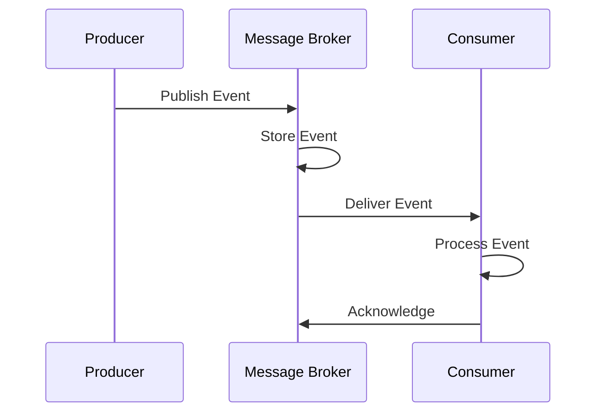
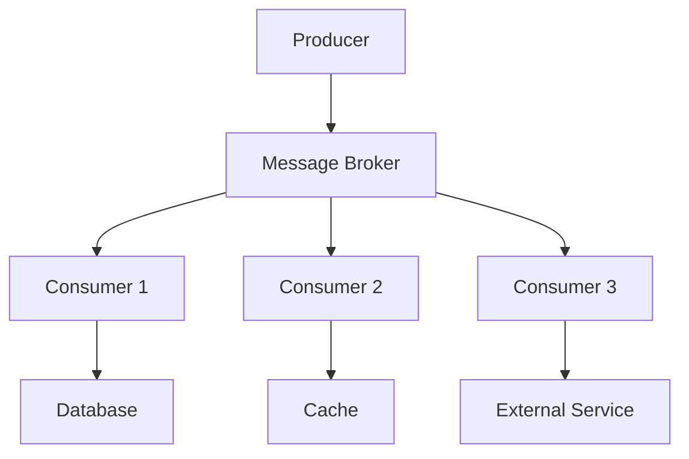

# Event-Driven Architecture in System Design 📌

## Table of Contents

- [Introduction](#introduction)
- [Prerequisites & Related Topics](#prerequisites--related-topics)
- [Pattern Recognition Guide](#pattern-recognition-guide)
- [Core Concepts](#core-concepts)
- [Event Patterns](#event-patterns)
- [Implementation Strategies](#implementation-strategies)
- [Message Brokers](#message-brokers)
- [Best Practices](#best-practices)
- [Trade-offs](#trade-offs)
- [Edge Cases to Consider](#edge-cases-to-consider)
- [Common Pitfalls](#common-pitfalls)
- [FAQ](#faq)
- [Interview Tips](#interview-tips)
- [Advanced Topics](#advanced-topics)
- [Further Reading](#further-reading)

## Introduction

Event-Driven Architecture (EDA) is a software architecture pattern promoting the production, detection, consumption, and reaction to events. Events represent a significant change in state or notable occurrence in the system.

### Key Benefits
1. **Loose Coupling**
2. **Scalability**
3. **Flexibility**
4. **Real-time Processing**
5. **Resilience**

## Prerequisites & Related Topics

- **Builds on**: [Microservices](microservices.md), [Message Queues](../architecture/message-queues.md)
- **Used in**: [Real-Time Analytics](../data-engineering/real-time-analytics.md), Data Pipelines, [Case Study: E-commerce](../case-studies/e-commerce-platform.md)
- **Techniques often combined**: idempotent consumers, DLQs, saga orchestration, CDC
- **See also**: CQRS — read models rebuilt from events

## Pattern Recognition Guide

### 🎯 When to Use Event-Driven Architecture

**Keywords in requirements**: "decouple", "publish/subscribe", "asynchronous", "event", "eventual consistency", "react to changes"
**Reach for this when**:
- Workflows spanning many services without chaining calls
- Fan-out: one fact, many reactors (order → email, inventory, analytics)
- Integration across teams with independent release cycles
- Audit trails and rebuildable state (event sourcing)

### 🔑 Approach Indicators

| Approach | Signals | Best For |
|----------|---------|----------|
| Pub-sub topic | one event, many reactors | notifications |
| Queue (competing consumers) | work distribution | job processing |
| Stream log | replay + per-key ordering | CDC, analytics |
| Saga | multi-service consistency | checkout flows |
| Event sourcing | full history, rebuild state | ledgers |

### ❌ When NOT to Use

- User is waiting on the answer — synchronous APIs
- Simple CRUD with one consumer — a queue is ceremony
- Cross-service invariants needing immediate atomicity — design [sagas](../architecture/message-queues.md) or co-locate

## Core Concepts

### 1. Event Structure
**How it works — event anatomy:** an event is an immutable fact — type, aggregate ID, payload, timestamp, and trace/correlation IDs — versioned so old consumers survive new fields. Events state *what happened* (OrderPlaced), not what should happen; commands are the ones that carry intent.

### 2. Event Flow

### 3. Event Sourcing
**How it works — event sourcing:** the event log is the source of truth — current state is derived by replaying an aggregate's events, and changes are new events appended (never updates in place). Free audit trail and time travel; the costs are replay cost and event-schema versioning.

## Event Patterns

### 1. Publish-Subscribe Pattern
**How it works — event bus:** producers publish facts to the bus without knowing consumers; each subscriber type reacts independently — inventory decrements, email sends, analytics records. New capabilities are new subscribers; the producer never changes.

### 2. Event Streaming
**How it works — event streaming:** a persistent, ordered, replayable log (Kafka-style) between producers and consumers — consumers track their own offsets, so they can be slow, restart, or join late without losing anything, and stream processing derives real-time aggregates from the log.

### 3. Command Query Responsibility Segregation (CQRS)
**How it works — Order system:** the write path is one transactional create; the read path (history, status) is served from projections updated by order events — writes stay simple while reads scale independently.

## Implementation Strategies

### 1. Event Handler
**How it works — event handler:** each handler subscribes to the event types it cares about, processes them idempotently (it may receive duplicates), and acks only after durable success — failures retry with backoff, then dead-letter with full context.

### 2. Event Sourcing Implementation
**How it works — Order:** the order is a consistency boundary — its state machine (created → paid → shipped → closed) advances only through the aggregate root, and events emitted at each transition drive the rest of the platform.

### 3. Saga Pattern
**How it works — saga:** a multi-service transaction as a sequence of local transactions, each publishing an event that triggers the next step; a failure runs compensating actions (release the inventory, refund the payment). Choreography (events only) suits short flows; orchestration (central coordinator) keeps long ones debuggable.

## Message Brokers

### 1. Kafka Configuration
**How it works — Kafka broker settings:** the producer tunes `acks=all` + idempotence for durability or `acks=1` for latency; consumers tune their group membership and `max.poll` behavior for processing speed; topic-level retention (time- or size-based) decides how long the log survives. Interviews care about the durability/latency dial, not the YAML.

### 2. RabbitMQ Implementation
**How it works — RabbitMQ event bus:** producers publish to exchanges, which route to queues by binding rules (direct, topic, fanout); consumers acknowledge messages individually so a crashed consumer redelivers, and unprocessable messages dead-letter after retry limits. Kafka keeps a replayable log; RabbitMQ deletes on ack — different delivery semantics, different use cases.

## Best Practices

### 1. Error Handling
**How it works — consumer error handling:** classify the failure — transient (retry with backoff and jitter), permanent (dead-letter with the original event and the error context), or poison (skip + alert after N retries) — and never let one bad event block the partition behind it.

### 2. Monitoring
**How it works — Event monitor:** Collect the signal on a schedule, evaluate it against the defined threshold or SLO, and route any breach to the right channel with enough context to act without digging.

## Trade-offs

| Aspect | Benefit | Cost |
|--------|---------|------|
| Decoupling | Independent deploys, failure isolation, easy consumers | Harder to reason about end-to-end flows |
| Async processing | High throughput, resilience to spikes | Eventual consistency, complex debugging |
| Event replay | Recovery, auditing, new consumers on history | Storage cost, schema evolution discipline |
| At-least-once delivery | No lost events | Duplicate handling (idempotency required) |

**Consistency vs availability:** Async event flows give high availability but consumers see stale state; business flows needing immediate consistency need synchronous paths.

**Flexibility vs complexity:** Loose coupling enables team autonomy but makes failures indirect — a broken consumer surfaces far from its cause.

**Ordering vs throughput:** Strict per-key ordering limits parallelism; many designs relax ordering and make consumers idempotent instead.

> **⚠️ When NOT to go event-driven:** simple request/response flows, strict read-after-write requirements, and small teams that must debug synchronous traces — an event mesh multiplies indirection faster than it buys decoupling.

## Edge Cases to Consider

- Duplicate deliveries — dedupe by event ID + consumer state
- Cross-partition ordering — design around per-key order
- Consumer lag spikes — scale consumers to partition count, alert on lag
- Poison message blocking a partition — DLQ fast
- Schema evolution breaking consumers — registry + compatibility rules

## Common Pitfalls

1. Publishing commands ("DoX") instead of facts — couples producers to consumers
2. Non-idempotent handlers in an at-least-once world
3. No DLQ — one bad message stalls the stream
4. Unbounded retries without backoff
5. No schema governance — v2 silently breaks v1 consumers

## FAQ

**Q1: Kafka or RabbitMQ?**

A: Kafka: replayable log, per-key order, high throughput, stream processing. RabbitMQ: rich routing, per-message ack, lower latency for work queues. Pick by delivery semantics, not fashion.

**Q2: How is this different from message queues?**

A: Queues move work to one consumer; event streams broadcast facts to many, retain them for replay, and enable derived state — queues are a subset.

**Q3: How do I keep order across events?**

A: Order only matters per entity — hash the entity key to a partition and consume that partition serially. Global ordering is rarely worth its cost.

## Interview Tips

### 1. Key Considerations
- Event schema design
- Message delivery guarantees
- Error handling strategy
- Scaling approach
- Monitoring needs

### 2. Common Questions
1. How do you handle event ordering?
2. How do you ensure event delivery?
3. How do you handle failed events?
4. How do you scale event processing?

### 3. Architecture Diagram

## Advanced Topics

1. **Exactly-once** — transactional producers + idempotent stores (or honest at-least-once)
2. **Event sourcing + projections** — state rebuilt by replay
3. **CDC pipelines** — databases as event producers (Debezium-style)
4. **Kappa architecture** — one log, stream processing only

## Further Reading
- [Apache Kafka Documentation](https://kafka.apache.org/documentation/)
- [RabbitMQ Tutorials](https://www.rabbitmq.com/getstarted.html)
- [Event Sourcing Pattern](https://docs.microsoft.com/en-us/azure/architecture/patterns/event-sourcing)
- [CQRS Pattern](https://martinfowler.com/bliki/CQRS.html) 
