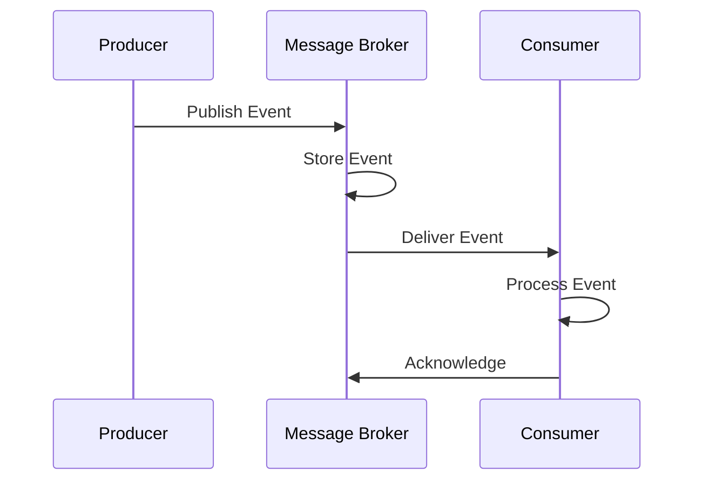
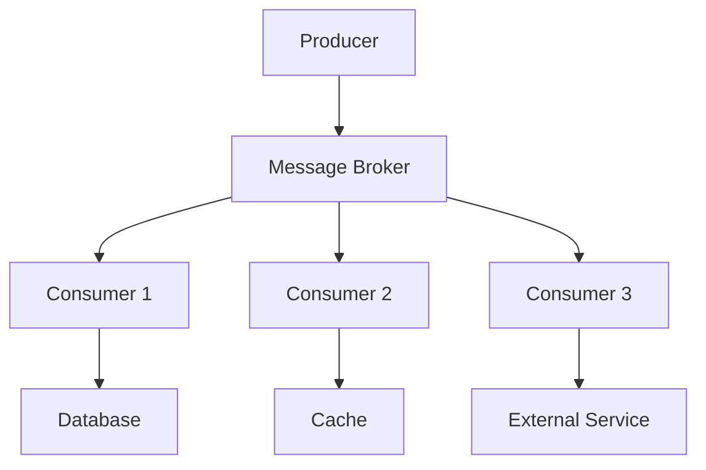

# Event-Driven Architecture

## Table of Contents
- [Introduction](#introduction)
- [Core Concepts](#core-concepts)
- [Event Patterns](#event-patterns)
- [Implementation Strategies](#implementation-strategies)
- [Message Brokers](#message-brokers)
- [Best Practices](#best-practices)
- [Trade-offs](#trade-offs)
- [Interview Tips](#interview-tips)

## Introduction

Event-Driven Architecture (EDA) is a software architecture pattern promoting the production, detection, consumption, and reaction to events. Events represent a significant change in state or notable occurrence in the system.

### Key Benefits
1. **Loose Coupling**
2. **Scalability**
3. **Flexibility**
4. **Real-time Processing**
5. **Resilience**

## Core Concepts

### 1. Event Structure
```python
class Event:
    def __init__(self, event_type, data, metadata=None):
        self.id = str(uuid.uuid4())
        self.type = event_type
        self.data = data
        self.metadata = metadata or {}
        self.timestamp = datetime.utcnow().isoformat()
    
    def to_json(self):
        """Convert event to JSON."""
        return {
            'id': self.id,
            'type': self.type,
            'data': self.data,
            'metadata': self.metadata,
            'timestamp': self.timestamp
        }
```

### 2. Event Flow


### 3. Event Sourcing
```python
class EventStore:
    def __init__(self):
        self.events = []
    
    def append_event(self, event):
        """Append event to store."""
        self.events.append(event)
    
    def get_events(self, aggregate_id):
        """Get events for aggregate."""
        return [
            event for event in self.events
            if event.data.get('aggregate_id') == aggregate_id
        ]
    
    def replay_events(self, aggregate_id):
        """Replay events to rebuild state."""
        events = self.get_events(aggregate_id)
        aggregate = Aggregate()
        for event in events:
            aggregate.apply_event(event)
        return aggregate
```

## Event Patterns

### 1. Publish-Subscribe Pattern
```python
class EventBus:
    def __init__(self):
        self.subscribers = defaultdict(list)
    
    def subscribe(self, event_type, callback):
        """Subscribe to event type."""
        self.subscribers[event_type].append(callback)
    
    def publish(self, event):
        """Publish event to subscribers."""
        for callback in self.subscribers[event.type]:
            try:
                callback(event)
            except Exception as e:
                logger.error(f"Error processing event: {e}")
```

### 2. Event Streaming
```python
class StreamProcessor:
    def process_stream(self, stream_name):
        """Process event stream."""
        consumer = KafkaConsumer(
            stream_name,
            bootstrap_servers=['localhost:9092'],
            auto_offset_reset='earliest',
            enable_auto_commit=False,
            group_id='processing_group'
        )
        
        for message in consumer:
            try:
                event = Event.from_json(message.value)
                self.handle_event(event)
                consumer.commit()
            except Exception as e:
                logger.error(f"Error processing message: {e}")
```

### 3. Command Query Responsibility Segregation (CQRS)
```python
class OrderSystem:
    def __init__(self):
        self.command_bus = CommandBus()
        self.query_bus = QueryBus()
        self.event_store = EventStore()
    
    def create_order(self, order_data):
        """Command to create order."""
        command = CreateOrderCommand(order_data)
        self.command_bus.dispatch(command)
    
    def get_order(self, order_id):
        """Query to get order."""
        query = GetOrderQuery(order_id)
        return self.query_bus.dispatch(query)
```

## Implementation Strategies

### 1. Event Handler
```python
class OrderEventHandler:
    def handle_order_created(self, event):
        """Handle order created event."""
        order_data = event.data
        
        # Update read model
        self.order_repository.save(order_data)
        
        # Trigger notifications
        self.notification_service.notify_customer(
            order_data['customer_id'],
            'Order Created',
            f"Order {order_data['order_id']} has been created"
        )
        
        # Update inventory
        self.inventory_service.reserve_items(order_data['items'])
```

### 2. Event Sourcing Implementation
```python
class Order:
    def __init__(self):
        self.id = None
        self.status = None
        self.items = []
        self.total = 0
    
    def apply_event(self, event):
        """Apply event to aggregate."""
        if event.type == 'OrderCreated':
            self.handle_order_created(event.data)
        elif event.type == 'ItemAdded':
            self.handle_item_added(event.data)
        elif event.type == 'OrderPaid':
            self.handle_order_paid(event.data)
    
    def handle_order_created(self, data):
        """Handle order created event."""
        self.id = data['order_id']
        self.status = 'created'
    
    def handle_item_added(self, data):
        """Handle item added event."""
        self.items.append(data['item'])
        self.total += data['price']
    
    def handle_order_paid(self, data):
        """Handle order paid event."""
        self.status = 'paid'
```

### 3. Saga Pattern
```python
class OrderSaga:
    def __init__(self):
        self.saga_id = str(uuid.uuid4())
        self.steps = []
        self.current_step = 0
    
    def start(self, order_data):
        """Start order saga."""
        self.steps = [
            self.create_order,
            self.reserve_inventory,
            self.process_payment,
            self.update_delivery
        ]
        
        try:
            for step in self.steps:
                step(order_data)
                self.current_step += 1
        except Exception as e:
            self.compensate()
            raise SagaFailedError(str(e))
    
    def compensate(self):
        """Compensate failed saga."""
        compensation_steps = self.steps[:self.current_step][::-1]
        for step in compensation_steps:
            try:
                step.compensate()
            except Exception as e:
                logger.error(f"Compensation failed: {e}")
```

## Message Brokers

### 1. Kafka Configuration
```yaml
# Kafka Producer Config
kafka:
  producer:
    bootstrap.servers: localhost:9092
    acks: all
    retries: 3
    batch.size: 16384
    linger.ms: 1
    buffer.memory: 33554432

# Kafka Consumer Config
  consumer:
    bootstrap.servers: localhost:9092
    group.id: order-processing-group
    auto.offset.reset: earliest
    enable.auto.commit: false
    max.poll.records: 500
```

### 2. RabbitMQ Implementation
```python
class RabbitMQEventBus:
    def __init__(self):
        self.connection = pika.BlockingConnection(
            pika.ConnectionParameters('localhost')
        )
        self.channel = self.connection.channel()
    
    def publish(self, routing_key, event):
        """Publish event to RabbitMQ."""
        self.channel.basic_publish(
            exchange='events',
            routing_key=routing_key,
            body=json.dumps(event.to_json()),
            properties=pika.BasicProperties(
                delivery_mode=2,  # make message persistent
            )
        )
    
    def subscribe(self, routing_key, callback):
        """Subscribe to events."""
        self.channel.queue_declare(queue=routing_key, durable=True)
        self.channel.basic_consume(
            queue=routing_key,
            on_message_callback=callback,
            auto_ack=False
        )
```

## Best Practices

### 1. Error Handling
```python
class EventProcessor:
    def process_event(self, event):
        """Process event with error handling."""
        try:
            # Process event
            self.handle_event(event)
            
        except TemporaryError as e:
            # Retry for temporary failures
            self.retry_queue.push(event)
            logger.warning(f"Temporary error: {e}")
            
        except PermanentError as e:
            # Move to dead letter queue
            self.dead_letter_queue.push(event)
            logger.error(f"Permanent error: {e}")
            
        except Exception as e:
            # Unknown error
            logger.critical(f"Unknown error: {e}")
            raise
```

### 2. Monitoring
```python
class EventMonitor:
    def __init__(self):
        self.metrics = {
            'events_published': Counter('events_published_total', 'Total events published'),
            'events_processed': Counter('events_processed_total', 'Total events processed'),
            'processing_time': Histogram('event_processing_seconds', 'Event processing time')
        }
    
    def track_event(self, event_type, duration):
        """Track event metrics."""
        self.metrics['events_processed'].inc()
        self.metrics['processing_time'].observe(duration)
```

## Trade-offs

| Aspect | Benefit | Cost |
|--------|---------|------|
| Decoupling | Independent deploys, failure isolation, easy consumers | Harder to reason about end-to-end flows |
| Async processing | High throughput, resilience to spikes | Eventual consistency, complex debugging |
| Event replay | Recovery, auditing, new consumers on history | Storage cost, schema evolution discipline |
| At-least-once delivery | No lost events | Duplicate handling (idempotency required) |

**Consistency vs availability:** Async event flows give high availability but consumers see stale state; business flows needing immediate consistency need synchronous paths.

**Flexibility vs complexity:** Loose coupling enables team autonomy but makes failures indirect — a broken consumer surfaces far from its cause.

**Ordering vs throughput:** Strict per-key ordering limits parallelism; many designs relax ordering and make consumers idempotent instead.

> **⚠️ When NOT to go event-driven:** simple request/response flows, strict read-after-write requirements, and small teams that must debug synchronous traces — an event mesh multiplies indirection faster than it buys decoupling.

## Interview Tips

### 1. Key Considerations
- Event schema design
- Message delivery guarantees
- Error handling strategy
- Scaling approach
- Monitoring needs

### 2. Common Questions
1. How do you handle event ordering?
2. How do you ensure event delivery?
3. How do you handle failed events?
4. How do you scale event processing?

### 3. Architecture Diagram


## Further Reading
- [Apache Kafka Documentation](https://kafka.apache.org/documentation/)
- [RabbitMQ Tutorials](https://www.rabbitmq.com/getstarted.html)
- [Event Sourcing Pattern](https://docs.microsoft.com/en-us/azure/architecture/patterns/event-sourcing)
- [CQRS Pattern](https://martinfowler.com/bliki/CQRS.html) 