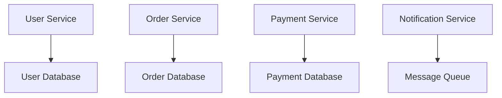
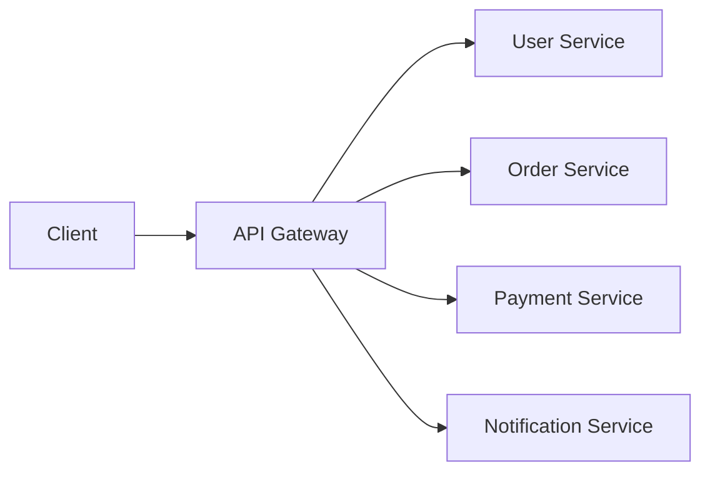
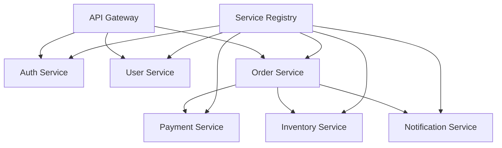

# Microservices Architecture

## Table of Contents
- [Introduction](#introduction)
- [Core Concepts](#core-concepts)
- [Architecture Patterns](#architecture-patterns)
- [Communication Patterns](#communication-patterns)
- [Implementation Strategies](#implementation-strategies)
- [Best Practices](#best-practices)
- [Interview Tips](#interview-tips)

## Introduction

Microservices is an architectural style that structures an application as a collection of small, loosely coupled services. Each service is:
- Independently deployable
- Highly maintainable
- Independently scalable
- Organized around business capabilities

## Core Concepts

### 1. Service Independence


### 2. Domain-Driven Design
```python
class OrderService:
    def __init__(self):
        self.repository = OrderRepository()
        self.event_publisher = EventPublisher()
    
    def create_order(self, order_data):
        """Create new order."""
        order = Order.create(order_data)
        self.repository.save(order)
        self.event_publisher.publish('order_created', order)
        return order
    
    def process_payment(self, order_id, payment_data):
        """Process order payment."""
        order = self.repository.get(order_id)
        payment = Payment.process(payment_data)
        order.mark_paid(payment)
        self.repository.save(order)
        self.event_publisher.publish('order_paid', order)
```

## Architecture Patterns

### 1. API Gateway Pattern


### 2. Service Registry Pattern
```yaml
# Eureka Service Registry Configuration
eureka:
  client:
    registerWithEureka: true
    fetchRegistry: true
    serviceUrl:
      defaultZone: http://localhost:8761/eureka/
  instance:
    hostname: localhost
    preferIpAddress: true
```

### 3. Circuit Breaker Pattern
```java
@CircuitBreaker(name = "paymentService", fallbackMethod = "fallbackPayment")
public PaymentResponse processPayment(PaymentRequest request) {
    return paymentClient.processPayment(request);
}

public PaymentResponse fallbackPayment(PaymentRequest request, Exception e) {
    return PaymentResponse.builder()
        .status(FAILED)
        .message("Payment service unavailable")
        .build();
}
```

## Communication Patterns

### 1. Synchronous Communication
```python
class OrderController:
    def create_order(self, order_data):
        """Create order with synchronous service calls."""
        # Validate inventory
        inventory_response = requests.get(
            f"{INVENTORY_SERVICE}/check",
            params={'items': order_data['items']}
        )
        if not inventory_response.ok:
            raise InvalidOrderError("Insufficient inventory")
        
        # Create order
        order = self.order_service.create(order_data)
        
        # Process payment
        payment_response = requests.post(
            f"{PAYMENT_SERVICE}/process",
            json={'order_id': order.id, 'amount': order.total}
        )
        if not payment_response.ok:
            raise PaymentError("Payment failed")
        
        return order
```

### 2. Asynchronous Communication
```python
class OrderProcessor:
    def process_order(self, order_event):
        """Process order asynchronously."""
        try:
            # Publish order created event
            self.event_bus.publish(
                'order.created',
                {
                    'order_id': order_event.id,
                    'items': order_event.items,
                    'total': order_event.total
                }
            )
            
            # Subscribe to events
            self.event_bus.subscribe('inventory.reserved', self.handle_inventory)
            self.event_bus.subscribe('payment.processed', self.handle_payment)
            
        except Exception as e:
            self.event_bus.publish('order.failed', {'order_id': order_event.id})
            raise OrderProcessingError(str(e))
```

## Implementation Strategies

### 1. Service Template
```python
from fastapi import FastAPI
from prometheus_client import Counter, Histogram
from opentelemetry import trace

app = FastAPI()
tracer = trace.get_tracer(__name__)
request_counter = Counter('http_requests_total', 'Total HTTP requests')
request_duration = Histogram('http_request_duration_seconds', 'Request duration')

class MicroserviceTemplate:
    def __init__(self):
        self.app = app
        self.setup_middleware()
        self.setup_routes()
        self.setup_health_check()
    
    def setup_middleware(self):
        """Setup service middleware."""
        @app.middleware("http")
        async def metrics_middleware(request, call_next):
            request_counter.inc()
            with request_duration.time():
                response = await call_next(request)
            return response
    
    def setup_health_check(self):
        """Setup health check endpoint."""
        @app.get("/health")
        async def health_check():
            return {"status": "healthy"}
```

### 2. Service Discovery
```python
class ServiceRegistry:
    def register_service(self, service_info):
        """Register service with discovery."""
        registration = {
            'name': service_info['name'],
            'host': service_info['host'],
            'port': service_info['port'],
            'health_check': f"http://{service_info['host']}:{service_info['port']}/health",
            'metadata': service_info.get('metadata', {})
        }
        return consul_client.agent.service.register(**registration)
    
    def discover_service(self, service_name):
        """Discover service by name."""
        services = consul_client.agent.services()
        return [svc for svc in services.values() if svc['Service'] == service_name]
```

### 3. Configuration Management
```yaml
# Spring Cloud Config
spring:
  cloud:
    config:
      server:
        git:
          uri: https://github.com/org/config-repo
          searchPaths: '{application}'
          username: ${GIT_USERNAME}
          password: ${GIT_PASSWORD}
```

## Best Practices

### 1. Service Design
- Single Responsibility
- Loose Coupling
- High Cohesion
- Independent Data Storage
- API Versioning

### 2. Monitoring and Logging
```python
class ServiceMonitor:
    def __init__(self):
        self.metrics = {
            'request_count': Counter('requests_total', 'Total requests'),
            'request_duration': Histogram('request_duration_seconds', 'Request duration'),
            'error_count': Counter('errors_total', 'Total errors')
        }
    
    def log_request(self, request_id, service, duration, status):
        """Log service request."""
        log_entry = {
            'request_id': request_id,
            'service': service,
            'duration': duration,
            'status': status,
            'timestamp': datetime.utcnow().isoformat()
        }
        logger.info('Service request', extra=log_entry)
```

### 3. Testing Strategies
```python
class ServiceTest:
    def test_service_integration(self):
        """Test service integration."""
        # Start service containers
        self.start_containers()
        
        try:
            # Test service endpoints
            response = requests.post(
                f"{SERVICE_URL}/api/v1/orders",
                json=self.test_order_data
            )
            assert response.status_code == 201
            
            # Verify event publication
            events = self.get_published_events()
            assert 'order.created' in events
            
        finally:
            self.cleanup_containers()
```

## Interview Tips

### 1. Key Considerations
- Service boundaries
- Data consistency
- Communication patterns
- Deployment strategy
- Monitoring approach

### 2. Common Questions
1. How do you handle distributed transactions?
2. How do you manage service discovery?
3. How do you ensure service resilience?
4. How do you handle service versioning?

### 3. Architecture Diagram


## Further Reading
- [Microservices Pattern](https://microservices.io/patterns/index.html)
- [Spring Cloud](https://spring.io/projects/spring-cloud)
- [Netflix OSS](https://netflix.github.io/)
- [Kubernetes Documentation](https://kubernetes.io/docs/) 