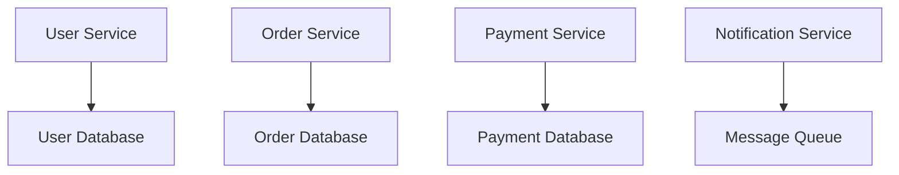
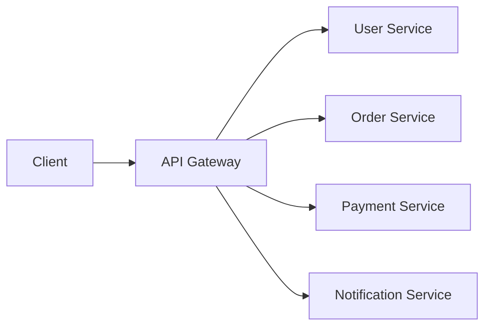
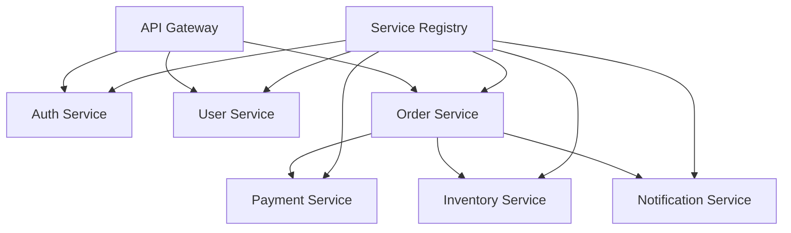

# Microservices in System Design 📌

## Table of Contents

- [Introduction](#introduction)
- [Prerequisites & Related Topics](#prerequisites--related-topics)
- [Pattern Recognition Guide](#pattern-recognition-guide)
- [Core Concepts](#core-concepts)
- [Architecture Patterns](#architecture-patterns)
- [Communication Patterns](#communication-patterns)
- [Implementation Strategies](#implementation-strategies)
- [Best Practices](#best-practices)
- [Trade-offs](#trade-offs)
- [Edge Cases to Consider](#edge-cases-to-consider)
- [Common Pitfalls](#common-pitfalls)
- [FAQ](#faq)
- [Interview Tips](#interview-tips)
- [Advanced Topics](#advanced-topics)
- [Further Reading](#further-reading)

## Introduction

Microservices is an architectural style that structures an application as a collection of small, loosely coupled services. Each service is:
- Independently deployable
- Highly maintainable
- Independently scalable
- Organized around business capabilities

## Prerequisites & Related Topics

- **Builds on**: [Load Balancing](../system-basics/load-balancing.md), [API Design](../system-basics/api-design.md)
- **Used in**: [Event-Driven Architecture](event-driven.md), [Service Discovery](../architecture/service-discovery.md), [Message Queues](../architecture/message-queues.md)
- **Techniques often combined**: sagas, CQRS, circuit breakers, service mesh, contract tests
- **See also**: [Monolith-first reasoning](../best-practices/design-guidelines.md) — the modular monolith is the honest default

## Pattern Recognition Guide

### 🎯 When to Use Microservices

**Keywords in requirements**: "independent deployment", "team autonomy", "scale services independently", "service boundaries", "domain-driven"
**Reach for this when**:
- Multiple teams needing independent release cadences
- Domains with wildly different scaling or technology needs
- Organization scale where one codebase is a coordination bottleneck
- Blast-radius isolation per domain

### 🔑 Approach Indicators

| Approach | Signals | Best For |
|----------|---------|----------|
| Sync REST/gRPC | request-response, low latency | queries across domains |
| Async events | decoupling and throughput | workflows, integrations |
| Saga | multi-service consistency | order/payment flows |
| CQRS | read/write scale differently | catalogs, feeds |

### ❌ When NOT to Use

- Small team, uncertain product → modular monolith; boundaries harden later
- Strong consistency invariants across domains in one transaction
- Latency-critical single-process paths — a network hop per step ruins them

## Core Concepts

### 1. Service Independence

### 2. Domain-Driven Design
**How it works — order service boundary:** owns the order lifecycle end-to-end — validation, state machine (created → paid → shipped → closed), and its own schema. Other services never read its tables; they consume order events, which is what keeps the boundary enforceable as teams grow.

## Architecture Patterns

### 1. API Gateway Pattern

### 2. Service Registry Pattern
**How it works — service registry:** services register their address on startup and send heartbeats; the registry marks them stale after missed heartbeats, and clients or the load balancer consult it on every request. DNS-based or client-side (Eureka/Consul) — either way, instances come and go without config changes anywhere.

### 3. Circuit Breaker Pattern
**How it works — Declarative circuit breaker:** the payment call is wrapped in a breaker named `paymentService`. While it is closed, calls flow to the payment client; after repeated failures it opens and every call routes straight to the fallback, which returns a canned "payment unavailable" response instead of a timeout.

## Communication Patterns

### 1. Synchronous Communication
**How it works — sync calls:** service A calls B's REST/gRPC endpoint and blocks on the response — simple, immediate consistency, but A inherits B's latency and availability: B slowing down drags A's thread pool with it. Budget timeouts and circuit breakers are mandatory; minimize the depth of call chains (A→B→C→D is an outage multiplier).

### 2. Asynchronous Communication
**How it works — async events:** service A publishes an event and returns immediately; B consumes when it can. Latency coupling disappears and B being down only delays processing, not A's responses — the price is eventual consistency and harder debugging (trace the flow through the broker, with correlation IDs on every event).

## Implementation Strategies

### 1. Service Template
**How it works — service template:** every new service starts from a shared golden path — standard health endpoints, structured logging, metrics, tracing hooks, and CI baked in. The template is what makes 50 services operable by 5 teams; without it, each service reinvents (or skips) its own observability and ops story.

### 2. Service Discovery
**How it works — discovery:** at boot a service registers its location and capabilities; clients either query the registry per request (client-side discovery, smart but coupled) or hit a stable virtual address that the infrastructure resolves (server-side, the Kubernetes/Service-mesh default). Health-checked routing keeps dead instances out of rotation automatically.

### 3. Configuration Management
**How it works — config service:** configuration lives outside the artifact in a versioned store (Consul, Spring Cloud Config, Kubernetes ConfigMaps + Secrets); services pull at startup and watch for changes, so a config flip rolls out without a redeploy. Sensitive values stay in a secrets manager, never in the repo or the image.

## Best Practices

### 1. Service Design
- Single Responsibility
- Loose Coupling
- High Cohesion
- Independent Data Storage
- API Versioning

### 2. Monitoring and Logging
**How it works — Service monitor:** Collect the signal on a schedule, evaluate it against the defined threshold or SLO, and route any breach to the right channel with enough context to act without digging.

### 3. Testing Strategies
**How it works — Service test:** Exercise the "Service test" scenario against a realistic environment and assert on the observable outcome — pass/fail criteria are defined before the run, not after.

## Trade-offs

| Aspect | Benefit | Cost |
|--------|---------|------|
| Independent deploys | Faster teams, smaller blast radius | Version compatibility, contract management |
| Independent scaling | Scale only hot services | Operational overhead per service |
| Technology freedom | Right tool per problem | Polyglot maintenance, on-call breadth |
| Fault isolation | One failing service need not sink all | Cascading failure risk without circuit breakers |

**Microservices vs modular monolith:** Microservices buy organizational scale at the price of distributed-systems complexity — network failures, data consistency, observability. Below a certain team/service ratio, a modular monolith delivers the same modularity cheaply.

**Autonomy vs standardization:** Free technology choices boost team morale but fragment tooling; golden paths trade some freedom for operability.

**Data ownership vs cross-service queries:** Per-service databases remove coupling but force sagas/API composition where joins used to be free.

> **⚠️ When NOT to use microservices:** small teams, unclear domain boundaries, and early products still searching for their shape — a modular monolith gives you the boundaries without the network tax, and services can be extracted later.

## Edge Cases to Consider

- Distributed monolith — chatty services with shared releases; fix boundaries, not tech
- Cascading failure across a call chain — breakers + bulkheads
- Schema evolution breaking consumers — contract tests in CI
- Partial deploys — two service versions live at once, contracts must span them
- Duplicate event delivery — consumers must be idempotent

## Common Pitfalls

1. Splitting by technical layer (data service, logic service) instead of domain
2. Shared databases — kills ownership and independent deploys
3. Deep synchronous call chains (A→B→C→D)
4. Skipping contract/integration tests because "it's all internal"
5. No backpressure — one slow consumer melts the upstream

## FAQ

**Q1: Monolith or microservices?**

A: Start with a modular monolith and clean internal boundaries; extract services when scaling or team-cadence pain is real. Extraction is easier than dissolution.

**Q2: How do services share data?**

A: They don't — each owns its store; others consume its API or its events. Shared tables are the road to a distributed monolith.

**Q3: What replaces distributed transactions?**

A: Sagas: sequence of local transactions with compensating actions for rollback. Choreograph small flows; orchestrate long ones.

## Interview Tips

### 1. Key Considerations
- Service boundaries
- Data consistency
- Communication patterns
- Deployment strategy
- Monitoring approach

### 2. Common Questions
1. How do you handle distributed transactions?
2. How do you manage service discovery?
3. How do you ensure service resilience?
4. How do you handle service versioning?

### 3. Architecture Diagram

## Advanced Topics

1. **Service mesh** — uniform mTLS, traffic shifting, retries
2. **Event sourcing + CQRS** per domain
3. **Cell-based architecture** — sharded deploy units for blast radius
4. **Platform golden paths** — templates make 50 services operable

## Further Reading
- [Microservices Pattern](https://microservices.io/patterns/index.html)
- [Spring Cloud](https://spring.io/projects/spring-cloud)
- [Netflix OSS](https://netflix.github.io/)
- [Kubernetes Documentation](https://kubernetes.io/docs/) 
