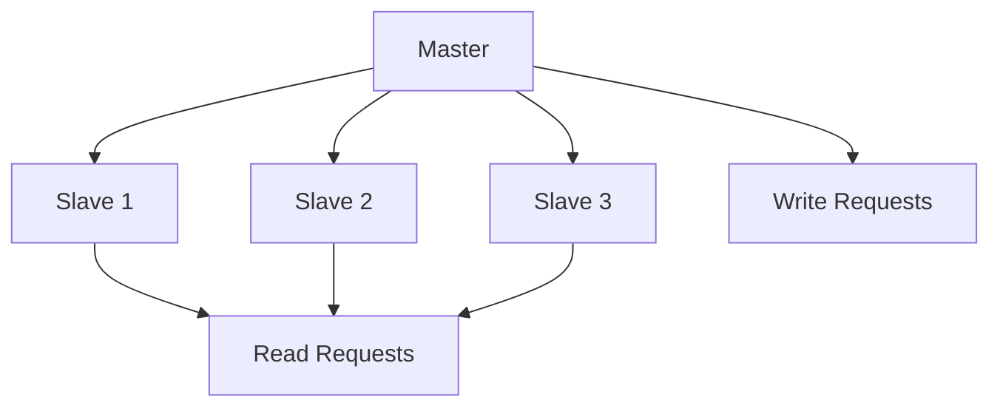
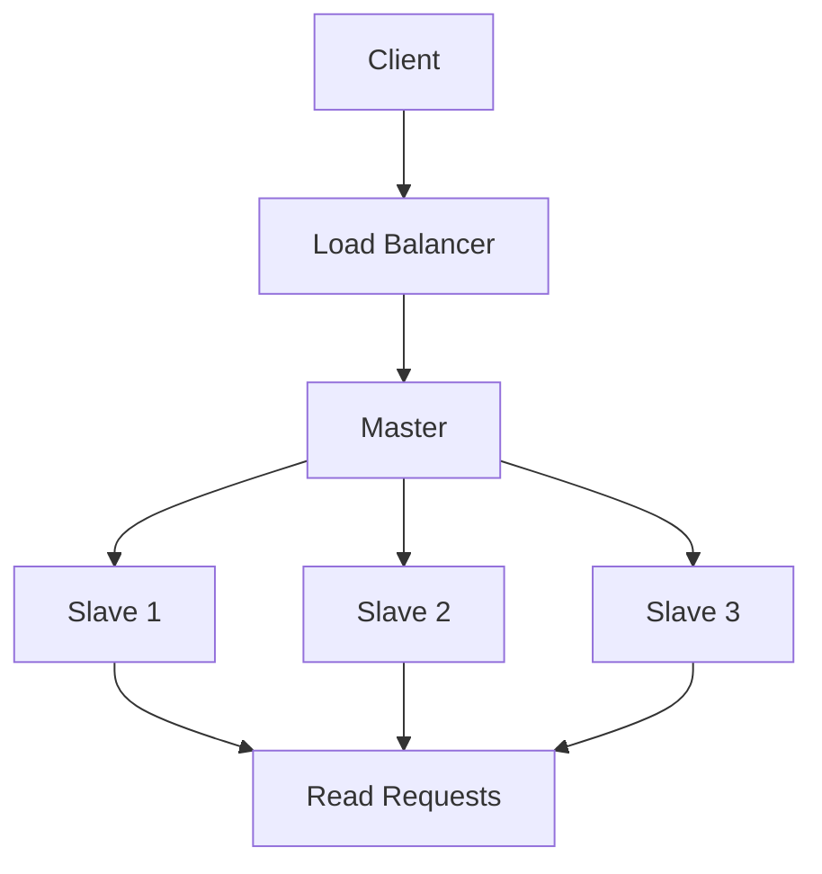

# Data Replication

## Table of Contents
- [Introduction](#introduction)
- [Replication Strategies](#replication-strategies)
- [Consistency Models](#consistency-models)
- [Implementation Patterns](#implementation-patterns)
- [Conflict Resolution](#conflict-resolution)
- [Best Practices](#best-practices)
- [Trade-offs](#trade-offs)
- [Interview Tips](#interview-tips)

## Introduction

Data replication is the process of storing multiple copies of data across different locations to improve availability, reliability, and performance.

### Benefits
1. **High Availability**
2. **Disaster Recovery**
3. **Load Distribution**
4. **Geographic Performance**

## Replication Strategies

### 1. Master-Slave Replication


```python
class MasterSlaveReplication:
    def __init__(self):
        self.master = Database('master')
        self.slaves = [
            Database('slave1'),
            Database('slave2'),
            Database('slave3')
        ]
    
    def write(self, data):
        """Write to master and propagate."""
        # Write to master
        self.master.write(data)
        
        # Propagate to slaves
        for slave in self.slaves:
            try:
                slave.replicate(data)
            except Exception as e:
                logger.error(f"Replication failed: {e}")
    
    def read(self):
        """Read from any slave."""
        available_slaves = [s for s in self.slaves if s.is_healthy()]
        if not available_slaves:
            return self.master.read()
        
        # Round-robin selection
        slave = available_slaves[self.current_slave % len(available_slaves)]
        self.current_slave += 1
        return slave.read()
```

### 2. Multi-Master Replication
```python
class MultiMasterReplication:
    def __init__(self):
        self.nodes = [
            Database('node1'),
            Database('node2'),
            Database('node3')
        ]
        self.vector_clock = VectorClock()
    
    def write(self, data, node_id):
        """Write to any master."""
        # Update vector clock
        self.vector_clock.increment(node_id)
        
        # Add version info
        versioned_data = {
            'data': data,
            'version': self.vector_clock.get_version(),
            'timestamp': time.time()
        }
        
        # Write locally
        node = self.nodes[node_id]
        node.write(versioned_data)
        
        # Propagate to other nodes
        for other_node in self.nodes:
            if other_node != node:
                try:
                    other_node.replicate(versioned_data)
                except Exception as e:
                    logger.error(f"Replication failed: {e}")
```

### 3. Quorum-Based Replication
```python
class QuorumReplication:
    def __init__(self, nodes, read_quorum, write_quorum):
        self.nodes = nodes
        self.R = read_quorum
        self.W = write_quorum
        assert self.R + self.W > len(nodes), "R + W must be > N"
    
    def write(self, key, value):
        """Write with quorum."""
        version = self.get_next_version()
        data = {'value': value, 'version': version}
        
        successful_writes = 0
        for node in self.nodes:
            try:
                node.write(key, data)
                successful_writes += 1
            except Exception as e:
                logger.error(f"Write failed: {e}")
        
        if successful_writes < self.W:
            raise QuorumNotMetError("Write quorum not met")
        
        return version
    
    def read(self, key):
        """Read with quorum."""
        responses = []
        for node in self.nodes:
            try:
                data = node.read(key)
                responses.append(data)
            except Exception as e:
                logger.error(f"Read failed: {e}")
        
        if len(responses) < self.R:
            raise QuorumNotMetError("Read quorum not met")
        
        # Return newest version
        return max(responses, key=lambda x: x['version'])
```

## Consistency Models

### 1. Strong Consistency
```python
class StrongConsistencyManager:
    def __init__(self):
        self.lock_manager = LockManager()
        self.nodes = []
    
    async def write(self, key, value):
        """Write with strong consistency."""
        # Acquire distributed lock
        async with self.lock_manager.lock(key):
            # Write to all nodes
            results = await asyncio.gather(*[
                node.write(key, value)
                for node in self.nodes
            ])
            
            # Verify all writes successful
            if not all(results):
                raise ConsistencyError("Strong consistency violated")
            
            return True
```

### 2. Eventual Consistency
```python
class EventualConsistencyManager:
    def __init__(self):
        self.nodes = []
        self.conflict_resolver = ConflictResolver()
    
    async def write(self, key, value):
        """Write with eventual consistency."""
        version = self.get_next_version()
        data = {'value': value, 'version': version}
        
        # Async write to all nodes
        asyncio.create_task(self.propagate_write(key, data))
        
        # Return immediately
        return version
    
    async def propagate_write(self, key, data):
        """Background write propagation."""
        for node in self.nodes:
            try:
                await node.write(key, data)
            except Exception as e:
                # Queue for retry
                self.retry_queue.put((node, key, data))
```

### 3. Causal Consistency
```python
class CausalConsistencyManager:
    def __init__(self):
        self.vector_clock = VectorClock()
        self.nodes = []
    
    def write(self, key, value, dependencies=None):
        """Write with causal consistency."""
        # Update vector clock
        self.vector_clock.increment()
        
        data = {
            'value': value,
            'vector_clock': self.vector_clock.copy(),
            'dependencies': dependencies or []
        }
        
        # Verify causal dependencies
        if dependencies:
            for dep in dependencies:
                if not self.vector_clock.happens_before(dep):
                    raise CausalityViolationError()
        
        # Write to nodes
        for node in self.nodes:
            node.write(key, data)
```

## Implementation Patterns

### 1. Change Data Capture
```python
class CDCReplication:
    def __init__(self):
        self.binlog_reader = BinlogReader()
        self.change_queue = Queue()
        self.subscribers = []
    
    def start_capture(self):
        """Start capturing changes."""
        while True:
            # Read from binlog
            changes = self.binlog_reader.read_changes()
            
            for change in changes:
                # Process change
                processed_change = self.process_change(change)
                
                # Notify subscribers
                for subscriber in self.subscribers:
                    subscriber.handle_change(processed_change)
    
    def process_change(self, change):
        """Process database change."""
        return {
            'table': change.table,
            'operation': change.operation,
            'data': change.data,
            'timestamp': change.timestamp
        }
```

### 2. State Machine Replication
```python
class StateMachineReplication:
    def __init__(self):
        self.state = {}
        self.log = []
        self.current_term = 0
    
    def apply_command(self, command):
        """Apply command to state machine."""
        # Add to log
        self.log.append({
            'command': command,
            'term': self.current_term
        })
        
        # Apply command
        result = self.execute_command(command)
        
        # Replicate to followers
        self.replicate_log()
        
        return result
    
    def replicate_log(self):
        """Replicate log to followers."""
        for follower in self.followers:
            try:
                follower.update_log(self.log)
            except Exception as e:
                logger.error(f"Log replication failed: {e}")
```

## Conflict Resolution

### 1. Vector Clocks
```python
class VectorClock:
    def __init__(self, node_id):
        self.node_id = node_id
        self.clock = defaultdict(int)
    
    def increment(self):
        """Increment local counter."""
        self.clock[self.node_id] += 1
    
    def merge(self, other_clock):
        """Merge with another vector clock."""
        for node_id, counter in other_clock.items():
            self.clock[node_id] = max(
                self.clock[node_id],
                counter
            )
    
    def happens_before(self, other_clock):
        """Check if happens before other clock."""
        return all(
            self.clock[k] <= other_clock[k]
            for k in other_clock
        ) and any(
            self.clock[k] < other_clock[k]
            for k in other_clock
        )
```

### 2. CRDT (Conflict-Free Replicated Data Type)
```python
class GCounter:
    """Grow-only Counter CRDT."""
    def __init__(self, node_id):
        self.node_id = node_id
        self.counters = defaultdict(int)
    
    def increment(self):
        """Increment local counter."""
        self.counters[self.node_id] += 1
    
    def merge(self, other):
        """Merge with another counter."""
        for node_id, count in other.counters.items():
            self.counters[node_id] = max(
                self.counters[node_id],
                count
            )
    
    def value(self):
        """Get total counter value."""
        return sum(self.counters.values())
```

## Best Practices

### 1. Monitoring Replication
```python
class ReplicationMonitor:
    def __init__(self):
        self.metrics = {
            'replication_lag': Gauge('replication_lag', 'Replication lag in seconds'),
            'replication_errors': Counter('replication_errors', 'Replication errors'),
            'sync_time': Histogram('sync_time', 'Time to sync changes')
        }
    
    def monitor_lag(self):
        """Monitor replication lag."""
        for slave in self.slaves:
            lag = self.calculate_lag(slave)
            self.metrics['replication_lag'].labels(
                slave=slave.id
            ).set(lag)
```

### 2. Failure Detection
```python
class FailureDetector:
    def __init__(self):
        self.nodes = []
        self.heartbeat_interval = 5
        self.failure_threshold = 3
    
    async def monitor_nodes(self):
        """Monitor node health."""
        while True:
            for node in self.nodes:
                missed_heartbeats = 0
                while missed_heartbeats < self.failure_threshold:
                    try:
                        await node.heartbeat()
                        break
                    except Exception:
                        missed_heartbeats += 1
                
                if missed_heartbeats >= self.failure_threshold:
                    await self.handle_node_failure(node)
            
            await asyncio.sleep(self.heartbeat_interval)
```

## Trade-offs

| Strategy | Pros | Cons | Best For |
|----------|------|------|----------|
| Single-leader | Simple, no conflict resolution | Write bottleneck, failover complexity | Most read-heavy workloads |
| Multi-leader | Writes anywhere, tolerates datacenter loss | Conflict resolution required | Multi-datacenter, offline-tolerant apps |
| Leaderless (quorum) | High availability, tunable consistency | Read-repair overhead, subtle conflict semantics | Always-write systems (e.g., shopping carts) |

**Consistency vs latency:** Synchronous replication guarantees durability but each write waits for followers; asynchronous is fast but can lose the latest writes on leader failure.

**Read scaling vs staleness:** Adding read replicas scales reads but serves stale data; quorum reads (R + W > N) bound staleness at latency cost.

**Failover safety vs availability:** Automatic failover keeps you available but risks split-brain and data loss without careful fencing/quorum.

> **⚠️ When NOT to use async single-leader replication:** writes that cannot survive leader loss (financial ledgers) and geo-distributed workloads needing local writes — use synchronous/quorum replication or multi-leader instead.

## Interview Tips

### 1. Key Considerations
- Consistency requirements
- Availability needs
- Network partition handling
- Conflict resolution strategy
- Monitoring approach

### 2. Common Questions
1. How do you handle network partitions?
2. How do you ensure consistency across replicas?
3. How do you handle replication lag?
4. What conflict resolution strategies would you use?

### 3. Architecture Diagram


## Further Reading
- [Database Replication](https://docs.mongodb.com/manual/replication/)
- [MySQL Replication](https://dev.mysql.com/doc/refman/8.0/en/replication.html)
- [Distributed Systems](https://martinfowler.com/articles/patterns-of-distributed-systems/)
- [CRDT Paper](https://hal.inria.fr/inria-00555588/document) 