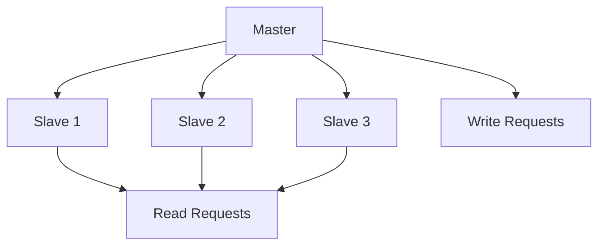
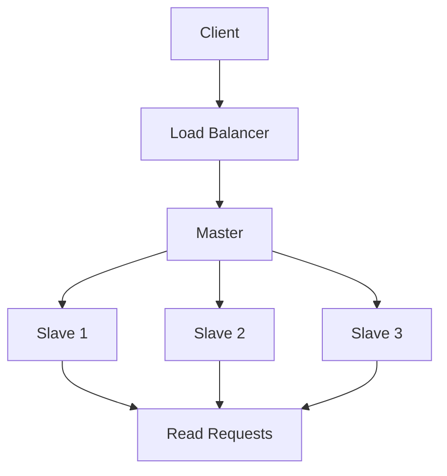

# Replication in System Design 📌

## Table of Contents

- [Introduction](#introduction)
- [Prerequisites & Related Topics](#prerequisites--related-topics)
- [Pattern Recognition Guide](#pattern-recognition-guide)
- [Replication Strategies](#replication-strategies)
- [Consistency Models](#consistency-models)
- [Implementation Patterns](#implementation-patterns)
- [Conflict Resolution](#conflict-resolution)
- [Best Practices](#best-practices)
- [Trade-offs](#trade-offs)
- [Edge Cases to Consider](#edge-cases-to-consider)
- [Common Pitfalls](#common-pitfalls)
- [FAQ](#faq)
- [Interview Tips](#interview-tips)
- [Advanced Topics](#advanced-topics)
- [Further Reading](#further-reading)

## Introduction

Data replication is the process of storing multiple copies of data across different locations to improve availability, reliability, and performance.

### Benefits
1. **High Availability**
2. **Disaster Recovery**
3. **Load Distribution**
4. **Geographic Performance**

## Prerequisites & Related Topics

- Builds on: [Distributed Systems](../system-basics/distributed-systems.md) fundamentals
- Used in: [Scaling Types](scaling-types.md), [Cap Theorem](cap-theorem.md), [Data Partitioning](data-partitioning.md)
- Techniques often combined: quorum reads, failover elections, lag-aware routing
- See also: [Caching](../system-basics/caching.md) — another copy-keeping strategy with different guarantees

## Pattern Recognition Guide

### 🎯 When to Use Replication

**Keywords in requirements**: "read replicas", "failover", "high availability", "read scale", "redundancy", "replica lag"
**Reach for this when**:
- Read-heavy workloads scaling reads across replicas
- Availability through automatic failover
- Geo-proximity reads from regional replicas
- Analytics offload from the operational primary

### 🔑 Approach Indicators

| Approach | Signals | Best For |
|----------|---------|----------|
| Single-leader sync | strong-ish consistency | financial records |
| Single-leader async | latency, read scale | most OLTP apps |
| Multi-leader | multi-region writes | conflict resolution needed |
| Leaderless quorum | tunable, partition-tolerant | Dynamo-family |

### ❌ When NOT to Use

- Write scaling — replication does not add write capacity (single-leader); see [sharding](data-partitioning.md)
- Zero staleness on async replicas — route read-your-writes to the primary
- Backup replacement — replicas protect availability, not logical corruption

## Replication Strategies

### 1. Master-Slave Replication

**How it works — Master slave replication:** Keep a synchronized copy or snapshot that can take over; failover promotes the copy, and RTO/RPO requirements decide how synchronized "synchronized" must be.

### 2. Multi-Master Replication
**How it works — Multi master replication:** Keep a synchronized copy or snapshot that can take over; failover promotes the copy, and RTO/RPO requirements decide how synchronized "synchronized" must be.

### 3. Quorum-Based Replication
**How it works — Quorum replication:** Keep a synchronized copy or snapshot that can take over; failover promotes the copy, and RTO/RPO requirements decide how synchronized "synchronized" must be.

## Consistency Models

### 1. Strong Consistency
**How it works — Strong consistency manager:** the system routes writes to the leader and pins causally-related reads to it (or a current follower); during partitions it chooses availability of the primary over serving stale data — an explicit CP commitment.

### 2. Eventual Consistency
**How it works — Eventual consistency manager:** tracks replication lag per replica and steers reads: read-your-own-writes via session pinning, monotonic reads via version tracking — eventual consistency with the guarantees users actually notice.

### 3. Causal Consistency
**How it works — Causal consistency manager:** writes carry the history of writes they depend on (vector clocks or dependency lists); every replica applies causes before effects, so a reply never appears before the post it answers — while unrelated writes can still land in any order.

## Implementation Patterns

### 1. Change Data Capture
**How it works — Cdcreplication:** the database's replication log (binlog/WAL) is tailed and every row change becomes an event — no polling, no missed updates; caches, search indexes, and warehouses consume the stream with second-level lag.

### 2. State Machine Replication
**How it works — State machine replication:** Keep a synchronized copy or snapshot that can take over; failover promotes the copy, and RTO/RPO requirements decide how synchronized "synchronized" must be.

## Conflict Resolution

### 1. Vector Clocks
**How it works — Vector clock:** each replica tracks a counter per writer; comparing clocks tells you "happened-before" (ordered) or "concurrent" (a real conflict needing resolution) — the cost is metadata that grows with the number of writers.

### 2. CRDT (Conflict-Free Replicated Data Type)
**How it works — Gcounter:** each replica keeps its own counter and only increments it; the value is the sum across replicas — merges are a max-per-replica element-wise, which is why concurrent increments never conflict.

## Best Practices

### 1. Monitoring Replication
**How it works — Replication monitor:** Collect the signal on a schedule, evaluate it against the defined threshold or SLO, and route any breach to the right channel with enough context to act without digging.

### 2. Failure Detection
**How it works — Failure detector:** nodes exchange heartbeats and a detector marks a peer suspect after k missed beats within a window — tuned so real failures are caught fast while GC pauses and network blips don't eject healthy nodes.

## Trade-offs

| Strategy | Pros | Cons | Best For |
|----------|------|------|----------|
| Single-leader | Simple, no conflict resolution | Write bottleneck, failover complexity | Most read-heavy workloads |
| Multi-leader | Writes anywhere, tolerates datacenter loss | Conflict resolution required | Multi-datacenter, offline-tolerant apps |
| Leaderless (quorum) | High availability, tunable consistency | Read-repair overhead, subtle conflict semantics | Always-write systems (e.g., shopping carts) |

**Consistency vs latency:** Synchronous replication guarantees durability but each write waits for followers; asynchronous is fast but can lose the latest writes on leader failure.

**Read scaling vs staleness:** Adding read replicas scales reads but serves stale data; quorum reads (R + W > N) bound staleness at latency cost.

**Failover safety vs availability:** Automatic failover keeps you available but risks split-brain and data loss without careful fencing/quorum.

> **⚠️ When NOT to use async single-leader replication:** writes that cannot survive leader loss (financial ledgers) and geo-distributed workloads needing local writes — use synchronous/quorum replication or multi-leader instead.

## Edge Cases to Consider

- Failover losing acknowledged writes (async) — semi-sync mitigates
- Split-brain double-writes — fencing and quorum elections
- Lag spike during bulk loads — warn readers, pin critical reads
- Replica promoting with stale log — election quorums must check
- Read-your-writes broken by load-balanced session routing

## Common Pitfalls

1. Assuming replicas are hot standbys without testing failover
2. Analytics queries melting production replicas
3. Ignoring lag until users see stale data
4. No fencing — old primary keeps accepting writes after partition

## FAQ

**Q1: Sync or async replication?**

A: Sync (or semi-sync) where a lost write is unacceptable — payments; async where latency matters and some loss is survivable. Know what your engine actually does.

**Q2: How many replicas?**

A: Odd numbers for quorum math (3, 5), sized for read load; each replica adds commit fan-out cost on the primary. Start at 3.

**Q3: Replication or sharding?**

A: Replication copies the same data for availability and read scale; sharding splits data for write scale. Large systems do both — replicate each shard.

## Interview Tips

### 1. Key Considerations
- Consistency requirements
- Availability needs
- Network partition handling
- Conflict resolution strategy
- Monitoring approach

### 2. Common Questions
1. How do you handle network partitions?
2. How do you ensure consistency across replicas?
3. How do you handle replication lag?
4. What conflict resolution strategies would you use?

### 3. Architecture Diagram

## Advanced Topics

1. Semi-synchronous replication to bound data loss
2. Raft-based replication with automatic leader election
3. Conflict-free replicated data types for multi-leader
4. Lag-aware read routing with session pinning

## Further Reading
- [Database Replication](https://docs.mongodb.com/manual/replication/)
- [MySQL Replication](https://dev.mysql.com/doc/refman/8.0/en/replication.html)
- [Distributed Systems](https://martinfowler.com/articles/patterns-of-distributed-systems/)
- [CRDT Paper](https://hal.inria.fr/inria-00555588/document) 