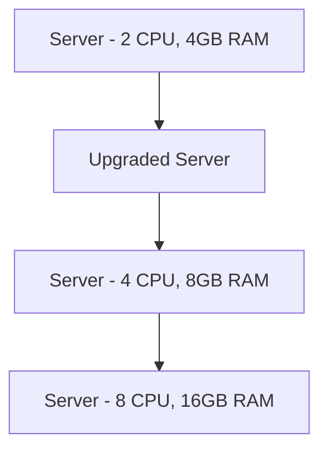
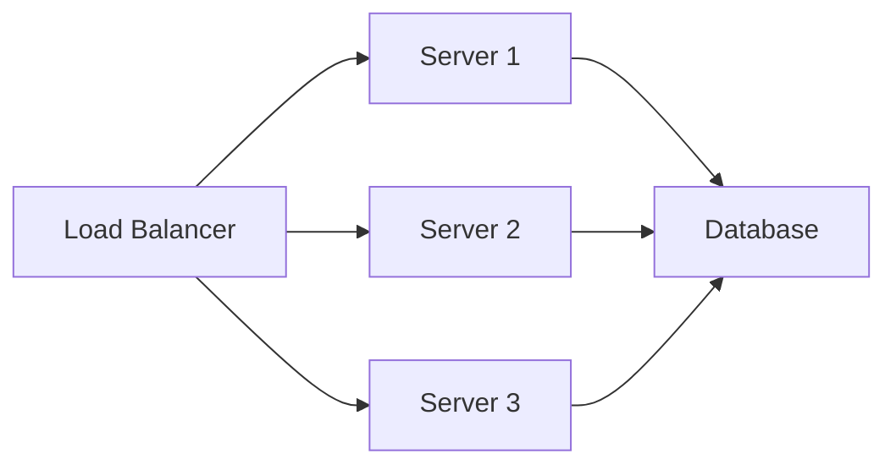
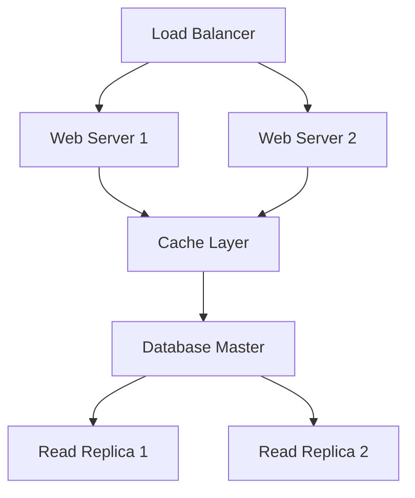
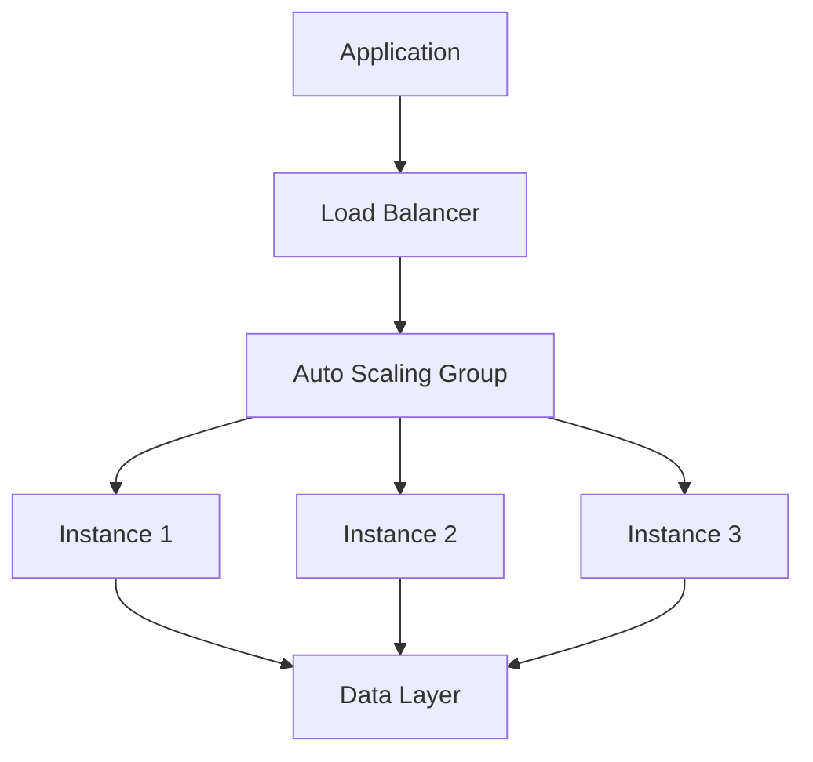

# Horizontal vs Vertical Scaling

## Table of Contents
- [Introduction](#introduction)
- [Vertical Scaling (Scale Up)](#vertical-scaling)
- [Horizontal Scaling (Scale Out)](#horizontal-scaling)
- [Trade-offs](#trade-offs)
- [Implementation Strategies](#implementation-strategies)
- [Real-World Examples](#real-world-examples)
- [Interview Tips](#interview-tips)

## Introduction

Scaling is the ability of a system to handle increased load by adding resources. There are two main approaches: vertical scaling (scaling up) and horizontal scaling (scaling out).

## Vertical Scaling

### What is Vertical Scaling?
Vertical scaling involves adding more power to existing machines by:
- Adding more CPU
- Increasing RAM
- Expanding storage
- Upgrading network capacity



### Advantages
1. **Simplicity**
   - No application changes needed
   - Easier to manage
   - Single system to maintain

2. **Data Consistency**
   - No data synchronization needed
   - ACID compliance easier
   - Simpler transactions

3. **Performance**
   - Lower latency
   - No network overhead
   - Better for complex queries

### Limitations
1. **Hardware Limits**
   - Physical constraints
   - Cost increases exponentially
   - Vendor lock-in

2. **Single Point of Failure**
   - No redundancy
   - Downtime during upgrades
   - Limited fault tolerance

## Horizontal Scaling

### What is Horizontal Scaling?
Horizontal scaling involves adding more machines to handle increased load:
- Adding more servers
- Distributing load
- Parallel processing



### Advantages
1. **Unlimited Scaling**
   - Add machines as needed
   - Linear cost scaling
   - Cloud-friendly

2. **High Availability**
   - No single point of failure
   - Rolling updates possible
   - Better fault tolerance

3. **Cost Effective**
   - Use commodity hardware
   - Pay-as-you-grow
   - Cloud cost optimization

### Challenges
1. **Complexity**
   - Data synchronization
   - Distributed transactions
   - Session management

2. **Application Design**
   - Need stateless design
   - CAP theorem trade-offs
   - Complex deployment

## Trade-offs

### Feature Comparison
| Feature | Vertical Scaling | Horizontal Scaling |
|---------|-----------------|-------------------|
| Cost | Higher upfront | Linear, predictable |
| Limit | Hardware capacity | Theoretically unlimited |
| Complexity | Simple | Complex |
| Availability | Lower | Higher |
| Performance | Better for complex operations | Better for parallel operations |
| Flexibility | Limited | High |

### When to Use What

#### Vertical Scaling
- Small to medium applications
- Monolithic architectures
- Complex database operations
- Budget constraints (initially)

#### Horizontal Scaling
- Large applications
- Microservices architecture
- High availability requirements
- Cloud-native applications

> **⚠️ When NOT to scale out:** stateful components that haven't been refactored for distribution (scaling out just spreads the problem), load well within current headroom (scale up first), and license-bound or single-threaded software.

## Implementation Strategies

### 1. Vertical Scaling Implementation
```yaml
# AWS EC2 Instance Upgrade Example
resource "aws_instance" "app_server" {
  instance_type = "t2.medium"  # Upgrade from t2.small
  ami           = "ami-0c55b159cbfafe1f0"
  
  root_block_device {
    volume_size = 100  # Increase from 50GB
  }
  
  tags = {
    Name = "AppServer"
  }
}
```

### 2. Horizontal Scaling Implementation
```yaml
# Kubernetes Horizontal Pod Autoscaling
apiVersion: autoscaling/v2
kind: HorizontalPodAutoscaler
metadata:
  name: app-scaler
spec:
  scaleTargetRef:
    apiVersion: apps/v1
    kind: Deployment
    name: app-deployment
  minReplicas: 2
  maxReplicas: 10
  metrics:
  - type: Resource
    resource:
      name: cpu
      target:
        type: Utilization
        averageUtilization: 70
```

### 3. Database Scaling
```sql
-- Vertical Scaling: Increase Resources
ALTER SYSTEM SET shared_buffers = '8GB';  -- Increase from 4GB
ALTER SYSTEM SET work_mem = '32MB';       -- Increase from 16MB

-- Horizontal Scaling: Read Replicas
CREATE SUBSCRIPTION subscription_name 
CONNECTION 'host=primary port=5432 dbname=mydb' 
PUBLICATION publication_name;
```

## Real-World Examples

### 1. E-commerce Platform


### 2. Video Streaming Service
```python
class AutoScaler:
    def check_metrics(self):
        """Monitor system metrics."""
        cpu_usage = self.get_cpu_usage()
        memory_usage = self.get_memory_usage()
        request_count = self.get_request_count()
        
        if self.needs_scaling(cpu_usage, memory_usage, request_count):
            self.scale_out()
    
    def needs_scaling(self, cpu, memory, requests):
        """Determine if scaling is needed."""
        return (
            cpu > 70 or 
            memory > 80 or 
            requests > self.threshold
        )
    
    def scale_out(self):
        """Add new instances."""
        self.provision_new_instance()
        self.update_load_balancer()
```

## Interview Tips

### 1. Key Considerations
- Application requirements
- Budget constraints
- Performance needs
- Availability requirements
- Data consistency needs

### 2. Common Questions
1. When would you choose vertical over horizontal scaling?
2. How do you handle session management in horizontal scaling?
3. What are the cost implications of each approach?
4. How do you ensure data consistency in horizontal scaling?

### 3. Best Practices
- Start with vertical scaling
- Plan for horizontal scaling
- Monitor scaling metrics
- Automate scaling decisions
- Consider cost optimization

### 4. Design Patterns


## Further Reading
- [AWS Auto Scaling](https://aws.amazon.com/autoscaling/)
- [Kubernetes Scaling](https://kubernetes.io/docs/concepts/workloads/controllers/deployment/#scaling-a-deployment)
- [Database Scaling Strategies](https://www.mongodb.com/basics/scaling)
- [Cloud Scaling Patterns](https://docs.microsoft.com/en-us/azure/architecture/patterns/) 