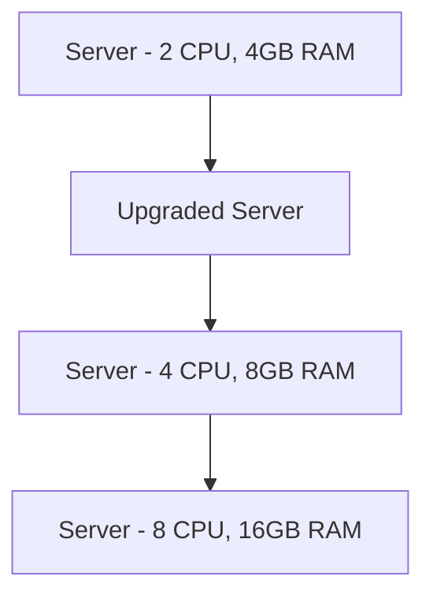
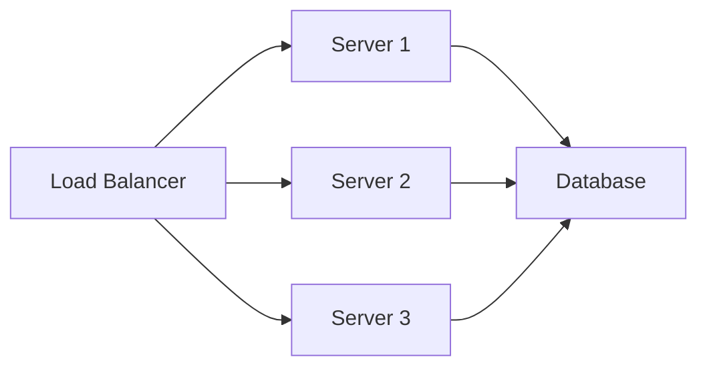
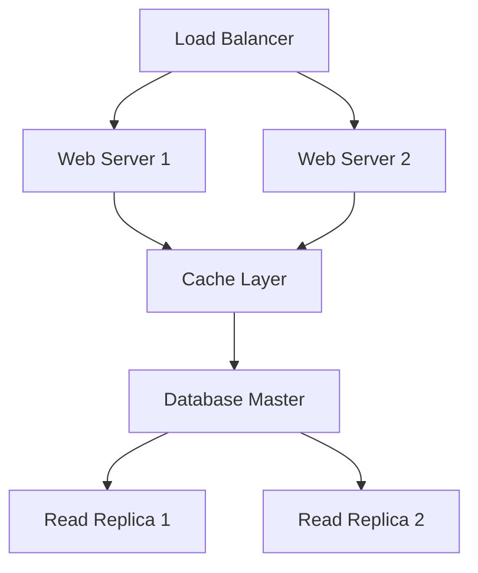
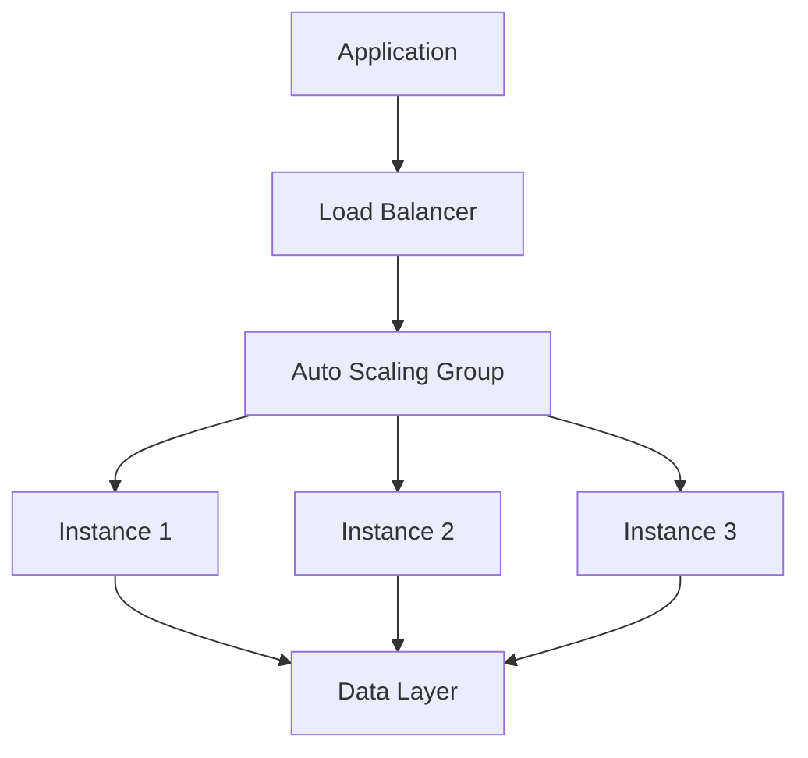

# Scaling Types in System Design 📌

## Table of Contents

- [Introduction](#introduction)
- [Prerequisites & Related Topics](#prerequisites--related-topics)
- [Pattern Recognition Guide](#pattern-recognition-guide)
- [Vertical Scaling](#vertical-scaling)
- [Horizontal Scaling](#horizontal-scaling)
- [Trade-offs](#trade-offs)
- [Edge Cases to Consider](#edge-cases-to-consider)
- [Implementation Strategies](#implementation-strategies)
- [Real-World Examples](#real-world-examples)
- [Common Pitfalls](#common-pitfalls)
- [FAQ](#faq)
- [Interview Tips](#interview-tips)
- [Advanced Topics](#advanced-topics)
- [Further Reading](#further-reading)

## Introduction

Scaling is the ability of a system to handle increased load by adding resources. There are two main approaches: vertical scaling (scaling up) and horizontal scaling (scaling out).

## Prerequisites & Related Topics

- **Builds on**: [Load Balancing](../system-basics/load-balancing.md), [Caching](../system-basics/caching.md)
- **Used in**: [Database Sharding](../system-basics/database-sharding.md), [Microservices](microservices.md), [Performance Optimization](../best-practices/performance.md)
- **Techniques often combined**: autoscaling, read replicas, queue-based peak shaving
- **See also**: [Cap Theorem](cap-theorem.md) — consistency constraints bound scaling choices

## Pattern Recognition Guide

### 🎯 When to Use Scaling Types

**Keywords in requirements**: "scale up vs out", "vertical vs horizontal", "read replicas", "handle more traffic", "capacity planning"
**Reach for this when**:
- Stateless tiers → horizontal scale behind a load balancer
- Read-heavy databases → replicas, then cache, then shard
- Spiky workloads → queues and autoscaling to flatten peaks
- Predictable growth → capacity math before hardware orders

### 🔑 Approach Indicators

| Approach | Signals | Best For |
|----------|---------|----------|
| Vertical | quick win, no app change | hardware ceiling, SPOF |
| Horizontal (stateless) | near-linear growth | requires statelessness |
| Read replicas | read-heavy loads | lag, write ceiling |
| Sharding | write + data size | operational cost |
| Caching | hot read paths | invalidation complexity |
| Async queues | peak shaving | eventual consistency |

### ❌ When NOT to Use

- Sharding before caching, indexes, and replicas are exhausted
- Vertical scaling for stateless tiers — adding machines is cheaper and safer
- Scaling anything before measuring the actual bottleneck

## Vertical Scaling

### What is Vertical Scaling?
Vertical scaling involves adding more power to existing machines by:
- Adding more CPU
- Increasing RAM
- Expanding storage
- Upgrading network capacity

### Advantages
1. **Simplicity**
   - No application changes needed
   - Easier to manage
   - Single system to maintain

2. **Data Consistency**
   - No data synchronization needed
   - ACID compliance easier
   - Simpler transactions

3. **Performance**
   - Lower latency
   - No network overhead
   - Better for complex queries

### Limitations
1. **Hardware Limits**
   - Physical constraints
   - Cost increases exponentially
   - Vendor lock-in

2. **Single Point of Failure**
   - No redundancy
   - Downtime during upgrades
   - Limited fault tolerance

## Horizontal Scaling

### What is Horizontal Scaling?
Horizontal scaling involves adding more machines to handle increased load:
- Adding more servers
- Distributing load
- Parallel processing

### Advantages
1. **Unlimited Scaling**
   - Add machines as needed
   - Linear cost scaling
   - Cloud-friendly

2. **High Availability**
   - No single point of failure
   - Rolling updates possible
   - Better fault tolerance

3. **Cost Effective**
   - Use commodity hardware
   - Pay-as-you-grow
   - Cloud cost optimization

### Challenges
1. **Complexity**
   - Data synchronization
   - Distributed transactions
   - Session management

2. **Application Design**
   - Need stateless design
   - CAP theorem trade-offs
   - Complex deployment

## Trade-offs

### Feature Comparison
| Feature | Vertical Scaling | Horizontal Scaling |
|---------|-----------------|-------------------|
| Cost | Higher upfront | Linear, predictable |
| Limit | Hardware capacity | Theoretically unlimited |
| Complexity | Simple | Complex |
| Availability | Lower | Higher |
| Performance | Better for complex operations | Better for parallel operations |
| Flexibility | Limited | High |

### When to Use What

#### Vertical Scaling
- Small to medium applications
- Monolithic architectures
- Complex database operations
- Budget constraints (initially)

#### Horizontal Scaling
- Large applications
- Microservices architecture
- High availability requirements
- Cloud-native applications

> **⚠️ When NOT to scale out:** stateful components that haven't been refactored for distribution (scaling out just spreads the problem), load well within current headroom (scale up first), and license-bound or single-threaded software.

## Edge Cases to Consider

- License or hardware ceilings on vertical growth
- Replica lag breaking read-your-writes — route user reads to primary
- Rebalancing shards under traffic
- Stampede when a new cache node empties the ring
- Autoscaler flapping on spiky metrics — cool-downs and smoothed signals

## Implementation Strategies

### 1. Vertical Scaling Implementation
**Infrastructure declaration:** the instance type shown here is the vertical-scaling lever; resize it (or add more instances behind a load balancer) as load grows.

### 2. Horizontal Scaling Implementation
**Kubernetes `HorizontalPodAutoscaler` `app-scaler`**: adds or removes replicas from CPU/memory signals. In interviews, sketch the object relationships (Deployment → ReplicaSet → Pod → Service) instead of the manifest.

### 3. Database Scaling
**Config lever:** raising memory/connection settings scales a single node vertically — effective until the hardware ceiling.

## Real-World Examples

### 1. E-commerce Platform

### 2. Video Streaming Service
**How it works — Auto scaler:** watch a load signal (CPU, request rate, queue depth), keep headroom above the target, and scale out before saturation — with cool-down periods so flapping doesn't churn instances and minimums that survive a zone loss.

## Common Pitfalls

1. Vertical-scaling habit until the hard ceiling forces a risky migration
2. Adding replicas when writes are the real bottleneck
3. Sharding before the cheaper 80% solutions
4. No load test after any scale change

## FAQ

**Q1: Vertical or horizontal first?**

A: Stateless tiers: horizontal from day one — it's the same image with more replicas. Stateful tiers: vertical until real pain, then replicas/sharding with a plan.

**Q2: Do replicas help writes?**

A: No — all writes still funnel to the primary. If write throughput is the ceiling, you're heading for sharding or async write paths.

**Q3: What's the cheapest scaling lever?**

A: Almost always caching — an order-of-magnitude DB offload for one subsystem's complexity. But it only buys read-path headroom.

## Interview Tips

### 1. Key Considerations
- Application requirements
- Budget constraints
- Performance needs
- Availability requirements
- Data consistency needs

### 2. Common Questions
1. When would you choose vertical over horizontal scaling?
2. How do you handle session management in horizontal scaling?
3. What are the cost implications of each approach?
4. How do you ensure data consistency in horizontal scaling?

### 3. Best Practices
- Start with vertical scaling
- Plan for horizontal scaling
- Monitor scaling metrics
- Automate scaling decisions
- Consider cost optimization

### 4. Design Patterns

## Advanced Topics

1. **Autoscaling policies** — target tracking, predictive scaling
2. **Cell-based architecture** — scale by duplicating whole stacks
3. **Read-your-writes routing** — session-aware replica selection
4. **Capacity planning math** — headroom, growth curves, unit economics

## Further Reading
- [AWS Auto Scaling](https://aws.amazon.com/autoscaling/)
- [Kubernetes Scaling](https://kubernetes.io/docs/concepts/workloads/controllers/deployment/#scaling-a-deployment)
- [Database Scaling Strategies](https://www.mongodb.com/basics/scaling)
- [Cloud Scaling Patterns](https://docs.microsoft.com/en-us/azure/architecture/patterns/) 
