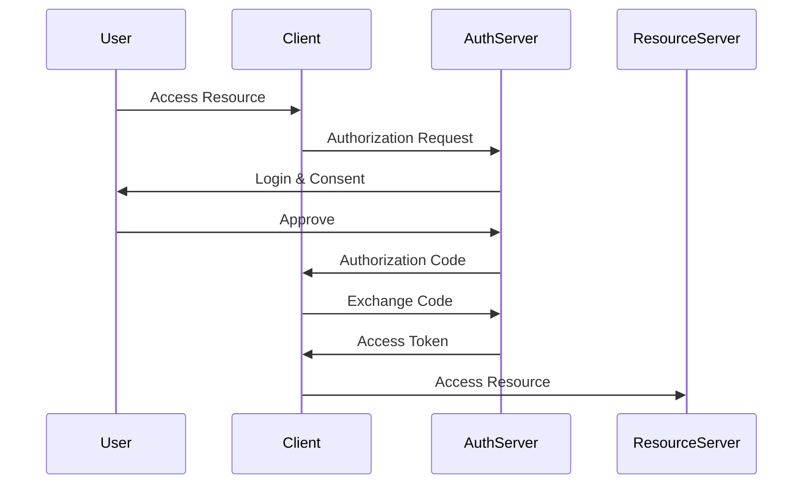

# OAuth & OpenID Connect in System Design 📌

## Table of Contents

- [Introduction](#introduction)
- [Prerequisites & Related Topics](#prerequisites--related-topics)
- [Pattern Recognition Guide](#pattern-recognition-guide)
- [OAuth 2.0 Flows](#oauth-20-flows)
- [OpenID Connect](#openid-connect)
- [Implementation Strategies](#implementation-strategies)
- [Common Use Cases](#common-use-cases)
- [Trade-offs](#trade-offs)
- [Edge Cases to Consider](#edge-cases-to-consider)
- [Common Pitfalls](#common-pitfalls)
- [FAQ](#faq)
- [Interview Tips](#interview-tips)
- [Advanced Topics](#advanced-topics)
- [Further Reading](#further-reading)

## Introduction

OAuth 2.0 and OpenID Connect provide standardized protocols for authorization and authentication.

### Key Benefits
1. **Standardized Security**
2. **Delegated Access**
3. **Token-based Security**
4. **Identity Federation**
5. **Scalable Authentication**

## Prerequisites & Related Topics

- Builds on: [Authentication & Authorization](../system-basics/auth.md), token concepts
- Used in: [API Security](api-security.md), [Zero Trust](zero-trust.md), [SSO patterns](../system-basics/auth.md)
- Techniques often combined: PKCE, token exchange, JWKS rotation, scope design
- See also: [OAuth 2.0 spec family](https://oauth.net/2/) and [OIDC](https://openid.net/developers/how-connect-works/)

## Pattern Recognition Guide

### 🎯 When to Use OAuth & OpenID Connect

**Keywords in requirements**: "SSO", "delegated access", "access token", "refresh token", "authorization code", "client credentials", "scopes"
**Reach for this when**:
- Third-party apps accessing user data with limited scopes
- SSO across internal tools via an identity provider
- Machine-to-machine auth (client credentials) between services
- Native/mobile apps using authorization code + PKCE

### 🔑 Approach Indicators

| Approach | Signals | Best For |
|----------|---------|----------|
| Authorization code + PKCE | user-delegated, browser flow | web and mobile apps |
| Client credentials | machine-to-machine | service-to-service |
| Refresh token rotation | long sessions, short access | all public clients |
| Token exchange | delegation chains | gateways acting for users |

### ❌ When NOT to Use

- Resource-owner password grant — deprecated and dangerous
- Implicit flow in new work — tokens in URL fragments leak
- Using OIDC ID tokens as API access tokens — different audiences, different jobs

## OAuth 2.0 Flows

### 1. Authorization Code Flow

**How it works — Authorization code flow:** redirect the user to the identity provider, they authenticate and approve scopes there, the provider returns a one-time code, and the backend exchanges it for tokens server-side — the access token never touches the browser.

### 2. Client Credentials Flow
**How it works — Client credentials flow:** machine-to-machine auth with no user involved — the service presents its own client ID/secret (better: a signed JWT assertion) to the token endpoint and receives a short-lived access token scoped to itself.

## OpenID Connect

### 1. Identity Token Validation
**How it works — Idtoken validator:** validate the ID token fully: signature against the provider's JWKS, issuer and audience match, expiry and nonce — any mismatch is a reject; use a maintained library, not hand-rolled parsing.

### 2. UserInfo Endpoint
**How it works — User info endpoint:** Keep the contract explicit — resource, method, versioning, pagination, error shape — and evolve it without breaking existing clients; additive changes only, deprecations announced with a sunset date.

## Implementation Strategies

### 1. Token Management
**How it works — Token manager:** issues, refreshes, and revokes: short-lived access tokens, rotating refresh tokens, and a real revocation path for logout — the manager owns lifetimes so services only ever validate.

### 2. Scope Management
**How it works — Scope manager:** the access request names the scopes (read:orders, write:profile); the user approves exactly those, the token carries them, and every API call is checked against the token's scopes — least privilege per integration.

## Common Use Cases

### 1. Single Sign-On
**How it works — Ssoprovider:** the identity provider authenticates the user once and issues assertions (SAML) or tokens (OIDC) that every relying app accepts — apps do zero password handling and logout/MFA policy applies everywhere at once.

### 2. API Security
**How it works — Apisecurity middleware:** the middleware chain authenticates (token validation), authorizes (scopes/roles), rate-limits, and logs — in that order — before any handler runs; cross-cutting security is exactly what middleware is for.

## Trade-offs

| Flow | Pros | Cons | Best For |
|------|------|------|----------|
| Authorization Code + PKCE | No secrets in client, standard | Redirect complexity | SPAs, mobile, web apps |
| Client Credentials | Simple machine-to-machine | No user context | Service-to-service |
| Implicit | No client secret historically | Tokens in URL, deprecated | Legacy only |
| Resource Owner Password | Simple to implement | Exposes credentials to client, anti-pattern | Migration only |

**Token lifetime vs risk:** Short-lived access tokens limit stolen-token damage and increase refresh traffic; long-lived tokens do the opposite.

**Central IdP vs per-app auth:** A central identity provider gives SSO, MFA, and audit in one place and becomes a critical dependency; per-app auth is isolated but duplicates security logic.

**Scope granularity:** Fine-grained scopes enforce least privilege but complicate consent screens and token management.

> **⚠️ When NOT to centralize identity:** a single small app with few users, air-gapped or embedded systems, and flows where IdP downtime must not take the product down (cache token validation locally).

## Edge Cases to Consider

- Redirect URI validation — exact match or token codes leak via open redirectors
- Refresh token theft — rotation plus reuse detection kills stolen sessions
- Clock skew at verification — small leeway, tightly bounded
- Scope creep over years — review scopes as permissions portfolios

## Common Pitfalls

1. Tokens in localStorage for XSS-heavy apps — httpOnly cookies or BFF patterns
2. Treating email as a stable identifier — use the subject (sub) claim
3. Skipping audience checks — token reuse across services
4. No revocation path when users disconnect apps

## FAQ

**Q1: OAuth vs OpenID Connect?**

A: OAuth delegates authorization (what the app may do); OIDC adds authentication (who the user is) as a layer on top. "Login with X" is OIDC; "post on my behalf" is OAuth.

**Q2: Access token vs ID token?**

A: ID tokens prove identity to your app; access tokens authorize API calls. They have different audiences — never accept one as the other.

**Q3: Why PKCE for server-side apps too?**

A: Because the client secret is no longer the guarantee it was and code interception mitigations should be universal — PKCE costs little and removes a whole attack class.

## Interview Tips

### 1. Key Considerations
- Flow selection
- Token security
- Scope management
- User experience
- Security requirements

### 2. Common Questions
1. When to use different OAuth flows?
2. How to secure tokens?
3. How to handle token expiration?
4. How to implement refresh tokens?

### 3. Best Practices
- Use HTTPS everywhere
- Validate all tokens
- Implement proper scopes
- Secure token storage
- Regular security review

## Advanced Topics

1. Token exchange (RFC 8693) for gateway delegation
2. mTLS-bound sender-constrained tokens
3. JARM/PAR hardening for high-security flows
4. Enterprise federation: SAML bridges via OIDC

## Further Reading
- [OAuth 2.0 Specification](https://oauth.net/2/)
- [OpenID Connect Core](https://openid.net/specs/openid-connect-core-1_0.html)
- [OAuth Security Best Practices](https://oauth.net/articles/authentication/)

